## MQTT直连接入
本文档以MQTTX为例，介绍使用第三方软件以MQTT协议接入物联网平台。

### 下载并安装MQTTX
前往[官网下载](https://mqttx.app/)安装

### 系统配置
#### 操作步骤
1.**登录**Jetlinks物联网平台，进入**协议管理**菜单，上传协议。</br>

<a target='_blank' href='https://github.com/jetlinks/jetlinks-official-protocol'>获取协议包源码</a>

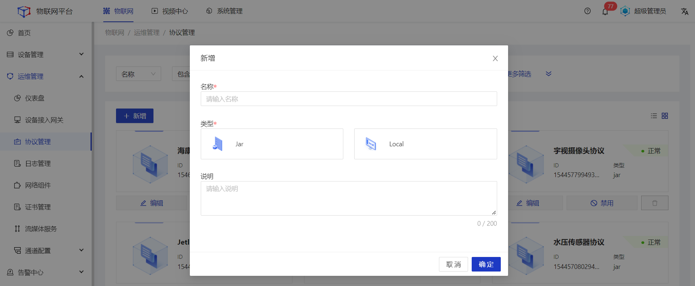

2.进入**网络组件**菜单，配置**MQTT服务**类型的网络组件。</br>


3.进入**设备接入网关**菜单，配置接入方式为**MQTT直连**的网关。</br>
&emsp;（1）选择MQTT服务类型的网络</br>

&emsp;（2）选择所需的协议包</br>

&emsp;（3）填写设备接入网关名称</br>


4.创建产品，并进入**设备接入**tab，选择所需的设备接入网关然后**启用**产品。
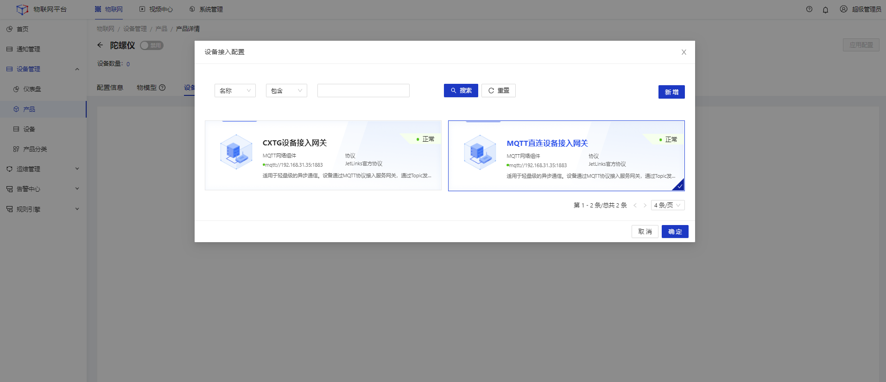

5.在**设备接入**tab页面中填写官方协议包认证信息；然后**启用**产品。

<div class='explanation primary'>
  <p class='explanation-title-warp'>
    <span class='iconfont icon-bangzhu explanation-icon'></span>
    <span class='explanation-title font-weight'>说明</span>
  </p>

不同协议包在设备接入界面所需要填写的方式不同。官方协议包，需要填写设备认证所需要的的账号密码

</div>

`在设备接入tab页的MQTT认证配置项中填写  secureId为：admin    secureKey为：admin。`


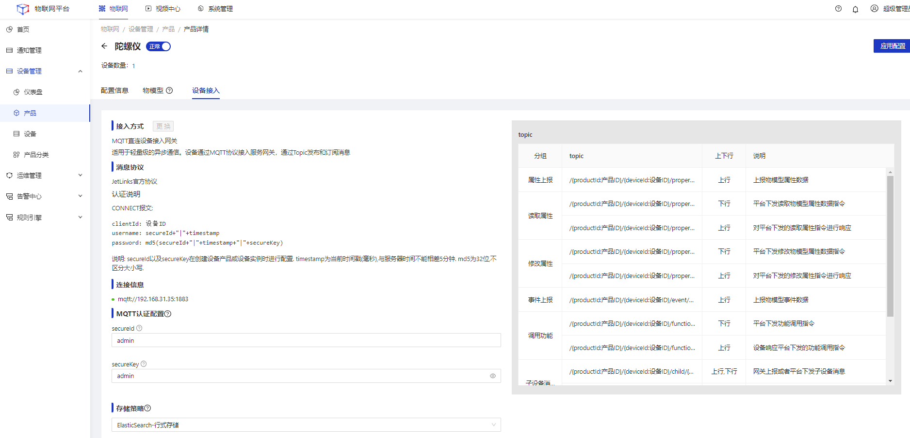


6.创建设备，选择对应的所属产品，然后**启用**设备。

<div class='explanation warning'>
  <p class='explanation-title-warp'>
    <span class='iconfont icon-jinggao explanation-icon'></span>
    <span class='explanation-title font-weight'>注意</span>
  </p>

需要先启用产品，才能基于产品创建设备

</div>


### 使用MQTTX模拟设备连接到平台
1.打开MQTTX软件，点击新建连接创建一个连接，设置**连接参数**。

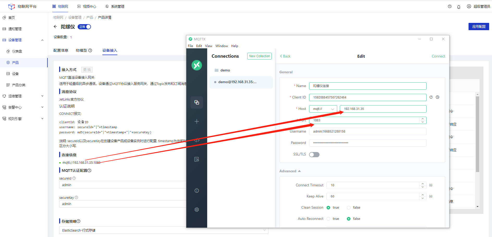

### 连接参数说明

<table class='table'>
        <thead>
            <tr>
              <td>参数</td>
              <td>说明</td>
            </tr>
        </thead>
        <tbody>
          <tr>
            <td>Name</td>
            <td>输入您的自定义名称。</td>
          </tr>
          <tr>
            <td>Client ID</td>
            <td> 设备Id。必须与系统中设备的ID填写一致。</td>
          </tr>
          <tr>
            <td>Host</td>
            <td>连接域名。本地连接可直接填写 `127.0.0.1`,如为远程连接，请填写产品-设备接入页-连接信息显示的连接地址。</td>
          </tr>
         <tr>
            <td>Port</td>
            <td>请填写产品-设备接入页-连接信息显示的端口。</td>
          </tr>
          <tr>
            <td>Username</td>
            <td>填写接入账号</td>
          </tr>
         <tr>
            <td>Password</td>
            <td>填写接入密码</td>
          </tr>
        </tbody>
      </table>
</div>


<div class='explanation primary'>
  <p class='explanation-title-warp'>
    <span class='iconfont icon-bangzhu explanation-icon'></span>
    <span class='explanation-title font-weight'>说明</span>
  </p>

使用JetLinks官方协议包接入设备，用户名和密码需要经过加密规则处理。<br />
可使用账号密码<a href="http://doc.jetlinks.cn/basics-guide/mqtt-auth-generator.html">自动生成器</a>获取

</div>


<div class='explanation warning'>
  <p class='explanation-title-warp'>
    <span class='iconfont icon-jinggao explanation-icon'></span>
    <span class='explanation-title font-weight'>注意</span>
  </p>

经过加密规则处理的账号密码超过5分钟后将不在可用，需重新生成

</div>


2.点击**连接**按钮，平台中设备状态变为**在线**。


<div class='explanation primary'>
  <p class='explanation-title-warp'>
    <span class='iconfont icon-bangzhu explanation-icon'></span>
    <span class='explanation-title font-weight'>说明</span>
  </p>

如您在点击连接后遇到MQTTX提示异常信息或设备未上线等问题。可在设备详情-设备诊断页中，诊断设备未上线原因

</div>


### 设备数据上下行
设备连接上平台后，可进行一些基本的事件上报、属性读取等操作。


### 物模型创建

在产品详情-物模型tab页中分别创建属性、事件、功能三种物模型

**创建属性** 属性ID: `temperature`


**创建功能**  功能ID: `playVoice`


**创建事件** 事件ID: `alarm_fire`


#### 读取设备属性
1.**登录**Jetlinks物联网平台，点击设备**查看**按钮，进入**运行状态**tab页。</br>
2.点击设备运行状态中某个属性的**获取属性值**按钮。
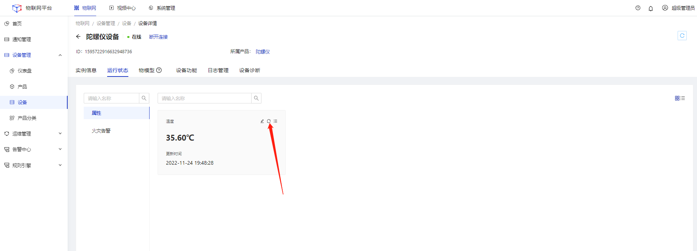
MQTTX会收到平台下发指令消息
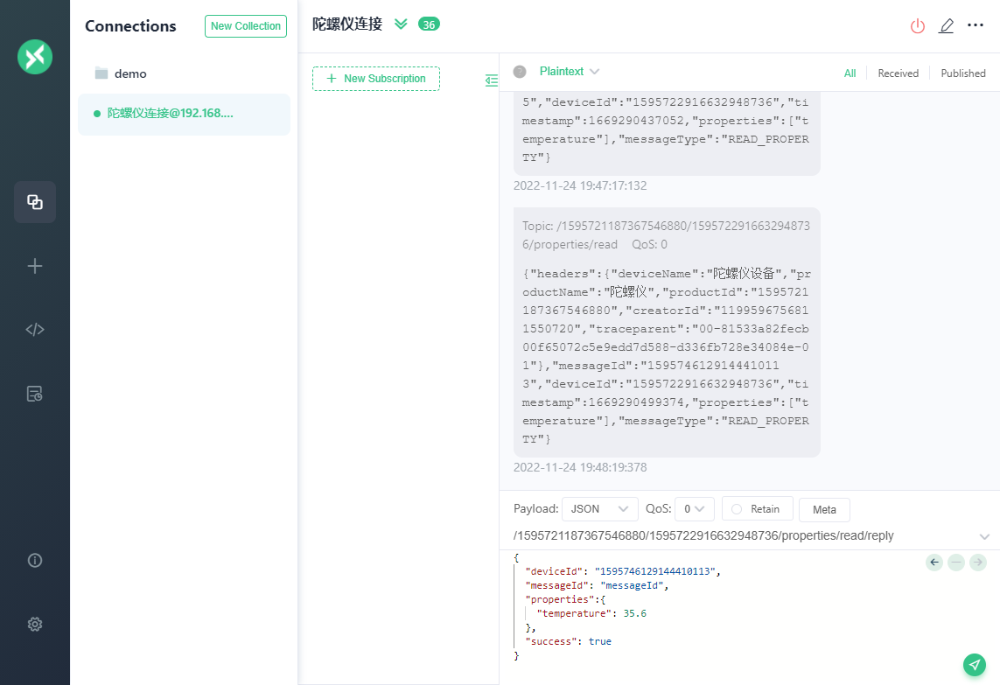
<div class='explanation primary'>
  <p class='explanation-title-warp'>
    <span class='iconfont icon-bangzhu explanation-icon'></span>
    <span class='explanation-title font-weight'>说明</span>
  </p>
复制好订阅该topic收到的消息中的messageId。此messageId将作为回复与平台设备属性的凭据之一。
</div>

3.回复平台设备读取消息
<br />
topic格式参考：[JetLinks官方协议-读取设备属性](/dev-guide/jetlinks-protocol-support.html#读取设备属性)
<br />
消息内容格式如下

```json

{
  "deviceId": "设备Id",
  "messageId": "平台下发报文中的messageId",
  "properties":{
    "temperature": 35.6
  },
  "success": true
}

```


**回复参数说明**

<table class='table'>
        <thead>
            <tr>
              <td>参数</td>
              <td>说明</td>
            </tr>
        </thead>
        <tbody>
          <tr>
            <td>messageId</td>
            <td>平台下发报文中的messageId</td>
          </tr>
          <tr>
            <td>deviceId </td>
            <td>设备ID</td>
          </tr>
          <tr>
            <td>success</td>
            <td>成功标识</td>
          </tr>
           <tr>
            <td>properties</td>
            <td>设备属性值对象。例如： { "temperature":"50"} </td>
          </tr>
        </tbody>
      </table>


点击**消息发送按钮图标**，向平台推送该消息。


4.平台收到MqttX推送的属性值后，将会实时展示到运行状态中。</br>


<div class='explanation warning'>
  <p class='explanation-title-warp'>
    <span class='iconfont icon-jinggao explanation-icon'></span>
    <span class='explanation-title font-weight'>注意</span>
  </p>
从在系统界面中点击刷新到MQTTX端回复消息，需在10秒内完成。否则平台会视为该次操作超时，导致读取属性值失败。
</div>

#### 设备事件上报
MQTTX 推送设备事件消息到平台。<br />

1.在MQTTX上，填写事件上报topic。topic格式参考[JetLinks官方协议-设备事件上报](/dev-guide/jetlinks-protocol-support.html#设备事件上报) 。</br>
2.输入事件上报Topic和要发送的事件内容，点击"发送"按钮图标，向平台推送该事件消息。
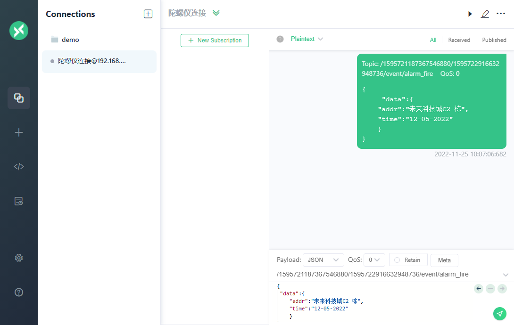

**设备事件上报数据**

```json
{
 "data":{
   "addr":"未来科技城 C2 栋",
  "time":"12-05-2012"
 }
}
```

<table class='table'>
        <thead>
            <tr>
              <td>参数</td>
              <td>说明</td>
            </tr>
        </thead>
        <tbody>
          <tr>
            <td>data</td>
            <td>对象类型的报文数据</td>
          </tr>
        </tbody>
      </table>

上报成功后，在**设备-运行状态**tab页，可查看事件具体信息。


#### 调用设备功能
1.在**设备-设备功能**tab页，选择设备功能模块,点击执行,向设备发送功能调用指令。
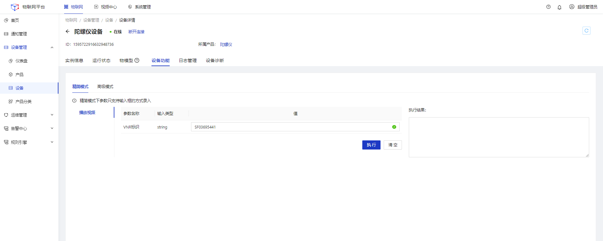
3.填写设备功能回复topic和报文。格式参考[JetLinks官方协议-调用设备功能](/dev-guide/jetlinks-protocol-support.html#调用设备功能)
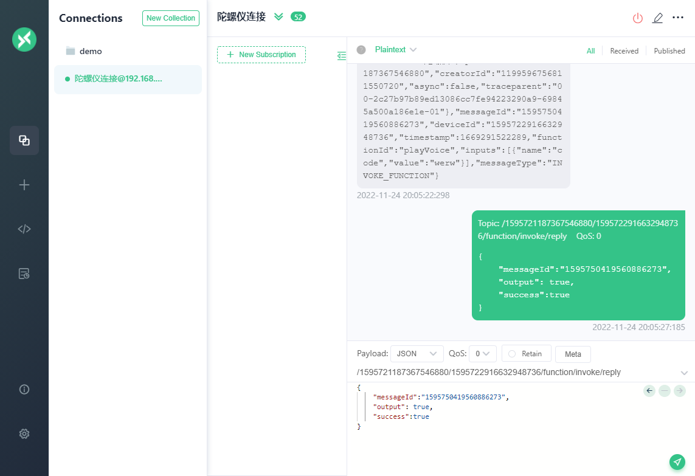

**设备功能回复报文**

```json
{
 "messageId":"平台下发报文中的messageId", 
 "output":true,
 "success":true
}
```
<table class='table'>
        <thead>
            <tr>
              <td>参数</td>
              <td>说明</td>
            </tr>
        </thead>
        <tbody>
          <tr>
            <td>messageId </td>
            <td>平台下发报文中的messageId</td>
          </tr>
          <tr>
            <td>output</td>
            <td>返回的对象类型执行结果</td>
          </tr>
           <tr>
            <td>success</td>
            <td>成功状态</td>
          </tr>
        </tbody>
      </table>

设备功能调用成功后在**设备-设备功能**tab页显示调用回复结果。

## MQTT Broker接入
在某些场景,设备不是直接接入平台,而是通过第三方MQTT服务,如:`emqx`接入。
本文使用`mqttx`模拟设备端，通过`emqx`接入平台。

### 安装并启动EMQ

前往[官网下载](https://docs.emqx.cn/broker/v4.3/getting-started/install.html)安装

本文使用docker搭建

```shell script
docker run -d --name emqx -p 18083:18083 -p 1883:1883 emqx/emqx:latest
```
### 访问EMQX Dashboard

在浏览器中输入 http://127.0.0.1:18083 ,默认账号密码为用户名：admin 密码：public。


### 系统配置
#### 操作步骤
1.**登录**Jetlinks物联网平台，进入**网络组件**菜单，创建MQTT客户端网络组件。</br>

`如EMQX服务在本机电脑启用，MQTT客户端网络组件填写参数参考下图填写即可`


**网络组件填写参数说明**

| 参数        | 说明   |  
| --------   | -----:  | 
| 远程地址      | emqx启动所在服务的IP地址，emq本机启动的可填写127.0.0.1   |   
| 远程端口        |   emqx启动的服务端口   |  
| clientId        |    连接到emqx的客户端Id    | 
| 用户名        |    连接到emqx时需要的用户名    | 
| 密码        |    连接到emqx时需要的密码    | 
| 最大消息长度        |    单次收发消息的最大长度,单位:字节;    | 

2.进入**协议管理**菜单，上传协议包。</br>

<a target='_blank' href='https://github.com/jetlinks/jetlinks-official-protocol'>获取协议包源码</a>


3.进入**设备接入网关**，创建MQTT Broker类型的接入网关。</br>
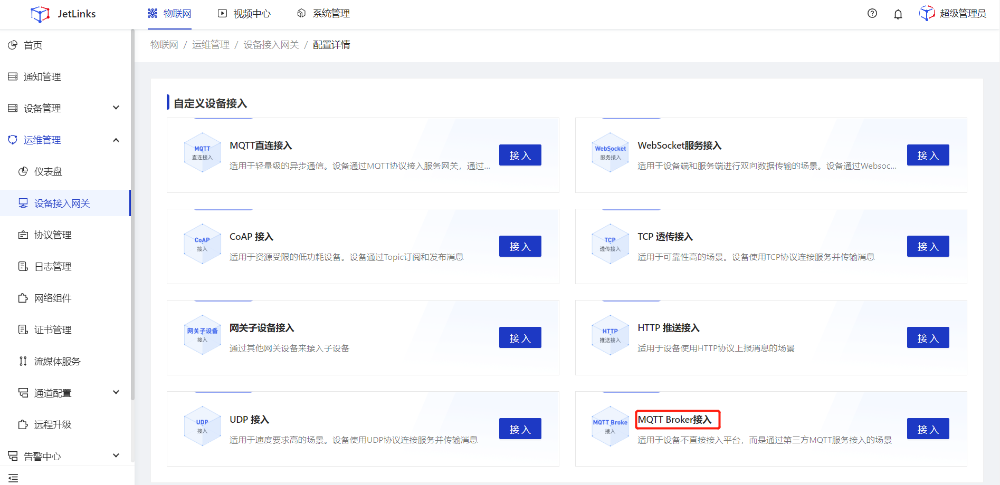


网关创建完成后，可在emqx客户端中的“Subscriptions”菜单中看到订阅列表


4.[创建产品](../Device_access/Create_product3.1.md)，并选中接入方式为MQTT Broker类型的设备接入网关。</br>
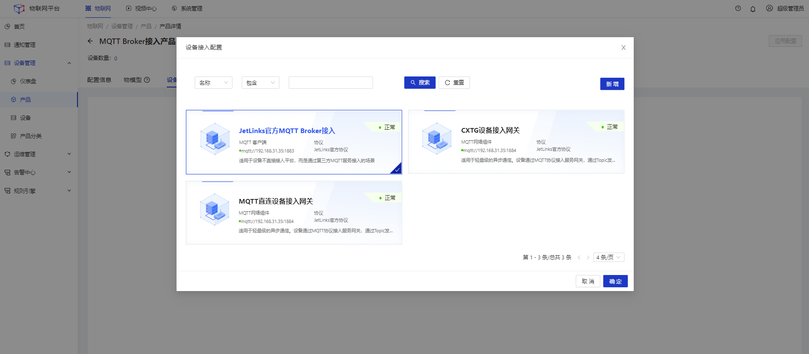

5 创建物模型

在产品详情-物模型tab页中创建温度属性物模型，属性ID:`temperature`


5.[创建设备](../Device_access/Create_Device3.2.md)，选择第4步中创建的产品。</br>


<div class='explanation warning'>
  <p class='explanation-title-warp'>
    <span class='iconfont icon-jinggao explanation-icon'></span>
    <span class='explanation-title font-weight'>注意</span>
  </p>

需要先启用产品，才能基于产品创建设备

</div>

### 使用MQTTX模拟设备与平台进行交互

**下载并安装MQTTX**。  可前往[官网下载](https://mqttx.app/)安装

1.打开MQTTX软件，点击新建连接创建一个连接


2.设置**连接参数**。连接到EMQX

`如EMQX服务在本机电脑启用，连接参数参数参考下图填写即可`


**连接参数说明**

| 参数        | 说明   |  
| --------   | -----:  | 
| Name      | 自定义名称   |   
| Client ID        |  注册到EMQX的客户端Id。可自定义填写任意字符串   |  
| Host        |    填写启动EMQX服务的IP地址    | 
| Port        |    EMQX启动的服务端口    | 


### 物模型属性上报

推送物模型属性消息到EMQX。实现平台设备上线与消息接收


推送设备上报属性topic格式和报文参考：[JetLinks官方协议-读取设备属性](/dev-guide/jetlinks-protocol-support.html#读取设备属性)

`topic:/产品Id/设备Id/properties/report`

```json
{
    "properties":{"temperature":36.8}
}
```

进入平台设备详情界面，此时设备以变成在线状态，且收到了刚刚的温度属性消息

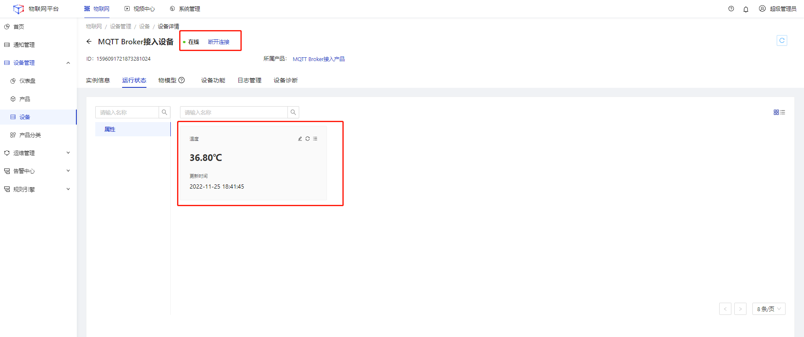

### 物模型属性读取回复

1.在MQTTX中点击订阅添加按钮


2.添加订阅设备读取属性topic：`/+/+/properties/read`。格式参考：[JetLinks官方协议-读取设备属性](/dev-guide/jetlinks-protocol-support.html#读取设备属性)


后续操作参考[读取设备属性](/Best_practices/Device_access.html#读取设备属性)


## TCP 透传接入

通过官方设备模拟器模拟TCP设备接入平台

### 系统配置

1.**登录**Jetlinks物联网平台，进入**网络组件**菜单，创建TCP服务网络组件。</br>

`如服务在本机电脑启用，TCP服务网络组件填写参数参考下图填写即可`


**网络组件填写参数说明**

| 参数        | 说明   |  
| --------   | -----:  | 
| 本地地址      | TCP绑定到服务器上的网卡地址,绑定到所有网卡:0.0.0.0   |   
| 本地端口        |   监听指定端口的请求   |  
| 远程地址        |   对外提供访问的地址,内网环境时填写服务器的内网IP地址   |  
| 公网端口        |   对外提供访问端口   |  
| 粘拆包规则        |    处理TCP粘拆包的方式    | 

2.进入**协议管理**菜单，上传协议包。</br>

<a target='_blank' href='https://github.com/jetlinks/jetlinks-official-protocol'>获取协议包源码</a>


3.进入**设备接入网关**，创建TCP透传类型的接入网关。</br>


4.[创建产品](../Device_access/Create_product3.1.md)，并选中接入方式为TCP透传类型的设备接入网关。</br>
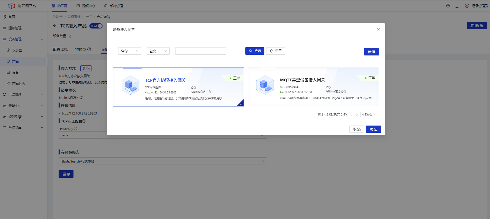

5.设置TCP认证配置的secureKey值为`admin`


6.创建物模型

在产品详情-物模型tab页中创建温度属性物模型，属性ID:`temperature`


7.[创建设备](../Device_access/Create_Device3.2.md)，选择第4步中创建的产品。</br>


<div class='explanation warning'>
  <p class='explanation-title-warp'>
    <span class='iconfont icon-jinggao explanation-icon'></span>
    <span class='explanation-title font-weight'>注意</span>
  </p>

需要先启用产品，才能基于产品创建设备

</div>


### 获取模拟器

前往获取[JetLinks官方设备模拟器](https://github.com/jetlinks/device-simulator)。


### 编写tcp设备模拟脚本


将如下脚本内容复制到模拟器项目的benchmark/tcp/benchmark.js中。覆盖原有脚本内容

<div class='explanation warning'>
  <p class='explanation-title-warp'>
    <span class='iconfont icon-jinggao explanation-icon'></span>
    <span class='explanation-title font-weight'>注意</span>
  </p>

请修改下面脚本代码中deviceId为自己系统中刚刚创建的TCP设备ID

</div>


```javascript

var protocol = require("benchmark/jetlinks-binary-protocol.js");


var $enableReport = "true" === args.getOrDefault("report", "true");
var $reportLimit = parseInt(args.getOrDefault("reportLimit", "1"));
var $reportInterval = parseInt(args.getOrDefault("interval", "1000"));

//绑定内置参数,否则匿名函数无法使用。
var $benchmark = benchmark;
//平台配置的密钥
var secureKey = args.getOrDefault("secureKey", "admin");

var deviceId = "1602199560887795712";


function beforeConnect(index, options) {
    options.setId(deviceId);
}


//平台下发读取属性指令时
protocol.doOnReadProperty(function (properties) {

    $benchmark.print("读取属性:" + properties);

    let data = newHashMap();

    properties.forEach(function (property) {
        data.put(property, randomFloat(20, 30))
    });

    return data;
});

//全部连接完成后执行
function onComplete() {
    if (!$enableReport) {
        return;
    }
    // 心跳
    $benchmark
        .interval(function () {
            return $benchmark.randomConnectionAsync(99999999, function (client) {
                return sendTo(client, protocol.createPing(client));
            });
        }, 1000)

    // 定时执行
    $benchmark
        .interval(function () {
            $benchmark.print("上报属性....");
            //随机获取100个连接然后上报属性数据
            return $benchmark.randomConnectionAsync($reportLimit, reportTcpProperty);
        }, $reportInterval)

}


function sendTo(client, buffer) {
    var len = buffer.writerIndex();
    // $benchmark.print(client.getId() + " 发送数据 0x" + client.toHex(buffer))
    client.send(
        newBuffer().writeInt(len).writeBytes(buffer)
    )

}

//协议发往设备
protocol.doOnSend(sendTo);


//单个连接创建成功时执行
function onConnected(client) {

    //上线
    sendTo(client, protocol.createOnline(client, secureKey));

    //订阅读取属性
    client
        .handlePayload(function (buf) {

            let buffer = buf.getByteBuf();

            //忽略长度字段
            buffer.readInt();

            protocol.handleFromServer(client, buffer);
        });

}

//随机上报数据
function reportTcpProperty(client) {
    var data = new java.util.HashMap();
    for (let i = 0; i < 1; i++) {
        data['temperature'] = randomFloat(10, 30);
    }
    sendTo(client, protocol.createReportProperty(client, data));
}


//重点! 绑定函数到benchmark
benchmark
    .beforeConnect(beforeConnect)
    .onConnected(onConnected)
    .onComplete(onComplete);
```

### 运行模拟器

1.在模拟器项目根目录执行如下命令

```shell
$ ./run-cli.sh
```
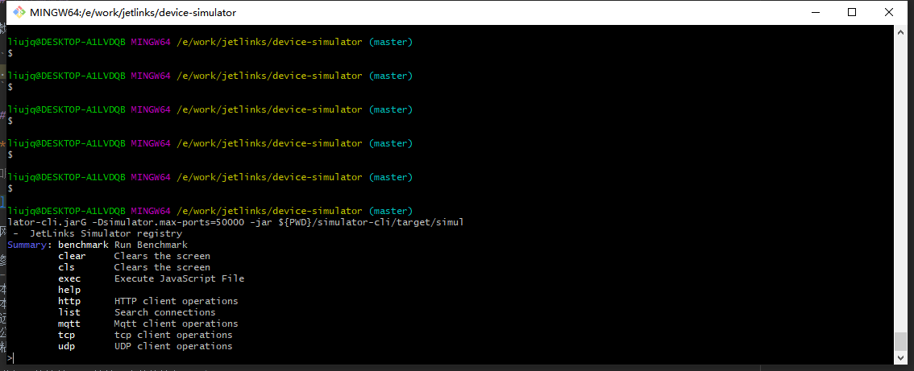

2.在运行成功的界面中执行如下命令。

```shell
 $ benchmark tcp --size=1 --name=tcp --host=127.0.0.1 --port=8803 --script=benchmark/tcp/benchmark.js
```

3. 出现如下界面表示TCP设备连接成功，并正在上报数据


## HTTP接入
### 系统配置
1.**登录**Jetlinks物联网平台，进入**网络组件**菜单，创建HTTP服务网络组件。</br>

2.进入**协议管理**菜单，上传协议包。</br>

3.进入**设备接入网关**，创建HTTP推送接入类型的接入网关。</br>

4.[创建产品](../Device_access/Create_product3.1.md)，并选中接入方式为HTTP推送类型的设备接入网关。</br>

5.[创建设备](../Device_access/Create_Device3.2.md)，所属产品选择HTTP推送接入类型的产品。</br>

### 推送消息
此处使用postman模拟设备请求。
#### 模拟设备上报属性

<div class='explanation primary'>
  <p class='explanation-title-warp'>
    <span class='iconfont icon-bangzhu explanation-icon'></span>
    <span class='explanation-title font-weight'>说明</span>
  </p>
请求时路径中带的/report-property相当于mqtt中的topic，在demo协议将中根据路径来判断消息类型。
</div>

上报后，在**设备-运行状态**中进行查看。
#### 模拟设备事件上报

<div class='explanation primary'>
  <p class='explanation-title-warp'>
    <span class='iconfont icon-bangzhu explanation-icon'></span>
    <span class='explanation-title font-weight'>说明</span>
  </p>
请求时路径中带的/fire-alarm相当于mqtt中的topic，在demo协议将中根据路径来判断消息类型。
</div>

上报后，在**设备-运行状态**中，点击左侧菜单，切换至对应事件，进行查看。


#### 指令下发
由于http是短链接,无法直接下发指令,可以在`消息拦截器中`或者`编码时`通过将消息设置到`device.setConfig`中,在收到 http请求拉取消息时，通过`device.getSelfConfig`获取配置,并返回。

## 使用CoAP服务接入
本文档使用[coap-cli](https://www.npmjs.com/package/coap-cli)模拟设备接入平台。

<div class='explanation info'>
  <p class='explanation-title-warp'> 
    <span class='iconfont icon-tishi explanation-icon'></span>
    <span class='explanation-title font-weight'>提示</span>
  </p>

本功能仅在企业版中提供。

</div>


### 系统配置
1.**登录**Jetlinks物联网平台，进入**网络组件**菜单，创建CoAP服务网络组件。</br>

2.进入**协议管理**菜单，上传协议包。</br>

3.进入**设备接入网关**，创建CoAP接入类型的接入网关。</br>
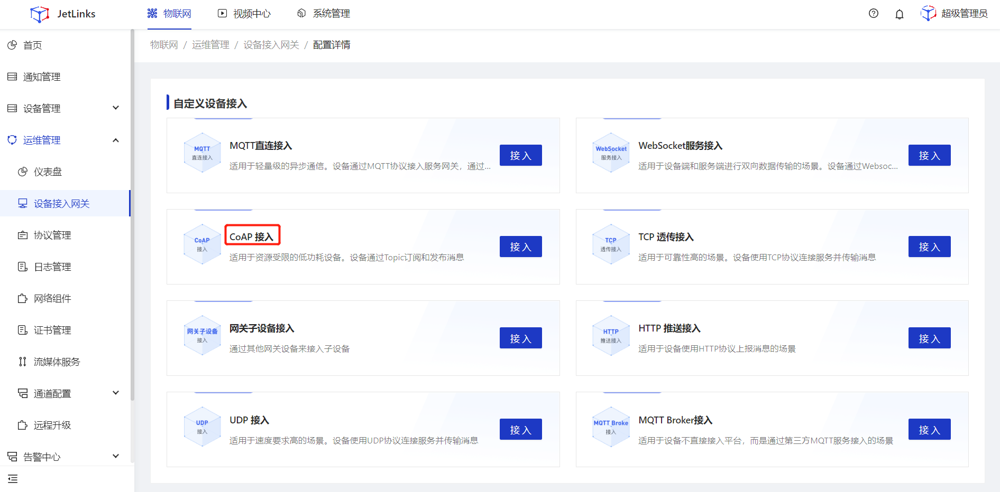
4.[创建产品](../Device_access/Create_product3.1.md)，并选中接入方式为CoAP接入类型的设备接入网关。</br>
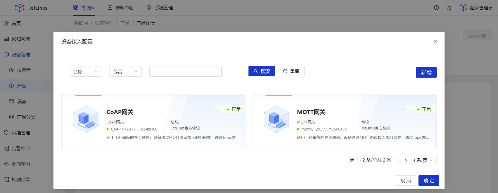
5.[创建设备](../Device_access/Create_Device3.2.md)，所属产品选择CoAP接入类型的产品。</br>

### 使用coap-cli模拟客户端接入
1.下载并安装`coap-cli`。
```shell script
npm install coap-cli -g
```

2.模拟设备设备属性上报

```shell script
echo -n '{"deviceId":"coap-test-001","properties":{"temperature":36.5}}' | coap post coap://localhost:8009/report-property
```
在**设备-运行状态**中可以看到温度属性已发生变化。  </br>
3.模拟设备上报事件

```shell script
echo -n '{"deviceId":"coap-test-001","pname":"智能温控","aid":105,"a_name":"未来科技城","b_name":"C2 栋","l_name":"12-05-201","timestamp":"2019-11-06 16:28:50","alarm_type":1,"alarm_describe":"火灾报警","event_id":1,"event_count":1}' | coap post coap://localhost:8009/fire_alarm
```
在**设备-运行状态**中点击左侧菜单，切换至对应事件，进行查看。


## 使用UDP接入


<div class='explanation info'>
  <p class='explanation-title-warp'> 
    <span class='iconfont icon-tishi explanation-icon'></span>
    <span class='explanation-title font-weight'>提示</span>
  </p>

本功能仅在企业版中提供。

</div>


### 系统配置
1.**登录**Jetlinks物联网平台，进入**网络组件**菜单，创建UDP网络组件。</br>
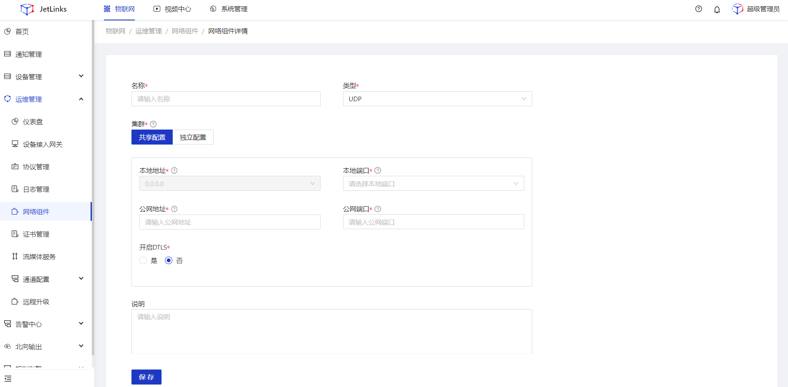
2.进入**协议管理**菜单，上传协议包。</br>

3.进入**设备接入网关**，创建UDP接入类型的接入网关。</br>

4.[创建产品](../Device_access/Create_product3.1.md)，并选中接入方式为UDP接入类型的设备接入网关。</br>
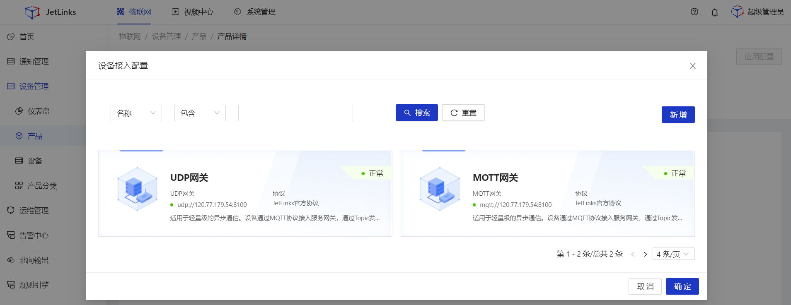
5.[创建设备](../Device_access/Create_Device3.2.md)，所属产品选择UDP接入类型的产品。</br>

### 使用UDP模拟工具接入
1.下载并安装`SocketTool4`。

<div class='explanation primary'>
  <p class='explanation-title-warp'>
    <span class='iconfont icon-bangzhu explanation-icon'></span>
    <span class='explanation-title font-weight'>说明</span>
  </p>
此处以json方式传输数据。
</div>

2.创建udp客户端。  


3.模拟设备设备属性上报</br>
在SocketTool4工具的**数据发送窗口**填写发送的报文。</br>
此处使用的报文为：
```json
{
  "properties":{
      "temperature":36.5 //温度属性
     },
  "messageType": "REPORT_PROPERTY",//org.jetlinks.core.message.MessageType
  "deviceId": "udp-test-001",//设备id
  "key": "admin"//udp认证配置，udp_auth_key	
}
```
单击**发送数据**按钮发起发送数据。

收到上报的消息后平台中设备状态将变为上线,在**设备-运行状态**中可以看到温度属性已发生变化。</br>

4.模拟设备上报事件</br>
在SocketTool4工具的**数据发送窗口**填写发送的报文。</br>
此处使用的报文为：</br>
```json
{
    "data": {
          "pname":"智能温控",
          "aid":105,
          "a_name":"未来科技城",
          "b_name":"C2 栋",
          "l_name":"12-05-201",
          "timestamp":"2019-11-06 16:28:50",
          "alarm_type":1,
          "alarm_describe":"火灾报警",
          "event_id":1,
          "event_count":1
    },
    "event": "fire_alarm",//事件标识
    "messageType": "EVENT",//org.jetlinks.core.message.MessageType
    "deviceId": "udp-test-001",//设备id
    "key": "admin"//udp认证配置，udp_auth_key	
}
``` 

单击**发送数据**按钮发起发送数据。  
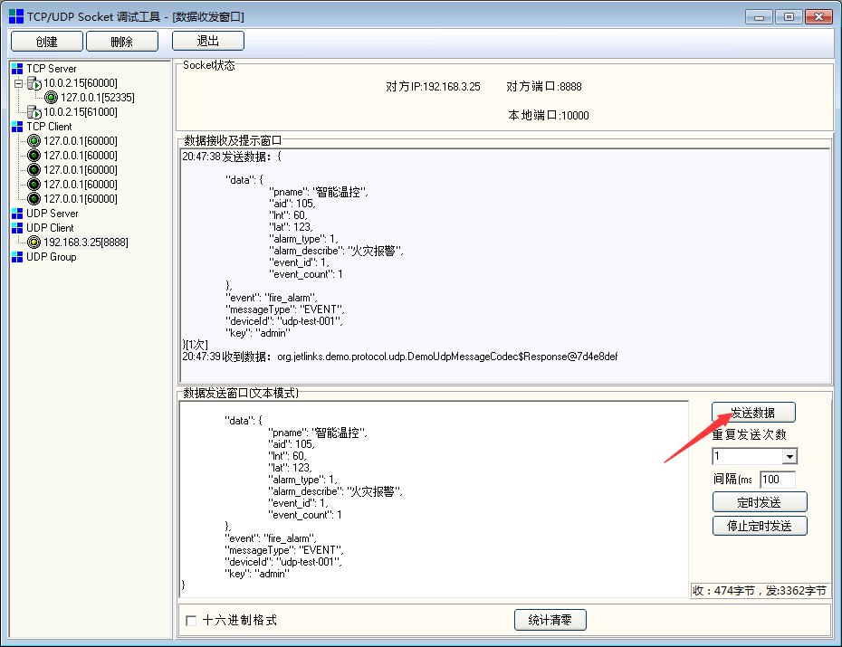
在**设备-运行状态**中点击左侧菜单，切换至对应事件，进行查看。


## TCP、MQTT短连接接入
默认情况下,使用tcp和mqtt方式接入时,当连接断开时,则认为设备已离线。
但是在某些场景(如:低功率设备)下,无法使用长连接进行通信,可以通过指定特定配置使平台保持设备在线状态。

<div class='explanation primary'>
  <p class='explanation-title-warp'>
    <span class='iconfont icon-bangzhu explanation-icon'></span>
    <span class='explanation-title font-weight'>说明</span>
  </p>
以下功能及API在jetlinks 1.4.0 后提供。
</div>

### 保持在线

在自定义协议包解码出消息时，可通过在消息中添加头`keepOnline`来进行设置。如:

```java

message.addHeader(Headers.keepOnline,true); //设置让会话强制在线
message.addHeader(Headers.keepOnlineTimeoutSeconds,600);//设置超时时间（可选,默认10分钟），如果超过这个时间没有收到任何消息则认为离线。

```

<div class='explanation primary'>
  <p class='explanation-title-warp'>
    <span class='iconfont icon-bangzhu explanation-icon'></span>
    <span class='explanation-title font-weight'>说明</span>
  </p>
MQTT接入时添加到任意消息即可。TCP接入时添加到DeviceOnlineMessage即可。

如果服务重启，将不会保存在线状态！</p>
</div>

### 缓存下发消息

在进行消息下发时，因为会话是强制保持在线的，所以消息会直接通过session下发，但是此时设备可能已经断开了连接,
将会抛出异常`DeviceOperationException(ErrorCode.CLIENT_OFFLINE)`。这时候可以通过将消息缓存起来，等待下次设备
连接上来后再下发指令。

一、在自定义协议包中使用消息拦截器拦截异常

```java
support.addMessageSenderInterceptor(new DeviceMessageSenderInterceptor() {
    @Override
    public <R extends DeviceMessage> Flux<R> afterSent(DeviceOperator device, DeviceMessage message, Flux<R> reply) {

        return reply.onErrorResume(DeviceOperationException.class, err -> {
            if (err.getCode() == ErrorCode.CLIENT_OFFLINE) {
                return device
                    .setConfig("will-msg", message) //设置到配置中
                    .thenReturn(((RepayableDeviceMessage<?>) message)
                        .newReply()
                        .code(ErrorCode.REQUEST_HANDLING.name())
                        .message("设备处理中...")
                        .success()
                    )
                    .map(r -> (R) r);
            }
            return Mono.error(err);
        });
    }
});

```

二、获取缓存的消息

在收到设备指令后进行解码时,可以先获取是否有缓存到消息,然后发送到设备。

伪代码如下:

```java

@Override
public Mono<? extends Message> decode(MessageDecodeContext context) {

    return context.getDevice()
        .getAndRemoveConfig("will-msg")
        .map(val -> val.as(DeviceMessage.class))
        .flatMap((msg) -> {
            return ((FromDeviceMessageContext) context)
                .getSession()
                .send(doEncode(msg)); //编码并发送给设备
        })
        .thenReturn(doDecode(context)); //解码收到的消息

}

```

<div class='explanation primary'>
  <p class='explanation-title-warp'>
    <span class='iconfont icon-bangzhu explanation-icon'></span>
    <span class='explanation-title font-weight'>说明</span>
  </p>
以上代码仅作为演示功能逻辑,请根据实际情况进行相应的处理。
</div>

