## MQTT直连接入
本文档以MQTTX为例，介绍使用第三方软件以MQTT协议接入物联网平台。

### 下载并安装MQTTX
前往[官网下载](https://mqttx.app/)安装

### 系统配置
#### 操作步骤
1.**登录**Jetlinks物联网平台，进入**协议管理**菜单，上传协议。</br>


2.进入**网络组件**菜单，配置**MQTT服务**类型的网络组件。</br>


3.进入**设备接入网关**菜单，配置接入方式为**MQTT直连**的网关。</br>
&emsp;（1）选择MQTT服务类型的网络</br>

&emsp;（2）选择所需的协议包</br>

&emsp;（3）填写设备接入网关名称</br>


4.创建产品，并进入**设备接入**tab，选择所需的设备接入网关，然后**启用**产品。


5.创建设备，选择对应的所属产品，然后**启用**设备。


### 使用MQTTX模拟设备连接到平台
1.打开MQTTX软件，点击新建连接创建一个连接，设置**连接参数**。


<table class='table'>
        <thead>
            <tr>
              <td>参数</td>
              <td>说明</td>
            </tr>
        </thead>
        <tbody>
          <tr>
            <td>名称</td>
            <td>输入您的自定义名称。</td>
          </tr>
          <tr>
            <td>Client ID</td>
            <td> 设备Id。必须与系统中设备的ID填写一致。</td>
          </tr>
          <tr>
            <td>服务器地址</td>
            <td>连接域名。本地连接可直接填写 `127.0.0.1`,如为远程连接，请填写产品-设备接入页面显示的连接地址。</td>
          </tr>
         <tr>
            <td>端口</td>
            <td>连接端口。本地连接直接填写1889，如为远程连接，请填写产品-设备接入页显示端口。</td>
          </tr>
          <tr>
            <td>用户名</td>
            <td>填写接入账号</td>
          </tr>
         <tr>
            <td>密码</td>
            <td>填写接入密码</td>
          </tr>
        </tbody>
      </table>
</div>

<div class='explanation primary'>
  <p class='explanation-title-warp'>
    <span class='iconfont icon-bangzhu explanation-icon'></span>
    <span class='explanation-title font-weight'>说明</span>
  </p>
 username和password
  <a href="http://doc.jetlinks.cn/basics-guide/mqtt-auth-generator.html">自动生成器</a>
</div>


2.点击**连接**按钮，平台中设备状态变为**在线**。


### 设备消息
设备连接上平台，并进行一些基本的事件收发、属性读取操作。

#### 设备上下线
单击 MqttX 中**Connect**进行连接,连接成功后，设备状态将变为在线。
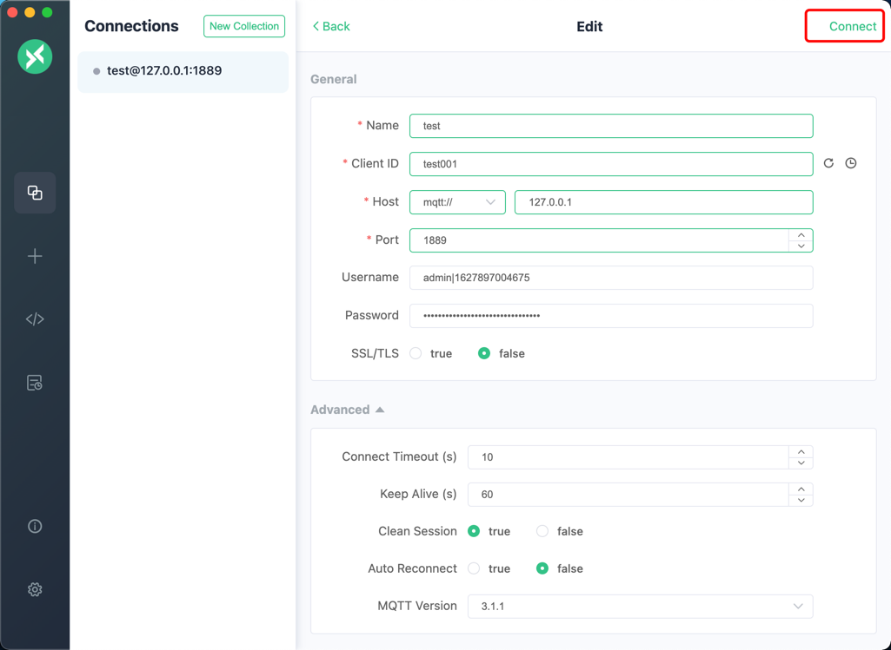
<div class='explanation primary'>
  <p class='explanation-title-warp'>
    <span class='iconfont icon-bangzhu explanation-icon'></span>
    <span class='explanation-title font-weight'>说明</span>
  </p>
平台端需要将设备先启用，否则将导致连接失败。
</div>

点击该设备的查看→日志管理，在设备日志模块可以看到设备上线日志</br>
单击 MqttX 中**Disconnect**断开连接,平台中设备状态变为离线。


#### 读取设备属性
1.**登录**Jetlinks物联网平台，点击设备**查看**按钮，进入**运行状态**tab页。</br>
2.点击设备运行状态中某个属性的**刷新**按钮。
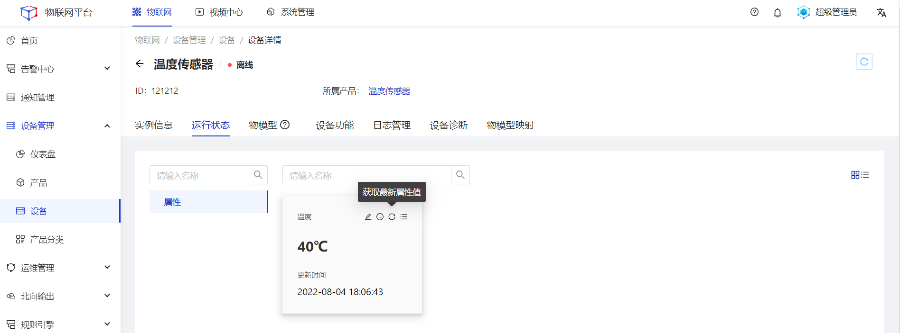
MQTTX会收到平台下发的订阅

<div class='explanation primary'>
  <p class='explanation-title-warp'>
    <span class='iconfont icon-bangzhu explanation-icon'></span>
    <span class='explanation-title font-weight'>说明</span>
  </p>
复制好订阅该topic收到的消息中的messageId。此messageId将作为回复与平台设备属性的凭据之一。
</div>

3.设备（MQTTX）回复平台设备属性值
输入一个回复平台属性值消息Topic(这里的为`/{productId}/{deviceId}/properties/read/reply`)和要发送的消息内容， 单击**Publish**，向平台推送该消息。
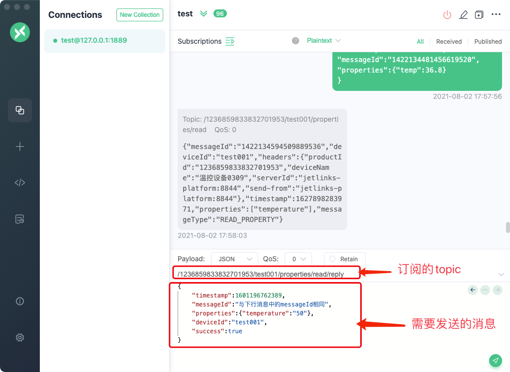
<table class='table'>
        <thead>
            <tr>
              <td>参数</td>
              <td>说明</td>
            </tr>
        </thead>
        <tbody>
          <tr>
            <td>messageId</td>
            <td>平台所下发的messageId值</td>
          </tr>
          <tr>
            <td>deviceId </td>
            <td>设备ID</td>
          </tr>
          <tr>
            <td>timestamp</td>
            <td>当前时间戳</td>
          </tr>
          <tr>
            <td>success</td>
            <td>成功标识</td>
          </tr>
           <tr>
            <td>properties</td>
            <td>设备属性值对象。例如： { "temperature":"50"} </td>
          </tr>
        </tbody>
      </table>

该文档所使用的回复内容

```json
{
 "timestamp":1601196762389,
 "messageId":"第一次平台订阅设备,MQTTX所收到的messageId值",
 "properties":{"temperature":"50"},
 "deviceId":"test001",
 "success":true
}
```
4.平台收到MqttX推送的属性值。</br>
5.读取设备属性回复的日志。</br>
<div class='explanation warning'>
  <p class='explanation-title-warp'>
    <span class='iconfont icon-jinggao explanation-icon'></span>
    <span class='explanation-title font-weight'>注意</span>
  </p>
从在系统界面中点击刷新到MQTTX端回复消息，需在10秒内完成。否则平台会视为该次操作超时，导致读取属性值失败。
</div>

#### 设备事件上报
MQTTX 推送设备事件消息到平台。<br>
1.在MQTTX上，订阅topic`/{productId}/{deviceId}/event/{eventId}`。</br>
2.输入事件上报Topic和要发送的事件内容，单击**Publish**按钮，向平台推送该事件消息。

```json
{
 "timestamp":1627960319,
 "messageId":"1422143789942595584",
 "data":{"a_name":"未来科技城",
  "b_name":"C2 栋",
  "l_name":"12-05-2012"}
}
```

<table class='table'>
        <thead>
            <tr>
              <td>参数</td>
              <td>说明</td>
            </tr>
        </thead>
        <tbody>
          <tr>
            <td>timestamp</td>
            <td>毫秒时间戳</td>
          </tr>
          <tr>
            <td>messageId </td>
            <td>随机消息ID</td>
          </tr>
          <tr>
            <td>data</td>
            <td>上报数据，类型与物模型事件中定义的类型一致</td>
          </tr>
        </tbody>
      </table>

3.进入**设备-日志管理**查看设备上报事件日志。</br>
4.进入**设备-运行状态**tab页，查看事件信息。


#### 地理位置上报
1.物模型中添加地理位置。通过属性定义添加地理位置类型属性。

2.使用mqttX连接到平台，设备上线后推送地理位置消息到平台， 此处使用topic为`/{productId}/{deviceId}/properties/report`。

此处使用的报文为：  
```json
{
 "timestamp":1601196762389,
 "messageId":"ddddd",
 "properties":{
  "geoPoint": "102.321,36.523"
 }
}
```
<div class='explanation primary'>
  <p class='explanation-title-warp'>
    <span class='iconfont icon-bangzhu explanation-icon'></span>
    <span class='explanation-title font-weight'>说明</span>
  </p>
上报geo地理位置类型数据有三种格式。 </br>一是字符串以逗号分隔，如：`"102.321,36.523"`;  </br>
二是数组类型，如:`[102.321,36.523]`;   </br>
三是map类型，如：`{"lat":102.321,"lon":36.523}`。  </br>
</div>

3.上报成功后将在设备的运行状态中显示，也可查看上报历史消息。
<div class='explanation primary'>
  <p class='explanation-title-warp'>
    <span class='iconfont icon-bangzhu explanation-icon'></span>
    <span class='explanation-title font-weight'>说明</span>
  </p>
物模型中的标签也可创建geo类型，但不可通过标签上报地理位置信息，只能通过属性上报。
地理位置标签将主要运用在地图查询中。
</div>

#### 调用设备功能
1.MqttX连接上平台</br>
2.在**设备-设备功能**tab页，选择设备功能模块,点击执行,向设备发送topic。

3.在MqttX订阅topic为`/{productId}/{deviceId}/function/invoke/reply`。
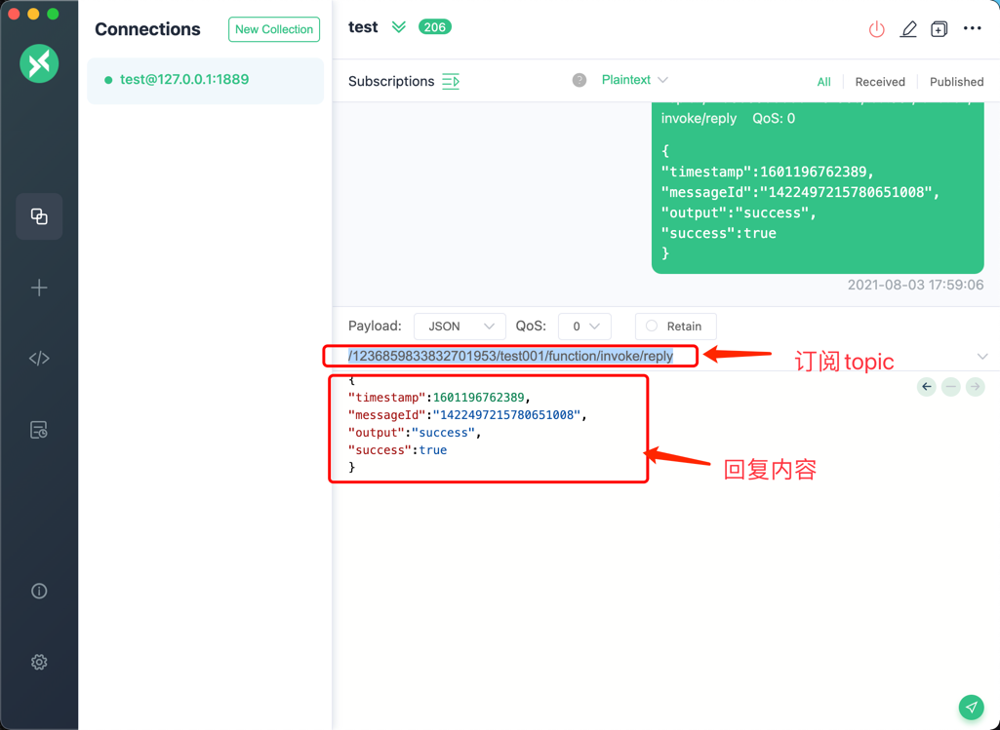

```json
{
 "timestamp":1601196762389,
 "messageId":"1422497215780651008",
 "output":"success",
 "success":true
}
```
<table class='table'>
        <thead>
            <tr>
              <td>参数</td>
              <td>说明</td>
            </tr>
        </thead>
        <tbody>
          <tr>
            <td>timestamp</td>
            <td>毫秒时间戳</td>
          </tr>
          <tr>
            <td>messageId </td>
            <td>与设备下发中的messageId相同</td>
          </tr>
          <tr>
            <td>output</td>
            <td>返回执行结果,具体类型与物模型中功能输出类型一致</td>
          </tr>
           <tr>
            <td>success</td>
            <td>成功状态</td>
          </tr>
        </tbody>
      </table>
      
4.设备功能调用成功,在**设备-设备功能**tab页返回调用结果。

## MQTT Broker接入
在某些场景,设备不是直接接入平台,而是通过第三方MQTT服务,如:`emqx`.
消息编解码与MQTT服务一样,从消息协议中使用`DefaultTransport.MQTT`来获取消息编解码器.
本文使用`mqttx`模拟设备端，通过`emqx`接入平台。

### 安装并启动EMQ

前往[官网下载](https://docs.emqx.cn/broker/v4.3/getting-started/install.html)安装

本文使用docker搭建

```shell script
docker run --name emq -p 18083:18083 -p 1883:1883 -p 8084:8084 -p 8883:8883 -p 8083:8083 -d registry.cn-hangzhou.aliyuncs.com/synbop/emqttd:2.3.6
```
### 访问EMQ Dashboard

在浏览器中输入 http://127.0.0.1:18083 ,默认账号密码为用户名：admin 密码：public。


### 系统配置
#### 操作步骤
1.**登录**Jetlinks物联网平台，进入**网络组件**菜单，创建MQTT客户端网络组件。</br>
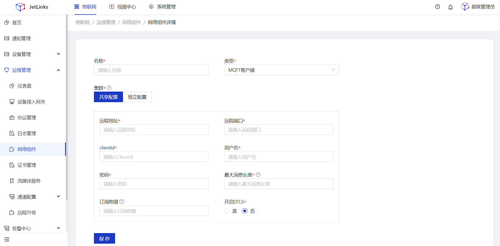
2.进入**协议管理**菜单，上传协议包。</br>

3.进入**设备接入网关**，创建MQTT Broker类型的接入网关。</br>

4.[创建产品](../Device_access/Create_product3.1.md)，并选中接入方式为MQTT Broker类型的设备接入网关。</br>
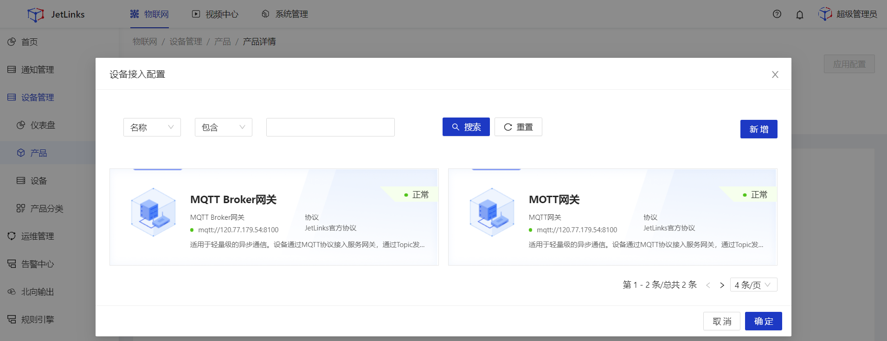
5.[创建设备](../Device_access/Create_Device3.2.md)，所属产品选择MQTT Broker类型的产品。</br>
6.使用MQTTX连接EMQ

<div class='explanation primary'>
  <p class='explanation-title-warp'>
    <span class='iconfont icon-bangzhu explanation-icon'></span>
    <span class='explanation-title font-weight'>说明</span>
  </p>
clientId 和用户名密码符合emq规则即可,这时的认证是通过emq,而不是平台。
</div>

### 设备上下线

平台收到任意设备消息后则认为设备上线,或者推送: `/{productId}/{deviceId}/online`.

设备下线推送topic: `/{productId}/{deviceId}/offline`.

<div class='explanation primary'>
  <p class='explanation-title-warp'>
    <span class='iconfont icon-bangzhu explanation-icon'></span>
    <span class='explanation-title font-weight'>说明</span>
  </p>
{productId}请替换为平台中的产品ID,{deviceId}请替换为平台中的设备ID。
</div>

### 数据上下行

通过此方法接入对于设备端除了认证方式、上下线逻辑不同,其他消息格式以及topic都是与使用MQTT服务网关接入设备一致的。


## TCP 服务接入
本文档使用[Packet Sender](https://packetsender.com/download#show)工具模拟tcp客户端接入平台。

###  系统配置
1.**登录**Jetlinks物联网平台，进入**网络组件**菜单，创建TCP服务网络组件。</br>

2.进入**协议管理**菜单，上传协议包。</br>

3.进入**设备接入网关**，创建TCP透传接入类型的接入网关。</br>
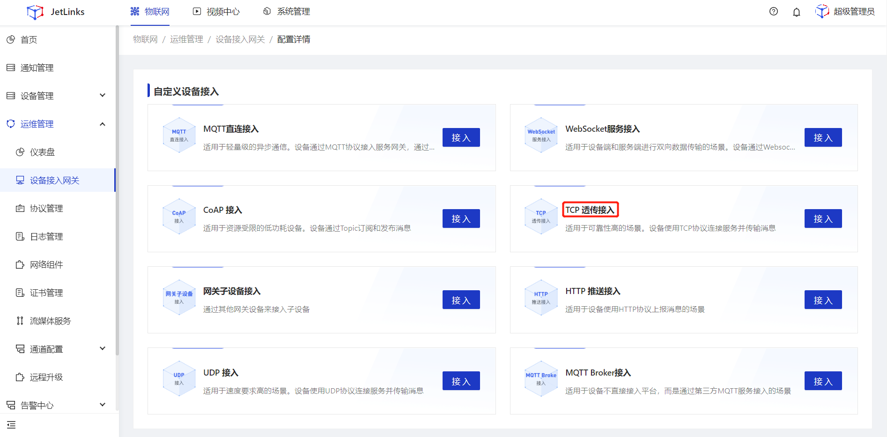
4.[创建产品](../Device_access/Create_product3.1.md)，并选中接入方式为TCP透传接入类型的设备接入网关。</br>

5.[创建设备](../Device_access/Create_Device3.2.md)，所属产品选择TCP透传接入类型的产品。</br>

### TCP工具接入
1.下载并安装[Packet Sender](https://packetsender.com/download#show)。  

<div class='explanation primary'>
  <p class='explanation-title-warp'>
    <span class='iconfont icon-bangzhu explanation-icon'></span>
    <span class='explanation-title font-weight'>说明</span>
  </p>
TCP协议以二进制的数据包传输数据，此处使用Packet Sender工具将发送的消息先转成十六进制，
再通过该工具自动转换成二进制发送到平台。
</div>

2.生成所需的十六进制字符串。  
    i. 检出[协议代码](https://github.com/jetlinks/demo-protocol.git)  
    ii. 执行测试包org.jetlinks.demo.protocol.tcp下DemoTcpMessageTest的test方法生成设备认证所需的十六进制字符串  
    代码如下：  
```java
    @Test
    void test() {
        DemoTcpMessage message = DemoTcpMessage.of(MessageType.AUTH_REQ, AuthRequest.of(1000, "admin"));

        byte[] data = message.toBytes();
        System.out.println(Hex.encodeHexString(data));

        DemoTcpMessage decode = DemoTcpMessage.of(data);

        System.out.println(decode);

        Assertions.assertEquals(message.getType(), decode.getType());
        Assertions.assertArrayEquals(message.getData().toBytes(), decode.getData().toBytes());
    }
   
```
结果：`000d000000e80300000000000061646d696e`

<div class='explanation primary'>
  <p class='explanation-title-warp'>
    <span class='iconfont icon-bangzhu explanation-icon'></span>
    <span class='explanation-title font-weight'>说明</span>
  </p>
AuthRequest.of(deviceId,key) 第一个参数为设备id，第二参数为设备型号中配置的TCP认证配置。  
</div>
iii. 在测试类中执行如下代码生成事件上报所需的十六进制字符串： 

```java
    @Test
    void encodeEvent() {
        DemoTcpMessage demoTcpMessage = DemoTcpMessage.of(MessageType.FIRE_ALARM,
                FireAlarm.builder()
                        .point(ThreadLocalRandom.current().nextInt())
                        .lat(36.5F)
                        .lnt(122.3F)
                        .deviceId(1000)
                        .build());
        byte[] data = demoTcpMessage.toBytes();
        System.out.println(demoTcpMessage);
        System.out.println(Hex.encodeHexString(data));
    }
```  
结果：`0614000000e8030000000000009a99f4420000124222b7c94c`

3.设置参数
i. 设置基本信息
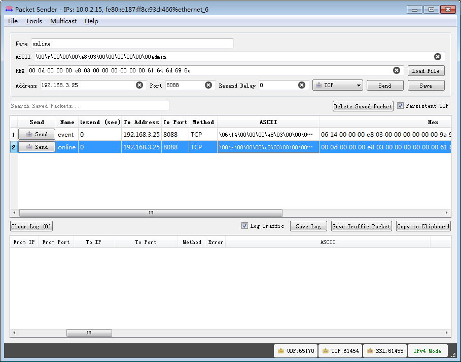

<table class='table'>
        <thead>
            <tr>
              <td>参数</td>
              <td>说明</td>
            </tr>
        </thead>
        <tbody>
          <tr>
            <td>Name</td>
            <td>输入您的自定义名称。</td>
          </tr>
          <tr>
            <td>ASCII </td>
            <td>ASCII码，输入下方十六进制字符串后会自动生成。</td>
          </tr>
          <tr>
            <td>HEX</td>
            <td>十六进制。</td>
          </tr>
           <tr>
            <td>Address</td>
            <td>TCP服务地址。</td>
          </tr>
           <tr>
            <td>Port</td>
            <td>TCP服务端口。</td>
          </tr>
          <tr>
            <td>Persistent TCP</td>
            <td>勾选之后可保持长连接。</td>
          </tr>
        </tbody>
      </table>
<div class='explanation primary'>
  <p class='explanation-title-warp'>
    <span class='iconfont icon-bangzhu explanation-icon'></span>
    <span class='explanation-title font-weight'>说明</span>
  </p>
设置参数时，请确保参数值中或参数值的前后均没有空格。
</div>

模式选择TCP。

**分别保存上线参数以及事件上报参数**。</br>
设备上线：
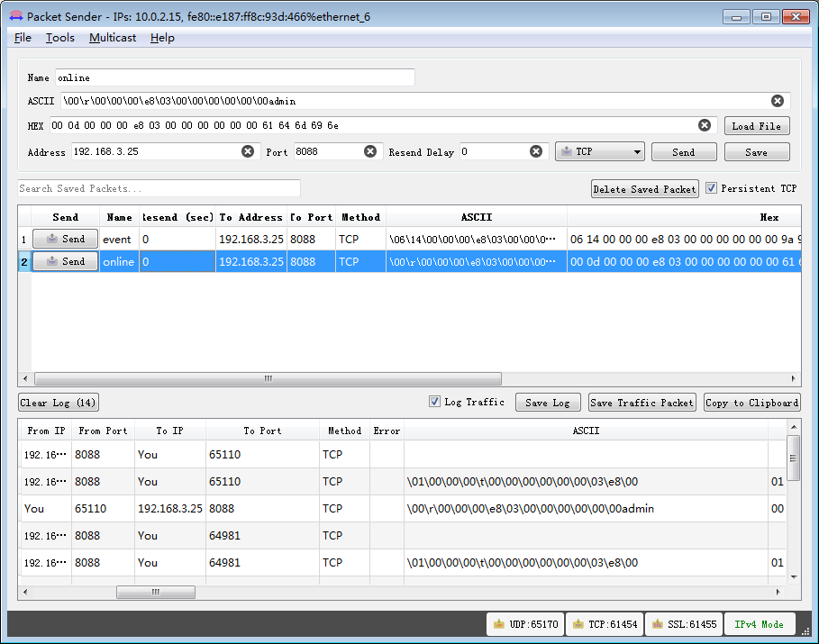
事件上报：


4.模拟设备上下线</br>
单击packetsender工具上`Send`按钮发起请求。

平台中设备状态变为上线即为连接成功,在设备日志模块可以看到设备上线日志。</br>
勾选`Persistent TCP`packetsender上请求成功后会打开一个新的已连接页面。

关闭这个新的已连接页面即可断开设备与平台的连接,平台中设备状态变为离线,同时在设备日志模块可以看到设备离线日志。</br>
5.模拟设备上报事件</br>
 i. 在第4.步，设备上线成功后打开的新的已连接页面上选择第3.步保存的事件上报参数。
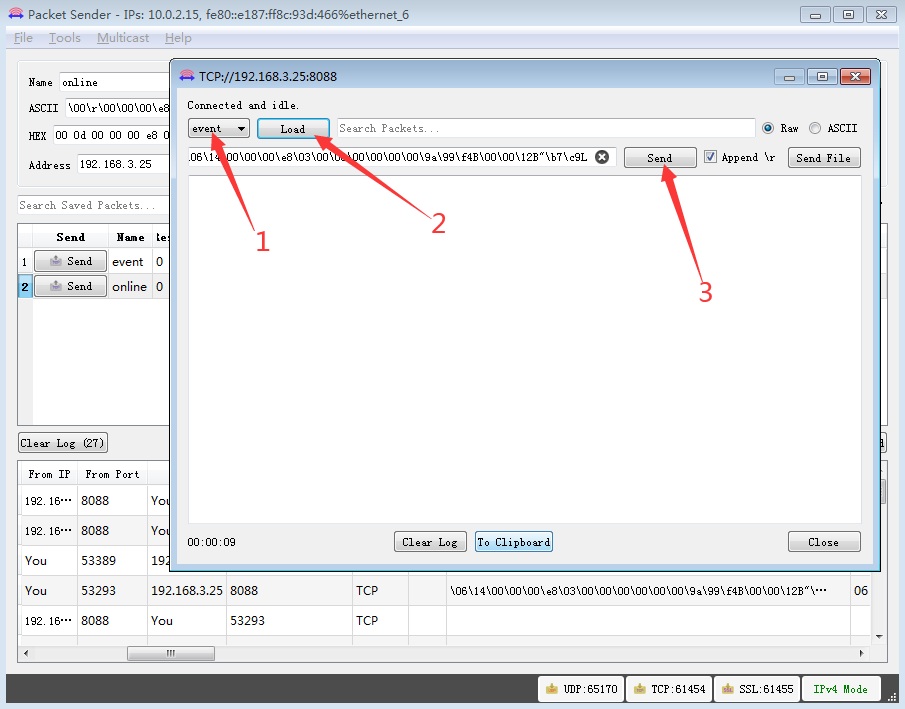
ii. 上报成功后，在**设备-运行状态**页面可以查看到。

## HTTP接入
### 系统配置
1.**登录**Jetlinks物联网平台，进入**网络组件**菜单，创建HTTP服务网络组件。</br>
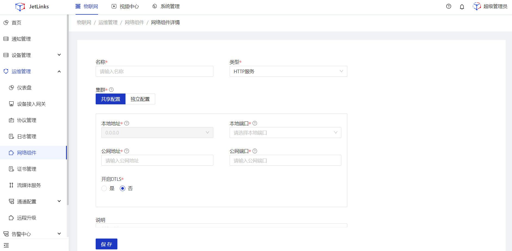
2.进入**协议管理**菜单，上传协议包。</br>

3.进入**设备接入网关**，创建HTTP推送接入类型的接入网关。</br>
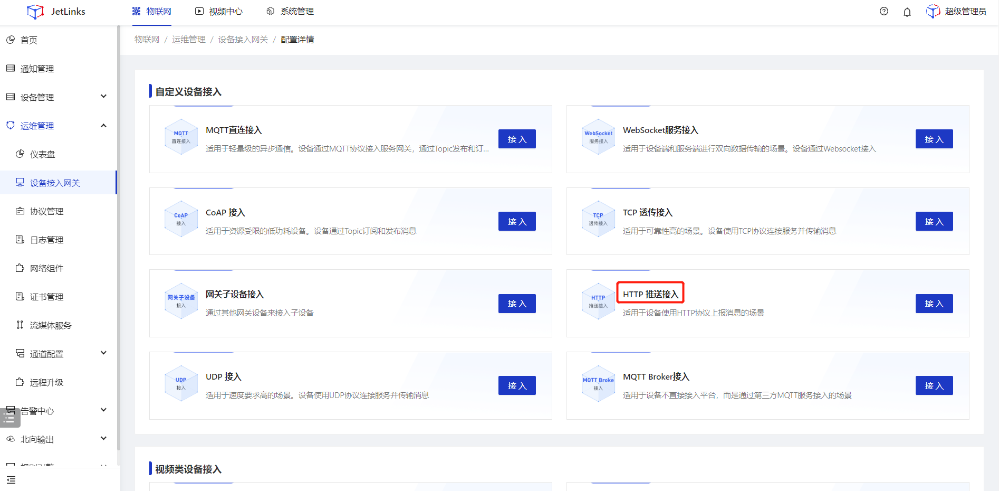
4.[创建产品](../Device_access/Create_product3.1.md)，并选中接入方式为HTTP推送类型的设备接入网关。</br>

5.[创建设备](../Device_access/Create_Device3.2.md)，所属产品选择HTTP推送接入类型的产品。</br>

### 推送消息
此处使用postman模拟设备请求。
#### 模拟设备上报属性

<div class='explanation primary'>
  <p class='explanation-title-warp'>
    <span class='iconfont icon-bangzhu explanation-icon'></span>
    <span class='explanation-title font-weight'>说明</span>
  </p>
请求时路径中带的/report-property相当于mqtt中的topic，在demo协议将中根据路径来判断消息类型。
</div>

上报后，在**设备-运行状态**中进行查看。
#### 模拟设备事件上报

<div class='explanation primary'>
  <p class='explanation-title-warp'>
    <span class='iconfont icon-bangzhu explanation-icon'></span>
    <span class='explanation-title font-weight'>说明</span>
  </p>
请求时路径中带的/fire-alarm相当于mqtt中的topic，在demo协议将中根据路径来判断消息类型。
</div>

上报后，在**设备-运行状态**中，点击左侧菜单，切换至对应事件，进行查看。


#### 指令下发
由于http是短链接,无法直接下发指令,可以在`消息拦截器中`或者`编码时`通过将消息设置到`device.setConfig`中,在收到 http请求拉取消息时，通过`device.getSelfConfig`获取配置,并返回。

## 使用CoAP服务接入
本文档使用[coap-cli](https://www.npmjs.com/package/coap-cli)模拟设备接入平台。

<div class='explanation info'>
  <p class='explanation-title-warp'> 
    <span class='iconfont icon-tishi explanation-icon'></span>
    <span class='explanation-title font-weight'>提示</span>
  </p>

本功能仅在企业版中提供。

</div>


### 系统配置
1.**登录**Jetlinks物联网平台，进入**网络组件**菜单，创建CoAP服务网络组件。</br>

2.进入**协议管理**菜单，上传协议包。</br>

3.进入**设备接入网关**，创建CoAP接入类型的接入网关。</br>

4.[创建产品](../Device_access/Create_product3.1.md)，并选中接入方式为CoAP接入类型的设备接入网关。</br>

5.[创建设备](../Device_access/Create_Device3.2.md)，所属产品选择CoAP接入类型的产品。</br>

### 使用coap-cli模拟客户端接入
1.下载并安装`coap-cli`。  
```shell script
npm install coap-cli -g
```
 
2.模拟设备设备属性上报

```shell script
echo -n '{"deviceId":"coap-test-001","properties":{"temperature":36.5}}' | coap post coap://localhost:8009/report-property
```
在**设备-运行状态**中可以看到温度属性已发生变化。  </br>
3.模拟设备上报事件

```shell script
echo -n '{"deviceId":"coap-test-001","pname":"智能温控","aid":105,"a_name":"未来科技城","b_name":"C2 栋","l_name":"12-05-201","timestamp":"2019-11-06 16:28:50","alarm_type":1,"alarm_describe":"火灾报警","event_id":1,"event_count":1}' | coap post coap://localhost:8009/fire_alarm
```
在**设备-运行状态**中点击左侧菜单，切换至对应事件，进行查看。


## 使用UDP接入


<div class='explanation info'>
  <p class='explanation-title-warp'> 
    <span class='iconfont icon-tishi explanation-icon'></span>
    <span class='explanation-title font-weight'>提示</span>
  </p>

本功能仅在企业版中提供。

</div>


### 系统配置
1.**登录**Jetlinks物联网平台，进入**网络组件**菜单，创建UDP网络组件。</br>

2.进入**协议管理**菜单，上传协议包。</br>

3.进入**设备接入网关**，创建UDP接入类型的接入网关。</br>
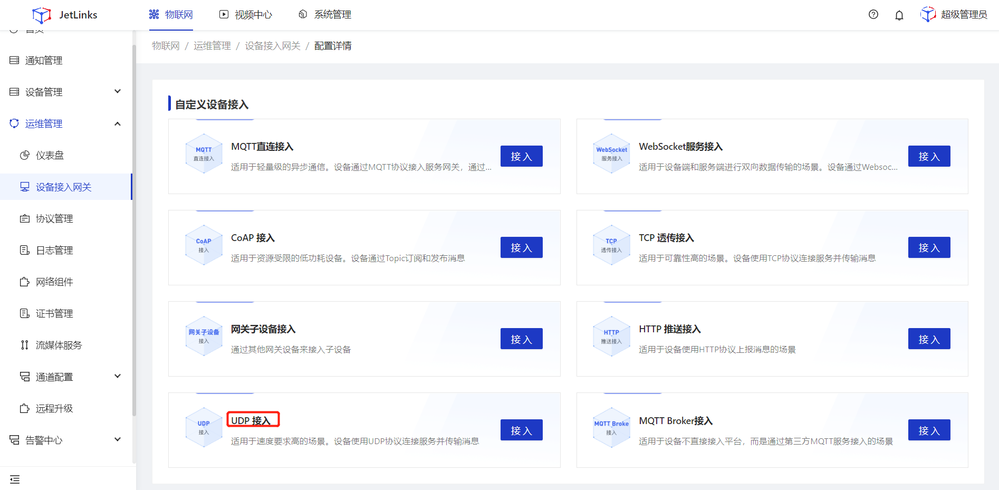
4.[创建产品](../Device_access/Create_product3.1.md)，并选中接入方式为UDP接入类型的设备接入网关。</br>

5.[创建设备](../Device_access/Create_Device3.2.md)，所属产品选择UDP接入类型的产品。</br>

### 使用UDP模拟工具接入
1.下载并安装`SocketTool4`。  

<div class='explanation primary'>
  <p class='explanation-title-warp'>
    <span class='iconfont icon-bangzhu explanation-icon'></span>
    <span class='explanation-title font-weight'>说明</span>
  </p>
此处以json方式传输数据。
</div>

2.创建udp客户端。  


3.模拟设备设备属性上报</br>
在SocketTool4工具的**数据发送窗口**填写发送的报文。</br>
此处使用的报文为：
```json
{
  "properties":{
      "temperature":36.5 //温度属性
     },
  "messageType": "REPORT_PROPERTY",//org.jetlinks.core.message.MessageType
  "deviceId": "udp-test-001",//设备id
  "key": "admin"//udp认证配置，udp_auth_key	
}
```
单击**发送数据**按钮发起发送数据。
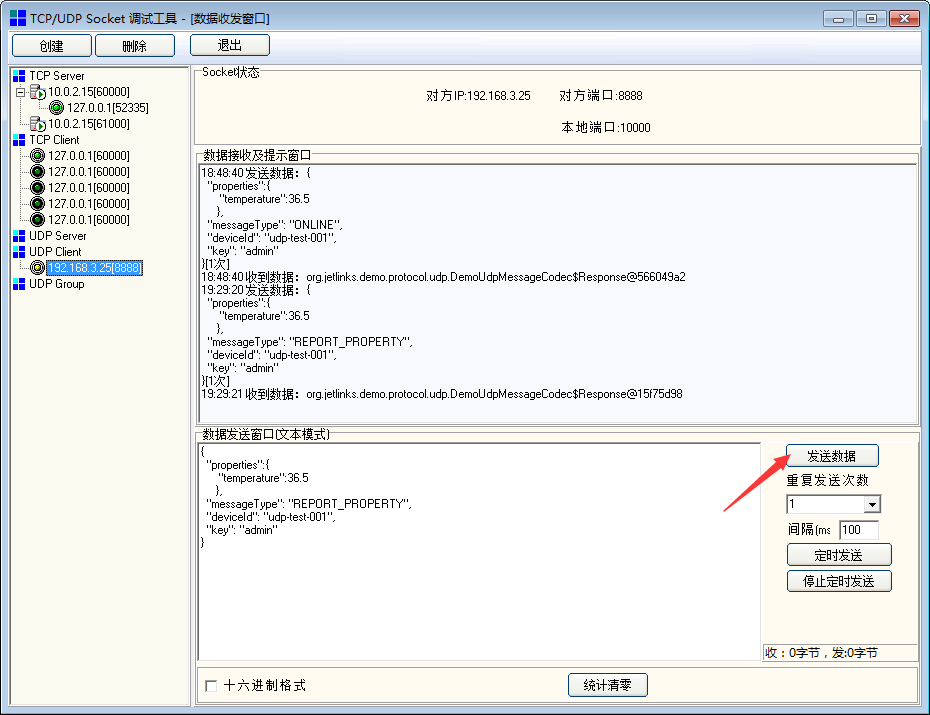
收到上报的消息后平台中设备状态将变为上线,在**设备-运行状态**中可以看到温度属性已发生变化。</br>

4.模拟设备上报事件</br>
在SocketTool4工具的**数据发送窗口**填写发送的报文。</br>
此处使用的报文为：</br>
```json
{
    "data": {
          "pname":"智能温控",
          "aid":105,
          "a_name":"未来科技城",
          "b_name":"C2 栋",
          "l_name":"12-05-201",
          "timestamp":"2019-11-06 16:28:50",
          "alarm_type":1,
          "alarm_describe":"火灾报警",
          "event_id":1,
          "event_count":1
    },
    "event": "fire_alarm",//事件标识
    "messageType": "EVENT",//org.jetlinks.core.message.MessageType
    "deviceId": "udp-test-001",//设备id
    "key": "admin"//udp认证配置，udp_auth_key	
}
``` 

单击**发送数据**按钮发起发送数据。  

在**设备-运行状态**中点击左侧菜单，切换至对应事件，进行查看。


## TCP、MQTT短连接接入
默认情况下,使用tcp和mqtt方式接入时,当连接断开时,则认为设备已离线。
但是在某些场景(如:低功率设备)下,无法使用长连接进行通信,可以通过指定特定配置使平台保持设备在线状态。

<div class='explanation primary'>
  <p class='explanation-title-warp'>
    <span class='iconfont icon-bangzhu explanation-icon'></span>
    <span class='explanation-title font-weight'>说明</span>
  </p>
以下功能及API在jetlinks 1.4.0 后提供。
</div>

### 保持在线

在自定义协议包解码出消息时，可通过在消息中添加头`keepOnline`来进行设置。如:

```java

message.addHeader(Headers.keepOnline,true); //设置让会话强制在线
message.addHeader(Headers.keepOnlineTimeoutSeconds,600);//设置超时时间（可选,默认10分钟），如果超过这个时间没有收到任何消息则认为离线。

```

<div class='explanation primary'>
  <p class='explanation-title-warp'>
    <span class='iconfont icon-bangzhu explanation-icon'></span>
    <span class='explanation-title font-weight'>说明</span>
  </p>
MQTT接入时添加到任意消息即可。TCP接入时添加到DeviceOnlineMessage即可。

如果服务重启，将不会保存在线状态！</p>
</div>

### 缓存下发消息

在进行消息下发时，因为会话是强制保持在线的，所以消息会直接通过session下发，但是此时设备可能已经断开了连接,
将会抛出异常`DeviceOperationException(ErrorCode.CLIENT_OFFLINE)`。这时候可以通过将消息缓存起来，等待下次设备
连接上来后再下发指令。

一、在自定义协议包中使用消息拦截器拦截异常

```java
support.addMessageSenderInterceptor(new DeviceMessageSenderInterceptor() {
    @Override
    public <R extends DeviceMessage> Flux<R> afterSent(DeviceOperator device, DeviceMessage message, Flux<R> reply) {

        return reply.onErrorResume(DeviceOperationException.class, err -> {
            if (err.getCode() == ErrorCode.CLIENT_OFFLINE) {
                return device
                    .setConfig("will-msg", message) //设置到配置中
                    .thenReturn(((RepayableDeviceMessage<?>) message)
                        .newReply()
                        .code(ErrorCode.REQUEST_HANDLING.name())
                        .message("设备处理中...")
                        .success()
                    )
                    .map(r -> (R) r);
            }
            return Mono.error(err);
        });
    }
});

```

二、获取缓存的消息

在收到设备指令后进行解码时,可以先获取是否有缓存到消息,然后发送到设备。

伪代码如下:

```java

@Override
public Mono<? extends Message> decode(MessageDecodeContext context) {

    return context.getDevice()
        .getAndRemoveConfig("will-msg")
        .map(val -> val.as(DeviceMessage.class))
        .flatMap((msg) -> {
            return ((FromDeviceMessageContext) context)
                .getSession()
                .send(doEncode(msg)); //编码并发送给设备
        })
        .thenReturn(doDecode(context)); //解码收到的消息

}

```

<div class='explanation primary'>
  <p class='explanation-title-warp'>
    <span class='iconfont icon-bangzhu explanation-icon'></span>
    <span class='explanation-title font-weight'>说明</span>
  </p>
以上代码仅作为演示功能逻辑,请根据实际情况进行相应的处理。
</div>

