# 场景联动
场景联动是规则引擎中，一种业务逻辑的可视化编程方式，您可以通过可视化的方式定义设备之间联动规则。当触发条件指定的事件或属性变化事件发生时，系统通过判断执行条件是否已满足，来决定是否执行规则中定义的执行动作。如果满足执行条件，则执行定义的执行动作；反之则不执行。 

  

    
    注意
  

 设备触发-触发规则中选择单个固定设备时，支持以设备物模型进行配置。其他情况仅支持以产品物模型进行配置。

## 手动触发
适用于第三方平台向物联网平台下发指令控制设备。 

**例如**：用户通过点击**手动触发**按钮，实现开启空调设备。

#### 前置条件
1.已经创建好空调产品。参见[创建产品](../Device_access/Create_product3.1.md)。 
2.已经创建好空调设备。参见[创建设备](../Device_access/Create_Device3.2.md)。 
3.通过MQTT协议将设备接入平台。参见[设备接入](../Best_practices/Device_access.md)。 
4.物模型中已经定义了空调产品具有开机功能。配置示例如下：

#### 操作步骤
1.**登录**Jetlinks物联网平台，进入**规则引擎>场景联动**菜单，点击**新增**，弹出弹框，填写名称，选择触发方式为**手动触发**，点击**确定**跳转至详情页。 

2.执行动作选择**设备输出**，产品选择**空调**，然后选择需要执行动作的**具体设备**，再选择**调用功能**，选择**开机**，设置值为true，最后点击**确定**。

3.点击页面底部**保存**。
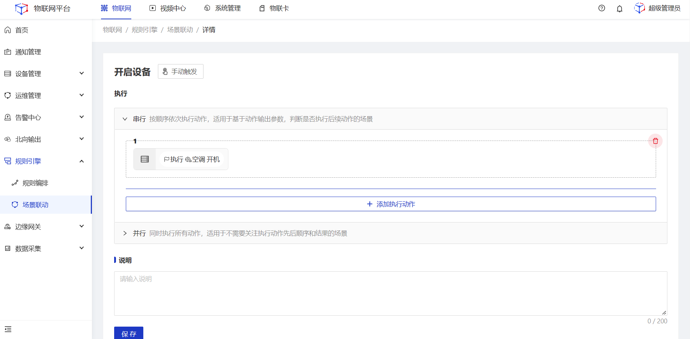
4.在**场景联动**列表页点击**手动触发**，执行空调开机动作。
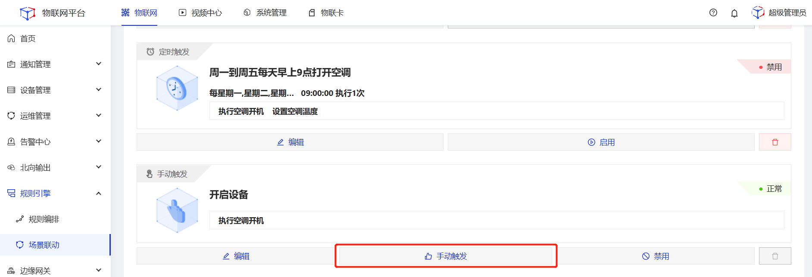
5.在设备**日志管理**中可查看具体日志数据。

## 定时触发
适用于定时向具体下发指令执行规定动作。支持按周、按月、按Corn表达式3种方式配置频率。 
**例如**：周一到周五每天早上9点打开空调，并将空调开到26度。

#### 前置条件
1.已经创建好空调产品。参见[创建产品](../Device_access/Create_product3.1.md)。 
2.已经创建好空调设备。参见[创建设备](../Device_access/Create_Device3.2.md)。 
3.通过MQTT协议将设备接入平台。参见[设备接入](../Best_practices/Device_access.md)。 
4.物模型中已经定义了空调产品具有开机功能。配置示例如下：

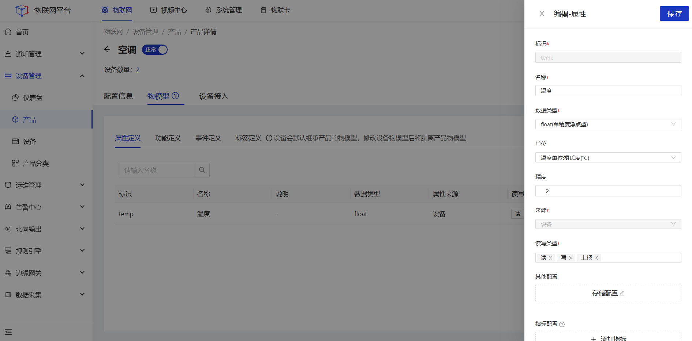

#### 操作步骤
1.**登录**Jetlinks物联网平台，进入**规则引擎>场景联动**菜单，点击**新增**，弹出弹框，填写名称，选择触发方式为**定时触发**，点击**确定**跳转至详情页。 
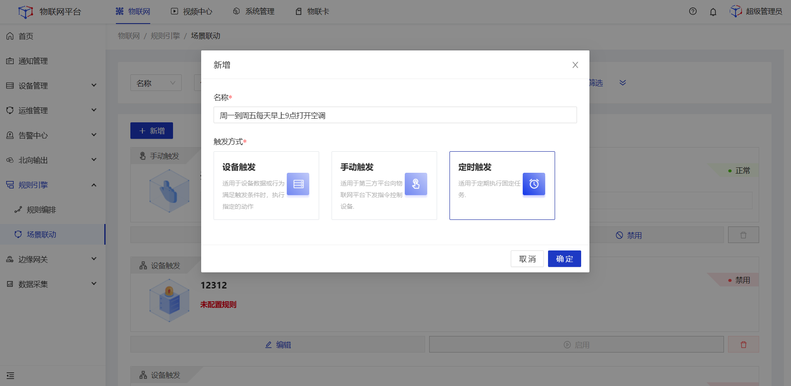
2.点击**触发规则**，在弹框页选择**按周**，周一、周二、周三、周四、周五**执行一次**，时间选择09:00:00。 

3.**串行**动作中，点击添加执行动作，选择**设备输出**，产品选择**空调**，然后选择需要执行动作的**具体设备**，再选择**功能调用**，选择**开机**，设置值为true，然后点击**确定**。
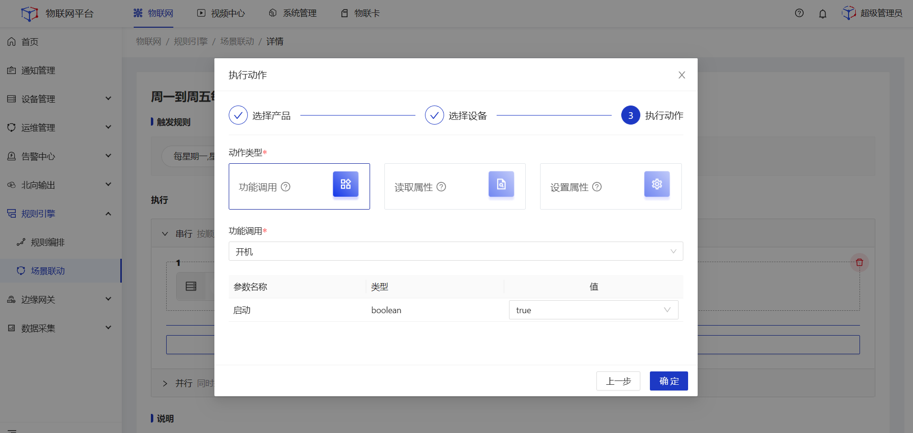
4.**串行**动作中，点击添加执行动作，选择**设备输出**，产品选择**空调**，然后选择需要执行动作的**具体设备**，再选择**设置属性**，选择**温度**，**手动输入**值为26，然后点击**确定**。
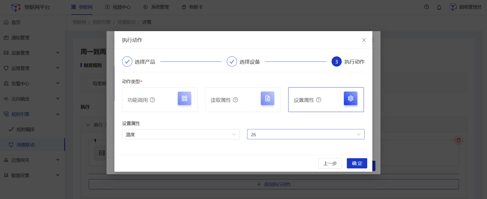
5.点击页面底部**保存**。

6.场景触发后，可在设备**日志管理**中可查看具体日志数据。

## 设备触发
适用于多个不同设备间执行动作的联动。 
**例如**：打开智能门设备的时候，打开空调，若空调打开失败，则给空调的设备负责人发送邮件通知。

#### 前置条件
1.已经创建好智能门、空调产品。参见[创建产品](../Device_access/Create_product3.1.md)。 
2.已经创建好智能门设备、空调设备。参见[创建设备](../Device_access/Create_Device3.2.md)。 
3.通过MQTT协议将设备接入平台。参见[设备接入](../Best_practices/Device_access.md)。 
4.物模型中已经定义了空调产品具有开机功能。配置示例如下：

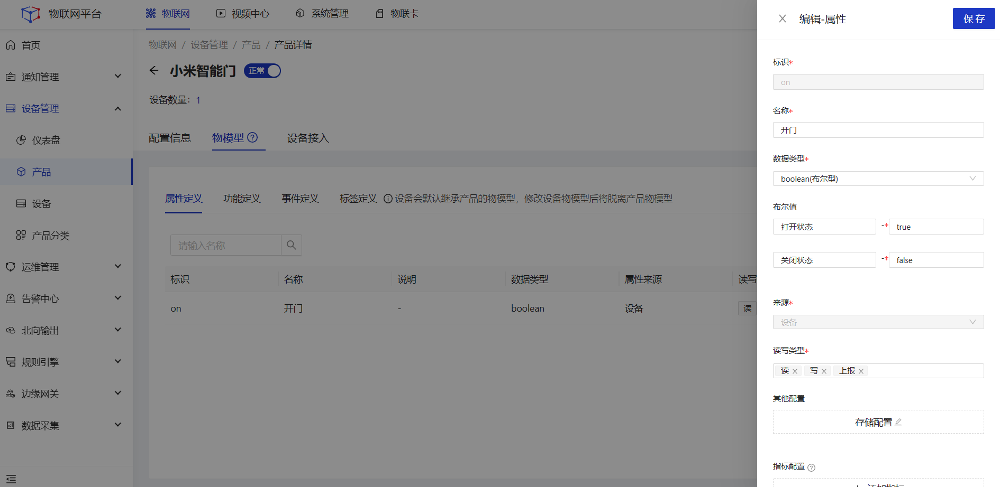
5.已在**关系配置**中配置了**设备负责人**。并给空调设备绑定了对应的负责人。参见[系统设置-关系配置](../System_settings/System_settings.md)。 
6.已在**通知管理**中配置了邮件通知模板与邮件通知配置。参见[通知管理](../Best_practices/Notification_management.md)。

#### 操作步骤
1.**登录**Jetlinks物联网平台，进入**规则引擎>场景联动**菜单，点击**新增**，填写名称，选择触发方式为**设备触发**，点击**确定**跳转至详情页。 
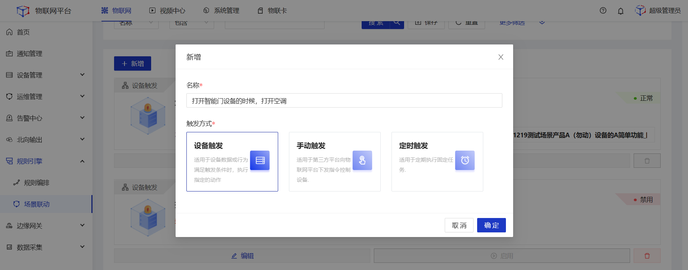
2.点击**触发规则**，在弹框页选择智能门产品，选择具体设备，触发类型选择**属性上报**，然后点击**确定**。 
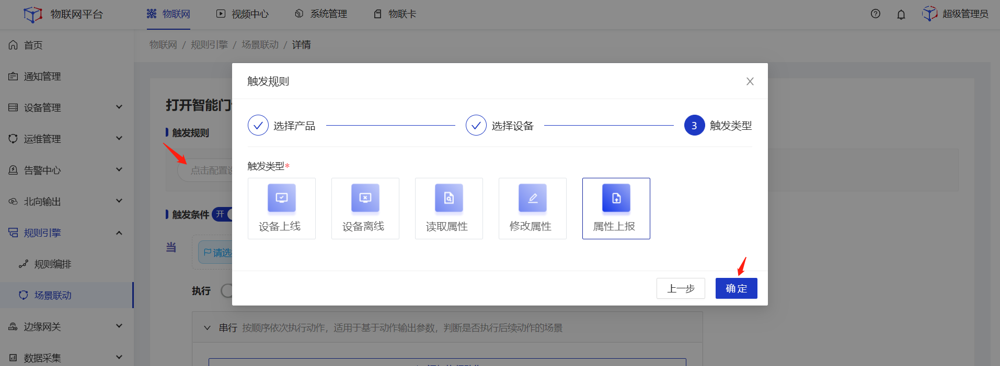
3.触发条件设置参数为**开门/当前值**，操作符为**等于**，值选择**是**。 

4.**串行**动作中，点击添加执行动作，选择**设备输出**，产品选择**空调**，然后选择需要执行动作的**具体设备**，再选择**功能调用**，选择**开机**，设置值为true，然后点击**确定**。
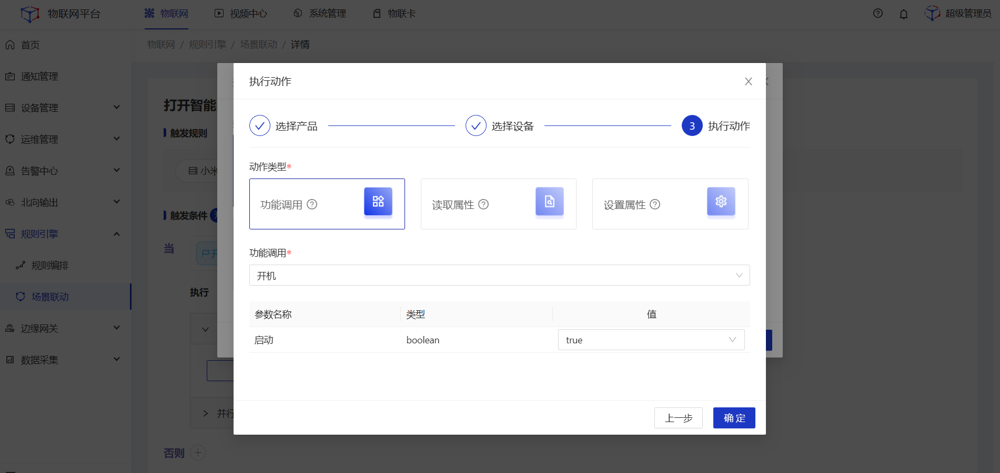
5.**串行**动作中，点击添加执行动作，选择**消息通知**，通知方式选择**邮件**，然后选择**通知配置**、**通知模板**，填写**模板变量**（可选，基于模板配置动态显示），收信人字段选择**关系用户-设备负责人**，然后点击**确定**。
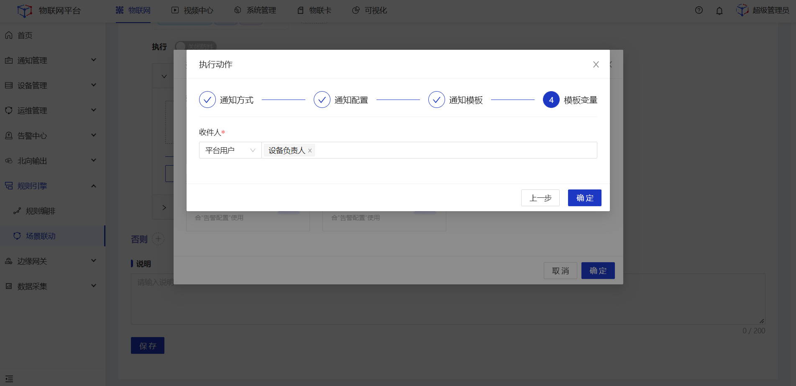

  

    
    注意
  

 若引用的通知模板中已固定了收信人，则模板变量中将不再显示该字段。

6.点击动作1与动作2之间的**添加过滤条件**按钮，参数选择**动作1-执行是否成功**，操作符选择**等于**，值选择**否**。

7.点击页面底部**保存**。
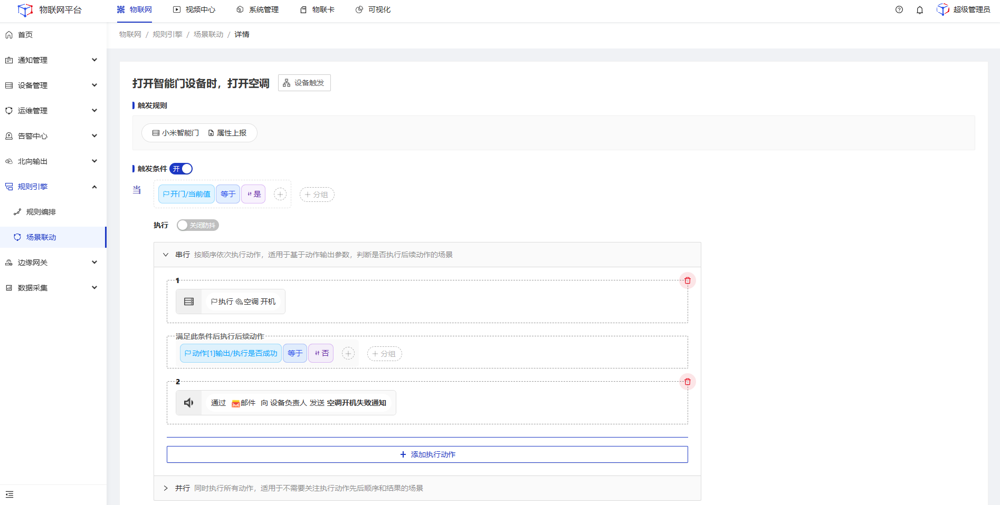
8.场景触发后，可在设备**日志管理**中可查看具体日志数据。
