# 数采管理
通过**Modbus TCP**、**OPC UA**协议采集真实物理设备的运行数据。

## 通道管理
### Modbus TCP
#### 新增
##### 操作步骤
1.**登录**Jetlinks物联网平台。 
2.点击顶部**物联网**，在左侧导航栏，选择**数据采集>通道管理**，进入列表页。 

3.点击**新增**按钮，弹出弹框，填写通道信息，然后点击**确定**。 
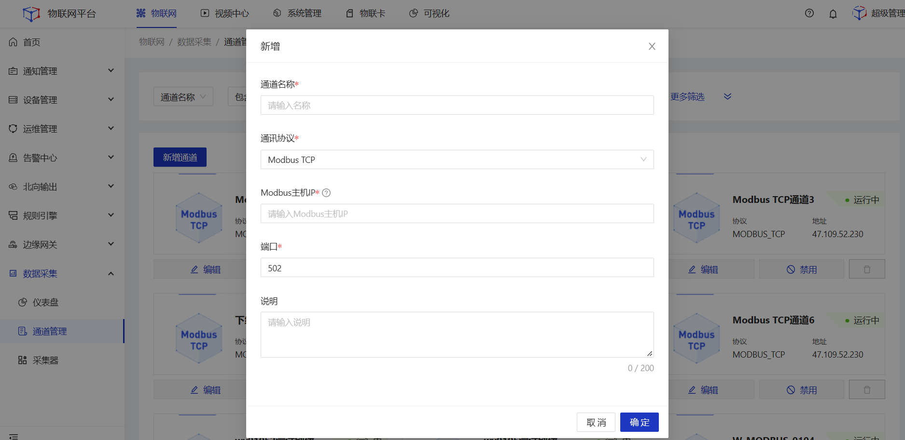

<table class='table'>
        <thead>
            <tr>
              <td>参数</td>
              <td>说明</td>
            </tr>
        </thead>
        <tbody>
          <tr>
            <td>通道名称</td>
            <td>设置通道名称，最多可输入64个字符</td>
          </tr>
          <tr>
            <td>通讯协议</td>
            <td>单选下拉框，根据所选的协议，将展开关联的其他参数配置项</td>
          </tr>
          <tr>
            <td>Modbus主机IP</td>
            <td>填写Modbus主机IP地址，格式支持ipv4、ipv6、域名</td>
          </tr>
          <tr>
            <td>端口</td>
            <td>默认502，支持输入1~65535之间的整数</td>
          </tr>
          <tr>
            <td>说明</td>
            <td>描述通道信息，非必填</td>
          </tr>
        </tbody>
      </table>

#### 编辑
##### 操作步骤
1.**登录**Jetlinks物联网平台。 
2.点击顶部**物联网**，在左侧导航栏，选择**数据采集>通道管理**，进入列表页。 

3.点击具体通道的**编辑**按钮，弹出弹框，填写通道信息，然后点击**确定**。 
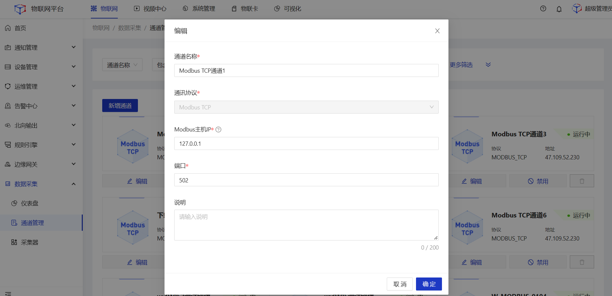

#### 启用/禁用
##### 操作步骤
1.**登录**Jetlinks物联网平台。 
2.点击顶部**物联网**，在左侧导航栏，选择**数据采集>通道管理**，进入列表页。 

3.点击具体通道的**启用/禁用**按钮，然后点击**确定**。 

#### 删除
##### 操作步骤
1.**登录**Jetlinks物联网平台。 
2.点击顶部**物联网**，在左侧导航栏，选择**数据采集>通道管理**，进入列表页。 

3.点击具体通道的**删除**按钮，然后点击**确定**。 

### OPC UA
#### 新增
##### 操作步骤
1.**登录**Jetlinks物联网平台。 
2.点击顶部**物联网**，在左侧导航栏，选择**数据采集>通道管理**，进入列表页。 

3.点击**新增**按钮，弹出弹框，填写通道信息，然后点击**确定**。 
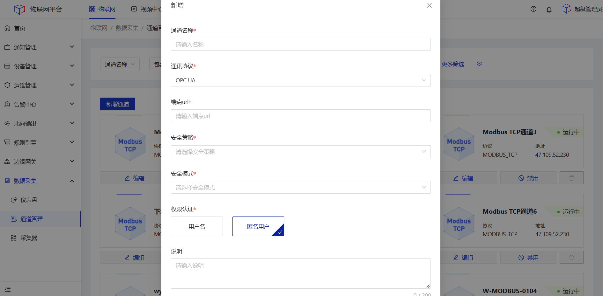

<table class='table'>
        <thead>
            <tr>
              <td>参数</td>
              <td>说明</td>
            </tr>
        </thead>
        <tbody>
          <tr>
            <td>通道名称</td>
            <td>设置通道名称，最多可输入64个字符</td>
          </tr>
          <tr>
            <td>通讯协议</td>
            <td>单选下拉框，根据所选的协议，将展开关联的其他参数配置项</td>
          </tr>
           <tr>
            <td>端点url</td>
            <td>填写端点url地址</td>
          </tr>
          <tr>
            <td>安全策略</td>
            <td>配置 OPC UA 客户端和服务器之间的数据通信安全策略</td>
          </tr>
          <tr>
            <td>安全模式</td>
            <td>配置 OPC UA 客户端和服务器之间的加密和身份验证方式
            

    说明
    <ul>
安全模式为Sign、SignAndEncrypt时，可配置证书。
    </ul>
  

            </td>
          </tr>
           <tr>
            <td>权限认证</td>
            <td>配置权限认证方式，选择用户名时，需配置用户名和密码</td>
          </tr>
          <tr>
            <td>说明</td>
            <td>描述通道信息，非必填</td>
          </tr>
        </tbody>
      </table>

#### 编辑
参考**Modbus TCP**操作逻辑。
#### 启用/禁用
参考**Modbus TCP**操作逻辑。
#### 删除
参考**Modbus TCP**操作逻辑。

## 采集器
### Modbus TCP
#### 新增采集器
##### 操作步骤
1.**登录**Jetlinks物联网平台。 
2.点击顶部**物联网**，在左侧导航栏，选择**数据采集>采集器**，进入列表页。 

3.点击左侧的**新增采集器**按钮，弹出弹框，填写采集器信息，然后点击**确定**。 
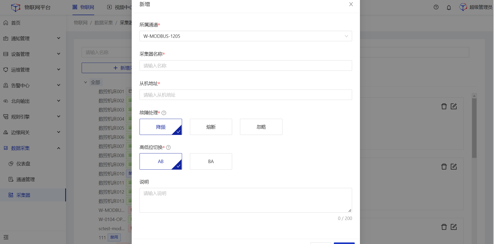

<table class='table'>
        <thead>
            <tr>
              <td>参数</td>
              <td>说明</td>
            </tr>
        </thead>
        <tbody>
           <tr>
            <td>所属通道</td>
            <td>选择所属通道</td>
          </tr>
          <tr>
            <td>采集器名称</td>
            <td>设置采集器名称，最多可输入64个字符</td>
          </tr>
           <tr>
            <td>从机地址</td>
            <td>设置从机地址，支持0~255之间的整数</td>
          </tr>
          <tr>
            <td>故障处理</td>
            <td><li>降频：连续20次异常，降低连接频率至原有频率的1/10（重试间隔不超过1分钟），故障处理后自动恢复至设定连接频率</li>
            <li>熔断：连续10分钟异常，停止采集数据进入熔断状态，设备重新启用后恢复采集状态</li>
            <li>忽略：忽略异常，保持原采集频率超时时间为5s</li>
            </td>
          </tr>
           <tr>
            <td>高低位切换</td>
            <td>统一配置所有点位的高低位切换</td>
          </tr>
          <tr>
            <td>说明</td>
            <td>描述采集器信息，非必填</td>
          </tr>
        </tbody>
      </table>

#### 编辑采集器
##### 操作步骤
1.**登录**Jetlinks物联网平台。 
2.点击顶部**物联网**，在左侧导航栏，选择**数据采集>采集器**，进入列表页。 

3.点击左侧的具体采集器的**编辑**按钮，弹出弹框，编辑采集器信息，然后点击**确定**。 
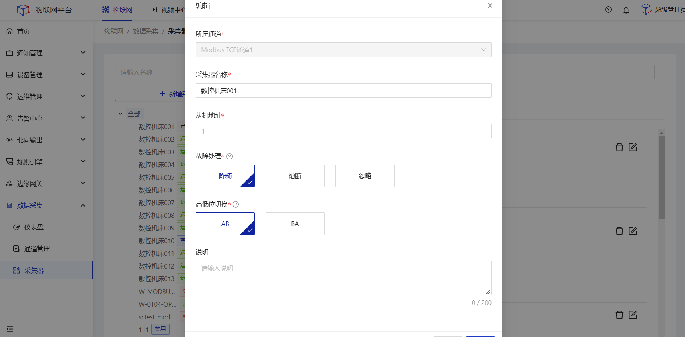

#### 启用/禁用采集器
##### 操作步骤
1.**登录**Jetlinks物联网平台。 
2.点击顶部**物联网**，在左侧导航栏，选择**数据采集>采集器**，进入列表页。 

3.点击左侧的具体采集器的**启用/禁用**按钮，弹出弹框，编辑采集器信息，然后点击**确定**。 

#### 删除采集器
##### 操作步骤
1.**登录**Jetlinks物联网平台。 
2.点击顶部**物联网**，在左侧导航栏，选择**数据采集>采集器**，进入列表页。 

3.点击左侧的具体采集器的**删除**按钮，弹出弹框，编辑采集器信息，然后点击**确定**。 

#### 新增点位
##### 操作步骤
1.**登录**Jetlinks物联网平台。 
2.点击顶部**物联网**，在左侧导航栏，选择**数据采集>采集器**，进入列表页。 

3.点击左侧的具体采集器节点，再点击右侧页面的**新增点位**按钮，弹出弹框，填写点位信息，然后点击**确定**。 
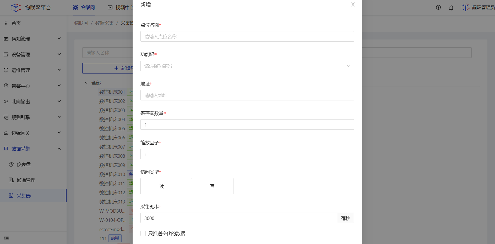

<table class='table'>
        <thead>
            <tr>
              <td>参数</td>
              <td>说明</td>
            </tr>
        </thead>
        <tbody>
          <tr>
            <td>点位名称</td>
            <td>设置点位名称，最多可输入64个字符</td>
          </tr>
          <tr>
            <td>功能码</td>
            <td>单选下拉框，由Modbus协议制定的标准数据</td>
          </tr>
          <tr>
            <td>地址</td>
            <td>设置点位地址，可输入0~255之间的正整数</td>
          </tr>
          <tr>
            <td>寄存器数量</td>
            <td>设置寄存器数量，只能输入非0正整数</td>
          </tr>
           <tr>
            <td>缩放因子</td>
            <td>对寄存器内的数据进行乘以缩放因子,得到所需的数据；只能输入数字，支持小数，支持负数</td>
          </tr>
           <tr>
            <td>访问类型</td>
            <td>根据功能码进行读取，可对读取后的数据进行自定义编辑</td>
          </tr>
           <tr>
            <td>采集频率</td>
            <td>设置平台端定期采集数据的频率，只能输入正整数</td>
          </tr>
          <tr>
            <td>只推送变化的数据</td>
            <td>默认不勾选，勾选后只有当采集的数据发生变化时，才将变化后的数据推送至平台</td>
          </tr>
          <tr>
            <td>说明</td>
            <td>描述点位信息，非必填</td>
          </tr>
        </tbody>
      </table>

  

    
    注意
  

  添加点位后，平台能获取点位上报的源数据，若需实现在**设备-运行状态**页面查看采集器的上报数据，需在**设备-Modbus TCP/OPC UA**页面将采集器点位数据与设备物模型进行映射绑定。

#### 编辑点位
##### 操作步骤
1.**登录**Jetlinks物联网平台。 
2.点击顶部**物联网**，在左侧导航栏，选择**数据采集>采集器**，进入列表页。 

3.点击左侧的具体点击数据的**编辑**按钮，弹出弹框，编辑点位信息，然后点击**确定**。 
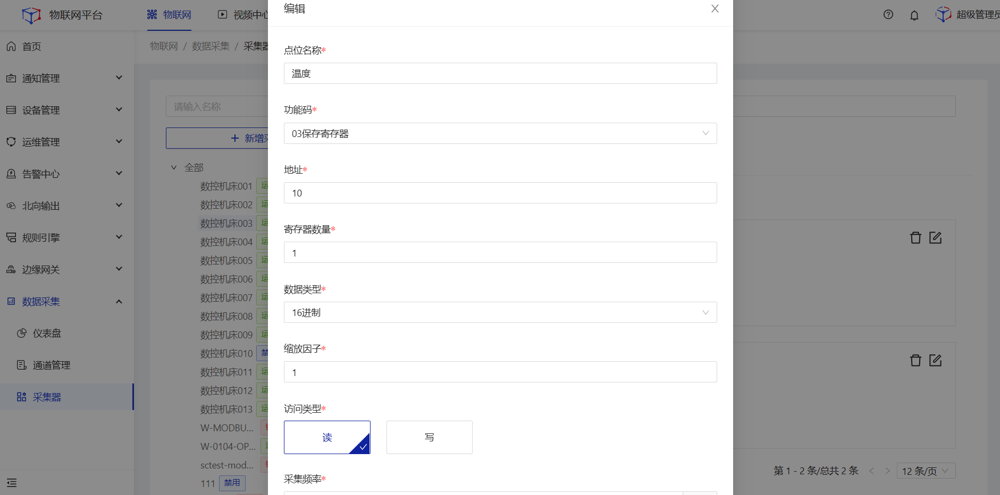

#### 删除点位
1.**登录**Jetlinks物联网平台。 
2.点击顶部**物联网**，在左侧导航栏，选择**数据采集>采集器**，进入列表页。 

3.点击左侧的具体点击数据的**删除**按钮，然后点击**确定**。 
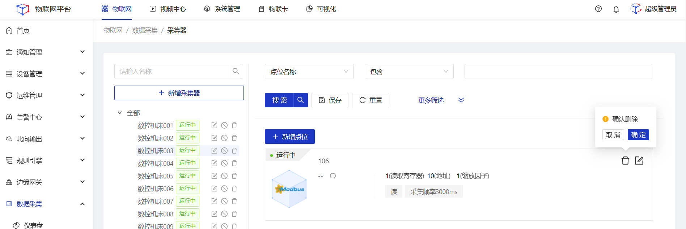

### OPC UA
#### 新增采集器
##### 操作步骤
1.**登录**Jetlinks物联网平台。 
2.点击顶部**物联网**，在左侧导航栏，选择**数据采集>采集器**，进入列表页。 

3.点击左侧的**新增采集器**按钮，弹出弹框，填写采集器信息，然后点击**确定**。 
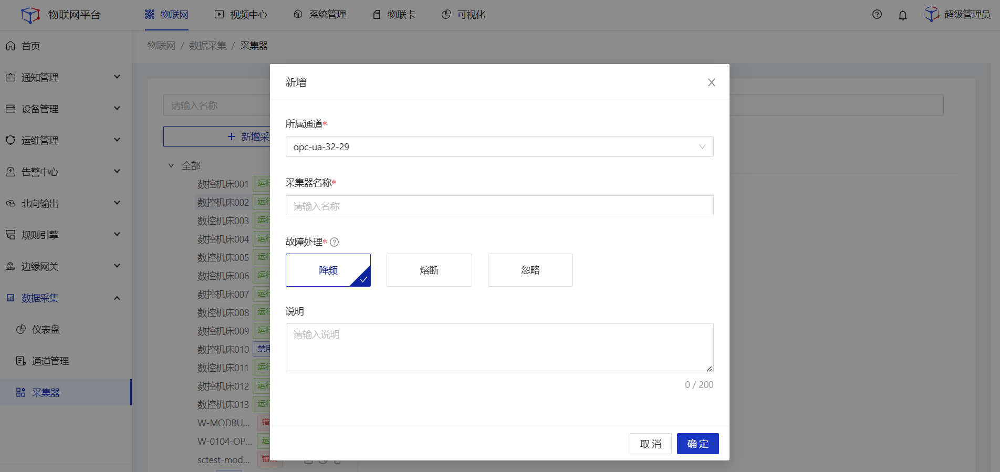

<table class='table'>
        <thead>
            <tr>
              <td>参数</td>
              <td>说明</td>
            </tr>
        </thead>
        <tbody>
          <tr>
            <td>采集器名称</td>
            <td>设置采集器名称，最多可输入64个字符</td>
          </tr>
          <tr>
            <td>故障处理</td>
            <td><li>降频：连续20次异常，降低连接频率至原有频率的1/10（重试间隔不超过1分钟），故障处理后自动恢复至设定连接频率</li>
            <li>熔断：连续10分钟异常，停止采集数据进入熔断状态，设备重新启用后恢复采集状态</li>
            <li>忽略：忽略异常，保持原采集频率超时时间为5s</li>
            </td>
          </tr>
          <tr>
            <td>说明</td>
            <td>描述采集器信息，非必填</td>
          </tr>
        </tbody>
      </table>

#### 编辑采集器
##### 操作步骤
1.**登录**Jetlinks物联网平台。 
2.点击顶部**物联网**，在左侧导航栏，选择**数据采集>采集器**，进入列表页。 

3.点击左侧采集器数据的**编辑**按钮，弹出弹框，编辑采集器信息，然后点击**确定**。 
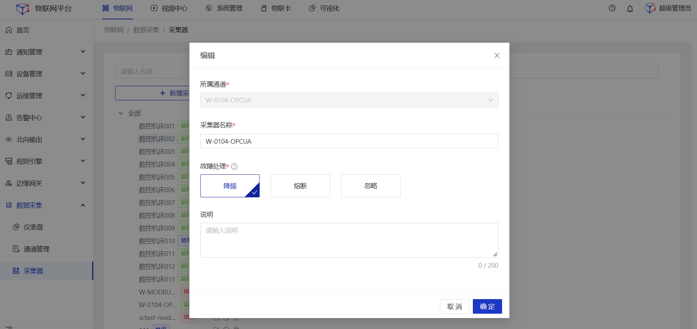

#### 启用/禁用采集器
与**Modbus TCP**采集器操作逻辑相同。
#### 删除采集器
与**Modbus TCP**采集器操作逻辑相同。

#### 新增点位
##### 操作步骤
1.**登录**Jetlinks物联网平台。 
2.点击顶部**物联网**，在左侧导航栏，选择**数据采集>采集器**，进入列表页。 

3.点击左侧的具体采集器节点，再点击右侧页面的**扫描**按钮，弹出弹框，勾选需要添加的点位，然后点击**确定**。 
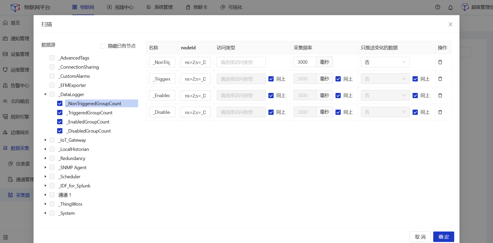

<table class='table'>
        <thead>
            <tr>
              <td>参数</td>
              <td>说明</td>
            </tr>
        </thead>
        <tbody>
          <tr>
            <td>点位名称</td>
            <td>设置点位名称，最多可输入64个字符</td>
          </tr>
           <tr>
            <td>nodeid</td>
            <td>唯一标识，回显字段，不可编辑。</td>
          </tr>
           <tr>
            <td>访问类型</td>
            <td>设置点位数据的访问类型
            <li>读：支持读取点位数据</li>
            <li>写：支持写入点位数据</li>
            <li>订阅：支持服务器监控点位，当点位数据发生变化时再通知客户端这些变化</li>
            </td>
          </tr>
           <tr>
            <td>采集频率</td>
            <td>设置平台端定期采集数据的频率，只能输入正整数</td>
          </tr>
          <tr>
            <td>只推送变化的数据</td>
            <td>默认不勾选，勾选后只有当采集的数据发生变化时，才将变化后的数据推送至平台</td>
          </tr>
        </tbody>
      </table>

#### 编辑点位
参考**Modbus TCP**点位操作逻辑。
#### 启用/禁用
参考**Modbus TCP**点位操作逻辑。
#### 删除
参考**Modbus TCP**点位操作逻辑。

