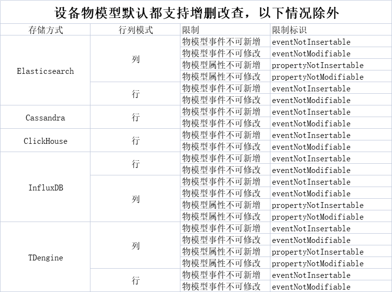

# 配置物模型

### 物模型概述

物模型是对设备在云端的功能描述，包括设备的**属性**、**功能**、**事件**和**标签**。物联网平台通过定义一种物的描述语言来描述物模型，称之为**TSL**（即 Thing Specification Language），采用**JSON**格式，您可以根据TSL组装上报设备的数据。 

### 功能说明
物模型是物理空间中的实体（如传感器设备、消防装置、园区、工厂等）在云端的数字化表示，从**属性**、**功能**、**事件**、**标签**四个维度，分别描述了该实体是什么、能做什么、可以对外提供哪些信息、可以自定义补充哪些信息。定义了物模型的这四个维度，即完成了产品功能的定义。

<table class='table'>
        <thead>
            <tr>
              <td>类型</td>
              <td>说明</td>
            </tr>
        </thead>
        <tbody>
          <tr>
            <td>属性</td>
            <td>用于描述设备运行时具体信息和状态。例如，环境监测设备所读取的当前环境温度、智能灯开关状态、电风扇风力等级等。属性可分为读、写和上报三种类型，即支持读取、设置属性、设备上报属性。 </td>
          </tr>
          <tr>
            <td>功能</td>
            <td>指设备可供外部调用的指令或方法。服务调用中可设置输入和输出参数。输入参数是服务执行时的参数，输出参数是服务执行后的结果。相比于属性，服务可通过一条指令实现更复杂的业务逻辑，例如执行某项特定的任务。服务分为异步和同步两种调用方式。</td>
          </tr>
          <tr>
            <td>事件</td>
            <td>设备运行时，主动上报给云端的信息，一般包含需要被外部感知和处理的信息、告警和故障。事件中可包含多个输出参数。例如，某项任务完成后的通知信息；设备发生故障时的温度、时间信息；设备告警时的运行状态等。事件可以被订阅和推送。</td>
          </tr>
          <tr>
            <td>标签</td>
            <td>设备基于业务需要，自定义补充标签信息。</td>
          </tr>
          </tbody>
</table>

### 使用说明
1.Jetlinks物联网平台通过定义一种物的描述语言来描述物模型模块和功能，称为TSL（Thing Specification Language）。 
2.物模型TSL文件格式为JSON。您可以在**产品/设备**的**物模型**页面，单击**物模型TSL**,查看或导出JSON格式的TSL。 
3.物模型支持单个和批量的添加，设备会自动**继承**产品的物模型配置参数。 

  

    
    说明
  

  设备的物模型也支持单独配置，单独配置后，设备将脱离产品物模型，修改产品物模型不会再同步到设备。

### 限制说明
设备派生物模型（自动继承的产品物模型）默认都支持增删改查，以下情况除外：

### 物模型支持的数据类型
<table class='table'>
        <thead>
            <tr>
              <td>参数</td>
              <td>说明</td>
              <td>示例</td>
            </tr>
        </thead>
        <tbody>
          <tr>
            <td>int</td>
            <td>32位整形</td>
            <td>100</td>
          </tr>
          <tr>
            <td>float</td>
            <td>单精度浮点型</td>
            <td>10.4</td>
          </tr>
          <tr>
            <td>double</td>
            <td>双精度浮点型</td>
            <td>10.45</td>
          </tr>
          <tr>
            <td>text</td>
            <td>字符串，对应的数据长度不能超过10240字节。</td>
            <td>你好，Jetlinks物联网平台</td>
          </tr>
           <tr>
            <td>date</td>
            <td>时间戳。默认格式为String类型的UTC时间戳，单位：毫秒。</td>
            <td>1635839462000</td>
          </tr>
           <tr>
            <td>boolen</td>
            <td>布尔型。采用0（false）或1（true）来定义布尔值</td>
            <td>1表示是、0表示否</td>
          </tr>
            <tr>
            <td>enum</td>
            <td>枚举型。定义枚举项的参数值和参数描述。</td>
            <td>[{key:1,value:1}</td>
          </tr>
          <tr>
            <td>array</td>
            <td>数组。需声明数组内的元素类型、数组元素个数。需确保同一个数组元素类型相同。元素个数限制为1~512个。</td>
            <td>[1, 2, 3, 4, 5, 6]</td>
          </tr>
          <tr>
            <td>Object</td>
            <td>结构体数据，支持树形结构化数据。树形数据格式为JSON 。</td>
            <td>{ "name":"烟感设备", "address":1楼}</td>
          </tr>
          <tr>
            <td>file</td>
            <td>文件</td>
            <td>https://gimg2.baidu.com/image_search/src=http%3A%2…sec=1660189147&t=7e5068baf7bef3fb0664476ba4d94822</td>
          </tr>
          <tr>
            <td>存储配置</td>
            <td>单选下拉框，支持存储、不存储。 
            </td>
              <td>存储</td>
          </tr>
          <tr>
            <td>指标配置</td>
            <td><li>标识：指标唯一标识。</li>
                <li>名称：为指标命名，最多可输入64个字符</li>
                <li>指标值：支持单个值和范围值填写</li></td>
            <td>{ "指标":"temp", "名称":高值, "指标值":50}</td>
          </tr>
          <tr>
            <td>password</td>
            <td>密码数据</td>
            <td>admin</td>
          </tr>
           <tr>
            <td>geoPoint</td>
            <td>地址位置数据，以经纬度显示</td>
            <td>106.551783,29.555705</td>
          </tr>
          </tbody>
</table>

### 操作步骤
1.**登录**Jetlinks物联网平台。 
2.在左侧导航栏，选择**设备管理>设备**，点击**查看**，切换至物模型tab页，并点击**新增**按钮。 
3.在**新建**抽屉中，根据设备实际情况，按照页面提示填写信息，然后单击**确定**。 

#### 属性参数说明
<table class='table'>
        <thead>
            <tr>
              <td>标识</td>
              <td>同一个产品内属性标识具有唯一性，不支持编辑。</td>
            </tr>
        </thead>
        <tbody>
          <tr>
            <td>名称</td>
            <td>为设备命名，最多可输入64个字符。</td>
          </tr>
          <tr>
            <td>数据类型</td>
            <td>1. int：整数型，需定义单位符号。 
            2. long：长整数型，需定义单位符号。 
            3. float：单精度浮点型。需定义单位符号。 
            4. double：双精度浮点型。需定义单位、精度。 
            5. text：字符串。需定义字符串的数据长度。 
            6. boolean：布尔型。采用true或false来定义布尔值，例如true-关；false-开。 
            7. date：时间戳。默认格式为String类型的UTC时间戳，单位：毫秒。 
            8. enum：枚举型。定义枚举项的参数值和参数描述，例如1-加热模式、2-制冷模式等。 
            9. array：数组。需声明数组内元素的数据类型，可选择int32、float、double、text或object。需确保同一个数组元素类型相同。数组内可包含1-128个元素。 
            10. object：JSON对象。定义一个JSON结构体，新增JSON参数项，例如定义灯的颜色是由Red、Green、Blue三个参数组成的结构体。 
            11.  file：文件。需声明文件元素类型，可选择URL、base64、binary(二进制)。 
            12. password：密码。上报时如果属性为密码，将进行加密或者是隐秘的方式进行显现或者处理。 
            13. geoPoint：地理位置，按经纬度格式进行定义。
</td>
         </td>
          </tr>
          <tr>
            <td>单位</td>
            <td>单选下拉框，可选择为无或根据实际情况选择。</td>
          </tr>
         <tr>
            <td>精度</td>
            <td>控制所需的小数位数。</td>
          </tr>
         <tr>
            <td>最大长度</td>
            <td>单位为字节。</td>
          </tr>
         <tr>
            <td>来源</td>
            <td>单选下拉框，支持设备、手动、规则。</td>
          </tr>
          <tr>
            <td>读写类型</td>
            <td>单选下拉框，支持读、写、上报</td>
          </tr>
          <tr>
            <td>说明</td>
            <td>备注说明，最多可输入200个字符。</td>
          </tr>
          </tbody>
</table>

#### 功能参数说明
<table class='table'>
        <thead>
            <tr>
              <td>标识</td>
              <td>同一个产品内功能标识具有唯一性，不支持编辑。</td>
            </tr>
        </thead>
        <tbody>
          <tr>
            <td>名称</td>
            <td>为功能命名，最多可输入64个字符。</td>
          </tr>
         <tr>
            <td>是否异步</td>
            <td>异步：服务为异步调用时，云端执行调用后直接返回结果，不会等待设备的回复消息。 同步：服务为同步调用时，云端会等待设备回复；若设备没有回复，则调用超时。</td>
          </tr>
          <tr>
            <td>输入参数</td>
            <td>定义功能的输入参数标识、名称、数据类型。
            </td>
          </tr>
          <tr>
            <td>输出参数</td>
            <td>1. int：位整型。需定义取值范围、步长和单位符号。 
            2. long：长整数型，需定义单位符号。 
            3. float：单精度浮点型。需定义单位符号。 
            4. double：双精度浮点型。需定义单位、精度。 
            5. text：字符串。需定义字符串的数据长度。 
            6. boolean：布尔型。采用true或false来定义布尔值，例如true-关；false-开。 
            7. date：时间戳。默认格式为String类型的UTC时间戳，单位：毫秒。 
            8. enum：枚举型。定义枚举项的参数值和参数描述，例如1-加热模式、2-制冷模式等。 
            9. array：数组。需声明数组内元素的数据类型，可选择int32、float、double、text或object。需确保同一个数组元素类型相同。数组内可包含1-128个元素。 
            10. object：JSON对象。定义一个JSON结构体，新增JSON参数项，例如定义灯的颜色是由Red、Green、Blue三个参数组成的结构体。 
            11. password：密码。上报时如果属性为密码，将进行加密或者是隐秘的方式进行显现或者处理。 
            12. geoPoint：地理位置，按经纬度格式进行定义。
          </td>
      </tr>
</tbody>
</table>

#### 事件参数说明
<table class='table'>
        <thead>
            <tr>
              <td>标识</td>
              <td>同一个产品内事件标识具有唯一性，不支持编辑</td>
            </tr>
        </thead>
        <tbody>
          <tr>
            <td>名称</td>
            <td>为功能命名，最多可输入64个字符。</td>
          </tr>
         <tr>
            <td>级别</td>
            <td>单选下拉框，点击展开：普通、告警、紧急</td>
          </tr>
          <tr>
            <td>输出参数</td>
            <td> object：JSON对象。定义一个JSON结构体，新增JSON参数项，例如定义灯的颜色是由Red、Green、Blue三个参数组成的结构体。  

    说明
    <ul>
 配置的事件的触发记录，将在设备“运行状态”左侧菜单中进行显示。
    </ul>
  

            </td>
          </tr>
           <tr>
            <td>JSON对象</td>
            <td>定义结构体的标识、名称、数据类型。</td>
          </tr>
</tbody>
</table>

#### 标签参数说明
<table class='table'>
        <thead>
            <tr>
              <td>标识</td>
              <td>同一个产品内标签标识具有唯一性，不支持编辑</td>
            </tr>
        </thead>
        <tbody>
          <tr>
            <td>名称</td>
            <td>为标签命名，最多可输入64个字符。</td>
          </tr>
          <tr>
            <td>数据类型</td>
            <td>1. int：位整型。需定义取值范围、步长和单位符号。 
            2. long：长整数型，需定义单位符号。 
            3. float：单精度浮点型。需定义单位符号。 
            4. double：双精度浮点型。需定义单位、精度。 
            5. text：字符串。需定义字符串的数据长度。 
            6. boolean：布尔型。采用true或false来定义布尔值，例如true-关；false-开。 
            7. date：时间戳。默认格式为String类型的UTC时间戳，单位：毫秒。 
            8. enum：枚举型。定义枚举项的参数值和参数描述，例如1-加热模式、2-制冷模式等。 
            9. array：数组。需声明数组内元素的数据类型，可选择int32、float、double、text或object。需确保同一个数组元素类型相同。数组内可包含1-128个元素。 
            10. object：JSON对象。定义一个JSON结构体，新增JSON参数项，例如定义灯的颜色是由Red、Green、Blue三个参数组成的结构体。 
            11. geoPoint：地理位置，按经纬度格式进行定义。
            </td>
           </tr>
           <tr>
            <td>标签类型</td>
            <td>单选下拉框，支持读、写、上报</td>
          </tr>
</tbody>
</table>