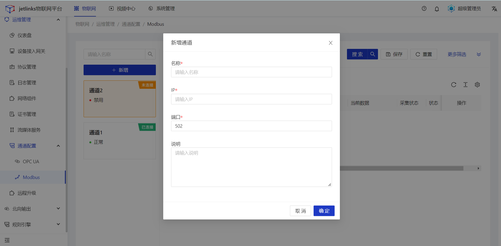
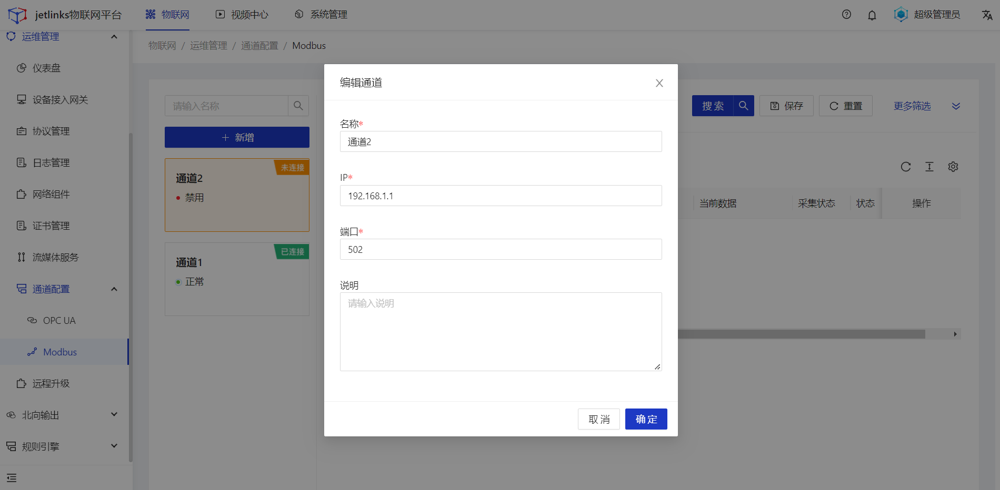
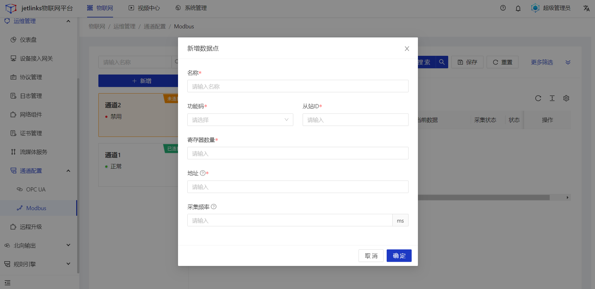
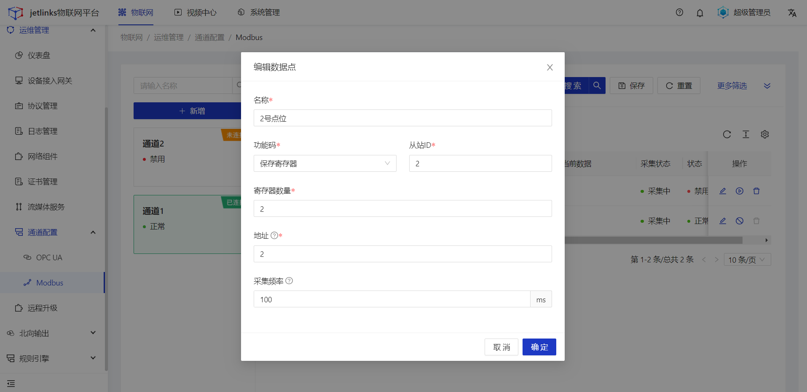
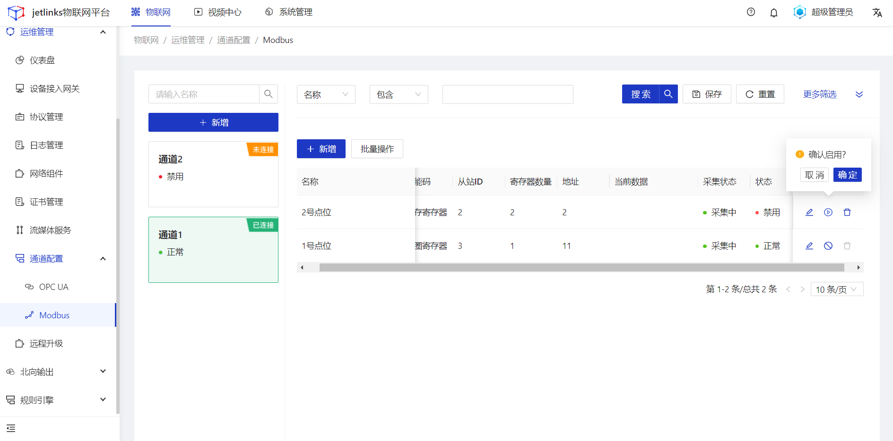
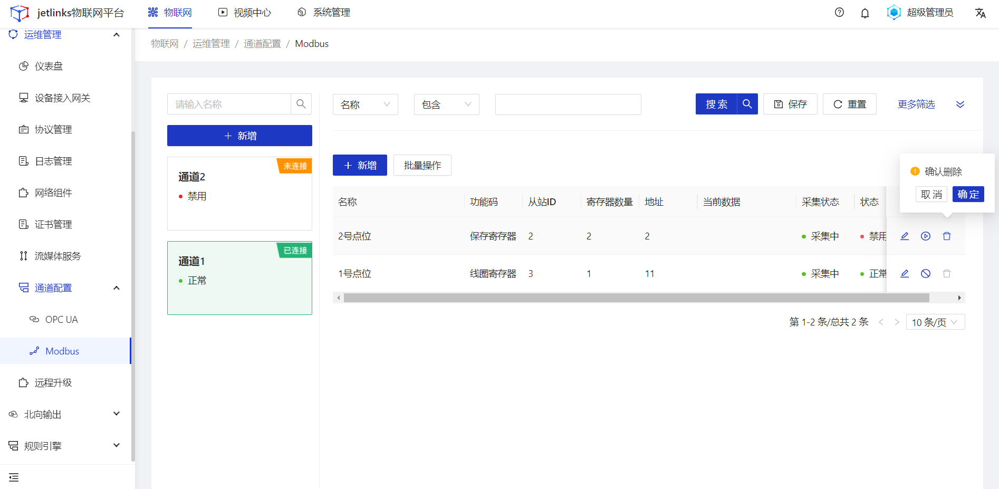

## Modbus通道配置
管理Modbus通道以及通道下的点位数据。

  
 
    
    提示
  

本功能仅在企业版中提供。

#### 新增
##### 操作步骤
1.**登录**Jetlinks物联网平台。 
2.在左侧导航栏，选择**运维管理>通道配置>Modbus**，进入列表页。 
3.点击页面左侧**新增**按钮，在弹框页中填写通道相关信息，然后点击**确定**。

#### 编辑
##### 操作步骤
1.**登录**Jetlinks物联网平台。 
2.在左侧导航栏，选择**运维管理>通道配置>Modbus**，进入列表页。 
3.鼠标移入通道卡片，点击卡片中的**编辑**按钮，在弹框页中编辑通道相关信息，然后点击**确定**。 

#### 启用禁用
##### 操作步骤
1.**登录**Jetlinks物联网平台。 
2.在左侧导航栏，选择**运维管理>通道配置>Modbus**，进入列表页。 
3.鼠标移入通道卡片，点击卡片中的**启用禁用**按钮，然后点击**确定**。 

#### 删除
##### 操作步骤
1.**登录**Jetlinks物联网平台。 
2.在左侧导航栏，选择**运维管理>通道配置>Modbus**，进入列表页。 
3.鼠标移入通道卡片，点击卡片中的**删除**按钮，然后点击**确定**。 

  

    
    说明
  

删除通道后，与该通道绑定的设备属性将自动解绑。

#### 新增数据点
##### 操作步骤
1.**登录**Jetlinks物联网平台。 
2.在左侧导航栏，选择**运维管理>通道配置>Modbus**，进入列表页。 
3.点击页面右侧的**新增**按钮，在弹框页中填写点位相关信息，然后点击**确定**。

#### 编辑数据点
##### 操作步骤
1.**登录**Jetlinks物联网平台。 
2.在左侧导航栏，选择**运维管理>通道配置>Modbus**，进入列表页。 
3.点击页面右侧具体点位数据的**编辑**按钮，在弹框页中编辑点位相关信息，然后点击**确定**。

#### 数据点启用禁用
##### 操作步骤
1.**登录**JetLinks物联网平台。 
2.在左侧导航栏，选择**运维管理>通道配置>Modbus**，进入列表页。 
3.点击页面右侧具体点位数据的**启用禁用**按钮，然后点击**确定**。

#### 数据点删除
##### 操作步骤
1.**登录**JetLinks物联网平台。 
2.在左侧导航栏，选择**运维管理>通道配置>Modbus**，进入列表页。 
3.点击页面右侧具体点位数据的**删除**按钮，然后点击**确定**。

  

    
    说明
  

删除点位后，与该点位绑定的设备属性将自动解绑。

