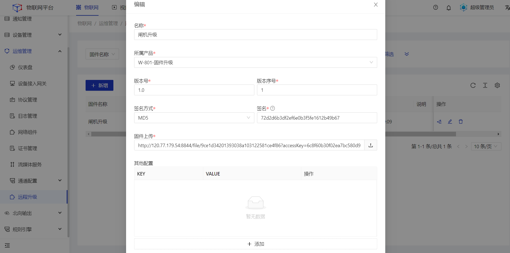

# 远程升级
<div class='explanation primary'>
  <p class='explanation-title-warp'>
    <span class='iconfont icon-bangzhu explanation-icon'></span>
    <span class='explanation-title font-weight'>说明</span>
  </p>

远程升级及空中下载技术，通过JetLinks物联网平台的远程升级功能，可对分布在各地的IoT设备进行远程升级。

</div>

## 指导介绍

  <p>1. <a href="/Mocha_ITOM/remote_upgrade.html#新增">新增</a></p>
  <p>2. <a href="/Mocha_ITOM/remote_upgrade.html#升级任务">升级任务</a></p>
  <p>3. <a href="/Mocha_ITOM/remote_upgrade.html#编辑">编辑</a></p>
  <p>4. <a href="/Mocha_ITOM/remote_upgrade.html#删除">删除</a></p>
  <p>5. <a href="/Mocha_ITOM/remote_upgrade.html#更新固件消息">更新固件消息</a></p>
  <p>6. <a href="/Mocha_ITOM/remote_upgrade.html#上报更新固件进度">上报更新固件进度</a></p>
  <p>7. <a href="/Mocha_ITOM/remote_upgrade.html#拉取固件更新">拉取固件更新</a></p>
  <p>8. <a href="/Mocha_ITOM/remote_upgrade.html#拉取固件更新回复">拉取固件更新回复</a></p>
  <p>9. <a href="/Mocha_ITOM/remote_upgrade.html#上报固件版本">上报固件版本</a></p>
  <p>10. <a href="/Mocha_ITOM/remote_upgrade.html#获取固件版本">获取固件版本</a></p>
  <p>11. <a href="/Mocha_ITOM/remote_upgrade.html#获取固件版本回复">获取固件版本回复</a></p>


<div class='explanation info'>
  <p class='explanation-title-warp'> 
    <span class='iconfont icon-tishi explanation-icon'></span>
    <span class='explanation-title font-weight'>提示</span>
  </p>

本功能仅在企业版中提供。

</div>

## 新增

<div class='explanation primary'>
  <p class='explanation-title-warp'>
    <span class='iconfont icon-bangzhu explanation-icon'></span>
    <span class='explanation-title font-weight'>说明</span>
  </p>

开启固件升级时，需要在协议包Provider入口类中添加全局Feature

</div>

```java
CompositeProtocolSupport support = new CompositeProtocolSupport();
//开启固件升级
support.addFeature(supportFirmware);
```

<div class='explanation primary'>
  <p class='explanation-title-warp'>
    <span class='iconfont icon-bangzhu explanation-icon'></span>
    <span class='explanation-title font-weight'>说明</span>
  </p>
<p>获取文件MD5/SHA256值：</p>
<p>1.cd 文件目录</p>
<p>2.certutil -hashfile 文件名 MD5/SHA256</p>
</div>


### 操作步骤
1.**登录**JetLinks物联网平台。</br>
2.在左侧导航栏，选择**运维管理>远程升级**，进入列表页。</br>
3.点击**新增**按钮，在弹框页填写相关信息，然后点击**确定**。


<table class='table'>
        <thead>
            <tr>
              <td>参数</td>
              <td>说明</td>
            </tr>
        </thead>
        <tbody>
          <tr>
            <td>名称</td>
            <td>为固件命名，最多可输入64个字符。</td>
          </tr>
          <tr>
            <td>所属产品</td>
            <td>选择支持固件升级的产品与固件进行关联。产品是否支持升级由关联的协议包决定。</td>
          </tr>
          <tr>
            <td>版本号</td>
            <td>拟定上传固件的版本号。 </td>
          </tr>
           <tr>
            <td>版本序号</td>
            <td>拟定固件版本序号。 设备拉取时可按序号从小往大升级，也可直接拉取最大序号的固件。</td>
          </tr>
          <tr>
            <td>签名方式</td>
            <td>固件加密方式</td>
          </tr>
           <tr>
            <td>签名</td>
            <td>输入本地文件进行签名加密后的值，以验证上传后的文件是否与本地一致。</td>
          </tr>
           <tr>
            <td>固件上传</td>
            <td>上传固件文件</td>
          </tr>
           <tr>
            <td>其他配置</td>
            <td>自定义远程升级所需的其他参数配置。</td>
          </tr>
           <tr>
            <td>说明</td>
            <td>备注说明，最多可输入200个字符。</td>
          </tr>
        </tbody>
      </table>

## 升级任务
### 操作步骤
1.**登录**Jetlinks物联网平台。</br>
2.在左侧导航栏，选择**运维管理>远程升级**，进入列表页。</br>
3.点击具体数据的**升级任务**按钮，进入列表页。</br>
4.点击**新增**按钮，在弹框页填写任务信息，然后点击确定。</br>


### 后续操作
1.点击**详情**按钮，查看升级进度。</br>

2.点击**批量重试**按钮，对升级失败的升级进行再次下方升级指令。
<div class='explanation primary'>
  <p class='explanation-title-warp'>
    <span class='iconfont icon-bangzhu explanation-icon'></span>
    <span class='explanation-title font-weight'>说明</span>
  </p>
只有升级方式为平台推送类型时才支持此功能
</div>

3.点击**停止**按钮，不再对等待升级的设备下发升级指令，或点击**继续升级**按钮，对已停止状态的设备继续下发升级指令。
<div class='explanation primary'>
  <p class='explanation-title-warp'>
    <span class='iconfont icon-bangzhu explanation-icon'></span>
    <span class='explanation-title font-weight'>说明</span>
  </p>
存在等待升级状态的设备时显示停止按钮，存在已停止状态的设备时显示继续升级按钮。
</div>

## 编辑
1.**登录**Jetlinks物联网平台。</br>
2.在左侧导航栏，选择**运维管理>远程升级**，进入列表页。</br>
3.点击具体数据的**编辑**按钮，在弹框页中编辑相关信息，然后点击**确定**。</br>


## 删除
1.**登录**Jetlinks物联网平台。</br>
2.在左侧导航栏，选择**运维管理>远程升级**，进入列表页。</br>
3.点击具体数据的**删除**按钮，然后点击**确定**。</br>

<div class='explanation primary'>
  <p class='explanation-title-warp'>
    <span class='iconfont icon-bangzhu explanation-icon'></span>
    <span class='explanation-title font-weight'>说明</span>
  </p>
固件下存在升级任务数据时，不可删除。
</div>

### 更新固件消息
topic: /{productId}/{deviceId}/firmware/upgrade

方向下行,更新设备固件.

详细格式:
```java
{
"timestamp":1601196762389, //毫秒时间戳
"url":"固件文件下载地址",
"version":"版本号",
"parameters":{},//其他参数
"sign":"文件签名值",
"signMethod":"签名方式",
"firmwareId":"固件ID",
"size":100000//文件大小,字节
}
```

### 上报更新固件进度
topic: /{productId}/{deviceId}/firmware/upgrade/progress

方向上行,上报更新固件进度.

详细格式:
```java
{
"timestamp":1601196762389, //毫秒时间戳
"progress":50,//进度,0-100
"complete":false, //是否完成更新
"version":"升级的版本号",
"success":true,//是否更新成功,complete为true时有效
"errorReason":"失败原因",
"firmwareId":"固件ID"
}
```

### 拉取固件更新
topic: /{productId}/{deviceId}/firmware/pull

方向上行,拉取平台的最新固件信息.

详细格式:
```java

{
"timestamp":1601196762389, //毫秒时间戳
"messageId":"消息ID",//回复的时候会回复相同的ID
"currentVersion":"",//当前版本,可以为null
"requestVersion":"", //请求更新版本,为null或者空字符则为最新版本
}
```
### 拉取固件更新回复
topic: /{productId}/{deviceId}/firmware/pull/reply

方向下行,平台回复拉取的固件信息.

详细格式:
```java
{
"timestamp":1601196762389, //毫秒时间戳
"messageId":"请求的ID",
"url":"固件文件下载地址",
"version":"版本号",
"parameters":{},//其他参数
"sign":"文件签名值",
"signMethod":"签名方式",
"firmwareId":"固件ID",
"size":100000//文件大小,字节
}
```

### 上报固件版本
topic: /{productId}/{deviceId}/firmware/report

方向下行,设备向平台上报固件版本.

详细格式:
```java
{
"timestamp":1601196762389, //毫秒时间戳
"version":"版本号"
}
```

### 获取固件版本
topic: /{productId}/{deviceId}/firmware/read

方向下行,平台读取设备固件版本

详细格式:
```java
{
"timestamp":1601196762389, //毫秒时间戳
"messageId":"消息ID"
}
```

### 获取固件版本回复
topic: /{productId}/{deviceId}/firmware/read/reply

方向上行,设备回复平台读取设备固件版本指令

详细格式:

```java
{
"timestamp":1601196762389, //毫秒时间戳
"messageId":"读取指令中的消息ID",
"version":""//版本号
}
```