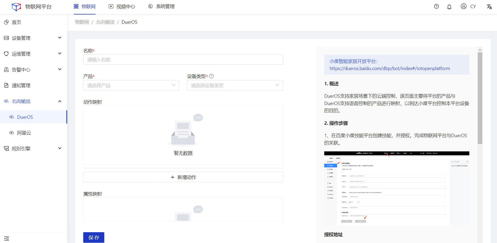
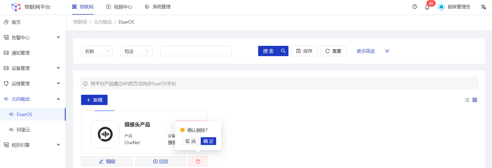
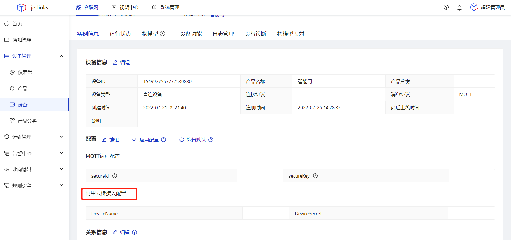
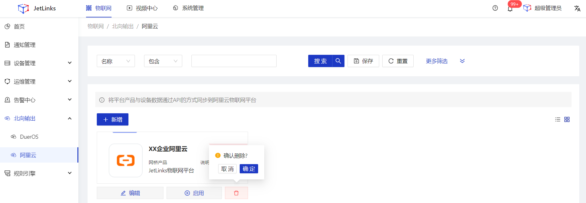

# 北向输出

北向输出功能用于将平台的**设备**以及**设备上报数据**，通过可视化配置的方式，**北向**输出给其他系统。 

## DuerOS
#### 新增
##### 操作步骤
1.**登录**Jetlinks物联网平台。 
2.在左侧导航栏，选择**北向输出>DuerOS**，进入列表页。 

3.点击**新增**按钮，进入详情页填写配置信息，然后点击**保存**按钮。 

<table class='table'>
        <thead>
            <tr>
              <td>参数</td>
              <td>说明</td>
            </tr>
        </thead>
        <tbody>
          <tr>
            <td>名称</td>
            <td>为该北向输出配置命名，最多可输入64个字符。</td>
          </tr>
          <tr>
            <td>产品</td>
            <td>Jetlinks平台内的产品。</td>
          </tr>
          <tr>
            <td>设备类型</td>
            <td>DuerOS平台拟定的设备类型。</td>
          </tr>
          <tr>
            <td>动作</td>
            <td>DuerOS根据设备类型，拟定的动作。</td>
          </tr>
         <tr>
            <td>操作</td>
            <td>映射物联网平台中所选产品具备的动作。</td>
          </tr>
          <tr>
            <td>指令类型</td>
            <td>对当前所选的平台产品，下发对应类型的指令。</td>
          </tr>
         <tr>
            <td>DuerOS属性</td>
            <td>DuerOS根据设备类型，拟定的属性。</td>
          </tr>
         <tr>
            <td>平台属性</td>
            <td>映射物联网平台中所选产品具备的动平台产品属性。</td>
          </tr>
        </tbody>
      </table>

#### 编辑
##### 操作步骤
1.**登录**Jetlinks物联网平台。 
2.在左侧导航栏，选择**北向输出>DuerOS**，进入列表页。 
3.选择具体配置的**编辑**按钮，进入详情页编辑配置信息，然后点击**保存**按钮。 

  

    
    说明
  

  产品不支持编辑，同一个产品只能配置一个映射规则。

#### 启用/禁用
##### 操作步骤
1.**登录**Jetlinks物联网平台。 
2.在左侧导航栏，选择**北向输出>DuerOS**，进入列表页。 
3.选择具体配置的**启用/禁用**按钮，然后点击**确定**。 

#### 删除
##### 操作步骤
1.**登录**Jetlinks物联网平台。 
2.在左侧导航栏，选择**北向输出>DuerOS**，进入列表页。 
3.选择具体配置的**删除**按钮，然后点击**确定**。 

## 阿里云
#### 新增
##### 操作步骤
1.**登录**Jetlinks物联网平台。 
2.在左侧导航栏，选择**北向输出>阿里云**，进入列表页。 

3.点击**新增**按钮，进入详情页填写配置信息，然后点击**保存**按钮。 

  

    
    说明
  

  Jetlinks物联网平台北向输出到阿里云物联网平台，将以一个网关设备进行展示。

<table class='table'>
        <thead>
            <tr>
              <td>参数</td>
              <td>说明</td>
            </tr>
        </thead>
        <tbody>
          <tr>
            <td>名称</td>
            <td>为该北向输出配置命名，最多可输入64个字符。</td>
          </tr>
          <tr>
            <td>服务地址</td>
            <td>阿里云内部给每台机器设置的唯一编号，请根据开通的阿里云物联网平台所在地域进行选择。</td>
          </tr>
          <tr>
            <td>AccessKey</td>
            <td>用于程序通知方式调用云服务API的用户标识。</td>
          </tr>
          <tr>
            <td>accessSecret</td>
            <td>用于程序通知方式调用云服务费API的秘钥标识。</td>
          </tr>
         <tr>
            <td>网桥产品</td>
            <td>物联网平台对应的阿里云产品，物联网平台对于阿里云物联网平台，是一个网关设备，需要映射到阿里云物联网平台的具体产品。</td>
          </tr>
          <tr>
            <td>阿里云产品</td>
            <td>阿里云物联网平台产品标识。</td>
          </tr>
          <tr>
            <td>平台产品</td>
            <td>与阿里云产品进行映射的Jetlinks物联网平台产品。</td>
          </tr>
        </tbody>
      </table>

##### 后续步骤
1.进入**设备实例信息**页面，填写阿里云桥接入配置，建立平台设备与与阿里云设备的映射关系。

  

    
    说明
  

  设备所属产品与阿里云平台产品映射后，平台产品所属设备的实例信息页面将新增阿里云桥接入配置。

#### 编辑 
##### 操作步骤
1.**登录**Jetlinks物联网平台。 
2.在左侧导航栏，选择**北向输出>阿里云**，进入列表页。 
3.点击具体数据的**编辑**按钮，进入详情页编辑配置信息，然后点击**保存**按钮。 

#### 启用/禁用
##### 操作步骤
1.**登录**Jetlinks物联网平台。 
2.在左侧导航栏，选择**北向输出>阿里云**，进入列表页。 
3.点击具体数据的**启用/禁用**按钮，然后点击**确定**。 

#### 删除
##### 操作步骤
1.**登录**Jetlinks物联网平台。 
2.在左侧导航栏，选择**北向输出>阿里云**，进入列表页。 
3.点击具体数据的**删除**按钮，然后点击**确定**。 

