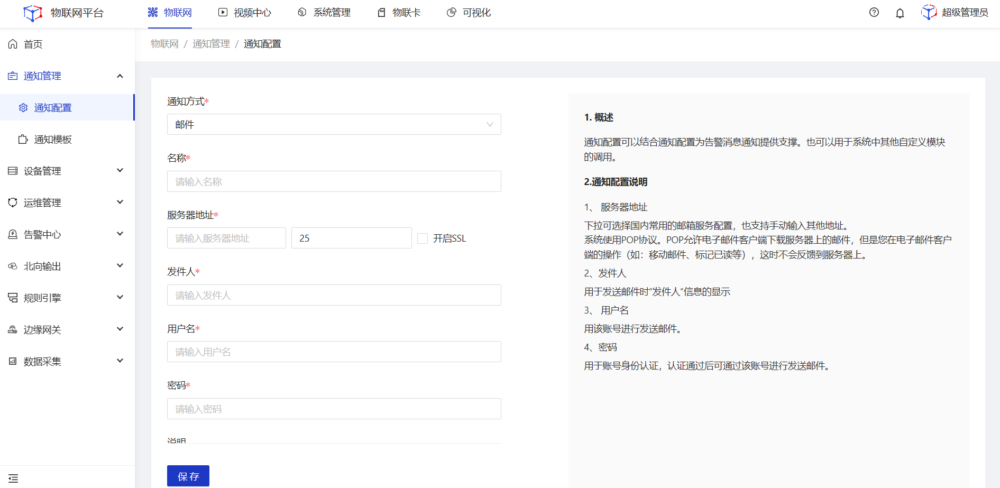
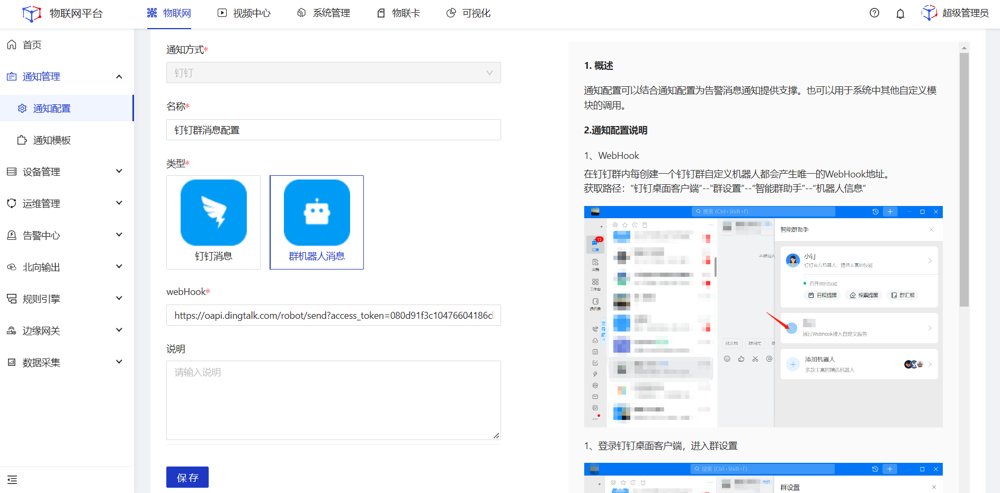
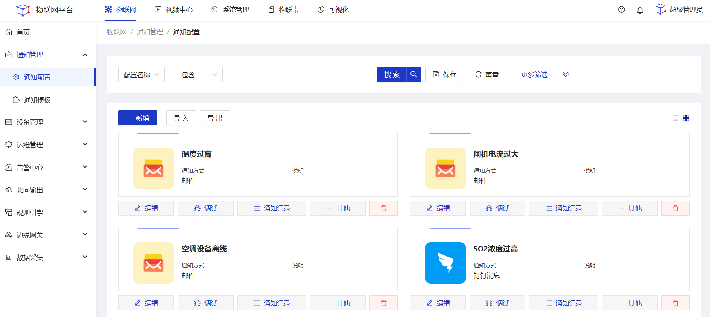
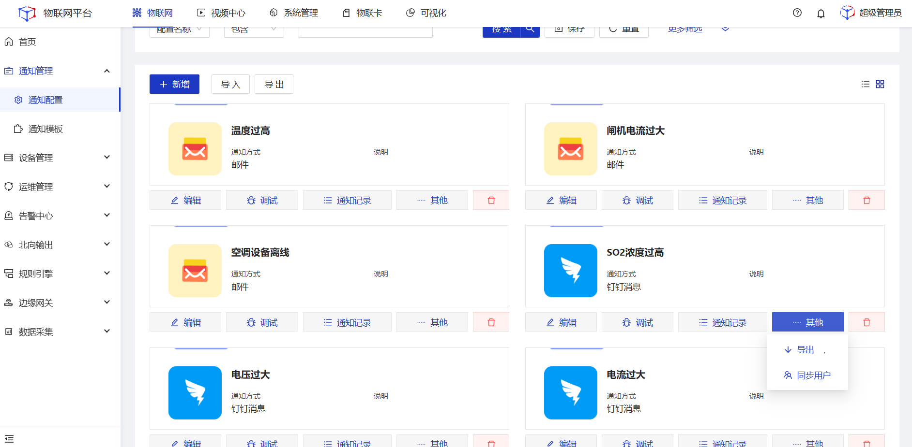
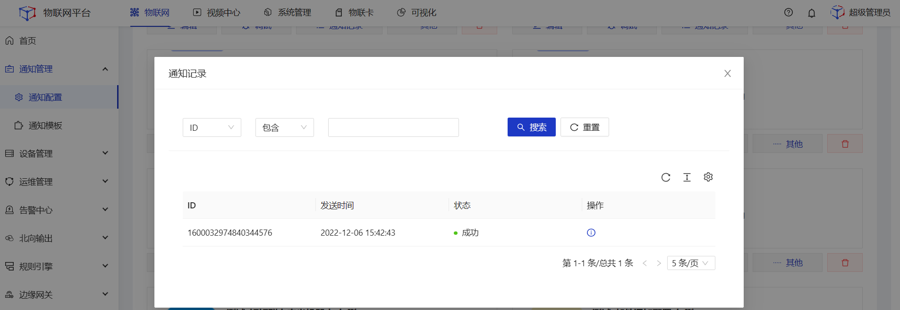
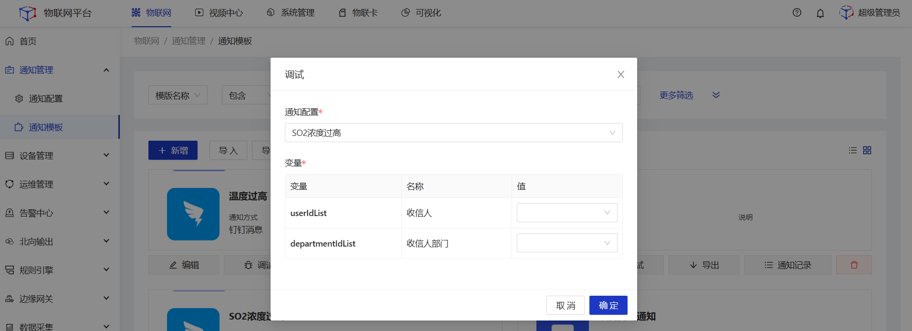
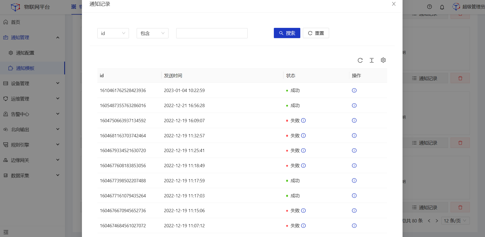

# 通知管理

通知管理用于统一管理、维护各种消息通知配置以及模版。可在场景联动的执行动作中被引用，也可通过统一的接口发送短信、邮件、微信消息、钉钉消息等消息通知。 
支持的**通知方式**：
<table class='table'>
        <thead>
            <tr>
              <td>通知方式</td>
              <td>类型</td>
            </tr>
        </thead>
        <tbody>
          <tr>
            <td>钉钉</td>
            <td><li>钉钉消息</li><li>群机器人消息</li></td>
          </tr>
          <tr>
            <td>微信</td>
            <td><li>企业消息</li></td>
          </tr>
          <tr>
            <td>邮件</td>
            <td><li>内置163、126、qq等类型</li><li>自定义其他邮件类型</li></td>
          </tr>
          <tr>
            <td>语音</td>
            <td><li>阿里云语音</li></td>
          </tr>
          <tr>
            <td>短信</td>
            <td><li>阿里云短信</li></td>
          </tr>
            <tr>
            <td>webhook</td>
            <td><li>自定义webhook地址</li></td>
          </tr>
       </tbody>
</table>

## 通知配置
#### 新增
##### 操作步骤
1.**登录**Jetlinks物联网平台。 
2.在左侧导航栏，选择**通知管理>通知配置**，进入卡片页。 

3.点击**新增**按钮，在详情页中填写通知配置信息，然后点击**保存**。 

#### 钉钉通知配置
<table class='table'>
        <thead>
            <tr>
              <td>参数</td>
              <td>说明</td>
            </tr>
        </thead>
        <tbody>
          <tr>
            <td>名称</td>
            <td>为通知配置命名，最多可输入64个字符。</td>
          </tr>
          <tr>
            <td>类型</td>
            <td>定义通知类型，根据类型的不同展示关联的配置参数项。</td>
          </tr>
          <tr>
            <td>AppKey</td>
            <td>企业内部应用的唯一身份标识。</td>
          </tr>
          <tr>
            <td>AppSecret</td>
            <td>钉钉应用对应的调用密钥。</td>
          </tr>
           <tr>
            <td>webhook</td>
            <td>填写webhook地址。在钉钉群内每创建一个钉钉群自定义机器人都会产生唯一的WebHook地址。</td>
          </tr>
          <tr>
            <td>说明</td>
            <td>通知配置备注说明信息，非必填。</td>
          </tr>
       </tbody>
</table>

#### 微信通知配置
<table class='table'>
        <thead>
            <tr>
              <td>参数</td>
              <td>说明</td>
            </tr>
        </thead>
        <tbody>
          <tr>
            <td>名称</td>
            <td>为通知配置命名，最多可输入64个字符。</td>
          </tr>
          <tr>
            <td>类型</td>
            <td>定义通知类型，根据类型的不同展示关联的配置参数项。</td>
          </tr>
          <tr>
            <td>corpId</td>
            <td>企业号的唯一专属编号。获取路径：“企业微信”管理后台--“我的企业”--“企业ID”。</td>
          </tr>
          <tr>
            <td>corpSecret</td>
            <td>应用的唯一secret,一个企业微信中可以有多个corpSecret。获取路径：“企业微信”--“应用与小程序”--“自建应用”中获取。</td>
          </tr>
          <tr>
            <td>说明</td>
            <td>通知配置备注说明信息，非必填。</td>
          </tr>
       </tbody>
</table>

#### 邮件通知配置
<table class='table'>
        <thead>
            <tr>
              <td>参数</td>
              <td>说明</td>
            </tr>
        </thead>
        <tbody>
          <tr>
            <td>名称</td>
            <td>为通知配置命名，最多可输入64个字符。</td>
          </tr>
          <tr>
            <td>服务器地址</td>
            <td>设置邮件服务地址，系统使用POP协议。POP允许电子邮件客户端下载服务器上的邮件，但是您在电子邮件客户端的操作（如：移动邮件、标记已读等），这时不会反馈到服务器上。</td>
          </tr>
          <tr>
            <td>发件人</td>
            <td>用于发送邮件时“发件人“信息的显示。</td>
          </tr>
          <tr>
            <td>用户名</td>
            <td>用该账号进行发送邮件。</td>
          </tr>
           <tr>
            <td>密码</td>
            <td>用于账号身份认证，认证通过后可通过该账号进行发送邮件。</td>
          </tr>
           <tr>
            <td>说明</td>
            <td>通知配置备注说明信息，非必填。</td>
          </tr>
       </tbody>
</table>

#### 语音通知配置
<table class='table'>
        <thead>
            <tr>
              <td>参数</td>
              <td>说明</td>
            </tr>
        </thead>
        <tbody>
          <tr>
            <td>名称</td>
            <td>为通知配置命名，最多可输入64个字符。</td>
          </tr>
          <tr>
            <td>类型</td>
            <td>设置通知类型，现支持阿里云语音。</td>
          </tr>
          <tr>
            <td>RegionId</td>
            <td>阿里云内部给每台机器设置的唯一编号。</td>
          </tr>
          <tr>
            <td>AccessKeyId</td>
            <td>用于程序通知方式调用云服务费API的用户标识，获取路径：“阿里云管理控制台”--“用户头像”--“”--“AccessKey管理”--“查看”。</td>
          </tr>
           <tr>
            <td>Secret</td>
            <td>用于程序通知方式调用云服务费API的用户秘钥，获取路径：“阿里云管理控制台”--“用户头像”--“”--“AccessKey管理”--“查看”。</td>
          </tr>
           <tr>
            <td>说明</td>
            <td>通知配置备注说明信息，非必填。</td>
          </tr>
       </tbody>
</table>

#### 短信通知配置
<table class='table'>
        <thead>
            <tr>
              <td>参数</td>
              <td>说明</td>
            </tr>
        </thead>
        <tbody>
          <tr>
            <td>名称</td>
            <td>为通知配置命名，最多可输入64个字符。</td>
          </tr>
          <tr>
            <td>类型</td>
            <td>设置通知类型，现支持阿里云短信。</td>
          </tr>
          <tr>
            <td>RegionId</td>
            <td>阿里云内部给每台机器设置的唯一编号。</td>
          </tr>
          <tr>
            <td>AccessKeyId</td>
            <td>用于程序通知方式调用云服务费API的用户标识，获取路径：“阿里云管理控制台”--“用户头像”--“”--“AccessKey管理”--“查看”。</td>
          </tr>
           <tr>
            <td>Secret</td>
            <td>用于程序通知方式调用云服务费API的用户秘钥，获取路径：“阿里云管理控制台”--“用户头像”--“”--“AccessKey管理”--“查看”。</td>
          </tr>
           <tr>
            <td>说明</td>
            <td>通知配置备注说明信息，非必填。</td>
          </tr>
       </tbody>
</table>

#### webhook通知配置
<table class='table'>
        <thead>
            <tr>
              <td>参数</td>
              <td>说明</td>
            </tr>
        </thead>
        <tbody>
          <tr>
            <td>名称</td>
            <td>为通知配置命名，最多可输入64个字符。</td>
          </tr>
          <tr>
            <td>webhook</td>
            <td>填写webhook地址。</td>
          </tr>
          <tr>
            <td>请求头</td>
            <td>自定义编辑请求头内容，非必填。</td>
          </tr>
           <tr>
            <td>说明</td>
            <td>通知配置备注说明信息，非必填。</td>
          </tr>
       </tbody>
</table>

#### 编辑
##### 操作步骤
1.**登录**Jetlinks物联网平台。 
2.在左侧导航栏，选择**通知管理>通知配置**，进入卡片页。 
3.点击具体数据的**编辑**按钮。 
4.在详情页中编辑通知模板/通知配置信息，然后点击**保存**。 

#### 删除
##### 操作步骤
1.**登录**Jetlinks物联网平台。 
2.在左侧导航栏，选择**通知管理>通知配置**，进入卡片页。 
3.点击具体数据的**删除**按钮，然后点击**确定**。 

#### 同步用户
当通知配置所选方式为**企业微信**、**钉钉消息**时，对应的配置卡片将出现**同步用户**按钮。该功能主要目的为将平台内的用户与钉钉、企业微信用户进行关联，实现在通知时通过选择平台内的用户、角色，即可将消息发送给关联的企业微信、钉钉用户。
##### 操作步骤
1.**登录**Jetlinks物联网平台。 
2.在左侧导航栏，选择**通知管理>通知配置**，进入卡片页。 
3.点击**钉钉/微信通知配置**的**同步用户**按钮。 

4.在弹框页中建立平台与钉钉/企业微信用户的关联关系，然后点击**关闭**。 

  

    
    说明
  

  第一次进行绑定时，点击自动绑定按钮，程序根据相同名称进行自动绑定。

#### 调试
##### 操作步骤
1.**登录**Jetlinks物联网平台。 
2.在左侧导航栏，选择**通知管理>通知配置**，进入卡片页。 
3.点击具体数据的**调试**按钮，在弹框中填写调试信息，然后点击**确定**。 

  

    
    说明
  

 调试弹框中的“变量”，来自于模板内容中填写的变量，不存在变量时，将不显示该字段。

#### 通知记录
##### 操作步骤
1.**登录**Jetlinks物联网平台。 
2.在左侧导航栏，选择**通知管理>通知配置**，进入卡片页。 
3.点击具体数据的**通知记录**按钮。 

## 通知模板
#### 新增
##### 操作步骤
1.**登录**Jetlinks物联网平台。 
2.在左侧导航栏，选择**通知管理>通知模板**，进入卡片页。 

3.点击**新增**按钮，在详情页中填写通知模板信息，然后点击**保存**。 

#### 钉钉通知模板
<table class='table'>
        <thead>
            <tr>
              <td>参数</td>
              <td>说明</td>
            </tr>
        </thead>
        <tbody>
          <tr>
            <td>名称</td>
            <td>为通知模板命名，最多可输入64个字符</td>
          </tr>
          <tr>
            <td>类型</td>
            <td>定义通知类型，根据类型的不同展示关联的配置参数项。现支持钉钉消息和群机器人消息。使用钉钉群机器人消息通知时需在钉钉开放平台中创建好对应的机器人，再到钉钉客户端对应的群中绑定智能机器人。</td>
          </tr>
          <tr>
            <td>绑定配置</td>
            <td>使用固定的通知配置来发送此通知模版。</td>
          </tr>
          <tr>
            <td>AgentID</td>
            <td>应用唯一标识，获取路径：“钉钉开放平台”--“应用开发”--“查看应用”。</td>
          </tr>
          <tr>
            <td>收信部门</td>
            <td>定义用于接收此模板通知的部门，非必填。若此处不配置，则将在其他引用此模板的页面中进行配置，例如场景联动。</td>
          </tr>
            <tr>
            <td>收信人</td>
            <td>定义用于接收此模板通知的收信人，非必填。若此处不配置，则将在其他引用此模板的页面中进行配置，例如场景联动。</td>
          </tr>
           <tr>
            <td>模板内容</td>
            <td>定义通知模板的具体通知内容。支持填写带变量的动态模板。 变量填写规范示例：${name}。 填写动态参数后，可对变量的名称、类型、格式进行配置，以便调用该通知时进行填写。</td>
          </tr>
       </tbody>
</table>

#### 微信通知模板
<table class='table'>
        <thead>
            <tr>
              <td>参数</td>
              <td>说明</td>
            </tr>
        </thead>
        <tbody>
          <tr>
            <td>名称</td>
            <td>为通知模板名称，最多可输入64个字符。</td>
          </tr>
          <tr>
            <td>类型</td>
            <td>定义通知类型，现只支持企业消息。</td>
          </tr>
          <tr>
            <td>绑定配置</td>
            <td>使用固定的通知配置来发送此通知模版。</td>
          </tr>
          <tr>
            <td>AgentID</td>
            <td>应用唯一标识，获取路径：“企业微信”管理后台--“应用管理”--“应用”--“查看应用”。</td>
          </tr>
          <tr>
            <td>收信部门</td>
            <td>定义用于接收此模板通知的部门，非必填。若此处不配置，则将在其他引用此模板的页面中进行配置，例如场景联动。</td>
          </tr>
            <tr>
            <td>收信人</td>
            <td>定义用于接收此模板通知的收信人，非必填。若此处不配置，则将在其他引用此模板的页面中进行配置，例如场景联动。</td>
          </tr>
           <tr>
            <td>标签推送</td>
            <td>定义用于接收此模板通知的标签用户，非必填。若此处不配置，则将在其他引用此模板的页面中进行配置，例如场景联动。</td>
          </tr>
           <tr>
            <td>模板内容</td>
            <td>定义通知模板的具体通知内容。支持填写带变量的动态模板。 变量填写规范示例：${name}。 填写动态参数后，可对变量的名称、类型、格式进行配置，以便调用该通知时进行填写。</td>
          </tr>
       </tbody>
</table>

#### 邮件通知模板
<table class='table'>
        <thead>
            <tr>
              <td>参数</td>
              <td>说明</td>
            </tr>
        </thead>
        <tbody>
          <tr>
            <td>名称</td>
            <td>为通知模板命名，最多可输入64个字符</td>
          </tr>
          <tr>
            <td>标题</td>
            <td>定义邮件标题，标题支持配置变量，变量填写规范示例：${name}。</td>
          </tr>
          <tr>
            <td>收件人</td>
            <td>填写收件人信息，多个收件人用换行分隔 最大支持1000个号码。非必填。若此处不配置，则将在其他引用此模板的页面中进行配置，例如场景联动。</td>
          </tr>
          <tr>
            <td>附件信息</td>
            <td>上传附件，附件只输入文件名称将在发送邮件时进行文件上传。</td>
          </tr>
           <tr>
            <td>模板内容</td>
            <td>定义通知模板的具体通知内容。支持填写带变量的动态模板。 变量填写规范示例：${name}。 填写动态参数后，可对变量的名称、类型、格式进行配置，以便调用该通知时进行填写。</td>
          </tr>
           <tr>
            <td>说明</td>
            <td>通知模板备注说明信息，非必填。</td>
          </tr>
       </tbody>
</table>

#### 语音通知模板
<table class='table'>
        <thead>
            <tr>
              <td>参数</td>
              <td>说明</td>
            </tr>
        </thead>
        <tbody>
          <tr>
            <td>名称</td>
            <td>为通知模板命名，最多可输入64个字符。</td>
          </tr>
          <tr>
            <td>类型</td>
            <td>定义通知类型，现支持阿里云语音。</td>
          </tr>
           <tr>
            <td>绑定配置</td>
            <td>使用固定的通知配置来发送此通知模版。</td>
          </tr>
          <tr>
            <td>类型</td>
            <td>阿里云语音通知类型，当类型为验证码类型时可配置变量。</td>
          </tr>
          <tr>
            <td>模板ID</td>
            <td>阿里云内部分配的唯一ID标识。</td>
          </tr>
           <tr>
            <td>被叫号码</td>
            <td>填写被叫号码，仅支持中国大陆号码。</td>
          </tr>
           <tr>
            <td>被叫显号</td>
            <td>必须是已购买的号码,用于呼叫号码显示。</td>
          </tr>
           <tr>
            <td>播放次数</td>
            <td>语音文件的播放次数，最多可播放3次。</td>
          </tr>
           <tr>
            <td>模板内容</td>
            <td>定义通知模板的具体通知内容。支持填写带变量的动态模板。 变量填写规范示例：${name}。 填写动态参数后，可对变量的名称、类型、格式进行配置，以便调用该通知时进行填写。</td>
          </tr>
           <tr>
            <td>说明</td>
            <td>通知模板备注说明信息，非必填。</td>
          </tr>
       </tbody>
</table>

#### 短信通知模板
<table class='table'>
        <thead>
            <tr>
              <td>参数</td>
              <td>说明</td>
            </tr>
        </thead>
        <tbody>
          <tr>
            <td>名称</td>
            <td>为通知模板命名，最多可输入64个字符。</td>
          </tr>
          <tr>
            <td>类型</td>
            <td>定义通知类型，现支持阿里云短信。</td>
          </tr>
           <tr>
            <td>绑定配置</td>
            <td>使用固定的通知配置来发送此通知模版。</td>
          </tr>
          <tr>
            <td>模板</td>
            <td>阿里云短信平台自定义的模版名称。</td>
          </tr>
          <tr>
            <td>收信人</td>
            <td>设置接收阿里云短信的收信人手机号，非必填，若此处不配置，则将在其他引用此模板的页面中进行配置，例如场景联动。</td>
          </tr>
           <tr>
            <td>签名</td>
            <td>用于短信内容签名信息显示，需在阿里云短信进行配置。</td>
          </tr>
           <tr>
            <td>模板内容</td>
            <td>定义通知模板的具体通知内容。支持填写带变量的动态模板。 变量填写规范示例：${name}。 填写动态参数后，可对变量的名称、类型、格式进行配置，以便调用该通知时进行填写。</td>
          </tr>
           <tr>
            <td>说明</td>
            <td>通知模板备注说明信息，非必填。</td>
          </tr>
       </tbody>
</table>

#### webhook通知模板
<table class='table'>
        <thead>
            <tr>
              <td>参数</td>
              <td>说明</td>
            </tr>
        </thead>
        <tbody>
          <tr>
            <td>名称</td>
            <td>为通知模板命名，最多可输入64个字符。</td>
          </tr>
           <tr>
            <td>绑定配置</td>
            <td>使用固定的通知配置来发送此通知模版。</td>
          </tr>
          <tr>
            <td>请求体</td>
            <td>选择默认，请求体中的数据来自于发送通知时指定的所有变量；选择自定义，可自定义编辑请求体内容，使用webhook通知时，系统会将该事件通过您指定的URL地址，以POST方式发送。</td>
          </tr>
           <tr>
            <td>说明</td>
            <td>通知模板备注说明信息，非必填。</td>
          </tr>
       </tbody>
</table>

#### 编辑
##### 操作步骤
1.**登录**Jetlinks物联网平台。 
2.在左侧导航栏，选择**通知管理>通知模板**，进入卡片页。 
3.点击具体数据的**编辑**按钮，在详情页中编辑通知模板信息，然后点击**保存**。 

#### 调试
##### 操作步骤
1.**登录**Jetlinks物联网平台。 
2.在左侧导航栏，选择**通知管理>通知模板**，进入卡片页。 
3.点击具体数据的**调试**按钮，在弹框中填写调试信息，然后点击**确定**。 

  

    
    说明
  

 调试弹框中的“变量”，来自于模板内容中填写的变量，不存在变量时，将不显示该字段。

#### 通知记录
##### 操作步骤
1.**登录**Jetlinks物联网平台。 
2.在左侧导航栏，选择**通知管理>通知模板**，进入卡片页。 
3.点击具体数据的**通知记录**按钮。 

#### 删除
##### 操作步骤
1.**登录**Jetlinks物联网平台。 
2.在左侧导航栏，选择**通知管理>通知模板**，进入卡片页。 
3.点击具体数据的**删除**按钮。 

