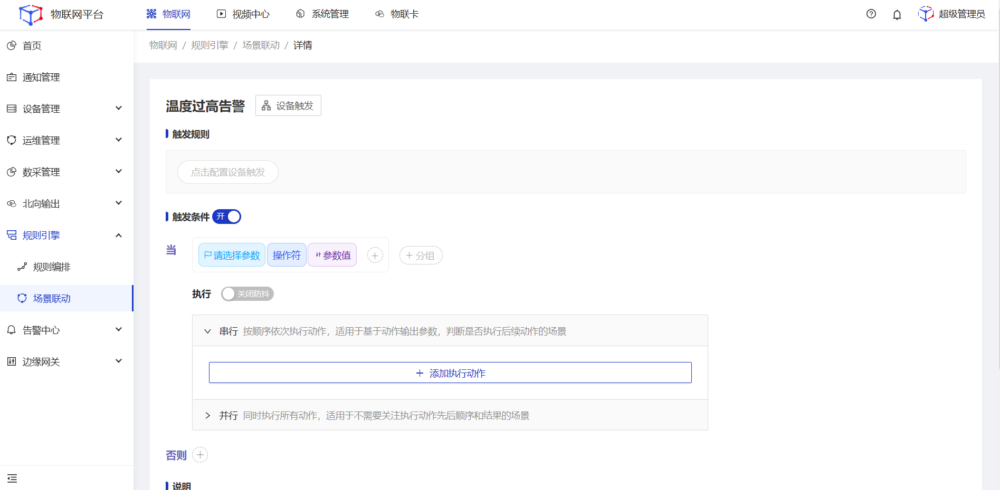
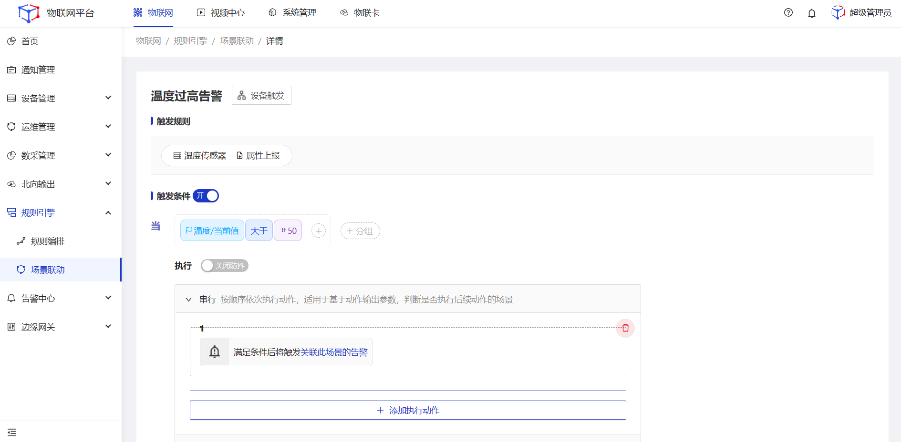
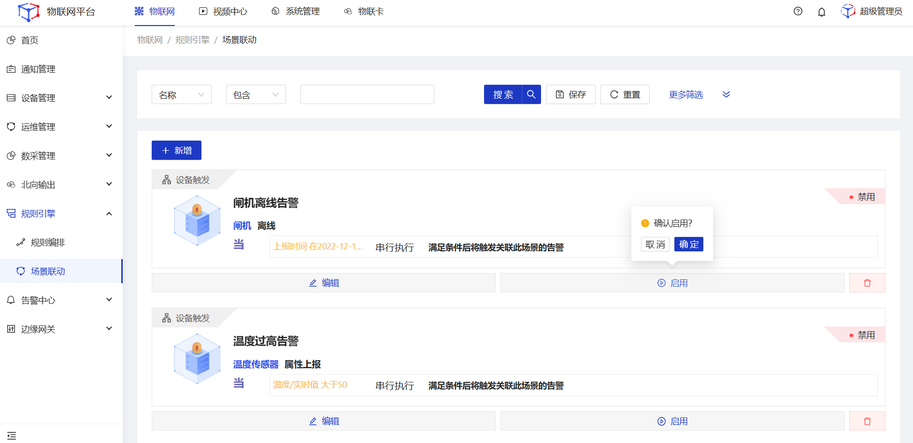
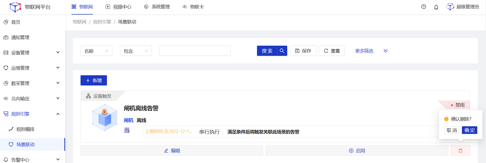

# 规则引擎

规则引擎是**可视化**的系统数据逻辑处理工具，可自定义数据处理**规则编排**，以及可视化的**场景联动**规则配置。 

## 规则编排
提供可视化,流程化的数据(逻辑)处理工具。支持对实时数据流进行计算，并将计算结果进行推送MQTT、写入Kafka、写入数据库等操作。

  
 
    
    提示
  

本功能仅在企业版中提供。

#### 新增
##### 操作步骤
1.**登录**Jetlinks物联网平台。 
2.在左侧导航栏，选择**规则引擎>规则编排**，进入列表页。 

3.点击**新增**按钮，在弹框页填写名称，然后点击**确定**按钮。 

4.点击卡片，进入画布页，**拖拽**左侧组件到画布页，并**双击**组件，填写相关配置。 

5.将多个组件之间，通过**连线**进行连接。 

6.点击页面右上角**部署**。 

#### 编辑
##### 操作步骤
1.**登录**Jetlinks物联网平台。 
2.在左侧导航栏，选择**规则引擎>规则编排**，进入列表页。 
3.点击具体数据的**编辑**按钮，在弹框页编辑名称，然后点击**确定**按钮。 

#### 启用/禁用
##### 操作步骤
1.**登录**Jetlinks物联网平台。 
2.在左侧导航栏，选择**规则引擎>规则编排**，进入列表页。 
3.点击具体数据的**启用/禁用**按钮，然后点击**确定**。 

#### 删除
##### 操作步骤
1.**登录**Jetlinks物联网平台。 
2.在左侧导航栏，选择**规则引擎>规则编排**，进入列表页。 
3.选择具体数据的**删除**按钮，然后点击**确定**。 

## 场景联动
通过可视化的方式定义设备之间联动规则。当触发条件指定的事件或属性变化事件发生时，系统通过判断执行条件是否已满足，来决定是否执行规则中定义的执行动作。

  

    
    注意
  

 场景联动规则仅当选择单个设备时支持以设备物模型进行配置，其他情况均以产品物模型进行配置。

#### 新增
##### 操作步骤
1.**登录**Jetlinks物联网平台。 
2.在左侧导航栏，选择**规则引擎>场景联动**，进入列表页。 
3.点击**新增**按钮，在弹框页填写基础信息，然后点击**确定**，进入详情页。 
4.根据触发方式填写**触发条件**（选择设备触发时有此配置项）、**执行动作**，然后点击**保存**。 

  

    
    说明
  

      <li> 选择设备触发时将显示“设备触发规则”配置  </li>
      <li> 选择定时触发时将显示“定时触发规则”配置  </li>
      <li> 防抖：触发条件在一定时间内触发多次时，可选择只执行第一次或最后一次。  </li>

##### 设备触发关联配置项说明
<table class='table'>
        <thead>
            <tr>
              <td>参数</td>
              <td>说明</td>
            </tr>
        </thead>
        <tbody>
          <tr>
            <td>选择产品</td>
            <td>单选，选择用作触发条件的产品。</td>
          </tr>
          <tr>
            <td>选择设备</td>
            <td>支持全部设备、部分设备、组织选择设备3种方式。</td>
          </tr>
          <tr>
            <td>触发类型</td>
            <td>根据物模型配置动态显示。默认有设备上线、设备离线。 
             

    说明
    <ul>
   <li>产品已配置属性时，下拉框中将会显示：属性读取、属性上报、修改属性</li>
   <li>产品已配置功能时，下拉框中将会显示：功能调用</li>
   <li>产品已配置事件时，下拉框中将会显示：事件上报</li>
    </ul>
  

            </td>
          </tr>
        </tbody>
      </table>

##### 定时触发关联配置项说明
<table class='table'>
        <thead>
            <tr>
              <td>参数</td>
              <td>说明</td>
            </tr>
        </thead>
        <tbody>
          <tr>
            <td>按周</td>
            <td>定时触发维度，可选择按周、按月、cron表达式。</td>
          </tr>
          <tr>
            <td>时间</td>
            <td>
            

    说明
    <ul>
       <li>选择按周时，显示每天、星期一、星期二...星期天</li>
            <li>选择按月时，显示每天、1号、2号...31号</li>
            <li>选择cron表达式时，显示cron表达式输入框</li>
    </ul>
  

           </td>
          </tr>
          <tr>
            <td>执行周期</td>
            <td>支持一定时间段内每隔固定时间进行触发，也支持在固定时间点定时执行一次。  </td>
          </tr>
        </tbody>
      </table>

##### 串行并行说明
<table class='table'>
        <thead>
            <tr>
              <td>参数</td>
              <td>说明</td>
            </tr>
        </thead>
        <tbody>
          <tr>
            <td>串行</td>
            <td>执行动作可根据条件过滤，按照先后顺序逐一执行后续动作。</td>
          </tr>
          <tr>
            <td>并行</td>
            <td>所有执行动作同时执行
             

    说明
    <ul>
     并行时，执行动作不支持延迟执行类型。
    </ul>
  

            </td>
          </tr>
          <tr>
            <td>条件过滤</td>
            <td>根据上游执行动作的执行结果配置条件，满足条件时继续执行后续动作。  </td>
          </tr>
        </tbody>
      </table>

##### 执行动作说明
<table class='table'>
        <thead>
            <tr>
              <td>参数</td>
              <td>说明</td>
            </tr>
        </thead>
        <tbody>
          <tr>
            <td>设备输出</td>
            <td>配置设备调用功能、读取属性、设置属性规则。 
            场景示例：当温度大于30度，打开空调。
            </td>
          </tr>
          <tr>
            <td>消息通知</td>
            <td>配置向指定用户发邮件、钉钉、微信、短信等通知。 
            场景示例：当空调离线时，给设备维护人员发送短信通知。
            </td>
          </tr>
          <tr>
            <td>延迟执行</td>
            <td>等待一段时间后，再执行后续动作。 
            场景示例：大门开启时，开启摄像头录像功能，延迟执行10S，再关闭录像功能。
              </td>
          </tr>
           <tr>
            <td>触发告警</td>
            <td>配置触发告警规则，需配合“告警配置”使用。  
            场景示例：当温度大于40度时，触发绑定了该场景联动的告警，生成对应的告警记录。
             </td>
          </tr>
           <tr>
            <td>解除告警</td>
            <td>配置解除告警规则，需配合“告警配置”使用。  
            场景示例：当温度小于40度时，解除绑定了该场景联动的告警，将对应的告警状态更新为无告警。
             </td>
          </tr>
        </tbody>
      </table>

##### 选择设备说明
<table class='table'>
        <thead>
            <tr>
              <td>参数</td>
              <td>说明</td>
            </tr>
        </thead>
        <tbody>
          <tr>
            <td>自定义</td>
            <td>自定义选择当前产品下的任意设备。</td>
          </tr>
          <tr>
            <td>全部</td>
            <td>选择产品下属的所有设备。</td>
          </tr>
          <tr>
            <td>按组织</td>
            <td>选择产品中归属与具体组织下的所有设备。</td>
          </tr>
           <tr>
            <td>按关系</td>
            <td>选择产品中与触发设备具有相同关系的其他设备。  
            场景示例：房间开打开时，打开与房间门设备具有相同设备负责人的空调。
             </td>
          </tr>
           <tr>
            <td>按标签</td>
            <td>选择产品下具有特定标签的设备。  
            场景示例：打开空调产品下，品牌为格力的空调设备。
             </td>
          </tr>
           <tr>
            <td>按变量</td>
            <td>选择设备ID为上游变量值的设备。 
            场景示例：100个摄像头设备，当任意摄像头探测到有人经过时，对应的摄像头开启录像功能。
             </td>
          </tr>
        </tbody>
      </table>

#### 编辑
##### 操作步骤
1.**登录**Jetlinks物联网平台。 
2.在左侧导航栏，选择**规则引擎>场景联动**，进入列表页。 
3.点击具体数据的**编辑**按钮，在详情页填写具体配置，然后点击**保存**。 

  

    
    说明
  

  上游配置发生变更时，需对有引用上游输出的配置项进行重新配置。 

#### 启用/禁用
##### 操作步骤
1.**登录**Jetlinks物联网平台。 
2.在左侧导航栏，选择**规则引擎>场景联动**，进入列表页。 
3.点击具体数据的**启用/禁用**按钮，然后点击**确定**。 

#### 删除
##### 操作步骤
1.**登录**Jetlinks物联网平台。 
2.在左侧导航栏，选择**规则引擎>场景联动**，进入列表页。 
3.选择具体数据的**删除**按钮，然后点击**确定**。 

  

    
    说明
  

场景联动被告警引用时不可删除。

