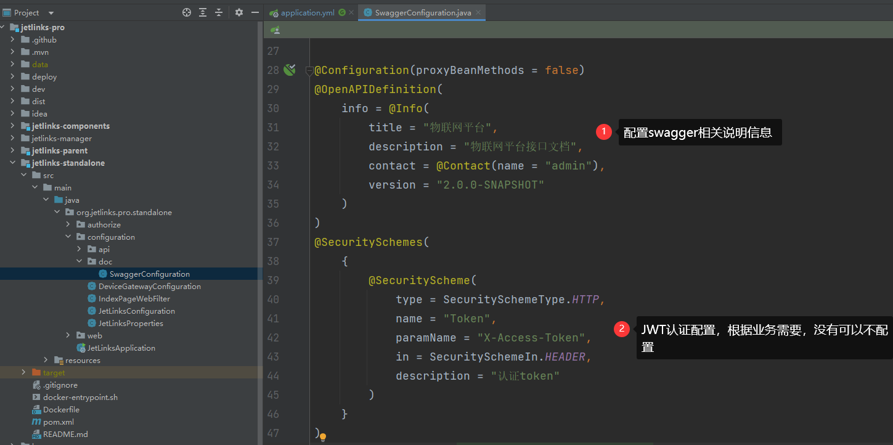

# API配置

  

    
    说明
  

 统一配置系统内对外输出的API服务，API配置将在为第三方平台赋权时引用。

## 指导介绍

  
1. <a href="/System_settings/System_api_configuration.html#平台api配置" >平台API配置</a>

  
2. <a href="/System_settings/System_api_configuration.html#自定义配置swagger-api" >配置API</a>

  
 
    
    提示
  

本功能仅在企业版中提供。

## 平台API配置
### 操作步骤
1.**登录**Jetlinks物联网平台。 
2.点击顶部**系统管理**，在左侧导航栏，选择**API配置**，进入详情页。 
3.勾选需要支持对外输出的API服务，然后点击**保存**。 

## 自定义配置Swagger API

  
 
    
    提示
  

本平台使用的是spring boot集成springdoc接口文档生成

### 1.在 <code>jetlinks-pro/jetlinks-standalone/src/main/resources/application.yaml</code>文件中进行配置

### 2.在<code>org.jetlinks.pro.standalone.configuration.doc.SwaggerConfiguration</code>配置swaager相关说明信息和JWT认证

