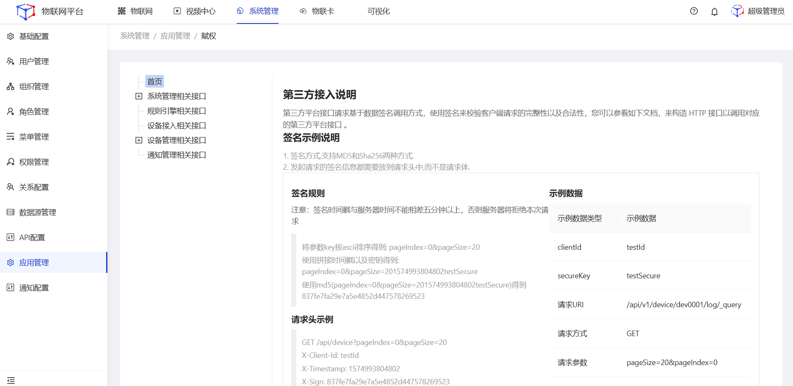
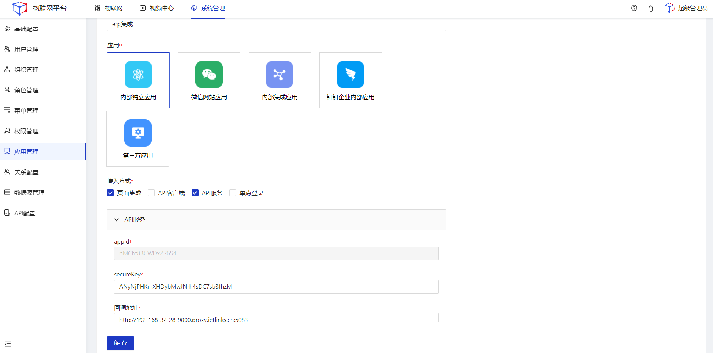
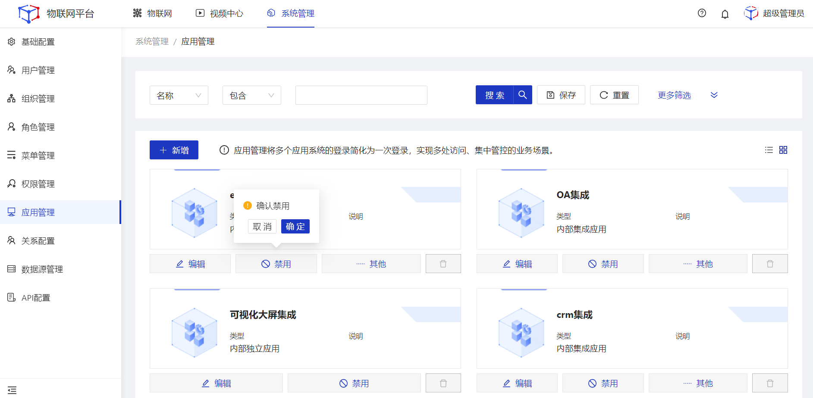
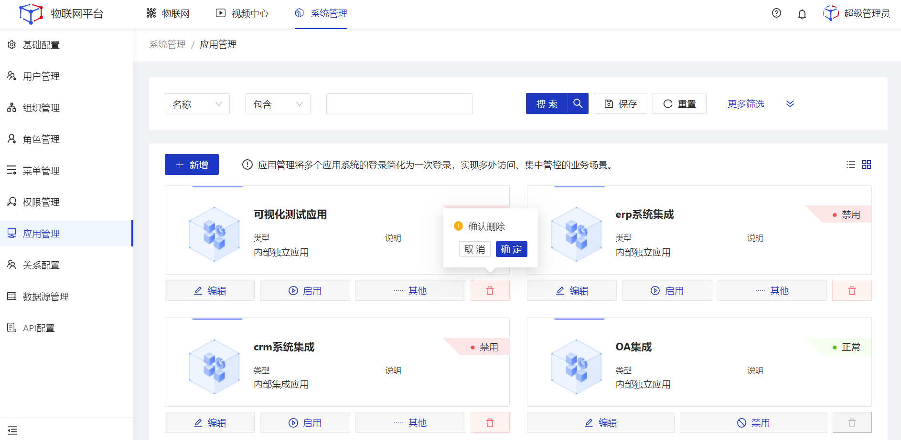

# 应用管理

  

    
    说明
  

 支持提供平台API接口服务给第三应用；集成第三方应用到本平台；提供SSO单点登陆；OAuth2认证 

## 指导介绍

  
1. <a href="/System_settings/System_application_management.html#新增" >新增</a>

  
2. <a href="/System_settings/System_application_management.html#编辑" >编辑</a>

  
3. <a href="/System_settings/System_application_management.html#启用-禁用" >启用/禁用</a>

  
4. <a href="/System_settings/System_application_management.html#删除" >删除</a>

  
 
    
    提示
  

本功能仅在企业版中提供。

## 新增
### 操作步骤
1.**登录**Jetlinks物联网平台。 
2.点击顶部**系统管理**，在左侧导航栏，选择**应用管理**，进入列表页。 

3.点击**新增**按钮，进入详情页，选择应用类型，基于类型填写相关配置项，然后点击**确定**。 

  

    
    说明
  

第三方应用的API服务中，APPId和secureKey需要提供给客户端开发者。 

### 后续操作
1.当应用的接入方式勾选了**API服务**时，可以对该应用进行API赋权操作。鼠标移入**其他**按钮，点击隐藏的**赋权**按钮，进入赋权页面，勾选对应的API权限，然后点击**保存**。

2.当应用的接入方式勾选了**API服务**时，可查看该应用的API权限。鼠标移入**其他**按钮，点击隐藏的**查看API**按钮，进入详情页面。 
3.当应用的接入方式勾选了**页面集成**时，可以对该应用进行集成菜单配置。鼠标移入**其他**按钮，点击隐藏的**集成菜单**按钮，在弹框页中，勾选对应的API权限，然后点击**保存**。 

## 编辑
### 操作步骤
1.**登录**Jetlinks物联网平台。 
2.点击顶部**系统管理**，在左侧导航栏，选择**应用管理**，进入列表页。 
3.点击具体数据的**编辑**按钮，在页面中编辑应用信息，然后点击**确定**。 

## 启用/禁用
### 操作步骤
1.**登录**Jetlinks物联网平台。 
2.点击顶部**系统管理**，在左侧导航栏，选择**第三方平台**，进入列表页。 
3.点击具体第三方平台的**启用/禁用**按钮，然后点击**确定**

## 删除
### 操作步骤
1.**登录**Jetlinks物联网平台。 
2.点击顶部**系统管理**，在左侧导航栏，选择**第三方平台**，进入列表页。 
3.点击具体第三方平台的**删除**按钮，然后点击**确定**

