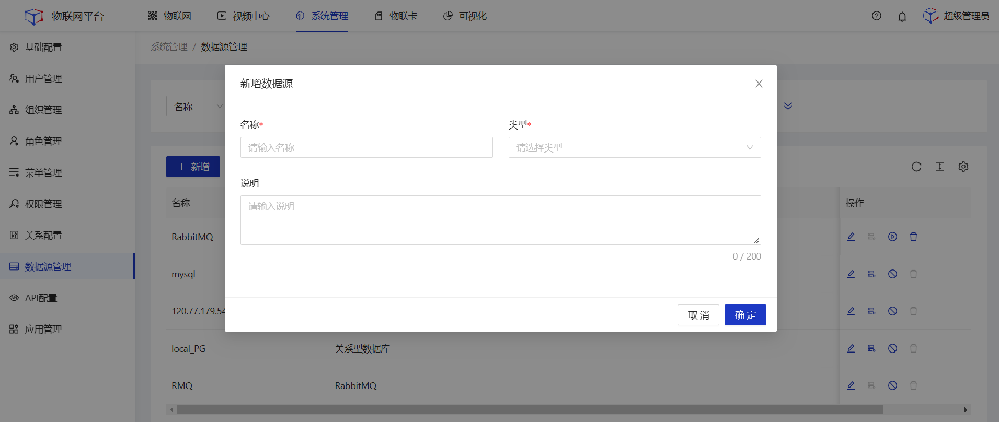
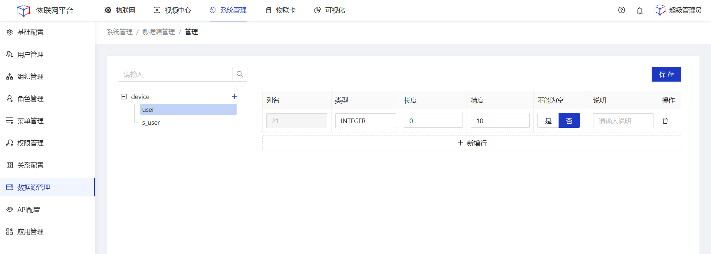
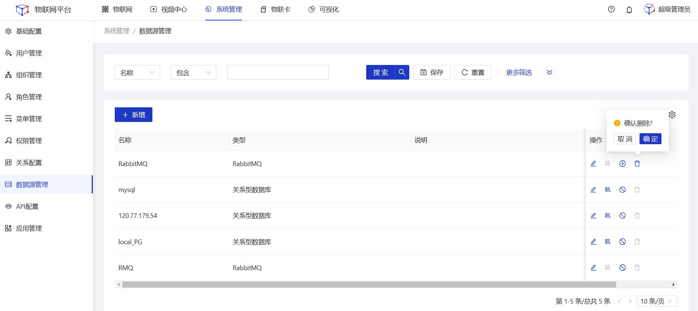

# 数据源管理

  

    
    说明
  

 统一维护管理系统内的数据源信息，配置的数据源可被系统其他模块引用，例如规则编排。

## 指导介绍

  
1. <a href="/System_settings/System_datasource_management.html#新增" >新增</a>

  
2. <a href="/System_settings/System_datasource_management.html#启用-禁用" >启用/禁用</a>

  
3. <a href="/System_settings/System_datasource_management.html#删除" >删除</a>

## 新增
### 操作步骤
1.**登录**Jetlinks物联网平台。 
2.点击顶部**系统管理**，在左侧导航栏，选择**数据源管理**，进入列表页。 

3.点击**新增**按钮，在弹框页填写信息，然后点击**确定**。 

4.点击**管理**按钮，进入详情页，点击右侧页面的**新增行**按钮，填写列表信息，然后点击右上角**保存**。

  

    
    说明
  

禁用状态下，管理按钮不可点击。

## 启用/禁用
### 操作步骤
1.**登录**Jetlinks物联网平台。 
2.点击顶部**系统管理**，在左侧导航栏，选择**数据源管理**，进入列表页。 
3.点击具体数据源的**启用/禁用**按钮，然后点击**确定**。 

## 删除
### 操作步骤
1.**登录**Jetlinks物联网平台。 
2.点击顶部**系统管理**，在左侧导航栏，选择**数据源管理**，进入列表页。 
3.点击具体数据源的**删除**按钮，然后点击**确定**。 
