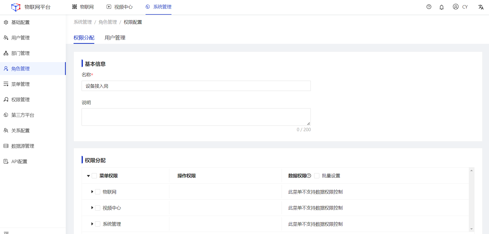

# 角色管理

  

    
    说明
  

 统一维护管理系统内的角色，角色可与权限进行关联，以实现不同角色查看不同菜单，不同用户查看同一菜单下的不同数据。

## 指导介绍

  
1. <a href="/System_settings/System_role_management.html#新增" >新增</a>

  
2. <a href="/System_settings/System_role_management.html#编辑" >编辑</a>

  
3. <a href="/System_settings/System_role_management.html#删除" >删除</a>

  

    
    说明
  

当前只有产品、设备、产品分类3个菜单支持数据权限。

## 新增
### 操作步骤
1.**登录**Jetlinks物联网平台。 
2.点击顶部**系统管理**，在左侧导航栏，选择**角色管理**，进入列表页。 

3.鼠标点击**新增**按钮，填写角色名称，然后点击**确定**。 

4.点击具体角色的**编辑**按钮，进入详情页，勾选所需的菜单、操作、数据权限，然后点击**保存**。 

  

    
    说明
  

勾选父菜单会自动关联勾选下属子菜单，以及子菜单中的所有操作权限。数据权限默认是选择自己创建的数据。

### 后续步骤
1.绑定用户 
在角色详情页，切换至**用户管理**tab页，点击**添加**按钮，将用户与角色关联。 

2.解绑用户 
在角色详情页，切换至**用户管理**tab页，勾选已经绑定角色的用户然后点击批量解绑，或直接点击对应用户操作列的**解绑**按钮，可实现批量或单独解绑。

  

    
    说明
  

同一个用户可以绑定多个角色，拥有多个角色权限的并集。

## 编辑
### 操作步骤
1.**登录**Jetlinks物联网平台。 
2.点击顶部**系统管理**，在左侧导航栏，选择**角色管理**，进入列表页。 
3.点击具体角色的**编辑**按钮，进入详情页，编辑相关信息，然后点击**保存**。 

## 删除
### 操作步骤
1.**登录**Jetlinks物联网平台。 
2.点击顶部**系统管理**，在左侧导航栏，选择**角色管理**，进入列表页。 
3.点击具体角色的**删除**按钮，然后点击**确定**。 

