## 基础配置
对系统的名称、风格、登录页、LOGO等基础信息进行维护管理。 

| 配置项     | 说明   |  
| --------   | -----  | 
| 系统名称      | 此项数据值将展示到系统左上角   |   
| 主题色        |   此项数据值将会修改系统主题色   |   
| 高德API key        | 正确的填写此项值后，系统将会展示与高德地图相关的功能，如设备地理位置    |
| base-path        | 前端访问服务端数据接口的地址。格式：{http/https}: //{前端所在服务器IP地址}:{前端暴露的服务端口}/api    | 
| 系统logo        | 此项数据值将作为系统logo展示    |  
| 浏览器页签        | 此项数据值将作浏览器中物联网平台窗口的页签展示    | 
| 登陆背景图        | 此项数据值讲作为系统登录的背景图    |

#### 基础信息配置
##### 操作步骤
1.**登录**Jetlinks物联网平台。 
2.点击顶部**系统管理**，在左侧导航栏，选择**基础配置**，进入详情页。 
3.填写基础信息，然后点击**保存**。 
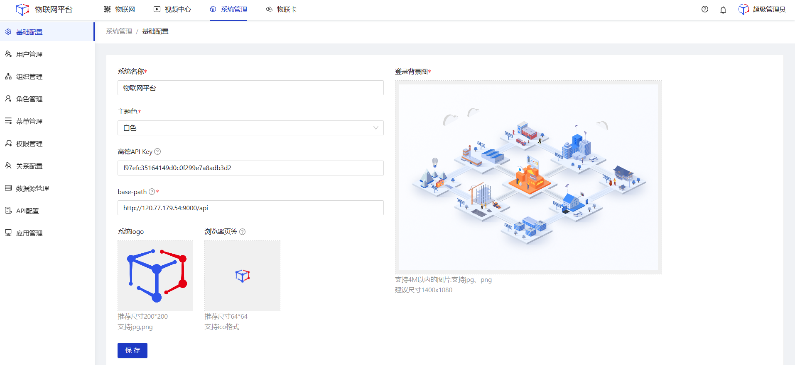

  

    
    说明
  

  不填写高德API Key，系统内基于地图展示的功能均不可使用。

## 用户管理
统一维护管理系统内的所有用户信息，用户的账号密码可用于登录本系统。 

#### 新增
##### 操作步骤
1.**登录**Jetlinks物联网平台。 
2.点击顶部**系统管理**，在左侧导航栏，选择**用户管理**，进入列表页。 

3.点击**新增**按钮，在弹框页中填写用户信息，然后点击**确定**。 
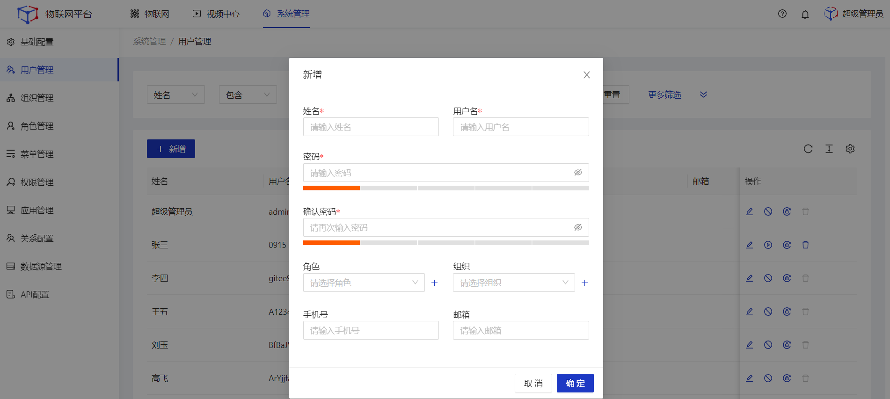

  

    
    说明
  

  <li>点击角色组织右侧的添加icon，将会在浏览器打开新tab页，添加完成后将自动关闭对应的tab页，并将添加的信息回填到当前页的下拉框中。</li>
  <li>用户具有多个角色时，拥有多个角色权限的并集。</li>

<table class='table'>
        <thead>
            <tr>
              <td>参数</td>
              <td>说明</td>
            </tr>
        </thead>
        <tbody>
          <tr>
            <td>姓名</td>
            <td>为用户命名，最多可输入64个字符。</td>
          </tr>
          <tr>
            <td>用户名</td>
            <td>设置账号的用户名信息，该字段将用于登录系统。用户名在系统内具有唯一性。</td>
          </tr>
          <tr>
            <td>密码</td>
            <td>密码不低于8位，最多64位；密码必须包含大小写字母+数字。</td>
          </tr>
          <tr>
            <td>确认密码</td>
            <td>再次输入密码，2次输入的密码必须一致。</td>
          </tr>
          <tr>
            <td>角色</td>
            <td>为当前用户账号绑定角色，系统将基于角色进行菜单权限分配，非必填。</td>
          </tr>
          <tr>
            <td>组织</td>
            <td>为当前用户账号绑定组织，系统将基于组织进行数据权限分配。非必填。</td>
          </tr>
           <tr>
            <td>手机号</td>
            <td>填写该用户的手机号信息，非必填。</td>
          </tr>
           <tr>
            <td>邮箱</td>
            <td>填写该用户的邮箱信息，非必填。</td>
          </tr>
          </tbody>
</table>

#### 编辑
##### 操作步骤
1.**登录**Jetlinks物联网平台。 
2.点击顶部**系统管理**，在左侧导航栏，选择**用户管理**，进入列表页。 
3.点击具体用户的**编辑**按钮，在弹框页中编辑用户信息，然后点击**确定**。 
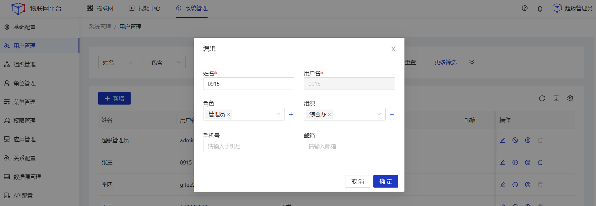

#### 启用/禁用
##### 操作步骤
1.**登录**Jetlinks物联网平台。 
2.点击顶部**系统管理**，在左侧导航栏，选择**用户管理**，进入列表页。 
3.点击具体用户的**启用/禁用**按钮，然后点击**确定**。 
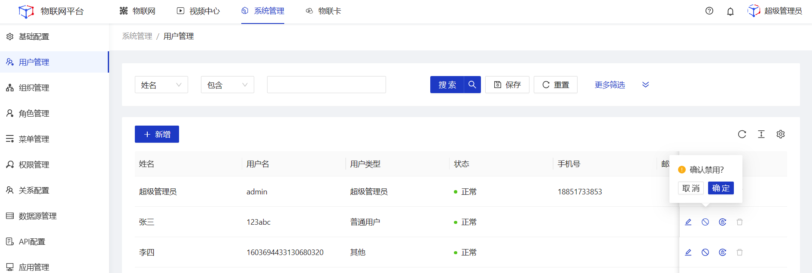

#### 重置密码
##### 操作步骤
1.**登录**Jetlinks物联网平台。 
2.点击顶部**系统管理**，在左侧导航栏，选择**用户管理**，进入列表页。 
3.点击具体用户的**重置密码**按钮，在弹框页重新设置用户登录密码，然后点击**确定**。 

#### 删除
##### 操作步骤
1.**登录**Jetlinks物联网平台。 
2.点击顶部**系统管理**，在左侧导航栏，选择**用户管理**，进入列表页。 
3.点击具体用户的**删除**按钮，然后点击**确定**。 

  
  警告
超级管理员被删除后，需手动修改数据库，请谨慎操作！

## 组织管理
统一维护管理系统内的组织架构信息，支持为每个组织分配产品、设备、用户。 

#### 新增
##### 操作步骤
1.**登录**Jetlinks物联网平台。 
2.点击顶部**系统管理**，在左侧导航栏，选择**组织管理**，进入列表页。 
3.点击左侧**新增**按钮，在弹框页填写组织信息，然后点击**确定**。 
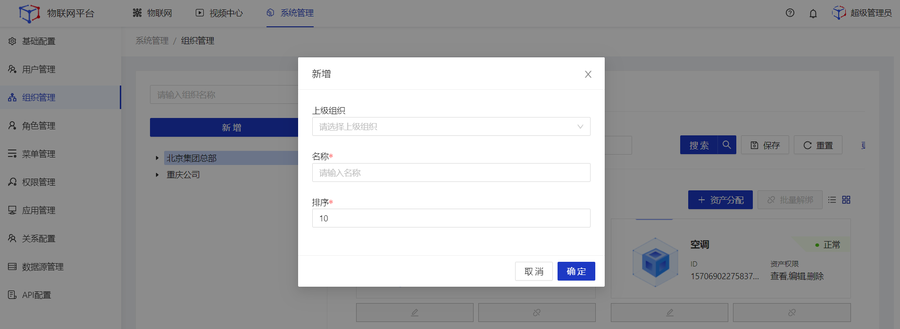

#### 编辑
##### 操作步骤
1.**登录**Jetlinks物联网平台。 
2.点击顶部**系统管理**，在左侧导航栏，选择**组织管理**，进入列表页。 
3.鼠标移入左侧树中的具体数据，点击**编辑**按钮，在弹框页编辑组织信息，然后点击**确定**。 

#### 删除
##### 操作步骤
1.**登录**Jetlinks物联网平台。 
2.点击顶部**系统管理**，在左侧导航栏，选择**组织管理**，进入列表页。 
3.鼠标移入左侧树中的具体数据，点击**删除**按钮，然后点击**确定**。 

#### 分配资产

  
 
    
    提示
  

本功能仅在企业版中提供。

##### 操作步骤
1.**登录**Jetlinks物联网平台。 
2.点击顶部**系统管理**，在左侧导航栏，选择**组织管理**，进入列表页。 
3.鼠标点击左侧树中的具体节点，点击页面右侧tab，选择要分类的资产类型（产品、设备、用户），点击**资产分配**按钮，在弹框页勾选需要分配的资产，然后点击**确定**。 
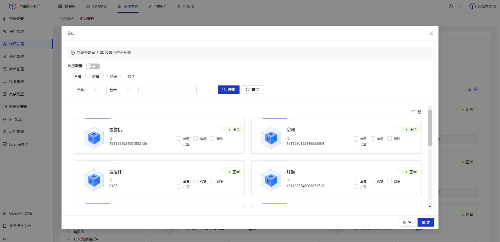

##### 后续步骤
1.资产解绑 
勾选需要解绑的资产数据或点击具体资产的**解绑**按钮，可进行**批量解绑**或**单个解绑**。 
2.编辑资产权限 
勾选需要解绑的资产数据或点击具体资产的**编辑**按钮，可进行**批量编辑**或**单个编辑**。 

  

    
    说明
  

<li>用户类型的资产不涉及此功能。</li>
<li>同一个设备可以被分配至多组织。</li>
<li>分配设备后自动分配该设备所属的产品资产。</li>

## 角色管理
统一维护管理系统内的角色，角色可与权限进行关联，以实现不同角色查看不同菜单，不同用户查看同一菜单下的不同数据。

  

    
    说明
  

当前只有产品、设备、产品分类3个菜单支持数据权限。

#### 新增
##### 操作步骤
1.**登录**Jetlinks物联网平台。 
2.点击顶部**系统管理**，在左侧导航栏，选择**角色管理**，进入列表页。 

3.鼠标点击**新增**按钮，填写角色名称，然后点击**确定**。 

4.点击具体角色的**编辑**按钮，进入详情页，勾选所需的菜单、操作、数据权限，然后点击**保存**。 

<table class='table'>
        <thead>
            <tr>
              <td>参数</td>
              <td>说明</td>
            </tr>
        </thead>
        <tbody>
          <tr>
            <td>名称</td>
            <td>为角色命名，最多可输入64个字符。</td>
          </tr>
          <tr>
            <td>说明</td>
            <td>角色备注说明信息，非必填。</td>
          </tr>
          <tr>
            <td>权限分配</td>
            <td>为角色分配菜单、操作、数据权限。
            

    说明
    <ul>
勾选父菜单会自动关联勾选下属子菜单，以及子菜单中的所有操作权限。数据权限默认是选择自己创建的数据。
    </ul>
  

            </td>
          </tr>
          </tbody>
</table>

##### 后续步骤
1.绑定用户 
在角色详情页，切换至**用户管理**tab页，点击**添加**按钮，将用户与角色关联。 

2.解绑用户 
在角色详情页，切换至**用户管理**tab页，勾选已经绑定角色的用户然后点击批量解绑，或直接点击对应用户操作列的**解绑**按钮，可实现批量或单独解绑。

  

    
    说明
  

同一个用户可以绑定多个角色，拥有多个角色权限的并集。

#### 编辑
##### 操作步骤
1.**登录**Jetlinks物联网平台。 
2.点击顶部**系统管理**，在左侧导航栏，选择**角色管理**，进入列表页。 
3.点击具体角色的**编辑**按钮，进入详情页，编辑相关信息，然后点击**保存**。 
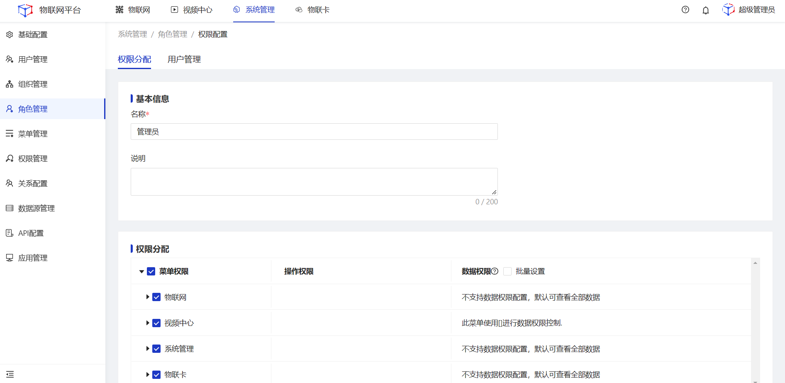

#### 删除
##### 操作步骤
1.**登录**Jetlinks物联网平台。 
2.点击顶部**系统管理**，在左侧导航栏，选择**角色管理**，进入列表页。 
3.点击具体角色的**删除**按钮，然后点击**确定**。 

## 菜单管理
统一管理系统内的菜单，可调整菜单基础信息与权限信息。
#### 新增
##### 操作步骤
1.**登录**Jetlinks物联网平台。 
2.点击顶部**系统管理**，在左侧导航栏，选择**菜单管理**，进入列表页。 
3.点击**新增**按钮，进入详情页填写菜单信息，然后点击**保存**。 
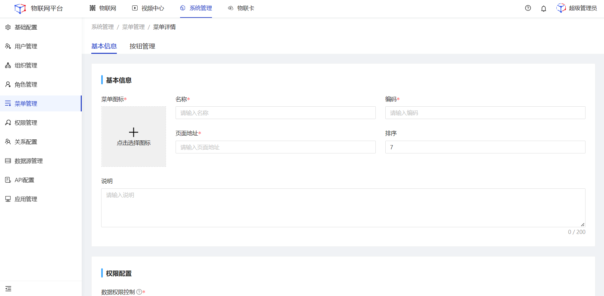

  

    
    说明
  

菜单的数据权限由后端代码控制，若后端代码不支持数据权限，即使前端页面配置为支持数据权限也无法生效。

<table class='table'>
        <thead>
            <tr>
              <td>参数</td>
              <td>说明</td>
            </tr>
        </thead>
        <tbody>
          <tr>
            <td>名称</td>
            <td>为菜单命名，最多可输入64个字符。</td>
          </tr>
          <tr>
            <td>编码</td>
            <td>菜单唯一编码。</td>
          </tr>
          <tr>
            <td>页面地址</td>
            <td>菜单对应的页面路由地址。</td>
          </tr>
          <tr>
            <td>排序</td>
            <td>菜单排序，展示时将按照升序排列。</td>
          </tr>
         <tr>
            <td>权限配置</td>
            <td>配置菜单的操作权限、数据权限。
            <li>不支持：菜单内的数据不支持权限隔离，拥有菜单权限即可查看菜单页面内的所有数据。</li>
            <li>支持：菜单内的数据支持权限隔离，可基于组织实现数据隔离。</li>
            <li>间接控制：此菜单内的数据基于其他菜单的数据权限控制。</li>
            </td>
          </tr>
        </tbody>
      </table>

4.（可选操作）点击切换至**按钮管理**tab，点击**新增**按钮，在弹框页面填写按钮权限信息，然后点击**保存**。 

<table class='table'>
        <thead>
            <tr>
              <td>参数</td>
              <td>说明</td>
            </tr>
        </thead>
        <tbody>
          <tr>
            <td>名称</td>
            <td>为按钮命名，最多可输入64个字符。</td>
          </tr>
          <tr>
            <td>编码</td>
            <td>菜单内按钮的唯一编码。
                        

    说明
    <ul>
按钮是一个抽象概念，可以基于实际业务以及代码的实际情况，将tab页权限以按钮权限的方式进行配置。
    </ul>
  

            </td>
          </tr>
          <tr>
            <td>权限</td>
            <td>为菜单内的按钮分配操作权限。</td>
          </tr>
        </tbody>
      </table>

#### 菜单配置
##### 操作步骤
1.**登录**Jetlinks物联网平台。 
2.点击顶部**系统管理**，在左侧导航栏，选择**菜单管理**，进入列表页。 
3.点击页面左侧的**菜单配置**按钮，进入详情页。 
4.拖拽左侧源菜单至右侧系统菜单中，然后点击保存。 

  

    
    说明
  

源菜单基于系统代码自动读取而来，系统菜单为展现在菜单管理页面中的菜单数据。 
同一个源菜单，只能配置一次。拖动源菜单父节点时会将下属子节点一并移动。

#### 编辑
##### 操作步骤
1.**登录**Jetlinks物联网平台。 
2.点击顶部**系统管理**，在左侧导航栏，选择**菜单管理**，进入列表页。 
3.点击具体菜单的**查看**按钮，进入详情页编辑菜单信息，然后点击**保存**。 

#### 删除
##### 操作步骤
1.**登录**Jetlinks物联网平台。 
2.点击顶部**系统管理**，在左侧导航栏，选择**菜单管理**，进入列表页。 
3.点击具体菜单的**删除**按钮，然后点击**保存**。 

  

    
    说明
  

删除父菜单将一并删除下属子菜单。

## 权限管理
创建、编辑和删除系统权限，作为菜单权限以及按钮权限配置项的数据来源。 
#### 新增
##### 操作步骤
1.**登录**Jetlinks物联网平台。 
2.点击顶部**系统管理**，在左侧导航栏，选择**权限管理**，进入列表页。 

3.点击**新增**按钮，填写权限信息，然后点击**确定**。

  

    
    说明
  

标识必须与代码中的标识ID一致，否则配置将不生效。

<table class='table'>
        <thead>
            <tr>
              <td>参数</td>
              <td>说明</td>
            </tr>
        </thead>
        <tbody>
          <tr>
            <td>标识</td>
            <td>权限控制唯一标识，系统内具有唯一性。标识必须与代码中的标识ID一致，否则配置将不生效。</td>
          </tr>
          <tr>
            <td>名称</td>
            <td>为权限命名，最多可输入64个字符。
            </td>
          </tr>
          <tr>
            <td>操作类型</td>
            <td>定义权限中的具体操作类型。填写时需与代码中定义的操作类型一致。</td>
          </tr>
        </tbody>
      </table>

#### 导入
##### 操作步骤
1.**登录**Jetlinks物联网平台。 
2.点击顶部**系统管理**，在左侧导航栏，选择**权限管理**，进入列表页。 
3.鼠标移入**批量操作**按钮，选择**导入**，选择JSON文件后，点击**确定**。 

#### 导出
##### 操作步骤
1.**登录**Jetlinks物联网平台。 
2.点击顶部**系统管理**，在左侧导航栏，选择**权限管理**，进入列表页。 
3.鼠标移入**批量操作**按钮，选择**导出**。 

#### 编辑
##### 操作步骤
1.**登录**Jetlinks物联网平台。 
2.点击顶部**系统管理**，在左侧导航栏，选择**权限管理**，进入列表页。 
3.点击具体权限的**编辑**按钮，在弹框页中编辑权限信息，然后点击**确定**。 
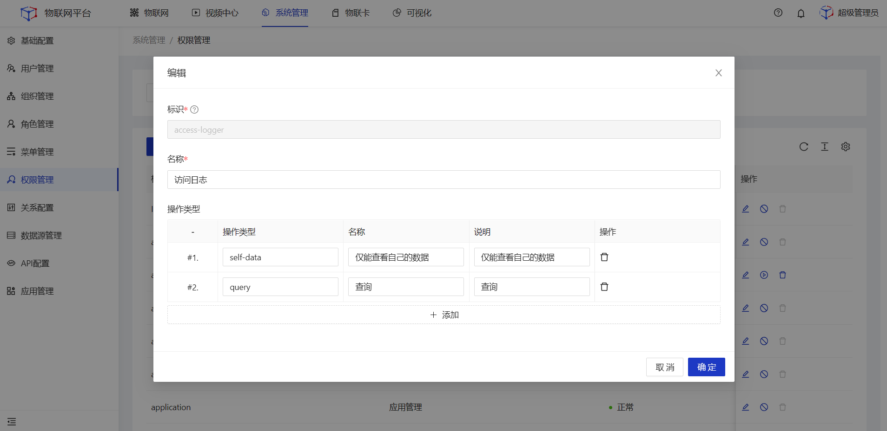

#### 启用/禁用
##### 操作步骤
1.**登录**Jetlinks物联网平台。 
2.点击顶部**系统管理**，在左侧导航栏，选择**权限管理**，进入列表页。 
3.点击具体权限的**启用/禁用**按钮，然后点击**确定**。 

#### 删除
##### 操作步骤
1.**登录**Jetlinks物联网平台。 
2.点击顶部**系统管理**，在左侧导航栏，选择**权限管理**，进入列表页。 
3.点击具体权限的**删除**按钮，然后点击**确定**。 
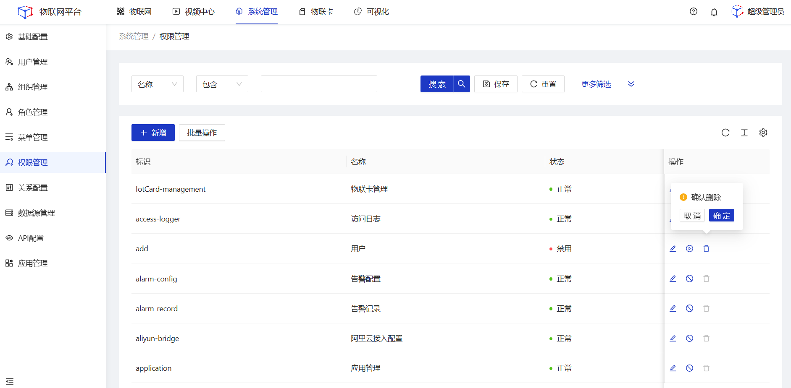

## 应用管理
支持提供平台API接口服务给第三应用；集成第三方应用到本平台；提供SSO单点登陆；OAuth2认证

  
 
    
    提示
  

本功能仅在企业版中提供。

#### 名称解释

<table class='table'>
        <thead>
            <tr>
              <td>参数</td>
              <td>说明</td>
            </tr>
        </thead>
        <tbody>
          <tr>
            <td>应用</td>
            <td>
            <li>内部独立应用</li>
            内部独立应用适用于将官方开发的其他应用与物联网平台相互集成，例如将可视化平台集成至物联网平台，或者将物联网平台集成至可视化平台。以实现多处访问、集中管控的业务场景。
             <li>内部集成应用</li>
            内部集成应用适用于将官方开发的其他应用与物联网平台相互集成，例如将可视化平台集成至物联网平台，或者将物联网平台集成至可视化平台。以实现多处访问、集中管控的业务场景。
            <li>微信网站应用</li>
            适用于通过微信账户登录jetlinks物联网平台。
           <li>钉钉企业内部应用</li>
           适用于通过钉钉账户登录jetlinks物联网平台。
           <li>第三方应用</li>
           适用于第三方应用与物联网平台相互集成。例如将公司业务管理系统集成至物联网平台，或者将物联网平台集成至业务管理系统。以实现多处访问、集中管控的业务场景。
            </td>
          </tr>
          <tr>
            <td>接入方式</td>
            <td>
            <li>页面集成</li>
            将其他应用系统的页面集成至jetlinks物联网平台。集成时通常需要配置API服务。（内部集成时无需配置）
            <li>API客户端</li>
            将jetlinks物联网平台作为客户端集成到其他应用系统中，其他应用系统可通过Oauth2的方式访问物联网平台。
             <li>API服务</li>
             将jetlinks物联网API能力提供给其他应用，其他应用可通过接口的方式直接使用API能力。
             <li>单点登录</li>
             使用第三方应用账户登录jetlinks物联网平台。
            </td>
          </tr>
             </tbody>
        </table>

### 内部独立应用
#### 新增
##### 操作步骤
1.**登录**Jetlinks物联网平台。 
2.点击顶部**系统管理**，在左侧导航栏，选择**应用管理**，进入列表页。 

3.点击**新增**按钮，进入详情页，选择应用类型，基于类型填写相关配置项，然后点击**确定**。 
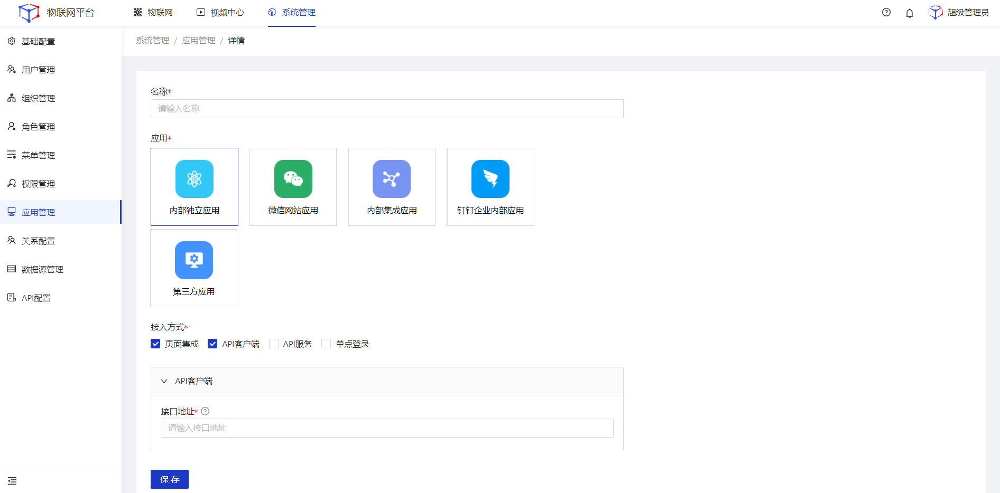

##### 页面集成
<table class='table'>
        <thead>
            <tr>
              <td>参数</td>
              <td>说明</td>
            </tr>
        </thead>
        <tbody>
          <tr>
            <td>接入地址</td>
            <td>访问其它平台的前端页面的地址</td>
          </tr>
           <tr>
            <td>路由方式</td>
            <td><li>hash：使用URL的hash来模拟一个完整的URL, 其显示的网络路径中会有 “#” 号</li>
            <li>history：路径中不包含“#”。依赖于Html5 的 history api</li>
            </td>
          </tr>
        </tbody>
      </table>

##### API客户端
<table class='table'>
        <thead>
            <tr>
              <td>参数</td>
              <td>说明</td>
            </tr>
        </thead>
        <tbody>
          <tr>
            <td>接口地址</td>
            <td>访问API服务的地址。格式{http/https}://{JetLinks前端所在服务器IP地址}:{JetLinks前端暴露的服务端口}/api</td>
          </tr>
          <tr>
            <td>授权地址</td>
            <td>认证授权地址。格式{http/https}://{JetLinks前端所在服务器IP地址}:{JetLinks前端暴露的服务端口}/#/oauth</td>
          </tr>
            <tr>
            <td>token地址</td>
            <td>设置token令牌的地址。格式{http/https}://{JetLinks前端所在服务器IP地址}:{JetLinks前端暴露的服务端口}/api/oauth2/token</td>
          </tr>
          <tr>
            <td>回调地址</td>
            <td>授权完成后跳转到具体页面的回调地址。{http/https}://{JetLinks前端所在服务器IP地址}:{JetLinks前端暴露的服务端口}</td>
          </tr>
          <tr>
            <td>appid</td>
            <td>应用唯一标识</td>
          </tr>
          <tr>
            <td>appKey</td>
            <td>应用唯一标识的密钥</td>
          </tr>
           <tr>
            <td>请求头</td>
            <td>根据不同应用的调用规范，自定义请求头内容</td>
          </tr>
           <tr>
            <td>参数</td>
            <td>根据不同应用的调用规范，自定义请求参数</td>
          </tr>
        </tbody>
      </table>

##### API服务
<table class='table'>
        <thead>
            <tr>
              <td>参数</td>
              <td>说明</td>
            </tr>
        </thead>
        <tbody>
          <tr>
            <td>appid</td>
            <td>应用唯一标识</td>
          </tr>
          <tr>
            <td>secureKey</td>
            <td>应用唯一标识匹配的秘钥</td>
          </tr>
          <tr>
            <td>回调地址</td>
            <td>授权完成后跳转到API客户端页面的回调地址。格式：{http/https}://{JetLinks前端所在服务器IP地址}:{JetLinks前端暴露的服务端口}</td>
          </tr>
          <tr>
            <td>角色</td>
            <td>为应用用户分配角色，根据绑定的角色，进行系统菜单赋权</td>
          </tr>
          <tr>
            <td>组织</td>
            <td>为应用用户配所属组织，根据绑定的组织，进行数据隔离</td>
          </tr>
        </tbody>
      </table>

  

    
    说明
  

第三方应用的API服务中，Appid和secureKey需要提供给客户端开发者。 同时系统将自动新增一个第三方平台类型的用户，APPid为用户名，secureKey为密码。

##### 后续操作
1.当应用的接入方式勾选了**API服务**时，可以对该应用进行API赋权操作。鼠标移入应用列表卡片的**其他**按钮，点击隐藏的**赋权**按钮，进入赋权页面，勾选对应的API权限，然后点击**保存**。

2.当应用的接入方式勾选了**API服务**时，可查看该应用的API权限。鼠标移入**其他**按钮，点击隐藏的**查看API**按钮，进入详情页面。 
3.当应用的接入方式勾选了**页面集成**时，可以对该应用进行集成菜单配置。鼠标移入**其他**按钮，点击隐藏的**集成菜单**按钮，在弹框页中，勾选需要集成的菜单，然后点击**保存**。 

##### 单点登录
<table class='table'>
        <thead>
            <tr>
              <td>参数</td>
              <td>说明</td>
            </tr>
        </thead>
        <tbody>
          <tr>
            <td>授权地址</td>
            <td>oauth2授权地址。格式：{http/https}://{JetLinks前端所在服务器IP地址}:{JetLinks前端暴露的服务端口}/#/oauth</td>
          </tr>
          <tr>
            <td>回调地址</td>
            <td>授权完成后跳转到具体页面的回调地址。{http/https}://{JetLinks前端所在服务器IP地址}:{JetLinks前端暴露的服务端口}</td>
          </tr>
           <tr>
            <td>appid</td>
            <td>应用唯一标识</td>
          </tr>
          <tr>
            <td>appKey</td>
            <td>应用唯一标识的密钥</td>
          </tr>
           <tr>
            <td>自动创建用户</td>
            <td>第三方用户第一次授权登录系统时，无需进入授权绑定页面。系统默认创建一个新用户与之绑定</td>
          </tr>
        </tbody>
      </table>

#### 编辑
##### 操作步骤
1.**登录**Jetlinks物联网平台。 
2.点击顶部**系统管理**，在左侧导航栏，选择**应用管理**，进入列表页。 
3.点击具体数据的**编辑**按钮，在页面中编辑应用信息，然后点击**确定**。 

#### 启用/禁用
##### 操作步骤
1.**登录**Jetlinks物联网平台。 
2.点击顶部**系统管理**，在左侧导航栏，选择**第三方平台**，进入列表页。 
3.点击具体第三方平台的**启用/禁用**按钮，然后点击**确定**

#### 删除
##### 操作步骤
1.**登录**Jetlinks物联网平台。 
2.点击顶部**系统管理**，在左侧导航栏，选择**第三方平台**，进入列表页。 
3.点击具体第三方平台的**删除**按钮，然后点击**确定**

  

    
    注意
  

删除接入方式包含API服务类型的应用时，将同步删除用户管理菜单中对应的用户；删除用户管理菜单中的第三方平台用户时，将同步删除与之关联的应用。

### 内部集成应用
#### 新增
##### 操作步骤
1.**登录**Jetlinks物联网平台。 
2.点击顶部**系统管理**，在左侧导航栏，选择**应用管理**，进入列表页。 

3.点击**新增**按钮，进入详情页，选择应用类型，基于类型填写相关配置项，然后点击**确定**。 
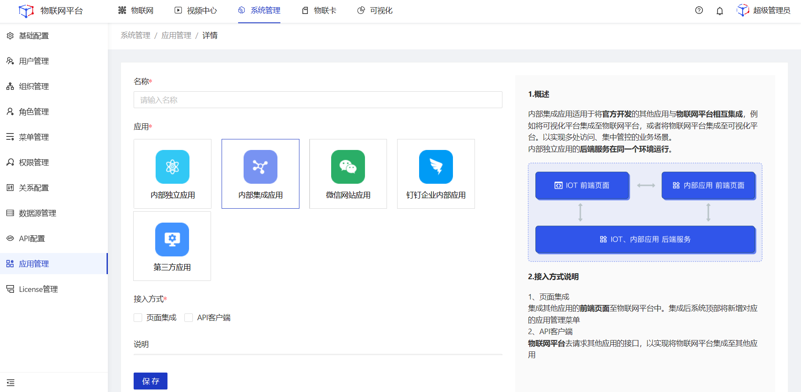

##### 页面集成
<table class='table'>
        <thead>
            <tr>
              <td>参数</td>
              <td>说明</td>
            </tr>
        </thead>
        <tbody>
          <tr>
            <td>接入地址</td>
            <td>访问其它平台的前端页面的地址</td>
          </tr>
           <tr>
            <td>路由方式</td>
            <td><li>hash：使用URL的hash来模拟一个完整的URL, 其显示的网络路径中会有 “#” 号</li>
            <li>history：路径中不包含“#”。依赖于Html5 的 history api</li>
            </td>
          </tr>
        </tbody>
      </table>

##### API客户端
<table class='table'>
        <thead>
            <tr>
              <td>参数</td>
              <td>说明</td>
            </tr>
        </thead>
        <tbody>
          <tr>
            <td>接口地址</td>
            <td>访问API服务的地址。格式{http/https}://{JetLinks前端所在服务器IP地址}:{JetLinks前端暴露的服务端口}/api</td>
          </tr>
        </tbody>
      </table>

#### 编辑
参见**内部独立应用**的编辑逻辑。
#### 启用/禁用
参见**内部独立应用**的启用/禁用逻辑
#### 删除
参见**内部独立应用**的删除逻辑

### 微信网站应用
#### 新增
##### 操作步骤
1.**登录**Jetlinks物联网平台。 
2.点击顶部**系统管理**，在左侧导航栏，选择**应用管理**，进入列表页。 

3.点击**新增**按钮，进入详情页，选择应用类型，基于类型填写相关配置项，然后点击**确定**。 
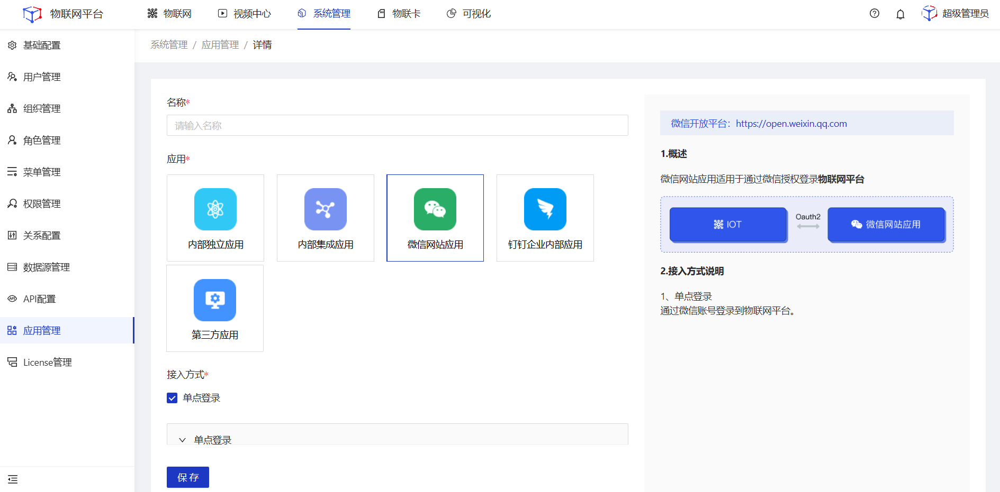

##### 单点登录
<table class='table'>
        <thead>
            <tr>
              <td>参数</td>
              <td>说明</td>
            </tr>
        </thead>
        <tbody>
          <tr>
            <td>appid</td>
            <td>应用的唯一标识</td>
          </tr>
          <tr>
            <td>appSecret</td>
            <td>应用唯一标识的秘钥</td>
          </tr>
           <tr>
            <td>自动创建用户</td>
            <td>第三方用户第一次授权登录系统时，无需进入授权绑定页面。系统默认创建一个新用户与之绑定</td>
          </tr>
        </tbody>
      </table>

#### 编辑
参见**内部独立应用**的编辑逻辑。
#### 启用/禁用
参见**内部独立应用**的启用/禁用逻辑
#### 删除
参见**内部独立应用**的删除逻辑

### 钉钉企业内部应用
#### 新增
##### 操作步骤
1.**登录**Jetlinks物联网平台。 
2.点击顶部**系统管理**，在左侧导航栏，选择**应用管理**，进入列表页。 

3.点击**新增**按钮，进入详情页，选择应用类型，基于类型填写相关配置项，然后点击**确定**。 

##### 单点登录
<table class='table'>
        <thead>
            <tr>
              <td>参数</td>
              <td>说明</td>
            </tr>
        </thead>
        <tbody>
          <tr>
            <td>appid</td>
            <td>应用的唯一标识</td>
          </tr>
          <tr>
            <td>appSecret</td>
            <td>应用唯一标识的秘钥</td>
          </tr>
           <tr>
            <td>自动创建用户</td>
            <td>第三方用户第一次授权登录系统时，无需进入授权绑定页面。系统默认创建一个新用户与之绑定</td>
          </tr>
        </tbody>
      </table>

#### 编辑
参见**内部独立应用**的编辑逻辑。
#### 启用/禁用
参见**内部独立应用**的启用/禁用逻辑
#### 删除
参见**内部独立应用**的删除逻辑

### 第三方应用
#### 新增
##### 操作步骤
1.**登录**Jetlinks物联网平台。 
2.点击顶部**系统管理**，在左侧导航栏，选择**应用管理**，进入列表页。 

3.点击**新增**按钮，进入详情页，选择应用类型，基于类型填写相关配置项，然后点击**确定**。 
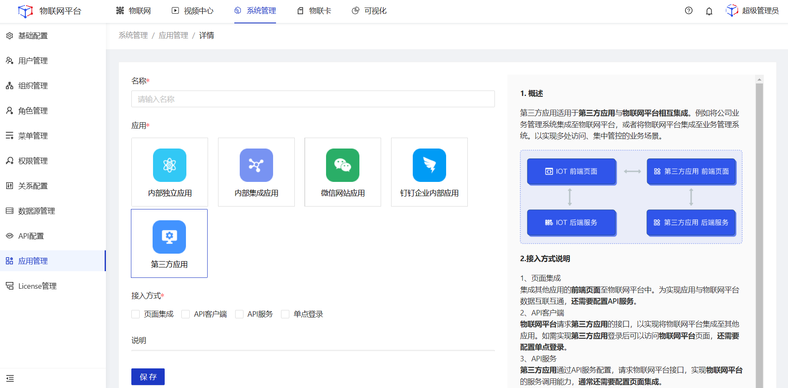

##### 页面集成
<table class='table'>
        <thead>
            <tr>
              <td>参数</td>
              <td>说明</td>
            </tr>
        </thead>
        <tbody>
          <tr>
            <td>接入地址</td>
            <td>访问其它平台的前端页面的地址</td>
          </tr>
           <tr>
            <td>路由方式</td>
            <td><li>hash：使用URL的hash来模拟一个完整的URL, 其显示的网络路径中会有 “#” 号</li>
            <li>history：路径中不包含“#”。依赖于Html5 的 history api</li>
            </td>
          </tr>
           <tr>
            <td>参数</td>
            <td>根据不同应用的调用规范，自定义请求参数</td>
          </tr>
        </tbody>
      </table>

##### API客户端
<table class='table'>
        <thead>
            <tr>
              <td>参数</td>
              <td>说明</td>
            </tr>
        </thead>
        <tbody>
          <tr>
            <td>接口地址</td>
            <td>访问第三方平台接口的地址</td>
          </tr>
          <tr>
            <td>认证方式</td>
            <td>配置身份认证方式，现支持Oauth2</td>
          </tr>
            <tr>
            <td>授权地址</td>
            <td>认证授权地址</td>
          </tr>
          <tr>
            <td>请求方式</td>
            <td>配置请求方式</td>
          </tr>
          <tr>
            <td>client_id</td>
            <td>应用唯一标识</td>
          </tr>
          <tr>
            <td>client_secret</td>
            <td>应用唯一标识的密钥</td>
          </tr>
           <tr>
            <td>请求头</td>
            <td>根据不同应用的调用规范，自定义请求头内容</td>
          </tr>
           <tr>
            <td>参数</td>
            <td>根据不同应用的调用规范，自定义请求参数</td>
          </tr>
        </tbody>
      </table>

##### API服务
<table class='table'>
        <thead>
            <tr>
              <td>参数</td>
              <td>说明</td>
            </tr>
        </thead>
        <tbody>
          <tr>
            <td>appid</td>
            <td>第三方应用唯一标识</td>
          </tr>
          <tr>
            <td>secureKey</td>
            <td>第三方应用唯一标识匹配的秘钥</td>
          </tr>
          <tr>
            <td>角色</td>
            <td>为应用用户分配角色，根据绑定的角色，进行系统菜单赋权</td>
          </tr>
          <tr>
            <td>组织</td>
            <td>为应用用户配所属组织，根据绑定的组织，进行数据隔离</td>
          </tr>
           <tr>
            <td>redirectUrl</td>
            <td>授权完成后跳转到API客户端页面的回调地址</td>
          </tr>
           <tr>
            <td>IP白名单</td>
            <td>白名单中的客户端可访问API服务</td>
          </tr>
        </tbody>
      </table>

##### 单点登录
<table class='table'>
        <thead>
            <tr>
              <td>参数</td>
              <td>说明</td>
            </tr>
        </thead>
        <tbody>
           <tr>
            <td>认证方式</td>
            <td>配置身份认证方式，现支持Oauth2</td>
          </tr>
           <tr>
            <td>scope</td>
            <td>限制用户访问应用程序的权限</td>
          </tr>
           <tr>
            <td>client_id</td>
            <td>应用唯一标识</td>
          </tr>
          <tr>
            <td>client_secret</td>
            <td>应用唯一标识的密钥</td>
          </tr>
           <tr>
            <td>授权地址</td>
            <td>oauth2授权地址</td>
          </tr>
           <tr>
            <td>token地址</td>
            <td>设置token令牌的地址</td>
          </tr>
           <tr>
            <td>logo</td>
            <td>设置第三方应用的logo，不配置时使用系统默认logo</td>
          </tr>
           <tr>
            <td>用户信息地址</td>
            <td>设置获取用户信息的地址</td>
          </tr>
           <tr>
            <td>用户ID</td>
            <td>填写从用户信息接口返回数据中的用户ID字段，示例:result.id</td>
          </tr>
           <tr>
            <td>用户名</td>
            <td>填写从用户信息接口返回数据中的用户名字段，示例:result.name</td>
          </tr>
           <tr>
            <td>头像</td>
            <td>填写从用户信息接口返回数据中的头像字段，示例:result.avatar</td>
          </tr>
           <tr>
            <td>自动创建用户</td>
            <td>第三方用户第一次授权登录系统时，无需进入授权绑定页面。系统默认创建一个新用户与之绑定</td>
          </tr>
        </tbody>
      </table>

#### 编辑
参见**内部独立应用**的编辑逻辑。
#### 启用/禁用
参见**内部独立应用**的启用/禁用逻辑
#### 删除
参见**内部独立应用**的删除逻辑

## 关系配置
自定义系统内，各类数据资产之间的**关系**。该关系可用于系统其他功能进行调用，例如设备与用户的关系可用于场景联动引用。

  

    
    说明
  

目前系统只支持设备与用户之间的关系配置。该配置在系统内全局生效。

#### 新增
##### 操作步骤
1.**登录**Jetlinks物联网平台。 
2.点击顶部**系统管理**，在左侧导航栏，选择**关系配置**，进入列表页。 
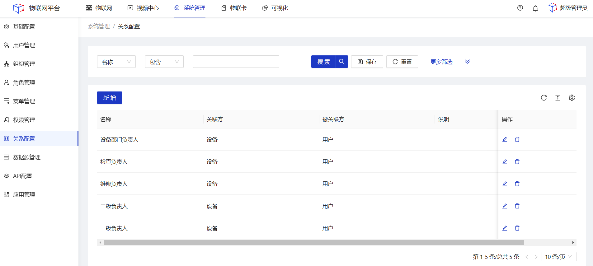
3.点击**新增**按钮，在弹框页填写关系信息，然后点击**确定**。 
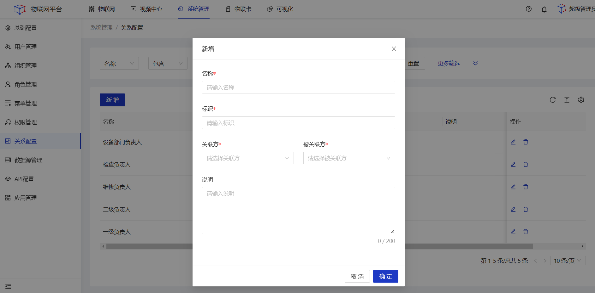
4.选择需要**配置关系**的设备，进入设备**实例信息**页面，点击关系配置的**编辑**按钮，填写关系，然后点击**保存**。 

#### 编辑
##### 操作步骤
1.**登录**Jetlinks物联网平台。 
2.点击顶部**系统管理**，在左侧导航栏，选择**关系配置**，进入列表页。 
3.点击具体配置数据**编辑**按钮，在弹框页编辑关系信息，然后点击**确定**。 
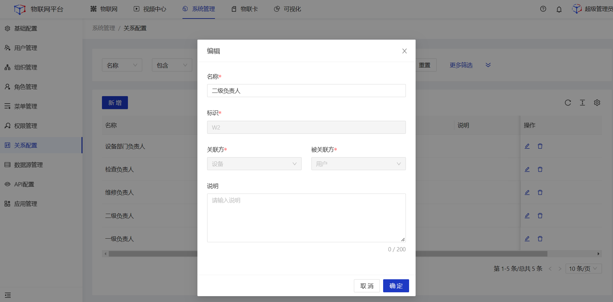

#### 删除
##### 操作步骤
1.**登录**Jetlinks物联网平台。 
2.点击顶部**系统管理**，在左侧导航栏，选择**关系配置**，进入列表页。 
3.点击具体配置数据**删除**按钮，然后点击**确定**。 

## 数据源管理
统一维护管理系统内的数据源信息，配置的数据源可被系统其他模块引用，例如规则编排。
#### 新增
##### 操作步骤
1.**登录**Jetlinks物联网平台。 
2.点击顶部**系统管理**，在左侧导航栏，选择**数据源管理**，进入列表页。 
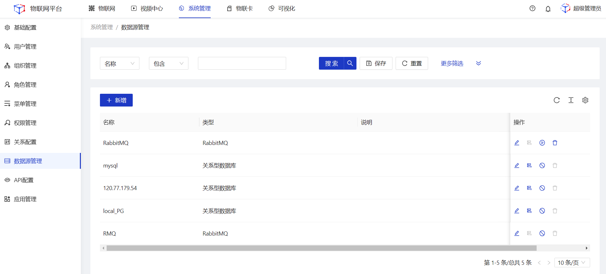
3.点击**新增**按钮，在弹框页填写信息，然后点击**确定**。 

4.点击**管理**按钮，进入详情页，点击右侧页面的**新增行**按钮，填写列表信息，然后点击右上角**保存**。

  

    
    说明
  

禁用状态下，管理按钮不可点击。RabbitMQ类型暂不支持管理功能。

#### 启用/禁用
##### 操作步骤
1.**登录**Jetlinks物联网平台。 
2.点击顶部**系统管理**，在左侧导航栏，选择**数据源管理**，进入列表页。 
3.点击具体数据源的**启用/禁用**按钮，然后点击**确定**。 
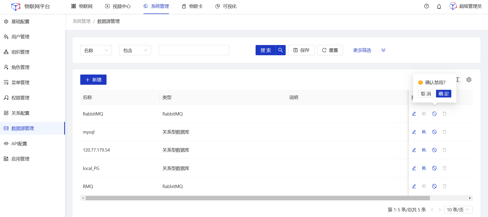

#### 删除
##### 操作步骤
1.**登录**Jetlinks物联网平台。 
2.点击顶部**系统管理**，在左侧导航栏，选择**数据源管理**，进入列表页。 
3.点击具体数据源的**删除**按钮，然后点击**确定**。 

## API配置
统一配置系统内对外输出的API服务，API配置将在为第三方平台赋权时引用。

  
 
    
    提示
  

本功能仅在企业版中提供。

##### 操作步骤
1.**登录**Jetlinks物联网平台。 
2.点击顶部**系统管理**，在左侧导航栏，选择**API配置**，进入详情页。 
3.勾选需要支持对外输出的API服务，然后点击**保存**。 
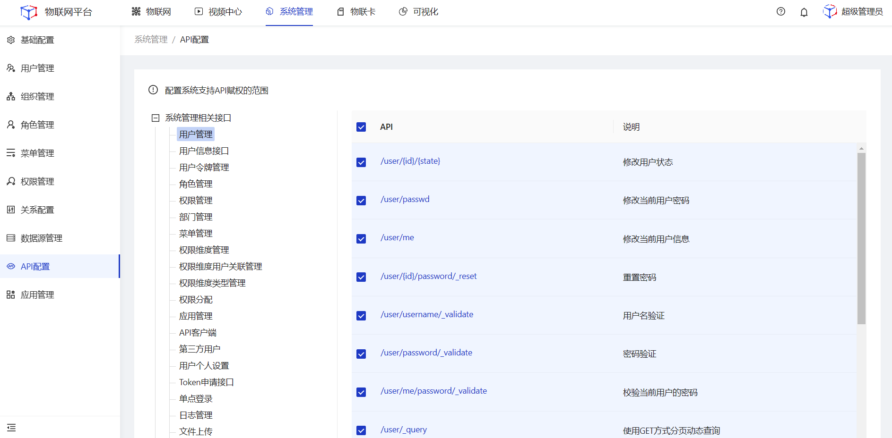

