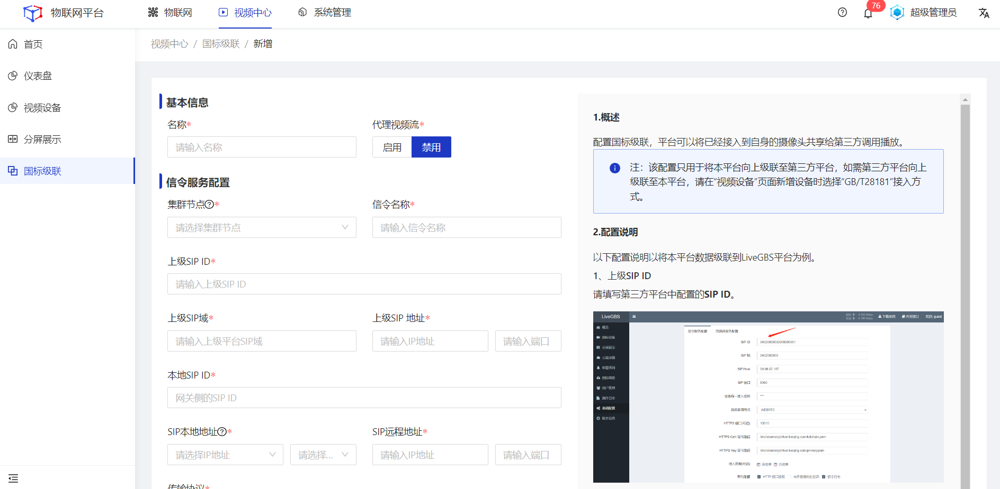
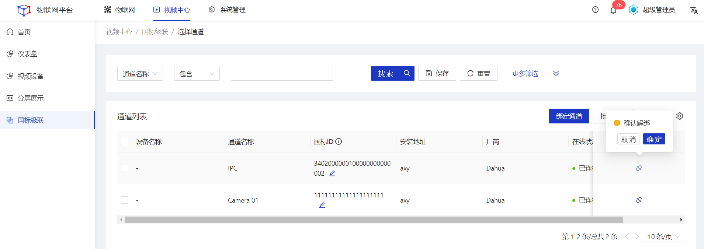

# 国标级联

  

    
    说明
  

该功能通过GB/T28181的方式将本地平台的设备推送给上级平台。

## 指导介绍

  
1. <a href="/Video_Center/National_standard_cascade.html#新增">新增</a>

  
2. <a href="/Video_Center/National_standard_cascade.html#编辑">编辑</a>

  
3. <a href="/Video_Center/National_standard_cascade.html#选择通道">选择通道</a>

  
4. <a href="/Video_Center/National_standard_cascade.html#启用-禁用">启用/禁用</a>

  
5. <a href="/Video_Center/National_standard_cascade.html#删除">删除</a>

## 新增
### 操作步骤
1.**登录**Jetlinks物联网平台。 
2.点击顶部**视频中心**，在左侧导航栏，选择**国标级联**，进入列表页。 

3.点击左上角**新增**按钮，进入详情页填写相关信息，然后点击**保存**。 

## 编辑
### 操作步骤
1.**登录**Jetlinks物联网平台。 
2.点击顶部**视频中心**，在左侧导航栏，选择**国标级联**，进入列表页。 
3.点击具体数据的**编辑**按钮，编辑相关配置信息，然后点击**保存**。 

## 选择通道
### 操作步骤
1.**登录**Jetlinks物联网平台。 
2.点击顶部**视频中心**，在左侧导航栏，选择**国标级联**，进入列表页。 
3.点击具体数据的**选择通道**按钮，进入详情页。 

4.点击绑定通道按钮，在弹框页面中勾选需要被推送的通道，然后点击**保存**。 

### 后续步骤
1.编辑国标ID 
点击国标ID字段后方的**编辑**ICON，重新填写**18位**或**20位**的ID。

  
  注意
  国标ID必须符合GB/T28181协议规范，否则将导致级联推送失败。

2.解绑 
勾选通道列表数据，点击页面右上角**批量解绑**按钮，或直接点击通道列表操作列的**解绑**按钮，可将对应通道与该级联配置解绑。

## 启用/禁用
### 操作步骤
1.**登录**Jetlinks物联网平台。 
2.点击顶部**视频中心**，在左侧导航栏，选择**国标级联**，进入列表页。 
3.点击具体数据的**启用/禁用**按钮，然后点击**确定**。 

## 删除
### 操作步骤
1.**登录**Jetlinks物联网平台。 
2.点击顶部**视频中心**，在左侧导航栏，选择**国标级联**，进入列表页。 
3.点击具体数据的**删除**按钮，然后点击**确定**。 

