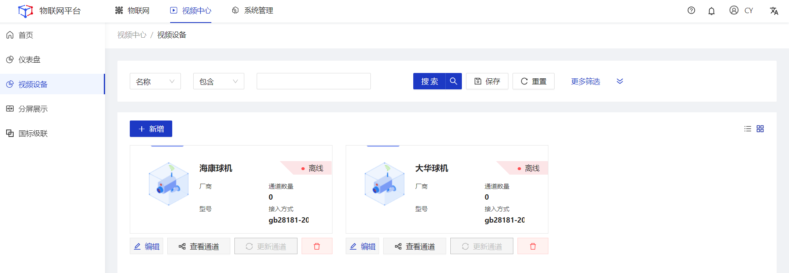
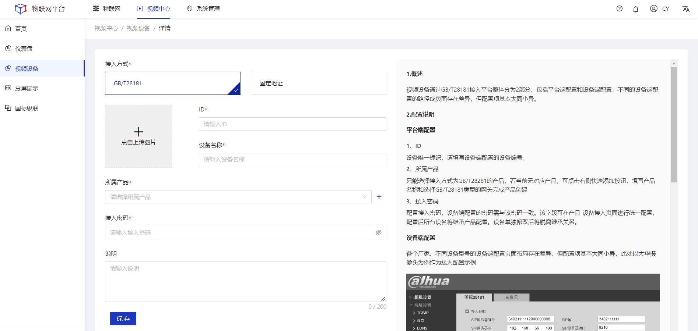
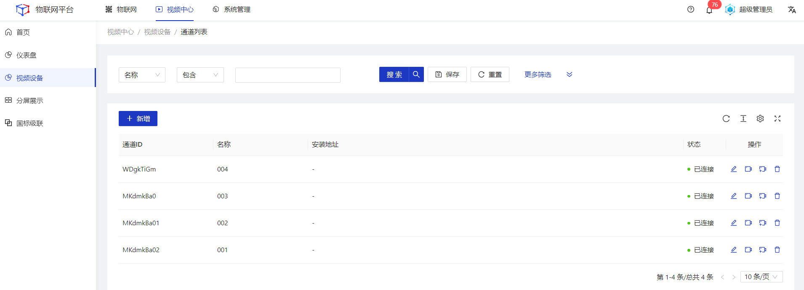
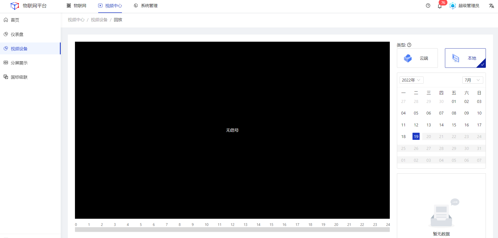
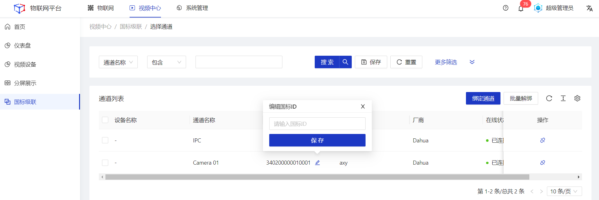

# 视频设备

## 视频设备

视频设备是对系统内所有视频类设备的统一接入与管理。支持GB/T28181和固定地址2种方式的接入。 

  
 
    
    提示
  

本功能仅在企业版中提供。

#### 新增
##### 操作步骤
1.**登录**Jetlinks物联网平台。 
2.点击顶部**视频中心**，在左侧导航栏，选择**视频设备**，进入列表页。 

3.点击**新增**按钮，进入详情页，填写设备信息，然后点击**保存**。 

<table class='table'>
        <thead>
            <tr>
              <td>参数</td>
              <td>说明</td>
            </tr>
        </thead>
        <tbody>
           <tr>
            <td>接入方式</td>
            <td>定义设备的接入方式，支持GB/T28181、固定地址2种方式。</td>
          </tr>
          <tr>
            <td>设备名称</td>
            <td>为视频设备命名，最多可输入64个字符。</td>
          </tr>
          <tr>
            <td>ID</td>
            <td>设备唯一标识，请填写设备端配置的设备编号。</td>
          </tr>
          <tr>
            <td>所属产品</td>
            <td>定义设备所属产品，产品所引用的设备接入网关必须与接入方式类型相同。</td>
          </tr>
          <tr>
            <td>接入密码</td>
            <td>GB/T28181类型接入时将出现此字段。配置接入密码，设备端配置的密码需与该密码一致。该字段可在产品-设备接入页面进行统一配置，配置后所有设备将继承产品配置。设备单独修改后将脱离继承关系。</td>
          </tr>
          <tr>
            <td>说明</td>
            <td>描述点位信息，非必填。</td>
          </tr>
        </tbody>
      </table>

#### 编辑
##### 操作步骤
1.**登录**Jetlinks物联网平台。 
2.点击顶部**视频中心**，在左侧导航栏，选择**视频设备**，进入列表页。 
3.点击具体数据的**编辑**按钮，进入详情页，编修所需要修改的信息，然后点击**确定**按钮。 

  

    
    说明
  

接入方式不可编辑。

#### 删除
##### 操作步骤
1.**登录**Jetlinks物联网平台。 
2.点击顶部**视频中心**，在左侧导航栏，选择**视频设备**，进入列表页。 
3.点击具体数据的**删除**按钮，然后点击**确定**。 

  

    
    说明
  

删除时将同步删除**物联网>设备管理>设备**页面中的数据。

#### 查看通道
##### 操作步骤
1.**登录**Jetlinks物联网平台。 
2.点击顶部**视频中心**，在左侧导航栏，选择**视频设备**，进入列表页。 
3.点击具体数据的**查看通道**按钮，进入详情页。 

#### 后续操作
1.新增通道 
点击页面左上角新增按钮，填写通道信息。

  

    
    说明
  

 只有固定地址接入类型的设备才可以新增通道。

<table class='table'>
        <thead>
            <tr>
              <td>参数</td>
              <td>说明</td>
            </tr>
        </thead>
        <tbody>
           <tr>
            <td>通道ID</td>
            <td>同一个设备下通道ID具有唯一性，若不填写，系统将自动生成。</td>
          </tr>
          <tr>
            <td>通道名称</td>
            <td>为通道命名，最多可输入64个字符。</td>
          </tr>
          <tr>
            <td>视频地址</td>
            <td>不同厂家的RTSP、RTMP固定地址规则不同，请按对应厂家的规则填写。</td>
          </tr>
          <tr>
            <td>用户名</td>
            <td>填写通道的用户名信息，非必填。</td>
          </tr>
          <tr>
            <td>密码</td>
            <td>填写通道的密码，非必填。</td>
          </tr>
          <tr>
            <td>说明</td>
            <td>描述点位信息，非必填。</td>
          </tr>
        </tbody>
      </table>

2.播放通道实时视频流 

  

    
    说明
  

云台控制需设备端自身支持才可使用。

3.回放视频 

  

    
    说明
  

<li>云端：存储在服务器中</li>
<li>本地：存储在设备本地</li>

4.删除通道 
点击通道操作列的**删除**按钮，然后点击确定。

  

    
    说明
  

  只有固定地址接入类型的设备才可以删除通道。

#### 更新通道
1.**登录**Jetlinks物联网平台。 
2.点击顶部**视频中心**，在左侧导航栏，选择**视频设备**，进入列表页。 
3.点击具体数据的**更新通道**按钮。 

  

    
    说明
  

  状态为离线的设备，更新通道按钮不可点击。

## 分屏展示

分屏展示对摄像头监控画面进行播放，支持单屏，四分屏，九分屏，和全屏，对于可以旋转的摄像头也可以通过右边的操作按钮调整摄像头方向。 

  
 
    
    提示
  

本功能仅在企业版中提供。

#### 查看
##### 操作步骤
1.**登录**Jetlinks物联网平台。 
2.点击顶部**视频中心**，在左侧导航栏，选择**分屏展示**，进入详情页。 
3.点击左侧通道树，点击需要被查看的通道。 

##### 后续步骤
1.保存分屏信息 
点击页面右上角**保存**按钮，可保存当前页面所选择的通道数据，后续进入该页面时，点击点击保存按钮右侧的折叠按钮，选择保存的分屏展示信息，进行快速回显。

## 国标级联

该功能通过GB/T28181的方式将Jetlinks平台的设备推送给上级平台。 

  
 
    
    提示
  

本功能仅在企业版中提供。

#### 新增
##### 操作步骤
1.**登录**Jetlinks物联网平台。 
2.点击顶部**视频中心**，在左侧导航栏，选择**国标级联**，进入列表页。 

3.点击左上角**新增**按钮，进入详情页填写相关信息，然后点击**保存**。 

<table class='table'>
        <thead>
            <tr>
              <td>参数</td>
              <td>说明</td>
            </tr>
        </thead>
        <tbody>
          <tr>
            <td>名称</td>
            <td>为国标级联配置命名，最多可输入64个字符。</td>
          </tr>
          <tr>
            <td>代理视频流</td>
            <td>默认不使用平台内置的代理。</td>
          </tr>
          <tr>
            <td>集群节点</td>
            <td>使用此集群节点级联到上级平台。</td>
          </tr>
          <tr>
            <td>信令名称</td>
            <td>为信令命名，该名称将在上级平台中显示。</td>
          </tr>
           <tr>
            <td>上级SIP ID</td>
            <td>填写上级SIP ID唯一标识。</td>
          </tr>
          <tr>
            <td>上级SIP 域</td>
            <td>填写上级SIP域。</td>
          </tr>
           <tr>
            <td>上级SIP 地址</td>
            <td>填写上级SIP地址。</td>
          </tr>
           <tr>
            <td>本地 SIP ID</td>
            <td>填写本地SIP ID。</td>
          </tr>
           <tr>
            <td>SIP 本地地址</td>
            <td>用指定的网卡和端口进行请求。</td>
          </tr>
           <tr>
            <td>SIP 远程地址</td>
            <td>填写SIP 远程地址，该地址为对外提供访问的地址。</td>
          </tr>
          <tr>
            <td>用户</td>
            <td>部分平台有基于用户和接入密码的特殊认证。通常情况下,请填写本地SIP ID值。</td>
          </tr>
          <tr>
            <td>接入密码</td>
            <td>需与上级平台设置的接入密码一致，用于身份认证。</td>
          </tr>
          <tr>
            <td>厂商</td>
            <td>填写本平台的厂商名，该字段将在上级平台中进行显示。</td>
          </tr>
          <tr>
            <td>型号</td>
            <td>填写本平台的型号，该字段将在上级平台中进行显示。</td>
          </tr>
          <tr>
            <td>版本号</td>
            <td>填写本平台的版本号，该字段将在上级平台中进行显示。</td>
          </tr>
          <tr>
            <td>心跳周期</td>
            <td>需与上级平台设置的心跳周期保持一致，通常默认60秒。</td>
          </tr>
          <tr>
            <td>注册间隔</td>
            <td>若SIP代理通过注册方式校时,其注册间隔时间宜设置为小于 SIP代理与 SIP服务器出现1s误 差所经过的运行时间。</td>
          </tr>
        </tbody>
      </table>

#### 编辑
##### 操作步骤
1.**登录**Jetlinks物联网平台。 
2.点击顶部**视频中心**，在左侧导航栏，选择**国标级联**，进入列表页。 
3.点击具体数据的**编辑**按钮，编辑相关配置信息，然后点击**保存**。 

#### 选择通道
##### 操作步骤
1.**登录**Jetlinks物联网平台。 
2.点击顶部**视频中心**，在左侧导航栏，选择**国标级联**，进入列表页。 
3.点击具体数据的**选择通道**按钮，进入详情页。 

4.点击绑定通道按钮，在弹框页面中勾选需要被推送的通道，然后点击**保存**。 

##### 后续步骤
1.编辑国标ID 
点击国标ID字段后方的**编辑**ICON，重新填写**16位**或**20位**的ID。

  

    
    说明
  

  国标ID必须符合GB/T28181协议规范，否则将导致级联推送失败。

2.解绑 
勾选通道列表数据，点击页面右上角**批量解绑**按钮，或直接点击通道列表操作列的**解绑**按钮，可将对应通道与该级联配置解绑。

#### 启用/禁用
##### 操作步骤
1.**登录**Jetlinks物联网平台。 
2.点击顶部**视频中心**，在左侧导航栏，选择**国标级联**，进入列表页。 
3.点击具体数据的**启用/禁用**按钮，然后点击**确定**。 

#### 删除
##### 操作步骤
1.**登录**Jetlinks物联网平台。 
2.点击顶部**视频中心**，在左侧导航栏，选择**国标级联**，进入列表页。 
3.点击具体数据的**删除**按钮，然后点击**确定**。 

