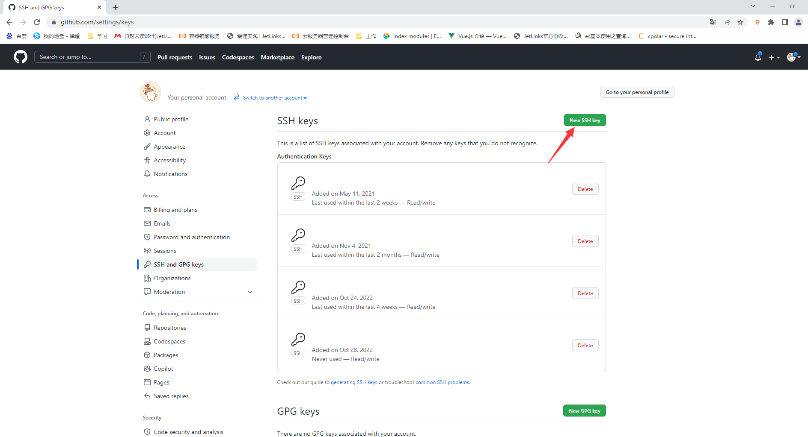
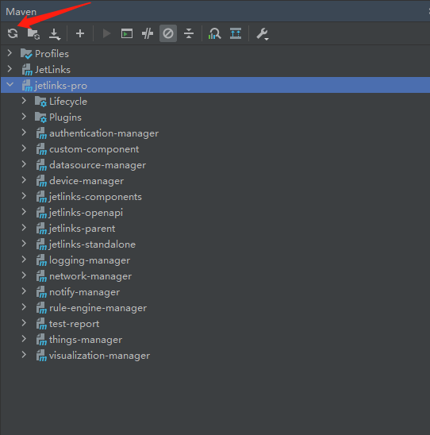
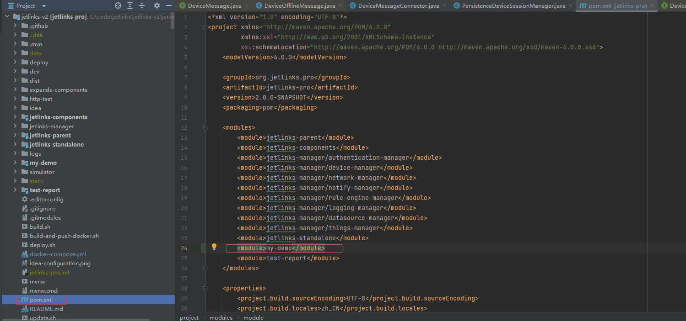
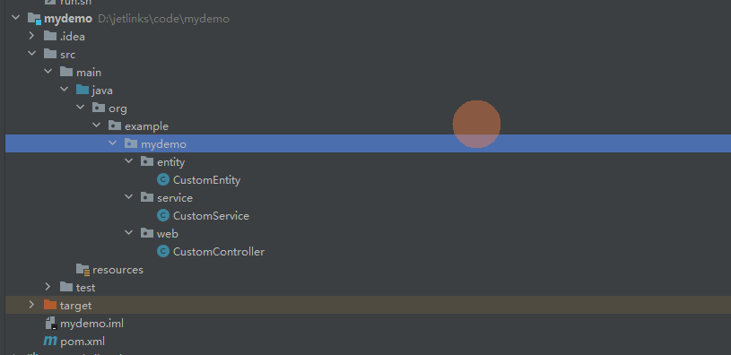
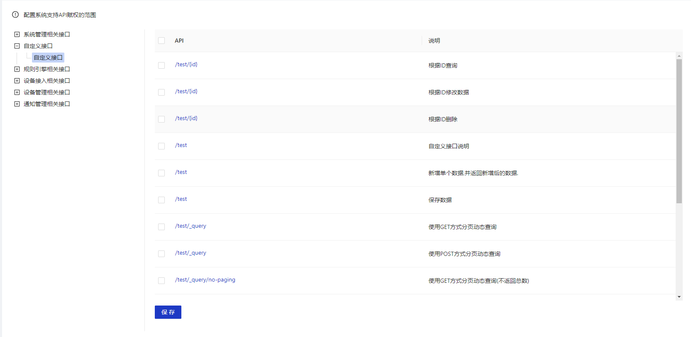

# 平台开发指导手册

## 常见开发问题

- <a target='_self' href='/dev-guide/code-guide.html#%E6%BA%90%E7%A0%81%E6%8B%89%E5%8F%96%E5%8F%8A%E5%AD%90%E6%A8%A1%E5%9D%97%E6%9B%B4%E6%96%B0%E6%8C%87%E5%8D%97'>
   如何拉取源码及更新子模块？</a>
- <a target='_self' href='/dev-guide/code-guide.html#%E5%9C%A8jetlinks%E4%B8%8A%E6%9E%84%E5%BB%BA%E8%87%AA%E5%B7%B1%E7%9A%84%E4%B8%9A%E5%8A%A1%E5%8A%9F%E8%83%BD'>
   在JetLinks上构建自己的业务功能？</a>
- <a target='_self' href='/dev-guide/code-guide.html#%E7%9B%91%E5%90%AC%E5%AE%9E%E4%BD%93%E5%8F%98%E5%8C%96%E5%81%9A%E4%B8%9A%E5%8A%A1'>
   实体变更后如何触发自己的业务流程？</a>
- <a target='_self' href='/dev-guide/code-guide.html#%E4%BD%BF%E7%94%A8%E6%B6%88%E6%81%AF%E6%80%BB%E7%BA%BF'>
   如何获取消息总线内的数据？</a>
- <a target='_self' href='/dev-guide/code-guide.html#%E6%B7%BB%E5%8A%A0%E8%87%AA%E5%AE%9A%E4%B9%89%E5%AD%98%E5%82%A8%E7%AD%96%E7%95%A5'>
  如何添加自定义存储策略？</a>
- <a target='_self' href='/dev-guide/code-guide.html#%E4%B8%BB%E5%8A%A8%E4%BB%8E%E7%AC%AC%E4%B8%89%E6%96%B9%E5%B9%B3%E5%8F%B0%E3%80%81%E8%AE%BE%E5%A4%87%E8%8E%B7%E5%8F%96%E6%95%B0%E6%8D%AE'>
   主动从设备获取属性、事件如何操作？</a>
- <a target='_self' href='/dev-guide/code-guide.html#%E7%9F%AD%E8%BF%9E%E6%8E%A5%E3%80%81%E4%BD%8E%E5%8A%9F%E8%80%97%E7%B1%BB%E8%AE%BE%E5%A4%87%E6%8E%A5%E5%85%A5%E5%B9%B3%E5%8F%B0'>
   短连接接入平台 </a>
- <a target='_self' href='/dev-guide/code-guide.html#%E8%AE%BE%E5%A4%87%E7%9B%B8%E5%85%B3%E6%95%B0%E6%8D%AE%E6%8E%A8%E9%80%81%E5%88%B0%E6%B6%88%E6%81%AF%E4%B8%AD%E9%97%B4%E4%BB%B6'>
   设备数据推送到消息中间件 </a>
- <a target='_self' href='/dev-guide/code-guide.html#%E7%AC%AC%E4%B8%89%E6%96%B9%E5%B9%B3%E5%8F%B0%E8%AF%B7%E6%B1%82jetlinks%E6%9C%8D%E5%8A%A1%E6%8E%A5%E5%8F%A3'>
   第三方平台请求JetLinks服务接口</a>
- <a target='_self' href='/dev-guide/code-guide.html#%E8%87%AA%E5%AE%9A%E4%B9%89sql%E6%9D%A1%E4%BB%B6%E6%9E%84%E9%80%A0%E5%99%A8'>
  自定义SQL条件构造器</a>
- <a target='_self' href=''>
  如何在协议包里面使用Redis？</a>
- <a target='_self' href=''>
  如何在协议包里面使用平台的业务方法？</a>

### 源码拉取及子模块更新指南

#### 应用场景

<div class='explanation primary'>
  <p class='explanation-title-warp'>
    <span class='iconfont icon-bangzhu explanation-icon'></span>
    <span class='explanation-title font-weight'>说明</span>
  </p>

  <p>1. 该指南提供首次拉取代码的用户配置SSH Key操作步骤，以及拉取代码后如何更新子模块的代码。</p>
  <p>2. 将更新后的代码提交到自己的仓库内。</p>
  <p>3. 如何更新源仓库代码并同步至自己的仓库内。</p>

</div>

#### 操作步骤

##### 配置SSH Key

1. 在电脑的空闲磁盘上创建目录，并且安装Git客户端程序。

安装Git客户端程序不在此处进行详述，可自行百度搜索安装Git。


<div class='explanation warning'>
  <p class='explanation-title-warp'>
    <span class='iconfont icon-bangzhu explanation-icon'></span>
    <span class='explanation-title font-weight'>问题1</span>
  </p>
  <p>目录名称应以英文命名，不要使用中文进行命名！</p>
  <p>使用中文命名可能会导致文件上传时，查找中文目录名称转义失败，抛出无法加载协议的异常。</p>

</div>


2. 登录Github，进入个人中心->`Settings`->选择`SSH and GPG keys`
   


3. 创建SSH key


在第一步新建的目录内，右键空白处弹出菜单`git bash here`，在弹出的shell控制台内执行下方命令：

该命令需要修改邮箱地址为您自己的邮箱地址。
```shell
$ ssh-keygen -t ed25519 -C "your_email@example.com"
```

示例如下:
```shell
$ ssh-keygen -t ed25519 -C "445990772@qq.com"
Generating public/private ed25519 key pair.
#回车
Enter file in which to save the key (/c/Users/LJ/.ssh/id_ed25519): 
#回车 
Enter passphrase (empty for no passphrase):
#回车
Enter same passphrase again:
# 提示生成了公钥和身份信息
Your identification has been saved in id_ed25519
Your public key has been saved in id_ed25519.pub
The key fingerprint is:
SHA256:IBctEwVoRajdZLE29buxRlpxPDW5E4z453215tgUqcTQIrUrs 445990772@qq.com
The key's randomart image is:
+--[ED25519 256]--+
|     =O*+o.+.=o. |
|    +.==.o+o+.*. |
|   +o+Oo..o.+. + |
|  . .=.=  .+ .+  |
|      E S =    . |
|         + +     |
|        . +      |
|         .       |
|                 |
|                 |
|                 |
+----[SHA256]-----+

```

<div class='explanation info'>
  <p class='explanation-title-warp'> 
    <span class='iconfont icon-tishi explanation-icon'></span>
    <span class='explanation-title font-weight'>提示</span>
  </p>
<p>注意: 如果您使用的遗留系统不支持 Ed25519算法，请使用:</p>

```shell

$ ssh-keygen -t rsa -b 4096 -C "your_email@example.com"

```

</div>


4. 将生成的ssh key添加至github内。

创建完成后使用下方命令复制公钥内容，

```shell
$ clip < ~/.ssh/id_ed25519.pub

```

<div class='explanation info'>
  <p class='explanation-title-warp'> 
    <span class='iconfont icon-tishi explanation-icon'></span>
    <span class='explanation-title font-weight'>提示</span>
  </p>
<p>如果clip命令不起作用，您可以找到隐藏的.ssh 文件夹，隐藏的.ssh 文件夹一般在<b class='explanation-title font-weight'>C:\Users\{当前设备名称}</b>目录下，
找到该目录下的<b class='explanation-title font-weight'>.pub</b>文件，复制该内容粘贴至github</p>

</div>


5. 拉取代码

进入第一步创建的文件夹内执行拉取代码及子模块

- 拉取`jetlinks-pro`
```shell
 $ git clone -b master --recurse-submodules git@github.com:jetlinks-v2/jetlinks-pro.git
```

- 拉取`jetlinks-cloud`
```shell
 $ git clone -b master --recurse-submodules git@github.com:jetlinks-v2/jetlinks-cloud.git
```
6. 更新基础子模块

<div class='explanation info'>
  <p class='explanation-title-warp'> 
    <span class='iconfont icon-tishi explanation-icon'></span>
    <span class='explanation-title font-weight'>提示</span>
  </p>
<p>JetLinks物联网平台只包含基础模块，扩展模块添加请参考第7步，未购买扩展模块可以跳过第7步。</p>
<p>非首次拉取代码也可以使用下方命令更新全部子模块，但更新过后仍需执行<span class='explanation-title font-weight'>reimport</span>。</p>
</div>

```shell
$ git pull && git submodule init && git submodule update && git submodule foreach git checkout master && git submodule foreach git pull origin master
```

7. 首次更新添加JetLinks扩展子模块

执行下方命令添加子模块

```shell
$ git submodule add --force [git仓库地址] [下载文件路径]
```

示例命令:
```shell
$ git submodule add --force git@github.com:jetlinks-v2/jetlinks-ctwing.git expands-components/jetlinks-ctwing
```

其余模块同理。

<div class='explanation info'>
  <p class='explanation-title-warp'> 
    <span class='iconfont icon-tishi explanation-icon'></span>
    <span class='explanation-title font-weight'>提示</span>
  </p>
<p>当您不知道仓库地址填什么的情况下，进入jetlinks-v2仓库内进行搜索模块名称，扩展模块相关信息查看<a target="_blank" href="/install-deployment/enterprise-version-start.html#添加扩展模块仓库">扩展模块列表</a></p>
</div>


[//]: # (移除子模块：git rm -f 【子模块本地存储目录】)

8. 代码拉取完毕后`reimport`



可以自行配置Maven多线程参数加快编译，具体线程数根据自己的电脑情况填写。


9. 扩展子模块加入Maven多模块项目

<div class='explanation info'>
  <p class='explanation-title-warp'> 
    <span class='iconfont icon-tishi explanation-icon'></span>
    <span class='explanation-title font-weight'>提示</span>
  </p>
<p>如无扩展模块，该步骤可跳过。</p>
</div>

在项目根目录下的`pom.xml`中的modules节点中添加模块

```xml
<modules>
    <module>expands-components/jetlinks-ctwing</module>
</modules>
```
- jetlinks-pro添加子模块依赖
  
在启动模块(jetlinks-standalone/pom.xml)中引入依赖
```xml
<dependency>
    <groupId>org.jetlinks.pro</groupId>
    <artifactId>jetlinks-ctwing</artifactId>
    <version>${project.version}</version>
</dependency>

```

- jetlinks-cloud添加子模块依赖

在启动模块(iot-service/pom.xml)中引入依赖
```xml
<dependency>
    <groupId>org.jetlinks.pro</groupId>
    <artifactId>jetlinks-ctwing</artifactId>
    <version>${project.version}</version>
</dependency>

```
其余模块同理。

10. 提交代码至自建仓库

```shell
$  git remote add gitee "git@gitee.com:/jetlinks-v2/$(echo ${PWD##*/}).git"
$  git submodule foreach 'git remote add gitee "git@gitee.com:/jetlinks-v2/$(echo ${PWD##*/}).git"'
$  git push gitee master
$  git submodule foreach git push gitee master 
```

11. 更新源仓库代码并同步自建仓库

查看远程仓库信息
```shell
$  git remote -v
# gitee 是上一步remote add声明的自建仓库名
gitee   git@gitee.com:/jetlinks-v2/jetlinks-v2.git (fetch)
gitee   git@gitee.com:/jetlinks-v2/jetlinks-v2.git (push)
#origin 一般是源原仓库
origin  git@github.com:jetlinks-v2/jetlinks-pro.git (fetch)
origin  git@github.com:jetlinks-v2/jetlinks-pro.git (push)

```

执行完更新子模块命令后执行下方命令同步至自建仓库

```shell
# gitee代表推送至自建仓库名为gitee的远程仓库， master为分支名
$ git push gitee master

```

#### 常见问题

<div class='explanation warning'>
  <p class='explanation-title-warp'>
    <span class='iconfont icon-bangzhu explanation-icon'></span>
    <span class='explanation-title font-weight'>问题1</span>
  </p>

  <p>Q：配置完SSH Key如果仍提示需要输入git@github.com‘s password，且尝试了所有密码均提示:Permission denied, please try again。</p>
  <p>A：Github官网给出的说法是：防火墙拒绝完全允许SSH连接。如果不能使用带有凭据缓存的HTTPS克隆，可以尝试使用通过HTTPS端口建立的SSH连接进行克隆。
大多数防火墙规则应该允许这样做，但是代理服务器可能会干扰。可以参照下方步骤解决该问题。</p>
  
</div>

1. 要测试是否可以通过 HTTPS 端口使用 SSH，请运行以下 SSH 命令。

```shell
$ ssh -T -p 443 git@ssh.github.com
> Hi USERNAME! You've successfully authenticated, but GitHub does not
> provide shell access.
```

2. 在`~/.ssh`目录下编辑或创建`config`文件，并添加下方内容。

`~/.ssh`目录在第四步的提示内有说明。

```shell
Host github.com
Hostname ssh.github.com
Port 443
User git
```

3. 在切换到端口443后第一次与 GitHub 交互时，您可能会收到一条警告消息。

此处在配置公钥过后选择`yes`即可
```shell
> The authenticity of host '[ssh.github.com]:443 ([140.82.112.36]:443)' can't be established.
> ED25519 key fingerprint is SHA256:+DiY3wvvV6TuJJhbpZisF/zLDA0zPMSvHdkr4UvCOqU.
> This host key is known by the following other names/addresses:
>     ~/.ssh/known_hosts:32: github.com
> Are you sure you want to continue connecting (yes/no/[fingerprint])?
```

4. 配置好上述内容后，执行拉取命令即可。


<div class='explanation warning'>
  <p class='explanation-title-warp'>
    <span class='iconfont icon-bangzhu explanation-icon'></span>
    <span class='explanation-title font-weight'>问题2</span>
  </p>

  <li>Q：拉取代码的时候出现 <b class='explanation-title font-weight'> Please make sure you have the correct access rights and the repository exists</b>？</li>
  <li>A：确认是否购买该模块或者账户未被添加进仓库，请联系商务。</li>

</div>

<div class='explanation warning'>
  <p class='explanation-title-warp'>
    <span class='iconfont icon-bangzhu explanation-icon'></span>
    <span class='explanation-title font-weight'>问题3</span>
  </p>

  <p>Q：Maven项目启动过程中出现jar包引入失败。</p>
  <p>A：一般是由于自行设置了配置文件的mirrors镜像加速地址，注释或者使用纯净的<b class='explanation-title font-weight'>settings.xml</b>配置文件。</p>

</div>


<div class='explanation error'>
  <p class='explanation-title-warp'>
    <span class='iconfont icon-jinggao explanation-icon'></span>
    <span class='explanation-title font-weight'>危险</span>
  </p>

若设备限制数量不能满足您的业务需求，请
<a>提交工单</a>
说明您的需求。

</div>

<div class='explanation info'>
  <p class='explanation-title-warp'> 
    <span class='iconfont icon-tishi explanation-icon'></span>
    <span class='explanation-title font-weight'>提示</span>
  </p>
若设备限制数量不能满足您的业务需求，请
<a>提交工单</a>
说明您的需求。
</div>

### 在JetLinks上构建自己的业务功能

#### 应用场景

<div class='explanation primary'>
  <p class='explanation-title-warp'>
    <span class='iconfont icon-bangzhu explanation-icon'></span>
    <span class='explanation-title font-weight'>说明</span>
  </p>

   <p>当您想使用JetLinks平台做自己的业务，又不想将项目独立时，可以选择基于JetLinks进行开发。</p>

</div>

#### 操作步骤

##### 创建新的Maven项目

1. 创建自定义Maven项目


2. 自定义的Maven项目与jetlinks-pro同级（低版本IDEA窗口下，新的Maven模块后显示root字样）


##### 将自定义模块加入JetLinks平台

1. 在jetlinks-pro目录根路径下的`pom.xml`文件内声明自定义项目加入多模块管理


示例代码:

```xml

<modules>
    <module>jetlinks-parent</module>
    <module>jetlinks-components</module>
    <module>jetlinks-manager/authentication-manager</module>
    <module>jetlinks-manager/device-manager</module>
    <module>jetlinks-manager/network-manager</module>
    <module>jetlinks-manager/notify-manager</module>
    <module>jetlinks-manager/rule-engine-manager</module>
    <module>jetlinks-manager/logging-manager</module>
    <module>jetlinks-manager/datasource-manager</module>
    <module>jetlinks-manager/things-manager</module>
    <module>jetlinks-standalone</module>
    <!--  声明加入自定义模块名称-->
    <module>my-demo</module>
    <module>test-report</module>
</modules>
```

2. 在jetlinks-standalone目录路径下的`pom.xml`文件内`profiles`节点中声明以下代码


示例代码:

```xml
<!-- 使用profile动态加入模块-->
<profile>
    <id>demo</id>
    <dependencies>
        <dependency>
            <groupId>com.example</groupId>
            <artifactId>my-demo</artifactId>
            <version>${project.version}</version>
        </dependency>
    </dependencies>
</profile>
```

3. reimport项目

以上两步操作完成之后需要使用Maven窗口的`reimport`按钮，重新引入模块依赖，此时模块被加入jetlinks-pro项目下


4. 加入子模块声明后，修改自定义项目pom文件内容

示例代码：

```xml
<?xml version="1.0" encoding="UTF-8"?>
<project xmlns="http://maven.apache.org/POM/4.0.0" xmlns:xsi="http://www.w3.org/2001/XMLSchema-instance"
         xsi:schemaLocation="http://maven.apache.org/POM/4.0.0 https://maven.apache.org/xsd/maven-4.0.0.xsd">
    <modelVersion>4.0.0</modelVersion>
    <!-- 声明父模块 -->
    <parent>
        <groupId>org.jetlinks.pro</groupId>
        <artifactId>jetlinks-parent</artifactId>
        <version>2.0.0-SNAPSHOT</version>
        <relativePath>../jetlinks-parent/pom.xml</relativePath>
    </parent>

    <groupId>com.example</groupId>
    <artifactId>my-demo</artifactId>

    <dependencies>
        <!-- 引入hsweb依赖，该依赖主要用于业务系统crud功能模块   -->
        <dependency>
            <groupId>org.hswebframework.web</groupId>
            <artifactId>hsweb-starter</artifactId>
            <version>${hsweb.framework.version}</version>
        </dependency>

        <dependency>
            <groupId>org.hswebframework</groupId>
            <artifactId>hsweb-easy-orm-rdb</artifactId>
        </dependency>
    </dependencies>
    <build>
        <plugins>
            <plugin>
                <groupId>org.apache.maven.plugins</groupId>
                <artifactId>maven-resources-plugin</artifactId>
                <configuration>
                    <nonFilteredFileExtensions>
                        <nonFilteredFileExtension>zip</nonFilteredFileExtension>
                        <nonFilteredFileExtension>jar</nonFilteredFileExtension>
                    </nonFilteredFileExtensions>
                </configuration>
            </plugin>
        </plugins>
    </build>

</project>


```

<div class='explanation info'>
  <p class='explanation-title-warp'> 
    <span class='iconfont icon-tishi explanation-icon'></span>
    <span class='explanation-title font-weight'>提示</span>
  </p>
<p>Q：如何确认模块被引入？</p>
<p>A：可以使用Maven工具或者命令打包时出现自定义模块的名称说明模块被引入。</p>

```text

[INFO] Reactor Summary:
[INFO] 
[INFO] jetlinks-parent .................................... SUCCESS [  1.346 s]
[INFO] jetlinks-components ................................ SUCCESS [  0.084 s]
[INFO] test-component ..................................... SUCCESS [  9.813 s]
[INFO] common-component ................................... SUCCESS [ 13.924 s]
[INFO] timeseries-component ............................... SUCCESS [  5.407 s]
[INFO] dashboard-component ................................ SUCCESS [  8.283 s]
[INFO] network-component .................................. SUCCESS [  0.108 s]
[INFO] network-core ....................................... SUCCESS [ 10.744 s]
[INFO] gateway-component .................................. SUCCESS [ 11.436 s]
[INFO] assets-component ................................... SUCCESS [ 12.147 s]
[INFO] geo-component ...................................... SUCCESS [  7.302 s]
[INFO] api-component ...................................... SUCCESS [  8.520 s]
[INFO] configure-component ................................ SUCCESS [ 11.337 s]
[INFO] script-component ................................... SUCCESS [  8.600 s]
[INFO] streaming-component ................................ SUCCESS [  3.830 s]
[INFO] things-component ................................... SUCCESS [ 21.910 s]
[INFO] elasticsearch-component ............................ SUCCESS [ 13.424 s]
[INFO] relation-component ................................. SUCCESS [  9.770 s]
[INFO] rule-engine-component .............................. SUCCESS [  8.008 s]
[INFO] notify-component ................................... SUCCESS [  0.102 s]
[INFO] notify-core ........................................ SUCCESS [  8.918 s]
[INFO] notify-sms ......................................... SUCCESS [  8.037 s]
[INFO] io-component ....................................... SUCCESS [  8.139 s]
[INFO] notify-email ....................................... SUCCESS [  8.770 s]
[INFO] notify-wechat ...................................... SUCCESS [  9.273 s]
[INFO] notify-dingtalk .................................... SUCCESS [  9.235 s]
[INFO] notify-voice ....................................... SUCCESS [  7.400 s]
[INFO] notify-webhook ..................................... SUCCESS [  7.467 s]
[INFO] coap-component ..................................... SUCCESS [ 15.998 s]
[INFO] mqtt-component ..................................... SUCCESS [ 12.371 s]
[INFO] http-component ..................................... SUCCESS [ 13.102 s]
[INFO] tcp-component ...................................... SUCCESS [ 17.454 s]
[INFO] websocket-component ................................ SUCCESS [ 17.322 s]
[INFO] udp-component ...................................... SUCCESS [ 16.092 s]
[INFO] simulator-component ................................ SUCCESS [ 10.106 s]
[INFO] protocol-component ................................. SUCCESS [ 10.202 s]
[INFO] datasource-component ............................... SUCCESS [ 10.831 s]
[INFO] messaging-component ................................ SUCCESS [  0.102 s]
[INFO] rabbitmq-component ................................. SUCCESS [  7.784 s]
[INFO] kafka-component .................................... SUCCESS [  7.923 s]
[INFO] logging-component .................................. SUCCESS [  5.452 s]
[INFO] tenant-component ................................... SUCCESS [  8.594 s]
[INFO] influxdb-component ................................. SUCCESS [  9.655 s]
[INFO] tdengine-component ................................. SUCCESS [ 10.927 s]
[INFO] clickhouse-component ............................... SUCCESS [ 10.780 s]
[INFO] cassandra-component ................................ SUCCESS [ 11.147 s]
[INFO] function-component ................................. SUCCESS [  0.107 s]
[INFO] function-api ....................................... SUCCESS [  3.569 s]
[INFO] function-manager ................................... SUCCESS [ 14.735 s]
[INFO] collector-component ................................ SUCCESS [ 12.584 s]
[INFO] application-component .............................. SUCCESS [ 14.226 s]
[INFO] authentication-manager ............................. SUCCESS [ 18.356 s]
[INFO] device-manager ..................................... SUCCESS [ 15.212 s]
[INFO] network-manager .................................... SUCCESS [ 13.248 s]
[INFO] notify-manager ..................................... SUCCESS [  9.168 s]
[INFO] rule-engine-manager ................................ SUCCESS [ 11.895 s]
[INFO] logging-manager .................................... SUCCESS [  7.648 s]
[INFO] datasource-manager ................................. SUCCESS [  8.070 s]
[INFO] things-manager ..................................... SUCCESS [  9.319 s]
[INFO] jetlinks-ctwing .................................... SUCCESS [  6.386 s]
[INFO] jetlinks-onenet .................................... SUCCESS [  6.444 s]
[INFO] jetlinks-opc-ua .................................... SUCCESS [ 11.776 s]
[INFO] jetlinks-aliyun-bridge-gateway ..................... SUCCESS [  8.857 s]
[INFO] jetlinks-dueros .................................... SUCCESS [  7.087 s]
[INFO] jetlinks-media ..................................... SUCCESS [ 13.981 s]
[INFO] network-card-manager ............................... SUCCESS [  9.961 s]
[INFO] jetlinks-modbus .................................... SUCCESS [ 12.166 s]
[INFO] jetlinks-standalone ................................ SUCCESS [  9.283 s]
//Maven的编译或打包信息内出现自定义项目的名称表明，该项目已被加入jetlinks-pro的多模块管理内
[INFO] my-demo ............................................ SUCCESS [  1.987 s]
[INFO] test-report ........................................ SUCCESS [  9.504 s]
[INFO] jetlinks-pro ....................................... SUCCESS [  0.953 s]
[INFO] ------------------------------------------------------------------------
[INFO] BUILD SUCCESS
[INFO] ------------------------------------------------------------------------
[INFO] Total time: 02:48 min (Wall Clock)
[INFO] Finished at: 2022-11-29T14:05:27+08:00
[INFO] Final Memory: 451M/3453M
[INFO] ------------------------------------------------------------------------

Process finished with exit code 0
```

</div>

4. 添加简单的Controller类、实体等

简单的业务系统目录结构如下图：



请求入口Controller：

```java
package com.example.mydemo.web;

import com.example.mydemo.entity.TestEntity;
import com.example.mydemo.service.TestService;
import io.swagger.v3.oas.annotations.Operation;
import io.swagger.v3.oas.annotations.tags.Tag;
import lombok.AllArgsConstructor;
import lombok.Getter;
import org.hswebframework.web.authorization.annotation.Authorize;
import org.hswebframework.web.authorization.annotation.QueryAction;
import org.hswebframework.web.authorization.annotation.Resource;
import org.hswebframework.web.crud.web.reactive.ReactiveServiceCrudController;
import org.springframework.web.bind.annotation.GetMapping;
import org.springframework.web.bind.annotation.RequestMapping;
import org.springframework.web.bind.annotation.RestController;
import reactor.core.publisher.Flux;

@Getter
@RestController
@AllArgsConstructor
@RequestMapping("/test")
@Resource(id = "test", name = "自定义接口")
@Tag(name = "自定义接口")
public class TestController implements ReactiveServiceCrudController<TestEntity, String> {

    private final TestService service;

    @GetMapping
    @QueryAction
    @Operation(summary = "自定义接口说明")
    public Flux<Void> getAll() {
        return Flux.empty();
    }

}

```

实体Entity类：

```java
package com.example.mydemo.entity;

import io.swagger.v3.oas.annotations.media.Schema;
import lombok.Getter;
import lombok.Setter;
import org.hswebframework.ezorm.rdb.mapping.annotation.Comment;
import org.hswebframework.ezorm.rdb.mapping.annotation.DefaultValue;
import org.hswebframework.web.api.crud.entity.GenericEntity;
import org.hswebframework.web.api.crud.entity.RecordCreationEntity;
import org.hswebframework.web.api.crud.entity.RecordModifierEntity;
import org.hswebframework.web.crud.generator.Generators;

import javax.persistence.Column;
import javax.persistence.Index;
import javax.persistence.Table;

@Table(name = "dev_my_demo_test", indexes = {
        @Index(name = "idx_demo_device_id_index", columnList = "type,device_id")
})
@Comment("自定义表")
@Getter
@Setter
public class TestEntity extends GenericEntity<String> implements RecordCreationEntity, RecordModifierEntity {

    @Column(name = "device_id")
    @Comment("设备id")
    private String deviceId;

    @Column
    @Comment("类型")
    private Integer type;

    @Column(name = "creator_id", updatable = false)
    @Schema(
            description = "创建者ID(只读)"
            , accessMode = Schema.AccessMode.READ_ONLY
    )
    private String creatorId;

    @Column(name = "creator_name", updatable = false)
    @Schema(
            description = "创建者名称(只读)"
            , accessMode = Schema.AccessMode.READ_ONLY
    )
    private String creatorName;

    @Column(name = "create_time", updatable = false)
    @DefaultValue(generator = Generators.CURRENT_TIME)
    @Schema(
            description = "创建时间(只读)"
            , accessMode = Schema.AccessMode.READ_ONLY
    )
    private Long createTime;

    @Column
    @DefaultValue(generator = Generators.CURRENT_TIME)
    @Schema(
            description = "修改时间"
            , accessMode = Schema.AccessMode.READ_ONLY
    )
    private Long modifyTime;

    @Column(length = 64)
    @Schema(
            description = "修改人ID"
            , accessMode = Schema.AccessMode.READ_ONLY
    )
    private String modifierId;

    @Column(length = 64)
    @Schema(
            description = "修改人名称"
            , accessMode = Schema.AccessMode.READ_ONLY
    )
    private String modifierName;
}


```

业务层Service：

```java
package com.example.mydemo.service;

import com.example.mydemo.entity.TestEntity;
import org.hswebframework.web.crud.service.GenericReactiveCrudService;
import org.springframework.stereotype.Service;

@Service
public class TestService extends GenericReactiveCrudService<TestEntity, String> {

}

```

5. 在jetlinks-pro的启动类上加入自定义项目的扫描路径

```java
//新增需要Spring扫描的包
@SpringBootApplication(scanBasePackages = {"org.jetlinks.pro", "com.example.mydemo"}, exclude = {
        DataSourceAutoConfiguration.class,
        KafkaAutoConfiguration.class,
        RabbitAutoConfiguration.class,
        ElasticsearchRestClientAutoConfiguration.class,
        ElasticsearchDataAutoConfiguration.class,
        MongoReactiveAutoConfiguration.class,
})
@EnableCaching
//新增实体扫描包
@EnableEasyormRepository({"org.jetlinks.pro.**.entity", "com.example.mydemo.entity"})
@EnableAopAuthorize
@EnableAccessLogger
public class JetLinksApplication {

    public static void main(String[] args) {
        SpringApplication.run(JetLinksApplication.class, args);
    }

    @Component
    @Slf4j
    public static class AdminAllAccess {

        @EventListener
        public void handleAuthEvent(AuthorizingHandleBeforeEvent e) {
            if (e.getContext().getAuthentication().getUser().getUsername().equals("admin")) {
                e.setAllow(true);
            }
        }

        @EventListener
        public void handleAccessLogger(AccessLoggerAfterEvent event) {

            log.info("{}=>{} {}-{}", event.getLogger().getIp(), event.getLogger().getUrl(), event.getLogger().getDescribe(), event.getLogger().getAction());

        }
    }

}

```

#### 核心类说明

| 类名                            | 说明                                              |
|-------------------------------|-------------------------------------------------|
| `ReactiveServiceCrudController<E, K>` | 实体CRUD操作的抽象接口，该接口继承了CRUD相关操作的接口，这些接口内封装了默认的实现方法 |
| `GenericEntity<PK>`             | 实体类需要继承该类，需要声明实体id数据类型                          |
| `GenericReactiveCrudService<TestEntity, String>`    | 业务层实体需要继承该类，该类有默认的crud方法的实现                     |

#### 常见问题

<div class='explanation warning'>
  <p class='explanation-title-warp'>
    <span class='iconfont icon-bangzhu explanation-icon'></span>
    <span class='explanation-title font-weight'>问题1</span>
  </p>

<p>Q：如何将自定义的接口加入swagger扫描并在API配置中显示出来？</p>
<p>A：在平台的<a>application.yml</a>文件内swagger下声明该项目扫描路径。</p>

```yaml
springdoc:
  swagger-ui:
    path: /swagger-ui.html
  group-configs:
    - group: 设备接入相关接口
      packages-to-scan:
        - org.jetlinks.pro.network.manager.web
        - org.jetlinks.pro.device.web
      paths-to-match:
        - /gateway/**
        - /network/**
        - /protocol/**
    - group: 系统管理相关接口
      packages-to-scan:
        - org.jetlinks.pro.auth
        - org.hswebframework.web.system.authorization.defaults.webflux
        - org.hswebframework.web.file
        - org.hswebframework.web.authorization.basic.web
        - org.jetlinks.pro.openapi.manager.web
        - org.jetlinks.pro.logging.controller
        - org.jetlinks.pro.tenant.web
    - group: 自定义接口
      packages-to-scan:
        - com.example.mydemo.web
```

效果图：


</div>


<div class='explanation warning'>
  <p class='explanation-title-warp'>
    <span class='iconfont icon-bangzhu explanation-icon'></span>
    <span class='explanation-title font-weight'>问题2</span>
  </p>

  <p>Q：自定义的接口不想被平台鉴权拦截？</p>
  <p>A：在类上或者方法上声明<span class="explanation-title font-weight">@Authorize(ignore = true)</span>。</p>
  <p>类上注解表明该类所有方法均不受鉴权拦截，方法上则仅限当前被注解的方法不受鉴权拦截。</p>


</div>

<div class='explanation error'>
  <p class='explanation-title-warp'>
    <span class='iconfont icon-jinggao explanation-icon'></span>
    <span class='explanation-title font-weight'>危险</span>
  </p>

  <p><li>响应式返回Mono&lt;Object&gt;或者Flux&lt;Object&gt;会报错，必须指出明确的返回类型。 </li></p>
  <p><li>响应式使用@RequestBody注解的参数必须使用流包裹。</li></p>
  <p><li>JetLinks从上至下使用全部使用响应式，基于JetLinks平台构建自己的业务代码时也请使用响应式。</li></p>
  <p><li>如果不会写响应式，建议最好独立项目不要与JetLinks混合使用非响应式，可能会导致项目出现阻塞。</li></p>

</div>

### 监听实体变化做业务

#### 应用场景

<div class='explanation primary'>
  <p class='explanation-title-warp'>
    <span class='iconfont icon-bangzhu explanation-icon'></span>
    <span class='explanation-title font-weight'>说明</span>
  </p>

  <li>产品在正常状态时，按钮显示为禁用；产品在启用状态时，按钮显示为启用。</li>
  <li>产品禁用后，设备无法再接入。但不影响已经接入的设备。</li>

</div>

```java
//此处将具体代码实现放入
//1.对关键部分代码进行步骤梳理及注释说明
//2.对核心部分代码用醒目的文字进行说明，说明内容包括但不限于设计思想、设计模式等
```

#### 核心类说明

| 类名 | 方法名 | 返回值 | 说明 |
|----------------| -------------------------- |--------|---------------------------|
| DeviceOperator | getSelfConfig() |`Mono<Value>` | 从缓存中获取设备自身的配置，如果不存在则返回`Mono.empty()`|

#### 常见问题

*对开发过程中出现的问题进行总结*


<div class='explanation warning'>
  <p class='explanation-title-warp'>
    <span class='iconfont icon-bangzhu explanation-icon'></span>
    <span class='explanation-title font-weight'>问题1</span>
  </p>

  <li>产品在正常状态时，按钮显示为禁用；产品在启用状态时，按钮显示为启用。</li>
  <li>产品禁用后，设备无法再接入。但不影响已经接入的设备。</li>

</div>


<div class='explanation warning'>
  <p class='explanation-title-warp'>
    <span class='iconfont icon-bangzhu explanation-icon'></span>
    <span class='explanation-title font-weight'>问题2</span>
  </p>

  <li>产品在正常状态时，按钮显示为禁用；产品在启用状态时，按钮显示为启用。</li>
  <li>产品禁用后，设备无法再接入。但不影响已经接入的设备。</li>

</div>

<div class='explanation error'>
  <p class='explanation-title-warp'>
    <span class='iconfont icon-jinggao explanation-icon'></span>
    <span class='explanation-title font-weight'>危险</span>
  </p>

若设备限制数量不能满足您的业务需求，请
<a>提交工单</a>
说明您的需求。

</div>

<div class='explanation info'>
  <p class='explanation-title-warp'> 
    <span class='iconfont icon-tishi explanation-icon'></span>
    <span class='explanation-title font-weight'>提示</span>
  </p>
若设备限制数量不能满足您的业务需求，请
<a>提交工单</a>
说明您的需求。
</div>

### 使用消息总线

#### 应用场景

EventBus是一个基于发布者/订阅者模式的事件总线框架。发布者/订阅者模式，也就是观察者模式，其定义了对象之间的一种一对多的依赖关系，
当事件发布时，平台的其他模块，例如：产品/设备、规则引擎、设备告警等模块都可以同时订阅到该事件，能够有效地降低消息发布者和订阅者之间的耦合度。

#### 核心接口说明

核心接口org.jetlinks.core.event.EventBus

| 方法名 | 返回值                  | 参数值                                      | 说明  |
|------- |----------------------|------------------------------------------|------------|
|subscribe() | Flux\<TopicPayload\> | `Subscription subscription`              |从事件总线中订阅事件|
|publish() | Mono\<Long\>         | `String topic, Publisher<T> event`       |推送消息流到事件总线 |

<div class='explanation primary'>
  <p class='explanation-title-warp'>
    <span class='iconfont icon-bangzhu explanation-icon'></span>
    <span class='explanation-title font-weight'>说明</span>
  </p>
 <li>订阅事件实例 </li>

```java

    public static Subscription of(String subscriber, String topic, Feature... features) {
        return Subscription
            .builder()
            //订阅者标识  
            .subscriberId(subscriber)
            //订阅主题   
            .topics(topic)
            //订阅特性   
            .features(features)
            .build();
    }
        
    public Flux<Message> subscribe(SubscribeRequest request) {
        return eventBus
            .subscribe(Subscription.of(
            "notifications-publisher",
            "/notifications/user/" + request.getAuthentication().getUser().getId() + "/*/*",
            Subscription.Feature.local, Subscription.Feature.broker
            ))
            .map(msg -> Message.success(request.getId(), msg.getTopic(), msg.bodyToJson(true)));
    }
```

 <li>核心参数Subscription </li>

| 字段名         | 类型                   | 是否必填 | 说明                    |
|-------------|----------------------|------|-----------------------|
| subscriber | String | 是    | 订阅者标识                 |
| topics   | String[]        | 是    | 订阅主题 |
| features   | Feature[]        | 是    | 订阅特性 |
| priority   | priority        | 否    | 优先级,值越小优先级越高,优先级高的订阅者会先收到消息 |

</div>

<div class='explanation info'>
  <p class='explanation-title-warp'> 
    <span class='iconfont icon-tishi explanation-icon'></span>
    <span class='explanation-title font-weight'>提示</span>
  </p>

通配符`**`表示匹配多层路径，`*`表示匹配单层路径。`不支持`前后匹配，如: `/device/id-*/message`。
发布和订阅均支持通配符，发布时使用通配符时则进行广播。

</div>

#### 常见问题

<div class='explanation warning'>
  <p class='explanation-title-warp'>
    <span class='iconfont icon-bangzhu explanation-icon'></span>
    <span class='explanation-title font-weight'>问题</span>
  </p>
  <li>哪些模块可以从事件总线中订阅事件</li>

| 模块名   |   类名            | Topic              | 订阅标识                    |
|-------|--------------------|--------------------|-------------------------|
| 流媒体服务 | ZLMMediaServer | /_sys/zlm/notify/* | ZLMedia-server-notify |
| 网络组件  | ClusterNetworkManager | /_sys/network/* /* | network-config-manager   |
| 规则引擎  | RuleEngineSubscriptionProvider | /rule-engine/**    | rule-engine   |
| 消息通知  | NotificationsPublishProvider | /notifications/user/**    | notifications-publisher   |
| 设备实例  | DeviceMessageSubscriptionProvider | /device/* /*/**    | network-config-manager   |
| 告警规则  | AlarmProvider | /alarm/**/record     | alarm   |

</div>

<div class='explanation warning'>
  <p class='explanation-title-warp'>
    <span class='iconfont icon-bangzhu explanation-icon'></span>
    <span class='explanation-title font-weight'>问题</span>
  </p>
 <li>如何实现共享订阅</li>
会根据传入的订阅特性判断是否为共享订阅，若是共享订阅则会先存到缓存中，后续再依次处理缓存中的共享订阅，在处理的过程中会
判断订阅消息是否是同一个订阅者的，若是同一个订阅者则只处理最早的那条订阅消息。

```java
private <T> Mono<Long> doPublish(String topic,
                                     T arg,
                                     Function4<String, T, List<SubscriptionInfo>, ContextView, Mono<Void>> handler,
                                     Predicate<SubscriptionInfo> predicate) {

        //共享订阅,只有一个订阅者能收到
        Map<String, List<SubscriptionInfo>> sharedMap = SHARED.get();
        //去重
        Set<Object> distinct = DISTINCT_HANDLERS.get();
        //订阅者信息
        Set<SubscriptionInfo> readyToPub = PUB_HANDLERS.get();
        Mono<Long> task;
        try {
            //从订阅表中查找topic
            root.findTopic(topic, predicate, sharedMap, distinct, readyToPub,
                           (_predicate, _sharedMap, _distinct, _readyToPub, subs) -> {
                               Set<SubscriptionInfo> subscriptions = subs.getSubscribers();
                               if (subscriptions.isEmpty()) {
                                   return;
                               }

                               for (SubscriptionInfo sub : subscriptions) {
                                   if (!_predicate.test(sub) || !_distinct.add(sub.handler)) {
                                       continue;
                                   }
                                   //共享订阅时,添加到缓存,最后再处理
                                   if (sub.hasFeature(Subscription.Feature.shared)) {
                                       _sharedMap
                                           .computeIfAbsent(sub.subscriber, ignore -> new ArrayList<>(8))
                                           .add(sub);
                                       continue;
                                   }
                                   _readyToPub.add(sub);
                               }
                           },
                           (_predicate, _sharedMap, _distinct, _readyToPub) -> {
                               if (_sharedMap.isEmpty()) {
                                   return;
                               }
                               //处理共享订阅
                               for (List<SubscriptionInfo> value : _sharedMap.values()) {
                                   if (value.isEmpty()) {
                                       continue;
                                   }
                                   SubscriptionInfo first = value.get(0);
                                   //只有一个订阅消息，则直接存入
                                   if (value.size() == 1) {
                                       _readyToPub.add(first);
                                       //有多个相同订阅者的订阅消息，则存入最先订阅的消息
                                   } else if (first.hasFeature(Subscription.Feature.sharedOldest)) {
                                       value.sort(SubscriptionInfo.comparatorByTime);
                                       _readyToPub.add(value.get(0));
                                       //其他情况则在订阅消息中随机取一个存入
                                   } else {
                                       _readyToPub.add(value.get(ThreadLocalRandom.current().nextInt(0, value.size())));
                                   }
                               }
                           });

            if (readyToPub.isEmpty()) {
                return Reactors.ALWAYS_ZERO_LONG;
            }

            int size = readyToPub.size();
            List<SubscriptionInfo> pub = new ArrayList<>(readyToPub);
            //排序
            pub.sort(SubscriptionInfo.comparatorPriority);

            task = Mono
                .deferContextual(ctx -> handler.apply(topic, arg, pub, ctx))
                .then(Mono.just((long) size));

        } finally {
            sharedMap.clear();
            distinct.clear();
            readyToPub.clear();
        }
        return task;
    }
```

</div>

### 添加自定义存储策略

#### 应用场景

<div class='explanation primary'>
  <p class='explanation-title-warp'>
    <span class='iconfont icon-bangzhu explanation-icon'></span>
    <span class='explanation-title font-weight'>说明</span>
  </p>

  <li>产品在正常状态时，按钮显示为禁用；产品在启用状态时，按钮显示为启用。</li>
  <li>产品禁用后，设备无法再接入。但不影响已经接入的设备。</li>

</div>

```java
//此处将具体代码实现放入
//1.对关键部分代码进行步骤梳理及注释说明
//2.对核心部分代码用醒目的文字进行说明，说明内容包括但不限于设计思想、设计模式等
```

#### 核心类说明

| 类名 | 方法名 | 返回值 | 说明 |
|----------------| -------------------------- |--------|---------------------------|-------------------|
| DeviceOperator | getSelfConfig() |`Mono<Value>` | 从缓存中获取设备自身的配置，如果不存在则返回`Mono.empty()`|

#### 常见问题

*对开发过程中出现的问题进行总结*

<div class='explanation warning'>
  <p class='explanation-title-warp'>
    <span class='iconfont icon-bangzhu explanation-icon'></span>
    <span class='explanation-title font-weight'>问题1</span>
  </p>

  <li>产品在正常状态时，按钮显示为禁用；产品在启用状态时，按钮显示为启用。</li>
  <li>产品禁用后，设备无法再接入。但不影响已经接入的设备。</li>

</div>


<div class='explanation warning'>
  <p class='explanation-title-warp'>
    <span class='iconfont icon-bangzhu explanation-icon'></span>
    <span class='explanation-title font-weight'>问题2</span>
  </p>

  <li>产品在正常状态时，按钮显示为禁用；产品在启用状态时，按钮显示为启用。</li>
  <li>产品禁用后，设备无法再接入。但不影响已经接入的设备。</li>

</div>

<div class='explanation error'>
  <p class='explanation-title-warp'>
    <span class='iconfont icon-jinggao explanation-icon'></span>
    <span class='explanation-title font-weight'>危险</span>
  </p>

若设备限制数量不能满足您的业务需求，请
<a>提交工单</a>
说明您的需求。

</div>

<div class='explanation info'>
  <p class='explanation-title-warp'> 
    <span class='iconfont icon-tishi explanation-icon'></span>
    <span class='explanation-title font-weight'>提示</span>
  </p>
若设备限制数量不能满足您的业务需求，请
<a>提交工单</a>
说明您的需求。
</div>

### 主动从第三方平台、设备获取数据

#### 应用场景

<div class='explanation primary'>
  <p class='explanation-title-warp'>
    <span class='iconfont icon-bangzhu explanation-icon'></span>
    <span class='explanation-title font-weight'>说明</span>
  </p>

  <li>产品在正常状态时，按钮显示为禁用；产品在启用状态时，按钮显示为启用。</li>
  <li>产品禁用后，设备无法再接入。但不影响已经接入的设备。</li>

</div>

```java
//此处将具体代码实现放入
//1.对关键部分代码进行步骤梳理及注释说明
//2.对核心部分代码用醒目的文字进行说明，说明内容包括但不限于设计思想、设计模式等
```

#### 核心类说明

| 类名 | 方法名 | 返回值 | 说明 |
|----------------| -------------------------- |--------|---------------------------|-------------------|
| DeviceOperator | getSelfConfig() |`Mono<Value>` | 从缓存中获取设备自身的配置，如果不存在则返回`Mono.empty()`|

#### 常见问题

*对开发过程中出现的问题进行总结*


<div class='explanation warning'>
  <p class='explanation-title-warp'>
    <span class='iconfont icon-bangzhu explanation-icon'></span>
    <span class='explanation-title font-weight'>问题1</span>
  </p>

  <li>产品在正常状态时，按钮显示为禁用；产品在启用状态时，按钮显示为启用。</li>
  <li>产品禁用后，设备无法再接入。但不影响已经接入的设备。</li>

</div>


<div class='explanation warning'>
  <p class='explanation-title-warp'>
    <span class='iconfont icon-bangzhu explanation-icon'></span>
    <span class='explanation-title font-weight'>问题2</span>
  </p>

  <li>产品在正常状态时，按钮显示为禁用；产品在启用状态时，按钮显示为启用。</li>
  <li>产品禁用后，设备无法再接入。但不影响已经接入的设备。</li>

</div>

<div class='explanation error'>
  <p class='explanation-title-warp'>
    <span class='iconfont icon-jinggao explanation-icon'></span>
    <span class='explanation-title font-weight'>危险</span>
  </p>

若设备限制数量不能满足您的业务需求，请
<a>提交工单</a>
说明您的需求。

</div>

<div class='explanation info'>
  <p class='explanation-title-warp'> 
    <span class='iconfont icon-tishi explanation-icon'></span>
    <span class='explanation-title font-weight'>提示</span>
  </p>
若设备限制数量不能满足您的业务需求，请
<a>提交工单</a>
说明您的需求。
</div>

### 短连接、低功耗类设备接入平台

#### 应用场景

默认情况下,使用tcp和mqtt方式接入时,当连接断开时,则认为设备已离线。
但是在某些场景(如:低功率设备)下,无法使用长连接进行通信,可以通过指定特定配置使平台保持设备在线状态。</br>
短连接接入场景：HTTP，MQTT/TCP发完即断开连接，CoAP协议。

<div class='explanation primary'>
  <p class='explanation-title-warp'>
    <span class='iconfont icon-bangzhu explanation-icon'></span>
    <span class='explanation-title font-weight'>说明</span>
  </p>

以下功能及API在`jetlinks 1.4.0` 后提供。

</div>

#### 保持在线

在自定义协议包解码出消息时，可通过在消息中添加头`keepOnline`来进行设置。如:

```javascript
//设置让会话强制在线
message.addHeader(Headers.keepOnline, true);
//设置超时时间（可选,默认10分钟），如果超过这个时间没有收到任何消息则认为离线。
message.addHeader(Headers.keepOnlineTimeoutSeconds, 600);

```

<div class='explanation primary'>
  <p class='explanation-title-warp'>
    <span class='iconfont icon-bangzhu explanation-icon'></span>
    <span class='explanation-title font-weight'>说明</span>
  </p>

  <li>MQTT接入时添加到任意消息即可。TCP接入时添加到<b class='explanation-title font-weight'>DeviceOnlineMessage</b>即可。</li>
  <li>如果服务重启，将不会保持在线状态！</li>

</div>

#### 核心类说明

1. `org.jetlinks.core.message.Headers`: 平台设备消息头统一约定接口，提供消息头参数设置。

| 属性名                        | 返回值                   | 默认值                                                | 说明                                                                                            |
|----------------------------|-----------------------|----------------------------------------------------|-----------------------------------------------------------------------------------------------|
| force                      | ` HeaderKey<Boolean>` | true                                               | 强制执行                                                                                          |
| keepOnline                 | ` HeaderKey<Boolean>` | true                                               | 保持在线,与`DeviceOnlineMessage`配合使用.                                                              |
| keepOnlineIgnoreConnection | ` HeaderKey<Boolean>` | false                                              | 在保持在线时,忽略连接状态信息,设备是否在线以: `keepOnlineTimeoutSeconds`指定为准                                       |
| keepOnlineTimeoutSeconds   | ` HeaderKey<Integer>` | 600                                                | 保持在线超时时间,超过指定时间未收到消息则认为离线，单位：秒                                                                |
| async                      | ` HeaderKey<Boolean>` | false                                              | 异步消息,当发往设备的消息标记了为异步时,设备网关服务发送消息到设备后将立即回复`org.jetlinks.core.enums.ErrorCode.REQUEST_HANDLING`到发送端 |
| timeout                    | ` HeaderKey<Long>`    | 1000                                               | 指定发送消息的超时时间,默认10秒                                                                             |
| mergeLatest                | ` HeaderKey<Boolean>` | false                                              | 是否合并历史属性数据,设置此消息头后,将会把历史最新的消息合并到消息体里                                                          |
| dispatchToParent           | ` HeaderKey<Boolean>` | false                                              | 是否为转发到父设备的消息                                                                                  |
| fragmentBodyMessageId      | ` HeaderKey<String>`  | null                                               | 分片消息ID,设备将结果分片返回,通常用于处理大消息(为平台下发消息时的消息ID)                                                     |
| fragmentNumber             | ` HeaderKey<Integer>` | 0                                                  | 分片数量                                                                                          |
| fragmentLast               | ` HeaderKey<Boolean>` | false                                              | 是否最后一个分配，当分片数量不确定时，使用该参数表示分片结束了                                                               |
| fragmentPart               | ` HeaderKey<Integer>` | 0                                                  | 当前分片数                                                                                         |
| partialProperties          | ` HeaderKey<Boolean>` | false                                              | 是否属性为部分属性,如果为true,在列式存储策略下,将会把之前上报的属性合并到一起进行存储                                                |
| enableTrace                | ` HeaderKey<Boolean>` | Boolean.getBoolean("device.message.trace.enabled") | 是否开启追踪,开启后header中将添加各个操作的时间戳，参数可以在`application.yml`里面指定                                       |
| ignoreStorage              | ` HeaderKey<Boolean>` | false                                              | 标记数据不存储                                                                                       |
| ignoreLog                  | ` HeaderKey<Boolean>` | false                                              | 忽略记录日志                                                                                        |
| ignore                     | ` HeaderKey<Boolean>` | false                                              | 忽略某些操作,具体由不同的消息决定，设置该参数后，消息统一处理中心判断该参数为false时丢弃该条数据                                           |
| ignoreSession              | ` HeaderKey<Boolean>` | false                                              | 忽略会话创建,如果设备未在线,默认创建会话,设置此header为true后则不会自动创建会话                                                |
| productId                  | ` HeaderKey<Boolean>` | null                                               | 产品ID                                                                                          |
| propertyContainsGeo        | ` HeaderKey<Boolean>` | true                                               | 上报属性中是否包含`geoPoint`信息,如果设置为false,上报属性时则不处理地理位置相关逻辑,可能提高一些性能                                             |
| geoProperty                | ` HeaderKey<Boolean>` | null                                               | 明确定义上报属性中包含的geo属性字段,在设备物模型属性数量较大时有助于提升地理位置信息处理性能，填写物模型定义为`geoPoint`类型的标识                        |
| clearAllSession            | ` HeaderKey<Boolean>` | false                                              | 在设备离线时,标记是否清理所有会话.<br/>通常用于短连接方式接入平台的场景, 在集群的多台节点中存在同一个设备的会话时,默认只有集群全部会话失效时,设备才算离线. <br/>可通过在发送离线消息中指定`header:clearAllSession`来标识是否让集群全部会话都失效                                                                                          |

#### 常见问题

<div class='explanation warning'>
  <p class='explanation-title-warp'>
    <span class='iconfont icon-bangzhu explanation-icon'></span>
    <span class='explanation-title font-weight'>警告</span>
  </p>

  <li>短连接下发指令平台会抛出设备离线的异常信息。</li>

[//]: # (  <li>产品禁用后，设备无法再接入。但不影响已经接入的设备。</li>)

</div>

<div class='explanation info'>
  <p class='explanation-title-warp'> 
    <span class='iconfont icon-tishi explanation-icon'></span>
    <span class='explanation-title font-weight'>提示</span>
  </p>

<p>在进行消息下发时，因为会话是强制保持在线的，所以消息会直接通过session下发，但是此时设备可能已经断开了连接,
将会抛出异常<b class='explanation-title font-weight'>DeviceOperationException(ErrorCode.CLIENT_OFFLINE)</b>。</p>
<p>此时可以在发送消息后拦截异常将消息缓存起来，等待下次设备连接上来后再下发指令。</p>

</div>

1. 在自定义协议包中使用消息拦截器拦截异常

```java
public class JetLinksProtocolSupportProvider implements ProtocolSupportProvider {

    @Override
    public Mono<CompositeProtocolSupport> create(ServiceContext context) {
        CompositeProtocolSupport support = new CompositeProtocolSupport();

        support.setId("jetlinks.v3.0");
        support.setName("JetLinks V3.0");
        support.setDescription("JetLinks Protocol Version 3.0");

        //实现DeviceMessageSenderInterceptor里面的afterSent方法
        support.addMessageSenderInterceptor(new DeviceMessageSenderInterceptor() {
            @Override
            public <R extends DeviceMessage> Flux<R> afterSent(DeviceOperator device, DeviceMessage message, Flux<R> reply) {
                //拦截抛出DeviceOperationException类异常
                return reply.onErrorResume(DeviceOperationException.class, err -> {
                    //处理异常状态码是离线的情况，其他异常情况仍然抛出异常信息
                    if (err.getCode() == ErrorCode.CLIENT_OFFLINE) {
                        return device
                                .setConfig("will-msg", message) //设置到设备缓存中心
                                .thenReturn(((RepayableDeviceMessage<?>) message)
                                        .newReply()
                                        .code(ErrorCode.REQUEST_HANDLING.name())
                                        .message("设备处理中...")
                                        .success()
                                )
                                .map(r -> (R) r);
                    }
                    return Mono.error(err);
                });
            }
        });
    }
}
```

2. 获取缓存的消息

平台收到设备上报数据后进行解码时,可以先获取是否有缓存到消息,然后发送到设备.

伪代码如下:

```java
public class JetLinksMqttDeviceMessageCodec implements DeviceMessageCodec {

    @Override
    public Mono<? extends Message> decode(MessageDecodeContext context) {
        //收到设备报文时，说明设备和平台已建立连接会话（session）
        //可以通过context获取会话session，将缓存的消息处理后send给设备
        return context.getDevice()
                //从缓存里获取配置信息，获取到后并删除该缓存
                .getAndRemoveConfig("will-msg")
                .map(val -> val.as(DeviceMessage.class))
                .flatMap((msg) -> {
                    //取到消息后在此处将消息send返回给设备
                    return ((FromDeviceMessageContext) context)
                            .getSession(doEncode(msg))
                            .send(); //编码并发送给设备
                })
                //同时解码上报的报文信息返回平台
                .thenReturn(doDecode(context));

    }

    public DeviceMessage doDecode(MessageDecodeContext context) {
        //处理上行报文，即设备->平台,此处伪代码，需要自行解析成平台统一的消息类型
        return Mono.empty();
    }

    public EncodedMessage doEncode(DeviceMessage message) {
        //处理下行报文，平台->设备,需要自行按照设备协议文档约定的报文格式封装指令
        return EncodedMessage.simple(
                wrapByteByf(BinaryMessageType.write(message, Unpooled.buffer()))
        );
    }
}
```

<div class='explanation primary'>
  <p class='explanation-title-warp'>
    <span class='iconfont icon-bangzhu explanation-icon'></span>
    <span class='explanation-title font-weight'>说明</span>
  </p>

以上代码仅作为演示功能逻辑,请根据实际情况进行相应的处理.

</div>

### 设备相关数据推送到消息中间件

#### 应用场景

<div class='explanation primary'>
  <p class='explanation-title-warp'>
    <span class='iconfont icon-bangzhu explanation-icon'></span>
    <span class='explanation-title font-weight'>说明</span>
  </p>

  <li>产品在正常状态时，按钮显示为禁用；产品在启用状态时，按钮显示为启用。</li>
  <li>产品禁用后，设备无法再接入。但不影响已经接入的设备。</li>

</div>

```java
//此处将具体代码实现放入
//1.对关键部分代码进行步骤梳理及注释说明
//2.对核心部分代码用醒目的文字进行说明，说明内容包括但不限于设计思想、设计模式等
```

#### 核心类说明

| 类名 | 方法名 | 返回值 | 说明 |
|----------------| -------------------------- |--------|---------------------------|-------------------|
| DeviceOperator | getSelfConfig() |`Mono<Value>` | 从缓存中获取设备自身的配置，如果不存在则返回`Mono.empty()`|

#### 常见问题

*对开发过程中出现的问题进行总结*


<div class='explanation warning'>
  <p class='explanation-title-warp'>
    <span class='iconfont icon-bangzhu explanation-icon'></span>
    <span class='explanation-title font-weight'>问题1</span>
  </p>

  <li>产品在正常状态时，按钮显示为禁用；产品在启用状态时，按钮显示为启用。</li>
  <li>产品禁用后，设备无法再接入。但不影响已经接入的设备。</li>

</div>


<div class='explanation warning'>
  <p class='explanation-title-warp'>
    <span class='iconfont icon-bangzhu explanation-icon'></span>
    <span class='explanation-title font-weight'>问题2</span>
  </p>

  <li>产品在正常状态时，按钮显示为禁用；产品在启用状态时，按钮显示为启用。</li>
  <li>产品禁用后，设备无法再接入。但不影响已经接入的设备。</li>

</div>

<div class='explanation error'>
  <p class='explanation-title-warp'>
    <span class='iconfont icon-jinggao explanation-icon'></span>
    <span class='explanation-title font-weight'>危险</span>
  </p>

若设备限制数量不能满足您的业务需求，请
<a>提交工单</a>
说明您的需求。

</div>

<div class='explanation info'>
  <p class='explanation-title-warp'> 
    <span class='iconfont icon-tishi explanation-icon'></span>
    <span class='explanation-title font-weight'>提示</span>
  </p>
若设备限制数量不能满足您的业务需求，请
<a>提交工单</a>
说明您的需求。
</div>

### 第三方平台请求JetLinks服务接口

#### 应用场景

<div class='explanation primary'>
  <p class='explanation-title-warp'>
    <span class='iconfont icon-bangzhu explanation-icon'></span>
    <span class='explanation-title font-weight'>说明</span>
  </p>

  <li>产品在正常状态时，按钮显示为禁用；产品在启用状态时，按钮显示为启用。</li>
  <li>产品禁用后，设备无法再接入。但不影响已经接入的设备。</li>

</div>

```java
//此处将具体代码实现放入
//1.对关键部分代码进行步骤梳理及注释说明
//2.对核心部分代码用醒目的文字进行说明，说明内容包括但不限于设计思想、设计模式等
```

#### 核心类说明

| 类名 | 方法名 | 返回值 | 说明 |
|----------------| -------------------------- |--------|---------------------------|-------------------|
| DeviceOperator | getSelfConfig() |`Mono<Value>` | 从缓存中获取设备自身的配置，如果不存在则返回`Mono.empty()`|

#### 常见问题

*对开发过程中出现的问题进行总结*


<div class='explanation warning'>
  <p class='explanation-title-warp'>
    <span class='iconfont icon-bangzhu explanation-icon'></span>
    <span class='explanation-title font-weight'>问题1</span>
  </p>

  <li>产品在正常状态时，按钮显示为禁用；产品在启用状态时，按钮显示为启用。</li>
  <li>产品禁用后，设备无法再接入。但不影响已经接入的设备。</li>

</div>


<div class='explanation warning'>
  <p class='explanation-title-warp'>
    <span class='iconfont icon-bangzhu explanation-icon'></span>
    <span class='explanation-title font-weight'>问题2</span>
  </p>

  <li>产品在正常状态时，按钮显示为禁用；产品在启用状态时，按钮显示为启用。</li>
  <li>产品禁用后，设备无法再接入。但不影响已经接入的设备。</li>

</div>

<div class='explanation error'>
  <p class='explanation-title-warp'>
    <span class='iconfont icon-jinggao explanation-icon'></span>
    <span class='explanation-title font-weight'>危险</span>
  </p>

若设备限制数量不能满足您的业务需求，请
<a>提交工单</a>
说明您的需求。

</div>

<div class='explanation info'>
  <p class='explanation-title-warp'> 
    <span class='iconfont icon-tishi explanation-icon'></span>
    <span class='explanation-title font-weight'>提示</span>
  </p>
若设备限制数量不能满足您的业务需求，请
<a>提交工单</a>
说明您的需求。
</div>

### 自定义SQL条件构造器

#### 应用场景

<div class='explanation primary'>
  <p class='explanation-title-warp'>
    <span class='iconfont icon-bangzhu explanation-icon'></span>
    <span class='explanation-title font-weight'>说明</span>
  </p>

  <li>产品在正常状态时，按钮显示为禁用；产品在启用状态时，按钮显示为启用。</li>
  <li>产品禁用后，设备无法再接入。但不影响已经接入的设备。</li>

</div>

```java
//此处将具体代码实现放入
//1.对关键部分代码进行步骤梳理及注释说明
//2.对核心部分代码用醒目的文字进行说明，说明内容包括但不限于设计思想、设计模式等
```

#### 核心类说明

| 类名 | 方法名 | 返回值 | 说明 |
|----------------| -------------------------- |--------|---------------------------|-------------------|
| DeviceOperator | getSelfConfig() |`Mono<Value>` | 从缓存中获取设备自身的配置，如果不存在则返回`Mono.empty()`|

#### 常见问题

*对开发过程中出现的问题进行总结*


<div class='explanation warning'>
  <p class='explanation-title-warp'>
    <span class='iconfont icon-bangzhu explanation-icon'></span>
    <span class='explanation-title font-weight'>问题1</span>
  </p>

  <li>产品在正常状态时，按钮显示为禁用；产品在启用状态时，按钮显示为启用。</li>
  <li>产品禁用后，设备无法再接入。但不影响已经接入的设备。</li>

</div>


<div class='explanation warning'>
  <p class='explanation-title-warp'>
    <span class='iconfont icon-bangzhu explanation-icon'></span>
    <span class='explanation-title font-weight'>问题2</span>
  </p>

  <li>产品在正常状态时，按钮显示为禁用；产品在启用状态时，按钮显示为启用。</li>
  <li>产品禁用后，设备无法再接入。但不影响已经接入的设备。</li>

</div>

<div class='explanation error'>
  <p class='explanation-title-warp'>
    <span class='iconfont icon-jinggao explanation-icon'></span>
    <span class='explanation-title font-weight'>危险</span>
  </p>

若设备限制数量不能满足您的业务需求，请
<a>提交工单</a>
说明您的需求。

</div>

<div class='explanation info'>
  <p class='explanation-title-warp'> 
    <span class='iconfont icon-tishi explanation-icon'></span>
    <span class='explanation-title font-weight'>提示</span>
  </p>
若设备限制数量不能满足您的业务需求，请
<a>提交工单</a>
说明您的需求。
</div>