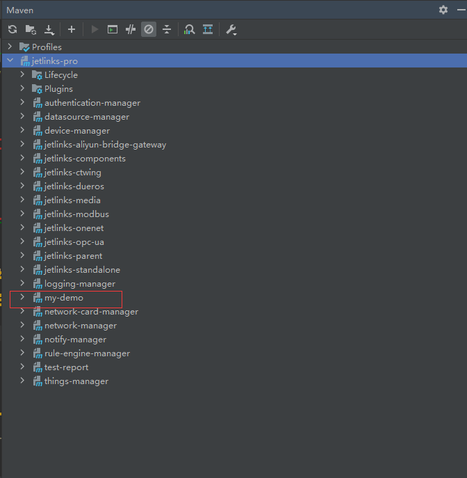

# 在JetLinks上构建自己的业务功能

## 文档指引
<table>
<tr>
    <td><a target='_self' href='/dev-guide/custom-code-guide.html#%E8%87%AA%E5%AE%9A%E4%B9%89%E6%A8%A1%E5%9D%97%E9%A1%B9%E7%9B%AE'>自定义模块项目</a></td>
    <td><a target='_self' href='/dev-guide/custom-code-crud.html#%E8%87%AA%E5%AE%9A%E4%B9%89%E6%A8%A1%E5%9D%97%E4%B8%AD%E7%BC%96%E5%86%99%E5%A2%9E%E5%88%A0%E6%94%B9%E6%9F%A5%E9%80%BB%E8%BE%91%E4%BB%A3%E7%A0%81'>自定义模块中编写增删改查逻辑代码</a></td>
</tr>
<tr>
    <td><a target='_self' href='/dev-guide/custom-use-es.
html#%E8%87%AA%E5%AE%9A%E4%B9%89%E6%A8%A1%E5%9D%97%E5%A6%82%E4%BD%95%E4%BD%BF%E7%94%A8es'>自定义模块如何使用es</a></td>
    <td><a target='_self' href='/dev-guide/custom-use-redis.html#%E8%87%AA%E5%AE%9A%E4%B9%89%E6%A8%A1%E5%9D%97%E5%A6%82%E4%BD%95%E5%BC%95%E5%85%A5%E4%BD%BF%E7%94%A8redis%E7%BC%93%E5%AD%98'>
  自定义模块如何引入使用redis缓存</a></td>
</tr>
<tr>
    <td><a target='_self' href='/dev-guide/custom-use-eventbus.
html#%E8%87%AA%E5%AE%9A%E4%B9%89%E6%A8%A1%E5%9D%97%E5%A6%82%E4%BD%95%E4%BD%BF%E7%94%A8es'>
  自定义模块如何使用eventBus</a> </td>
    <td><a target='_self' href='/dev-guide/custom-group-query-device.
html#%E8%87%AA%E5%AE%9A%E4%B9%89%E6%A8%A1%E5%9D%97%E5%A6%82%E4%BD%95%E5%88%86%E7%BB%84%E6%9F%A5%E8%AF%A2%E4%BA%A7%E5%93%81%E8%AE%BE%E5%A4%87%E4%BF%A1%E6%81%AF'>
  自定义模块如何分组查询产品设备信息</a></td>
</tr>
<tr>
   <td><a target='_self' href='/dev-guide/custom-use-sqlexecutor.html#%E8%87%AA%E5%AE%9A%E4%B9%89%E6%A8%A1%E5%9D%97%E5%A6%82%E4%BD%95%E4%BD%BF%E7%94%A8sqlexecutor'>
  自定义模块如何使用sqlExecutor</a></td>
</tr>

</table>


# 自定义模块项目

## 应用场景

<div class='explanation primary'>
  <p class='explanation-title-warp'>
    <span class='iconfont icon-bangzhu explanation-icon'></span>
    <span class='explanation-title font-weight'>说明</span>
  </p>

   <p>当您想使用JetLinks平台做自己的业务，又不想将项目独立时，可以选择基于JetLinks进行开发。</p>

  <p>JetLinks平台不用自动创建数据库，遵循JPA(Java Persistence API)规范，会根据@table注解自动创建表</p>

</div>

## 指导介绍

  </p>
     <p>1. <a href="/dev-guide/custom-code-guide.html#创建自定义maven项目" >如何创建自定义Maven项目</a></p>
     <p>2. <a href="/dev-guide/custom-code-guide.html#将自定义模块加入jetlinks平台" >如何将自定义模块加入JetLinks平台</a></p>
     <p>3. <a href="/dev-guide/custom-code-guide.html#如何确认模块被引入" >如何确认模块被引入</a></p>
  </p>

## 问题指引
<table>
<tr>
    <td><a target='_self' href='/dev-guide/custom-code-guide.html#自定义接口如何加入swagger'>自定义接口如何加入swagger</a></td>
    <td><a target='_self' href='/dev-guide/custom-code-guide.html#自定义的接口不想被平台鉴权拦截'>自定义的接口不想被平台鉴权拦截</a></td>
</tr>
</table>


## 创建自定义Maven项目
### 1. 创建项目图示


### 2. 自定义的Maven项目与jetlinks-pro同级（低版本IDEA窗口下，新的Maven模块后显示root字样）


## 将自定义模块加入JetLinks平台

### 1. 在jetlinks-pro目录根路径下的`pom.xml`文件内声明自定义项目加入多模块管理


示例代码:

```xml

<modules>
    <module>jetlinks-parent</module>
    <module>jetlinks-components</module>
    <module>jetlinks-manager/authentication-manager</module>
    <module>jetlinks-manager/device-manager</module>
    <module>jetlinks-manager/network-manager</module>
    <module>jetlinks-manager/notify-manager</module>
    <module>jetlinks-manager/rule-engine-manager</module>
    <module>jetlinks-manager/logging-manager</module>
    <module>jetlinks-manager/datasource-manager</module>
    <module>jetlinks-manager/things-manager</module>
    <module>jetlinks-standalone</module>
    <!--  声明加入自定义模块名称-->
    <module>my-demo</module>
    <module>test-report</module>
</modules>
```

### 2. 在jetlinks-standalone目录路径下的`pom.xml`文件内`profiles`节点中声明以下代码


示例代码:

```xml
<!-- 使用profile动态加入模块-->
<profile>
    <id>demo</id>
    <dependencies>
        <dependency>
            <groupId>com.example</groupId>
            <artifactId>my-demo</artifactId>
            <version>${project.version}</version>
        </dependency>
    </dependencies>
</profile>
```

### 3. reimport项目

以上两步操作完成之后需要使用Maven窗口的`reimport`即 `Reload ALL Maven Project`按钮，重新引入模块依赖，此时模块被加入jetlinks-pro项目下


### 4. 加入子模块声明后，修改自定义项目pom文件内容

示例代码：

```xml
<?xml version="1.0" encoding="UTF-8"?>
<project xmlns="http://maven.apache.org/POM/4.0.0" xmlns:xsi="http://www.w3.org/2001/XMLSchema-instance"
         xsi:schemaLocation="http://maven.apache.org/POM/4.0.0 https://maven.apache.org/xsd/maven-4.0.0.xsd">
    <modelVersion>4.0.0</modelVersion>
    <!-- 声明父模块 -->
    <parent>
        <groupId>org.jetlinks.pro</groupId>
        <artifactId>jetlinks-parent</artifactId>
        <version>2.0.0-SNAPSHOT</version>
        <relativePath>../jetlinks-parent/pom.xml</relativePath>
    </parent>

    <groupId>com.example</groupId>
    <artifactId>my-demo</artifactId>

    <dependencies>
        <!-- 引入hsweb依赖，该依赖主要用于业务系统crud功能模块   -->
        <dependency>
            <groupId>org.hswebframework.web</groupId>
            <artifactId>hsweb-starter</artifactId>
            <version>${hsweb.framework.version}</version>
        </dependency>

        <dependency>
            <groupId>org.hswebframework</groupId>
            <artifactId>hsweb-easy-orm-rdb</artifactId>
        </dependency>
    </dependencies>
    <build>
        <plugins>
            <plugin>
                <groupId>org.apache.maven.plugins</groupId>
                <artifactId>maven-resources-plugin</artifactId>
                <configuration>
                    <nonFilteredFileExtensions>
                        <nonFilteredFileExtension>zip</nonFilteredFileExtension>
                        <nonFilteredFileExtension>jar</nonFilteredFileExtension>
                    </nonFilteredFileExtensions>
                </configuration>
            </plugin>
        </plugins>
    </build>

</project>


```

## 如何确认模块被引入

<div class='explanation info'>
  <p class='explanation-title-warp'> 
    <span class='iconfont icon-tishi explanation-icon'></span>
    <span class='explanation-title font-weight'>提示</span>
  </p>
<p>Q：如何确认模块被引入？</p>
<p>A：可以使用Maven工具或者命令打包时出现自定义模块的名称说明模块被引入。</p>


```text
[INFO] Reactor Summary:
[INFO] 
[INFO] jetlinks-parent .................................... SUCCESS [  1.346 s]
[INFO] jetlinks-components ................................ SUCCESS [  0.084 s]
[INFO] test-component ..................................... SUCCESS [  9.813 s]
[INFO] common-component ................................... SUCCESS [ 13.924 s]
[INFO] timeseries-component ............................... SUCCESS [  5.407 s]
[INFO] dashboard-component ................................ SUCCESS [  8.283 s]
[INFO] network-component .................................. SUCCESS [  0.108 s]
[INFO] network-core ....................................... SUCCESS [ 10.744 s]
[INFO] gateway-component .................................. SUCCESS [ 11.436 s]
[INFO] assets-component ................................... SUCCESS [ 12.147 s]
[INFO] geo-component ...................................... SUCCESS [  7.302 s]
[INFO] api-component ...................................... SUCCESS [  8.520 s]
[INFO] configure-component ................................ SUCCESS [ 11.337 s]
[INFO] script-component ................................... SUCCESS [  8.600 s]
[INFO] streaming-component ................................ SUCCESS [  3.830 s]
[INFO] things-component ................................... SUCCESS [ 21.910 s]
[INFO] elasticsearch-component ............................ SUCCESS [ 13.424 s]
[INFO] relation-component ................................. SUCCESS [  9.770 s]
[INFO] rule-engine-component .............................. SUCCESS [  8.008 s]
[INFO] notify-component ................................... SUCCESS [  0.102 s]
[INFO] notify-core ........................................ SUCCESS [  8.918 s]
[INFO] notify-sms ......................................... SUCCESS [  8.037 s]
[INFO] io-component ....................................... SUCCESS [  8.139 s]
[INFO] notify-email ....................................... SUCCESS [  8.770 s]
[INFO] notify-wechat ...................................... SUCCESS [  9.273 s]
[INFO] notify-dingtalk .................................... SUCCESS [  9.235 s]
[INFO] notify-voice ....................................... SUCCESS [  7.400 s]
[INFO] notify-webhook ..................................... SUCCESS [  7.467 s]
[INFO] coap-component ..................................... SUCCESS [ 15.998 s]
[INFO] mqtt-component ..................................... SUCCESS [ 12.371 s]
[INFO] http-component ..................................... SUCCESS [ 13.102 s]
[INFO] tcp-component ...................................... SUCCESS [ 17.454 s]
[INFO] websocket-component ................................ SUCCESS [ 17.322 s]
[INFO] udp-component ...................................... SUCCESS [ 16.092 s]
[INFO] simulator-component ................................ SUCCESS [ 10.106 s]
[INFO] protocol-component ................................. SUCCESS [ 10.202 s]
[INFO] datasource-component ............................... SUCCESS [ 10.831 s]
[INFO] messaging-component ................................ SUCCESS [  0.102 s]
[INFO] rabbitmq-component ................................. SUCCESS [  7.784 s]
[INFO] kafka-component .................................... SUCCESS [  7.923 s]
[INFO] logging-component .................................. SUCCESS [  5.452 s]
[INFO] tenant-component ................................... SUCCESS [  8.594 s]
[INFO] influxdb-component ................................. SUCCESS [  9.655 s]
[INFO] tdengine-component ................................. SUCCESS [ 10.927 s]
[INFO] clickhouse-component ............................... SUCCESS [ 10.780 s]
[INFO] cassandra-component ................................ SUCCESS [ 11.147 s]
[INFO] function-component ................................. SUCCESS [  0.107 s]
[INFO] function-api ....................................... SUCCESS [  3.569 s]
[INFO] function-manager ................................... SUCCESS [ 14.735 s]
[INFO] collector-component ................................ SUCCESS [ 12.584 s]
[INFO] application-component .............................. SUCCESS [ 14.226 s]
[INFO] authentication-manager ............................. SUCCESS [ 18.356 s]
[INFO] device-manager ..................................... SUCCESS [ 15.212 s]
[INFO] network-manager .................................... SUCCESS [ 13.248 s]
[INFO] notify-manager ..................................... SUCCESS [  9.168 s]
[INFO] rule-engine-manager ................................ SUCCESS [ 11.895 s]
[INFO] logging-manager .................................... SUCCESS [  7.648 s]
[INFO] datasource-manager ................................. SUCCESS [  8.070 s]
[INFO] things-manager ..................................... SUCCESS [  9.319 s]
[INFO] jetlinks-ctwing .................................... SUCCESS [  6.386 s]
[INFO] jetlinks-onenet .................................... SUCCESS [  6.444 s]
[INFO] jetlinks-opc-ua .................................... SUCCESS [ 11.776 s]
[INFO] jetlinks-aliyun-bridge-gateway ..................... SUCCESS [  8.857 s]
[INFO] jetlinks-dueros .................................... SUCCESS [  7.087 s]
[INFO] jetlinks-media ..................................... SUCCESS [ 13.981 s]
[INFO] network-card-manager ............................... SUCCESS [  9.961 s]
[INFO] jetlinks-modbus .................................... SUCCESS [ 12.166 s]
[INFO] jetlinks-standalone ................................ SUCCESS [  9.283 s]
//Maven的编译或打包信息内出现自定义项目的名称表明，该项目已被加入jetlinks-pro的多模块管理内
[INFO] my-demo ............................................ SUCCESS [  1.987 s]
[INFO] test-report ........................................ SUCCESS [  9.504 s]
[INFO] jetlinks-pro ....................................... SUCCESS [  0.953 s]
[INFO] ------------------------------------------------------------------------
[INFO] BUILD SUCCESS
[INFO] ------------------------------------------------------------------------
[INFO] Total time: 02:48 min (Wall Clock)
[INFO] Finished at: 2022-11-29T14:05:27+08:00
[INFO] Final Memory: 451M/3453M
[INFO] ------------------------------------------------------------------------

Process finished with exit code 0
```

</div>

## 常见问题

### 自定义接口如何加入swagger
<div class='explanation warning'>
  <p class='explanation-title-warp'>
    <span class='iconfont icon-bangzhu explanation-icon'></span>
    <span class='explanation-title font-weight'>问题1</span>
  </p>
<p>Q：如何将自定义的接口加入swagger扫描并在API配置中显示出来？</p>
<p>A：在平台的<a>application.yml</a>文件内swagger下声明该项目扫描路径。</p></div>


```yaml
springdoc:
  swagger-ui:
    path: /swagger-ui.html
  group-configs:
    - group: 设备接入相关接口
      packages-to-scan:
        - org.jetlinks.pro.network.manager.web
        - org.jetlinks.pro.device.web
      paths-to-match:
        - /gateway/**
        - /network/**
        - /protocol/**
    - group: 系统管理相关接口
      packages-to-scan:
        - org.jetlinks.pro.auth
        - org.hswebframework.web.system.authorization.defaults.webflux
        - org.hswebframework.web.file
        - org.hswebframework.web.authorization.basic.web
        - org.jetlinks.pro.openapi.manager.web
        - org.jetlinks.pro.logging.controller
        - org.jetlinks.pro.tenant.web
    - group: 自定义接口
      packages-to-scan:
        - com.example.mydemo.web
```

效果图：


### 自定义的接口不想被平台鉴权拦截
<div class='explanation warning'>
  <p class='explanation-title-warp'>
    <span class='iconfont icon-bangzhu explanation-icon'></span>
    <span class='explanation-title font-weight'>问题2</span>
  </p>


  <p>Q：自定义的接口不想被平台鉴权拦截？</p>
  <p>A：在类上或者方法上声明<span class="explanation-title font-weight">@Authorize(ignore = true)</span>。</p>
  <p>类上注解表明该类所有方法均不受鉴权拦截，方法上则仅限当前被注解的方法不受鉴权拦截。</p>

</div>


