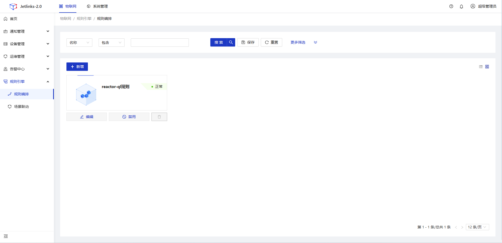
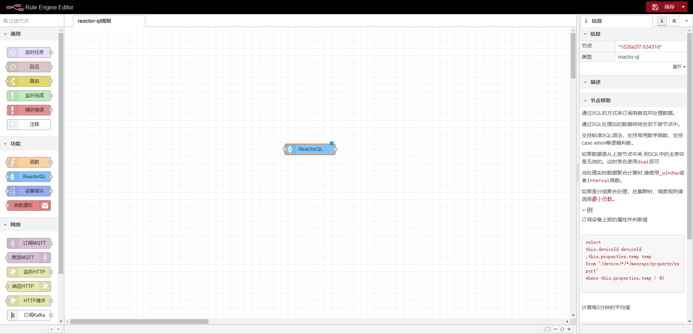

# ReactorQL

## 应用场景

<div class='explanation primary'>
  <p class='explanation-title-warp'>
    <span class='iconfont icon-bangzhu explanation-icon'></span>
    <span class='explanation-title font-weight'>说明</span>
  </p>
    <p>
       需要处理实时数据、聚合计算实时数据、跨数据源联合数据处理的业务场景
    </p>
</div>


## 指导介绍

<p>1. <a href='/dev-guide/reactor-ql.html#概述'>概述</a></p>

<p>2. <a href='/dev-guide/reactor-ql.html#使用指引'>使用指引</a></p>

<p>3. <a href='/dev-guide/reactor-ql.html#使用样例'>使用样例</a></p>

<p>4. <a href='/dev-guide/reactor-ql.html#sql支持列表'>SQL支持列表</a></p>

<p>5. <a href='/dev-guide/reactor-ql.html#拓展函数'>拓展函数</a></p>


## 概述

JetLinks封装了一套使用SQL来进行实时数据处理的工具包<a target='_blank' href='https://github.com/jetlinks/reactor-ql'>查看源代码</a>。
通过将SQL翻译为<a target='_blank' href='https://projectreactor.io/'>reactor</a>来进行数据处理。
规则引擎中的`数据转发`以及可视化规则中的`ReactorQL节点`均使用此工具包实现。
默认情况下，SQL中的表名就是事件总线中的`topic`。如：`select * from "/device/*/*/message/property/*"`，
表示订阅`/device/*/*/message/property/*`下的实时消息。


## 使用指引

<p>1、登录JetLinks平台</p>

<p>2、选择<b>物联网</b>-><b>规则引擎</b>-><b>规则编排</b>，选择存在的一个规则后进入<b>规则引擎编辑器</b></p>



<p>3、拖动<b>ReactorQL</b>组件并进行编辑</p>




## 使用样例

<div class='explanation primary'>
  <p class='explanation-title-warp'>
    <span class='iconfont icon-bangzhu explanation-icon'></span>
    <span class='explanation-title font-weight'>说明</span>
  </p>
    <p>
        聚合处理实时数据时，必须使用<code>interval</code>函数或者<code>_window</code>函数。
   </p>
</div>

 当温度大于40度时，将数据转发到下一步。

```sql
select 
this.properties.temperature temperature,
this.deviceId deviceId
from
"/device/*/*/message/property/**" -- 订阅所有设备的所有属性消息
where this.properties.temperature > 40
```

处理指定多个型号的设备数据 

```sql
select * from (
    select 
        this.properties.temperature temperature,
        this.deviceId deviceId
    from
        "/device/T0001/*/message/property/**" -- 订阅T0001型号下的所有设备消息
    where this.properties.temperature > 40
union all   -- 实时数据只能使用 union all
    select 
        this.properties.temperature temperature,
        this.deviceId deviceId
    from
        "/device/T0002/*/message/property/**" -- 订阅T0002型号下的所有设备消息
    where this.properties.temperature > 42
)
```

计算每5分钟的温度平均值，当平均温度大于40度时，将数据转发到下一步。

```sql
select
avg(this.properties.temperature) temperature
from
"/device/*/*/message/property/**" -- 订阅所有设备的所有属性消息
group by interval('5m')
having temperature > 40 --having 必须使用别名.
```

计算每10条数据为一个窗口，每2条数据滚动的平均值。

```text
[1,2,3,4,5,6,7,8,9,10]  第一组
[3,4,5,6,7,8,9,10,11,12] 第二组
[5,6,7,8,9,10,11,12,13,14] 第三组
```

```sql
select 
avg(this.properties.temperature) temperature
from
"/device/*/*/message/property/**" -- 订阅所有设备的所有属性消息
group by _window(10,2)
having temperature > 40 --having 必须使用别名.
```

聚合统计平均值，并且提取聚合结果中的数据。

```sql
select 
rows_to_array(idList) deviceIdList, --将[{deviceId:1},{deviceId:2}] 转为[1,2]
avgTemp,
from
(
   select
   collect_list((select this.deviceId deviceId)) idList, --聚合结果里的
   avg(temperature)                   avgTemp ,
   from "/device/*/*/message/property/**" ,
   group by interval('1m') having avgTemp > 40
)

```

5分钟之内只取第一次。

```sql

select * 
from "/device/*/*/message/event/fire_alarm"
_window('5m'),take(1) -- -1为取最后一次

```

限流: 10秒内超过2次则获取最后一条数据

```sql
select * from 
( select * from "/device/demo-device/device001/message/event/alarm" )
group by
_window('10s') --时间窗口
,trace() -- 跟踪分组内行号信息
,take(-1) --取最后一条数据
having 
  row.index > 2  -- 跟踪分组内的行号
and 
  row.elapsed>1000 -- 距离上一行的时间
```

<div class='explanation warning'>
  <p class='explanation-title-warp'>
    <span class='iconfont icon-jinggao explanation-icon'></span>
    <span class='explanation-title font-weight'>警告</span>
  </p>

SQL中的`this`表示主表当前的数据。如果存在嵌套属性的时候，必须指定`this`或者以表别名开头。
如: `this.properties.temperature`，写成：`properties.temperature`是无法获取到值的。

</div>


## SQL支持列表

| 函数/表达式          | 用途                       | 示例                                   | 说明                                                        |
| -------------------- | -------------------------- | -------------------------------------- | ----------------------------------------------------------- |
| %                    | 取模运算                   | temp%2                                 | 对应函数: math\.mod\(temp,2\)                               |
| &                    | 位与运算                   | val&3                                  | 对应函数: bit\_and\(val,3\)                                 |
| \|                   | 位或运算                   | val\|3                                 | 对应函数: bit\_or\(val,3\)                                  |
| ^                    | 异或运算                   | val^3                                  | 对应函数: bit\_mutex\(val,3\)                               |
| <<                   | 位左移运算                 | val<<2                                 | 对应函数: bit\_left\_shift\(val,2\)                         |
| >>                   | 位右移运算                 | val>>2                                 | 对应函数: bit\_right\_shift\(val,2\)                        |
| \|\|                 | 字符拼接                   | val\|\|'度'                            | 对应函数: concat\(val,'度'\)                                |
| avg                  | 平均值                     | avg\(val\)                             | 聚合函数,平均值                                             |
| sum                  | 合计值                     | sum\(val\)                             | 聚合函数,合计值                                             |
| count                | 总数                       | count\(1\)                             | 聚合函数,计数                                               |
| max                  | 最大值                     | max\(val\)                             | 聚合函数,最大值                                             |
| min                  | 最小值                     | min\(val\)                             | 聚合函数,最小值                                             |
| take                 | 取指定数量数据             | take\(5,-1) --取5个中的最后一个        | 通常配合分组函数_window使用                                 |
| >                    | 大于                       | val > 10                               |                                                             |
| <                    | 小于                       | val < 10                               |                                                             |
| =                    | 等于                       | val = 10                               |                                                             |
| \!=                  | 不等于                     | val \!=10                              | 等同于: <> ,如: val <> 10                                   |
| >=                   | 大于等于                   | val>=10                                |                                                             |
| <=                   | 小于等于                   | val<=10                                |                                                             |
| in                   | 在\.\.之中                 | val in \(1,2,3\)                       |                                                             |
| not in               | 不在\.\.之中               | val not in \(1,2,3\)                   |                                                             |
| like                 | 模糊匹配                   | name like 'a%'                         | not like 同理                                               |
| between              | 在之间                     | val between 1 and 10                   |                                                             |
| now                  | 当前时间                   | now\(\)                                | 默认返回时间戳,可传入格式化参数\.                           |
| date\_format         | 格式化日期                 | date\_format\(now\(\),'yyyy\-MM\-dd'\) |                                                             |
| cast                 | 转换类型                   | cast\(val as boolean\)                 | 支持类型: string,boolean,int,double,float,date,decimal,long |
| interval             | 时间分组                   | interval\('10s'\)                      | 分组函数,按时间分组                                         |
| \_window             | 窗口分组                   | \_window\(10\)                         | 窗口,支持按数量和时间窗口                                   |
| collect\_list        | 聚合结果转为list           | collect\_list\(\(select deviceId\)\)   | 把聚合的的结果转为list                                      |
| rows\_to\_array      | 将结果集转为单元素数组     | rows\_to\_array\(idList\)              | 把只有一个属性的结果集中的属性转为集合                      |
| new\_map             | 创建一个map                | new\_map\('k1',v1,'k2',v2\)            |                                                             |
| new\_array           | 创建一个集合               | new\_array\(1,2,3,4\)                  |                                                             |
| device.tag           | 获取设备标签函数            |device.tag(deviceId,'tag1')            |         获取设备标签函数                                     |
| device.tags           | 获取设备标签函数           |device.tags(deviceId,'tag1','tag2')            |        |
| device.config        | 获取设备配置               |device.config(deviceId,'tag1')          |											 				|
| device\.metadata\.func        | 获取设备物模型指定功能信息              | device\.metadata\.func(deviceId,funcId)          |select device.metadata.func('ot-test','f1') pwd from dual											 |   
| device\.metadata\.property        | 获取设备物模型指定属性信息          | device\.metadata\.property(deviceId,propertyId)        |select device.metadata.property('ot-test','f1') pwd from dual											 | 
| device\.metadata\.event        | 获取设备物模型指定事件信息             | device\.metadata\.event(deviceId,eventId)          |select device.metadata.event('ot-test','e1') pwd from dual											 | 
| device\.property\.recent        | 获取设备最新属性             | device\.property\.recent(deviceId,eventId,timestamp)          | select device.property.recent('test-1','temp1',timestamp) recent rom dual | 
| device\.selector           | 设备选择器函数             | device\.selector(in_group('tenant1','tenant2'))                 |                                                             |
| math\.ceil           | 向上取整                   | math\.ceil\(val\)                      |                                                             |
| math\.floor          | 向下取整                   | math\.floor\(val\)                     |                                                             |
| math\.round          | 四舍五入                   | math\.round\(val\)                     |                                                             |
| math\.log            | log运算                    | math\.log\(val\)                       |                                                             |
| math\.sin            | 正弦                       | math\.sin\(val\)                       |                                                             |
| math\.asin           | 反正弦                     | math\.asin\(val\)                      |                                                             |
| math\.sinh           | 双曲正弦                   | math\.sinh\(val\)                      |                                                             |
| math\.cos            | 余弦                       | math\.cos\(val\)                       |                                                             |
| math\.acos           | 反余弦                     | math\.acos\(val\)                      |                                                             |
| math\.cosh           | 双曲余弦                   | math\.cosh\(val\)                      |                                                             |
| math\.tan            | 正切                       | math\.tan\(val\)                       |                                                             |
| math\.atan           | 反正切                     | math\.atan\(val\)                      |                                                             |
| math\.tanh           | 双曲正切                   | math\.tanh\(val\)                      |                                                             |
| if                   | 条件取值                   | if(a<1,'when true','when false')       |                                                             |
| range                | 范围判断,等同于between and | range(val,1,10)                        |                                                             |
| median               | 中位数                     | median(val)                            | 中位数 (Pro)                                                |
| skewness             | 偏度特征值                 | skewness(val)                          | 偏度特征值聚合函数 (Pro)                                    |
| kurtosis             | 峰度特征值                 | kurtosis(val)                          | 峰度特征值聚合函数 (Pro)                                    |
| variance             | 方差                       | variance(val)                          | 方差聚合函数 (Pro)                                         |
| geo_mean             | 几何平均数                 | geo_mean(val)                          | 几何平均数聚合函数 (Pro)                                    |
| sum_of_squ           | 平方和                     | sum_of_squ(val)                        | 平方和聚合函数 (Pro)                                        |
| std_dev              | 标准差                     | std_dev(val)                           | 标准差聚合函数 (Pro)                                        |
| slope                | 斜度                       | slope(val)                             | 使用最小二乘回归模型计算斜度,大于0为向上,小于0为向下 (Pro)  |
| time                 | 转换时间                   | time('now-1d')                         | 使用表达式来转换时间,返回毫秒时间戳(Pro)                    |
| jsonata              | jsonata表达式              | jsonata('$abs(val)')                   | 使用jsonata表达式来提取行数据(Pro)                          |
| spel                 | spel表达式                 | spel('#val')                           | 使用spel表达式来提取行数据(Pro)                             |
| env                  | 获取配置信息               | env('key','默认值')                    | 获取系统配置信息(Pro)                                       |
| _window_until        | 打开窗口直到满足条件       | _window_until(this.success)            | 打开窗口直到满足条件(Pro)                                   |
| _window_until_change | 打开窗口直到值变更         | _window_until_change(this.state)       | 打开窗口直到值变更(Pro)                                     |


## 拓展函数

<div class='explanation primary'>
  <p class='explanation-title-warp'>
    <span class='iconfont icon-bangzhu explanation-icon'></span>
    <span class='explanation-title font-weight'>说明</span>
  </p>

以下功能只在企业版中支持

</div>

### device.properties

获取设备已保存的全部最新属性。

<div class='explanation warning'>
  <p class='explanation-title-warp'>
    <span class='iconfont icon-jinggao explanation-icon'></span>
    <span class='explanation-title font-weight'>警告</span>
  </p>
    <p>
        由于使用es存储设备数据，此数据并不是完全实时的
    </p>
</div>


```sql
select 
device.properties(this.deviceId) props,
this.properties reports
from "/device/*/*/message/property/report"
```

<div class='explanation primary'>
  <p class='explanation-title-warp'>
    <span class='iconfont icon-bangzhu explanation-icon'></span>
    <span class='explanation-title font-weight'>说明</span>
  </p>

`device.properties(this.deviceId,'property1','property2')`还可以通过参数获取指定的属性，如果未设置则获取全部属性。

</div>

 ### device.properties.history

 查询设备历史数据

 ```sql
 --聚合查询
select * from device.properties.history(
    select avg(temperature) avgVal 
    from "deviceId" -- from 支持: 按设备ID查询: "deviceId", 查询多个设备: device('1','2') 按产品查询: product('id')
    where timestamp between now()-86400000 and now()
)
 ```

```sql
 --按时间分组
select * from device.properties.history(
    select avg(temperature) avgVal 
    from "deviceId"
    where timestamp between now()-86400000 and now()
    group by interval('1d')
)
```

```sql
-- 订阅实时数据,然后查询对应设备的历史数据
select 
(
select maxVal,avgVal from 
    device.properties.history(
        select 
        max(temp3) maxVal,
        avg(temp3) avgVal
        from device(t.deviceId)
        -- 前一天的数据
        where timestamp between time('now-1d') and t.timestamp
    )
) $this,
t.properties.temp3 temp3
from "/device/*/*/message/property/**" t
```


### device.properties.latest

<div class='explanation primary'>
  <p class='explanation-title-warp'>
    <span class='iconfont icon-bangzhu explanation-icon'></span>
    <span class='explanation-title font-weight'>说明</span>
  </p>

此功能需要开启<a href='/function-description/storage_policy.html#记录设备最新数据到数据库'>设备最新数据存储</a>

</div>

查询设备最新的数据

```sql
select * from device.properties.latest(
    select 
    temperature
    from "productId" --表名为产品ID
    where id = 'deviceId' -- id则为设备ID
)
```

聚合查询

```sql
select * from device.properties.latest(
    select 
    avg(temperature) temperature
    from "productId" --表名为产品ID
)
```

### device.tags

 获取设备标签信息

 ```sql
select device.tags(this.deviceId) from "/device/*/*/message/property/report"
 ```

<div class='explanation primary'>
  <p class='explanation-title-warp'>
    <span class='iconfont icon-bangzhu explanation-icon'></span>
    <span class='explanation-title font-weight'>说明</span>
  </p>

`device.tags(this.deviceId,'tag1','tag2')`还可以通过参数获取指定的标签，如果未设置则获取全部标签。

</div>

### device.property.recent

获取设备最新属性

 ```sql
select device.property.recent(deviceId,'temperature',timestamp) recent from "/device/*/*/message/property/report"
 ```

<div class='explanation primary'>
  <p class='explanation-title-warp'>
    <span class='iconfont icon-bangzhu explanation-icon'></span>
    <span class='explanation-title font-weight'>说明</span>
  </p>

`select device.property.recent`还可以通过'from dual'获取最新属性数据。

</div>

### device.selector

选择设备,如：

```sql
select dev.deviceId from "/device/*/*/message/property/report" t
-- 获取和上报属性在同一个分组里，并且产品id为light-product的设备
left join ( 
            select this.id deviceId from 
            device.selector(same_group(t.deviceId),product('light-product'))
          ) dev
```

支持参数:

1. in_gourp('groupId') 在指定的设备分组中
2. in_group_tree('groupId') 在指定分组中（包含下级分组）
3. same_group('deviceId') 在指定设备的相同分组中
4. product('productId') 指定产品ID对应的设备
5. tag('tag1Key','tag1Value','tag2Key','tag2Value') 按指定的标签获取
6. state('online') 按指定的状态获取
7. in_tenant('租户ID') 在指定租户中的设备
8. org('组织ID') 在指定组织中

### mqtt.client.publish

推送消息到mqtt客户端.

```sql

select 
mqtt.client.publish(
   'networkId' -- 第一个参数: 网络组件中mqtt客户端的ID
   ,'topic' -- 第二个参数: topic
   ,'JSON'  -- 第三个参数: 消息类型: JSON,STRING,BINARY,HEX
   ,this  -- 消息体,会根据消息类型转为不同格式的消息
   ) publishSuccess -- 返回推送结果 true false
from "/rule-engine/device/alarm/sensor-1/**"

```

### mqtt.client.subscribe

从mqtt客户端订阅消息

```sql

select 
t.did deviceId,
t.l location,
t.v value
from mqtt.client.subscribe(
   'networkId' -- 第一个参数: 网络组件中mqtt客户端的ID
   ,'JSON' -- 第二个参数: 消息类型: JSON,STRING,BINARY,HEX
   ,'topic' -- topic
   ,'topic2' -- topic2
) t
where t.v > 30 -- 过滤条件

```

### http.request

发起http请求

```sql

select

http.request(
   'networkId' -- 第一个参数: 网络组件中http客户端的ID
   -- 下面的参数两两对应组成键值对,注意: 使用逗号(,)分割.
   ,'url','https://www.baidu.com'
   ,'method','POST'
   ,'contentType','application/json'
   -- 请求头
   ,'headers',new_map('key1','value1','key2','value2')
   -- body参数在contentType为application/json时生效
   ,'body',new_map('key1','value1','key2','value2')
   -- requestParam参数在contentType不为json时生效,相当于:application/x-www-form-urlencoded的处理方式
   ,'requestParam',new_map('key1','value1','key2','value2')
   -- 直接拼接到url上的参数 https://www.baidu.com?key1=value1&key2=value2
   ,'queryParameters',new_map('key1','value1','key2','value2')

) response

from dual

```

### message.subscribe

订阅消息网关中的消息

```sql

select 
t.topic topic,
t.message.deviceId deviceId,
t.message.headers.productId productId,
t.message.timestamp ts
from message.subscribe(
   'false' -- 是否订阅来自集群的消息(可选参数,默认为false)
   ,'/device/*/*/online'
   )  t

```

### message.publish

推送消息到消息网关

```sql

select

message.publish(
   '/device-online/'||t.message.deviceId -- 推送到此topic
   ,t.message -- 消息内容
   ) subscribeNumber -- 返回有多少订阅者收到了消息

from message.subscribe('/device/*/*/online')  t

```
