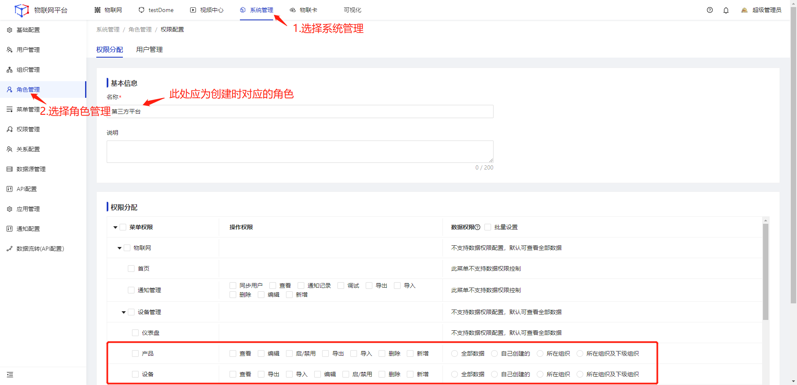

# 第三方平台请求JetLinks服务接口

## 应用场景

<div class='explanation primary'>
  <p class='explanation-title-warp'>
    <span class='iconfont icon-bangzhu explanation-icon'></span>
    <span class='explanation-title font-weight'>说明</span>
  </p>
    第三方平台通过api请求JetLinks服务接口获取相关数据
</div>


## 指导介绍

  <p>1. <a href='/dev-guide/request-jetlinks-interface.html#创建第三方平台'>创建第三方平台。</a></p>
  <p>2. <a href='/dev-guide/request-jetlinks-interface.html#获取平台签名及token'>获取平台签名及Token。</a></p>


## 创建第三方平台

首先进入平台：选择平台上方的[系统管理]---选择左侧[应用管理]---点击新增按钮


然后应用选择第三方应用，接入方式只勾选API服务，填入名称、secureKey，选择角色，点击保存

<div class='explanation primary'>
  <p class='explanation-title-warp'>
    <span class='iconfont icon-bangzhu explanation-icon'></span>
    <span class='explanation-title font-weight'>说明</span>
  </p>
    <p>
       appId和secureKey需要提供给客户端开发者，角色是多个用户的集合，角色中创建的用户可以使用用户名密码登录到系统中。IP白名单是只允许填写的ip进行访问
    </p>
</div>


<div class='explanation primary'>
  <p class='explanation-title-warp'>
    <span class='iconfont icon-bangzhu explanation-icon'></span>
    <span class='explanation-title font-weight'>说明</span>
  </p>
  大部分情况下只需要勾选设备相关权限即可
</div>
赋权操作在[系统管理]---[角色管理]---选择对应的角色后在页面内进行权限分配




## 获取平台签名及Token

1、使用签名的方式

验证流程

<div class='explanation primary'>
  <p class='explanation-title-warp'>
    <span class='iconfont icon-bangzhu explanation-icon'></span>
    <span class='explanation-title font-weight'>说明</span>
  </p>
         <p>
             1. 图中Signature函数为客户端设置的签名方式，支持MD5和SHA256<br>
             2. 发起请求的签名信息都需要放到请求头中，而不是请求体<br>
             3. OpenApi对开发是透明的，开发只需要关心权限控制即可。OpenAPI和后台接口使用的是相同的权限控制API，因此开发一个OpenAPI接口就是写一个WebFlux Controller。<a href='https://doc.jetlinks.cn/dev-guide/crud.html#web' target='_blank'>查看使用方式</a>
    </p>
</div>


签名

<div class='explanation primary'>
  <p class='explanation-title-warp'>
    <span class='iconfont icon-bangzhu explanation-icon'></span>
    <span class='explanation-title font-weight'>说明</span>
  </p>
  <p>
      平台使用签名来校验客户端请求的完整性以及合法性。
    Demo中测试包org.jetlinks.demo.openapi下的测试类已测试通过平台已有的openApi接口，Demo中使用签名的方式接入。<a href='https://github.com/jetlinks/jetlinks-openapi-demo' target='_blank'>下载Demo示例</a>
    </p>
</div>


使用GET方式：

<p>appId为<code>testId</code>，SecureKey为：<code>testSecure</code>，客户端请求接口: <code>/api/v1/device/dev0001/log/_query</code>，参数为<code>pageSize=20&pageIndex=0</code>，签名方式为<code>md5</code>。</p>

<p>1. 将参数key按ascii排序得到: <code>pageIndex=0&pageSize=20</code></p>

<p>2. 使用拼接时间戳以及密钥得到: <code>pageIndex=0&pageSize=201574993804802testSecure</code></p>

<p>3 .使用<code>md5("pageIndex=0&pageSize=201574993804802testSecure")</code>后得到<code>837fe7fa29e7a5e4852d447578269523</code></p>

示例：

```
GET /api/device?pageIndex=0&amp;pageSize=20
X-Client-Id: testId
X-Timestamp: 1574993804802
X-Sign: 837fe7fa29e7a5e4852d447578269523
```

响应结果

```
HTTP/1.1 200 OK
X-Timestamp: 1574994269075
X-Sign: c23faa3c46784ada64423a8bba433f25

{"status":200,result:[]}
```

<br>

使用POST方式：

<div class='explanation primary'>
  <p class='explanation-title-warp'>
    <span class='iconfont icon-bangzhu explanation-icon'></span>
    <span class='explanation-title font-weight'>说明</span>
  </p>
  <p>
      如果POST请求的contentType类型为APPLICATION_FORM_URLENCODED，则加密方式可以参见GET的方式。如果为其他类型则会将参数转换成<code>ByteBuffer</code>进行计算。
    </p>
</div>
<p>appId为<code>testId</code>，SecureKey为：<code>testSecure</code>，客户端请求接口<code>/api/v1/device/dev0001/log/_query</code>，参数为<code>{"pageSize":20,"pageIndex":0}</code>，签名方式为<code>md5</code>，使用md5()后得到<code>ed6c0149e9e6d8875064df475240ed5d</code></p>

示例：

```text
POST /api/device

X-Client-Id: testId
X-Timestamp: 167109938793
X-Sign: ed6c0149e9e6d8875064df475240ed5d
```

响应结果：

```
HTTP/1.1 200 OK
X-Timestamp: 167109989127
X-Sign: d41d8cd98f00b204e9800998ecf8427e

{"status":200,result:[]}
```

<br>

验签

<div class='explanation primary'>
  <p class='explanation-title-warp'>
    <span class='iconfont icon-bangzhu explanation-icon'></span>
    <span class='explanation-title font-weight'>说明</span>
  </p>
  需要使用使用和签名相同的算法，不需要对响应结果排序
</div>
示例：

```java
String secureKey = ...; //密钥
String responseBody = ...;//服务端响应结果
String timestampHeader = ...;//响应头: X-Timestamp
String signHeader = ...; //响应头: X-Sign

String sign = DigestUtils.md5Hex(responseBody + timestampHeader + secureKey);
if(sign.equalsIgnoreCase(signHeader)){
    //验签通过
}
```

<br>

2、使用token的方式

<div class='explanation primary'>
  <p class='explanation-title-warp'>
    <span class='iconfont icon-bangzhu explanation-icon'></span>
    <span class='explanation-title font-weight'>说明</span>
  </p>
  通过请求接口<code>/api/v1/token</code>来获取<code>X-Access-Token</code>，之后可以使用此token来发起api请求
</div>

申请token

客户端请求接口`/token`，请求方式post

```
POST /token
X-Sign: 932bbe8a39ae03f568f73a507d87afac
X-Timestamp: 1587719082698 
X-Client-Id: kF**********HRZ  
Content-Type: application/json 

{  
    "expires": 7200 // 过期时间,单位秒.
}

//返回结果
{
    "status":200,
    "result":"3bcddb719b01da679b88d07acde2516" //token信息
}
```

<br>

使用token发起请求

```
GET /device-instance/test001/_detail  
X-Access-Token: 3bcddb719b01da679b88d07acde2516
```

响应结果

```json
{
    "result": {
        "id": "test001",
        "name": "温控设备0309",
        "protocol": "demo-v1",
        "transport": "MQTT",
        "orgId": "test",
        "productId": "1236859833832701952",
        "productName": "智能温控",
        "deviceType": {
            "text": "网关设备",
            "value": "gateway"
        },
        "state": {
            "text": "离线",
            "value": "offline"
        },
        "address": "/127.0.0.1:36982",
        "onlineTime": 1586705515429,
        "offlineTime": 1586705507734,
        "createTime": 1585809343175,
        "registerTime": 1583805253659,
        "metadata": "{\"events\":[{\"id\":\"fire_alarm\",\"name\":\"火警报警\",\"expands\":{\"eventType\":\"reportData\",\"level\":\"urgent\"},\"valueType\":{\"type\":\"object\",\"properties\":[{\"id\":\"a_name\",\"name\":\"区域名称\",\"valueType\":{\"type\":\"string\"}},{\"id\":\"b_name\",\"name\":\"建筑名称\",\"valueType\":{\"type\":\"string\"}},{\"id\":\"l_name\",\"name\":\"位置名称\",\"valueType\":{\"type\":\"string\"}}]}}],\"properties\":[{\"id\":\"temperature\",\"name\":\"温度\",\"valueType\":{\"type\":\"float\",\"min\":\"0\",\"max\":\"100\",\"step\":\"0.1\",\"unit\":\"celsiusDegrees\"},\"expands\":{\"readOnly\":\"true\"}}],\"functions\":[{\"id\":\"get-log\",\"name\":\"获取日志\",\"isAsync\":true,\"output\":{\"type\":\"string\",\"expands\":{\"maxLength\":\"2048\"}},\"inputs\":[{\"id\":\"start_date\",\"name\":\"开始日期\",\"valueType\":{\"type\":\"date\",\"dateFormat\":\"yyyy-MM-dd HH:mm:ss\"}},{\"id\":\"end_data\",\"name\":\"结束日期\",\"valueType\":{\"type\":\"date\",\"dateFormat\":\"yyyy-MM-dd HH:mm:ss\"}},{\"id\":\"time\",\"name\":\"分组\",\"valueType\":{\"type\":\"string\"}}]}]}",
        "configuration": {
            "username": "test",
            "password": "test"
        },
        "tags": []
    },
    "status": 200,
    "code": "success"
}
```