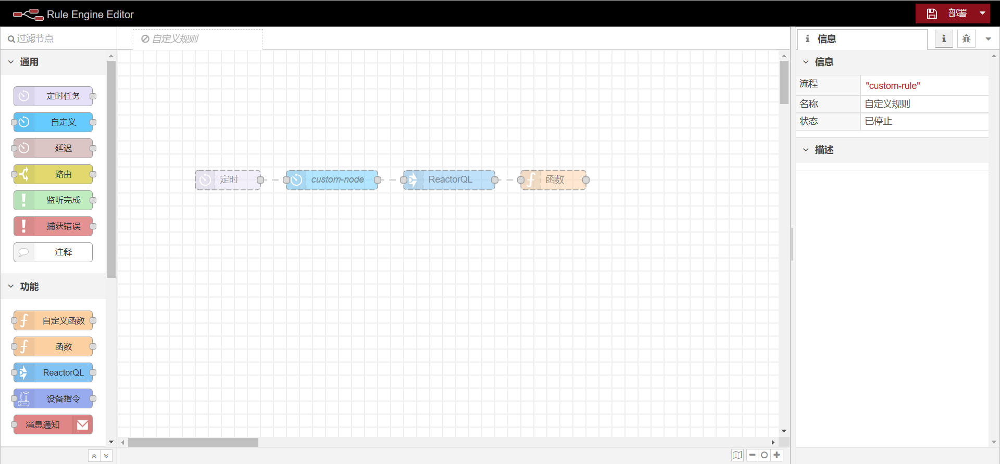
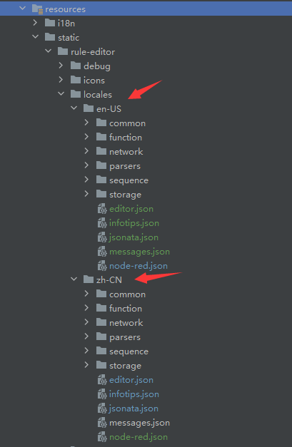
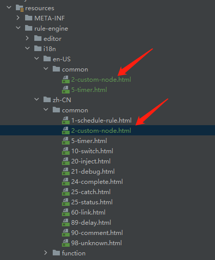

# 规则引擎

## 概述
<div class='explanation primary'>
  <p class='explanation-title-warp'>
    <span class='iconfont icon-bangzhu explanation-icon'></span>
    <span class='explanation-title font-weight'>说明</span>
  </p>
    <p>规则引擎是使用预定义的语义模块编写业务决策。接受数据输入，解释业务规则，并根据业务规则做出业务决策，
对于处理复杂的事件具有灵活配置和高度定制化的。
通过规则可以让项目下的设备相互联动，以设备上报数据或者定时器作为触发器并通过一些过滤及计算模块进行业务判断，最终控制其他设备进行联动操作。
JetLinks平台在此基础上还扩展了一些网络节点，方便开发者使用这些节点订阅外部数据或转发平台内部数据。
</p>
</div>

## 名词说明

<table>
    <tr>
        <td>RuleModel(规则模型)</td>
        <td>由多个RuleNode(规则节点),RuleLink(规则连线)组成</td>
    </tr>
     <tr>
        <td>RuleNode(规则节点)</td>
        <td>规则节点描述具体执行的逻辑</td>
    </tr>
     <tr>
        <td>RuleLink(规则连线)</td>
        <td>用于将多个节点连接起来,将上一个节点的输出结果作为下一个节点的输入结果.</td>
    </tr>
     <tr>
        <td>Input(输入)</td>
        <td>规则节点的数据输入,可以是上游节点的输出数据，也可以是通过自身html配置的数据</td>
    </tr>
     <tr>
        <td>Output(输出)</td>
        <td>规则节点的数据输出,将数据流向下游节点</td>
    </tr>
     <tr>
        <td>Scheduler(调度器)</td>
        <td>负责将模型转为任务(Job),并进行任务调度到Worker</td>
    </tr>
     <tr>
        <td>Worker(工作器)</td>
        <td>负责执行,维护任务.</td>
    </tr>
     <tr>
        <td>ExecutionContext(执行上下文)</td>
        <td>启动任务时的上下文,通过上下文获取输入输出配置信息等进行任务处理.</td>
    </tr>
   <tr>
        <td>TaskExecutor(任务执行器)</td>
        <td>具体执行任务逻辑的实现</td>
    </tr>
   <tr>
        <td>TaskExecutorProvider(任务执行器提供商)</td>
        <td>用于根据模型配置以及上下文创建任务执行器.</td>
    </tr>
   <tr>
        <td>RuleData(规则数据)</td>
        <td>任务执行过程中的数据实例</td>
    </tr>
</table>

## 规则模型数据结构

//todo 结构是否变更查阅代码后修改

```text
//规则模型
RuleModel{ 
    events:[ RuleLink ]     # 事件连接点,用于自定义规则事件的处理规则
    nodes:[ RuleNodeModel ] # 所有节点信息，包含事件节点
}
//节点模型
RuleNodeModel{
    executor: ""            # 节点执行器标识
    configuration: { Map }  # 节点配置
    events:[ RuleLink ]     # 事件连接点,用于自定义节点事件的处理规则
    inputs:[ RuleLink ]     # 输入连接点
    outputs:[ RuleLink ]    # 输出连接点
}
//连接点，将2个规则节点关联
RuleLink{
    type: ""                # 类型，为事件节点连接时值为对应当事件标识
    condition: Condition    # 连接条件
    source: RuleNodeModel   # 连接节点
    target: RuleNodeModel   # 被连接节点
}
//条件
Condition{
    type: ""                # 条件类型。如: expression
    configuration: { Map }  # 条件配置
}
```

## 指导介绍

  <p>1. <a href="/dev-guide/rule-engine.html#自定义规则节点">自定义规则节点</a> </p>
  <p>2. <a href="/dev-guide/rule-engine.html#配置自定义规则web节点">配置自定义规则web节点</a></p>
  <p>3. <a href="/dev-guide/rule-engine.html#规则编排使用自定义规则节点">规则编排使用自定义规则节点</a></p>
  <p>4. <a href="/dev-guide/rule-engine.html#自定义规则节点实现i18n国际化支持">自定义规则节点实现i18n国际化支持</a></p>

## 问题指引

<table>
<tr>
    <td><a href="/dev-guide/rule-engine.html#配置完成后规则引擎编辑器内未显示该节点">配置完成后规则引擎编辑器内未显示该节点</a></td>
    <td><a href="/dev-guide/rule-engine.html#无法取得自定义规则节点中配置的参数">无法取得自定义规则节点中配置的参数</a></td>
</tr>
<tr>
   <td><a href="/dev-guide/rule-engine.html#启动自定义规则时提示no-scheduler-for-custom">启动自定义规则时提示no-scheduler-for-custom</a></td>
    <td><a href="/dev-guide/rule-engine.html#editorresource注解中的helper参数路径动态化时如何使用">@EditorResource注解中的helper参数路径动态化时如何使用</a></td>
</tr>
<tr>
   <td><a href="/dev-guide/rule-engine.html#配置了jvm参数-在浏览器中-国际化相关配置不生效">配置了jvm参数-在浏览器中-国际化相关配置不生效</a></td>
<td></td>
</tr>

</table>

## 自定义规则节点

1、创建一个类实现接口<code>TaskExecutorProvider</code>,提供自定义规则节点的任务执行器

<div class='explanation primary'>
  <p class='explanation-title-warp'>
    <span class='iconfont icon-bangzhu explanation-icon'></span>
    <span class='explanation-title font-weight'>说明</span>
  </p>
   <p>需要使用<code>@Component</code>注解将任务执行器的自定义实现类加入容器</p>
   <p>在任务执行器的自定义实现类中，需要提供一个内部类实现<code>FunctionTaskExecutor</code>,用于执行自定义规则节点任务</p>
</div>

```java
@AllArgsConstructor
@Component
@EditorResource(
    id = "custom",
    name = "自定义组件",
    //节点显示需要填入的数据
    editor = "rule-engine/editor/common/2-custom-node.html",
    //该节点的说明页面
    helper = "rule-engine/i18n/zh-CN/common/2-custom-node.html",
    order = 2
)
public class MyCustomExecutorProvider implements TaskExecutorProvider {

    private final EventBus eventBus;

    //定义执行器标识
    @Override
    public String getExecutor() {
        return "custom";
    }

    //创建执行任务
    @Override
    public Mono<TaskExecutor> createTask(ExecutionContext context) {
        return Mono.just(new CustomTaskExecutor(context));
    }
	
    //定义一个内部类继承FunctionTaskExecutor
    class CustomTaskExecutor extends FunctionTaskExecutor {

        private String id;

        private String name;

        public CustomTaskExecutor(ExecutionContext context) {
            super("自定义执行器", context);
            reload();
        }

        //定义节点重新加载时执行的方法
        @Override
        public void reload() {
          //根据context上下文，获取自定义规则节点html文件中的id值，get("属性名")：属性名自定义html中的属性名相对应
          this.id = (String) getContext().getJob().getConfiguration().get("id");
          this.name = (String) getContext().getJob().getConfiguration().get("name");
        }

        //定义节点具体功能的方法，在此处实现自己系统的业务方法
       @Override
        protected Publisher<RuleData> apply(RuleData input) {
            return this.doSomething(input);
        }
        
        //此处为简单的例子
        //拿到配置中的id和name封装为map，再通过eventBus将数据发布到topic为/custom/id事件总线中
        public Publisher<RuleData> doSomething(RuleData input){
            Map<String, Object> data = new HashMap<>();
            data.put("id", id);
            data.put("name", name);
            data.put("executeTime", System.currentTimeMillis());

            input.acceptMap(data::putAll);

            return eventBus
                .publish(String.join("/", "custom", id), data)
                //转换新的数据
                .thenReturn(context.newRuleData(input.newData(data)));
        }
    }
}
```
2、上述示例一些简单说明

<table>
  <tr>
    <td>ExecutionContext context</td>
    <td>context – 上下文</td>
  </tr>
 <tr>
    <td><code>this.id = (String) getContext().getJob().getConfiguration().get("id")</code></td>
    <td>根据context上下文，获取自定义规则节点html文件中的id值</td>
  </tr>
 <tr>
    <td>RuleData input</td>
    <td>规则数据</td>
  </tr>
</table>

<div class='explanation primary'>
  <p class='explanation-title-warp'>
    <span class='iconfont icon-bangzhu explanation-icon'></span>
    <span class='explanation-title font-weight'>说明</span>
  </p>
    RuleData:规则数据
</div>

| 核心参数|类型|描述|
|--|-------|------|
|  id |   String   |  数据ID    |
|  contextId |   String   |  上下文ID,在一条数据创建时生成,在传递过程中此ID不变    |
|  data |   Object   |  真实数据   |

##  配置自定义规则web节点

1、在resources资源路径下<code>rule-engine.editor.common</code>下创建一个<code>2-custom-node.html</code>文件

2、配置节点所需填写内容

<div class='explanation primary'>
  <p class='explanation-title-warp'>
    <span class='iconfont icon-bangzhu explanation-icon'></span>
    <span class='explanation-title font-weight'>说明</span>
  </p>
    <p>
       <p>该节点需要配置的内容可以使用<code>input</code>标签声明，其中标签的<code>id</code>需要以<code>node-input-</code>为前缀</p>
       <p>如本例中的<code>id="node-input-name"</code></p>
       <p>在后端可以通过<code>getContext().getJob().getConfiguration().get("name")</code>获取对应的输入值</p>
    </p>
</div>


``` html
<script type="text/html" data-template-name="custom">
    <div class="form-row">
        <label for="node-input-name"><i class="fa fa-tag"></i> <span data-i18n="common.label.name"></span></label>
        <input type="text" placeholder="节点名称" id="node-input-name" data-i18n="[placeholder]common.label.name">
    </div>

    <div class="form-row">
        <label for="node-input-id"><i class="fa fa-server"></i> <span>id</span></label>
        <input type="text" id="node-input-id" placeholder="节点id">
    </div>
</script>

<script type="text/javascript">
    (function () {
        RED.nodes.registerType('custom', {
            category: 'common',
            name: "自定义",
            color: "#66ccff",
            defaults: {
                 name: {name:""},
                 id: {id:""}
            },
            inputs: 1,
            outputs: 1,
            icon: "timer.svg",
            label: function () {
                return this.name || "自定义";
            },
            labelStyle: function () {
                return this.name ? "node_label_italic" : "";
            },
            oneditprepare: function () {
            },
        });
    })()
</script>

```

3、在resources资源路径下<code>rule-engine.i18n.zh-CN.common</code>创建<code>2-custom-node.html</code>并配置节点说明（可选）

```html
<script type="text/html" data-help-name="custom">
  <p>自定义规则节点</p>
  <p>需要填入id</p>
  <p>需要填入name</p>
</script>
```

<br>

以上配置完成后可以在规则引擎编辑器中看到自定义的节点


##  规则编排使用自定义规则节点

<div class='explanation primary'>
  <p class='explanation-title-warp'>
    <span class='iconfont icon-bangzhu explanation-icon'></span>
    <span class='explanation-title font-weight'>说明</span>
  </p>
    <p>
     以如下图规则模型所示：
      <p>定时任务(配置cron表达式)--->自定义规则节点(配置数据)--->reactorQl(订阅自定义规则节点数据)--->函数(打印日志)</p>
    </p>
</div>
1、在规则引擎编辑器中放置如下组件



2、节点内容分别如下

定时任务配置


自定义规则节点配置


reactorQL配置


函数配置


全部配置完成后点击右上角的部署保存

3、启动自定义规则，右侧点击<code>debug</code>按钮，执行效果如下


##  自定义规则节点实现i18n国际化支持

<div class='explanation primary'>
  <p class='explanation-title-warp'>
    <span class='iconfont icon-bangzhu explanation-icon'></span>
    <span class='explanation-title font-weight'>提示</span>
  </p>
    <p>可以配置参数切换主时区</p>
</div>

### 以美国地区示例：
```java
   //en:代表语言
  -Duser.language=en
   //US:代表地区
  -Duser.region=US

```
#### 1.jar方式：
  在启动时加上参数：
```java
-Duser.language=en -Duser.region=US
```
#### 2.docker镜像方式
<div class='explanation primary'>
  <p class='explanation-title-warp'>
    <span class='iconfont icon-bangzhu explanation-icon'></span>
    <span class='explanation-title font-weight'>说明</span>
  </p>
     <p>镜像可以使用平台提供的后端的镜像(JetLinks)</p>
     <p> 也可以自己将应用程序打成镜像包,参考：<a href="/dev-guide/java-deploy.html">使用docker部署后端</a></p>
</div>

在后端`docker-compose.yaml`文件中`jetlinks`镜像的`environment`参数上加如下配置：
```yaml
 - "JAVA_OPTS=-Duser.language=en -Duser.region=US"
```
 

### editor国际化

#### 获取node-red国际化文件  [node-red国际化文件](https://github.com/node-red/node-red/tree/master/packages/node_modules/%40node-red/editor-client/locales).

#### 将平台的`jetlinks-pro\jetlinks-manager\rule-engine-manager\src\main\resources\static\rule-editor\locales`目录整理成如下结构

<div class='explanation primary'>
  <p class='explanation-title-warp'>
    <span class='iconfont icon-bangzhu explanation-icon'></span>
    <span class='explanation-title font-weight'>提示</span>
  </p>
    <p>文档中的zh-CN目录JSON文件，为原来平台<code>jetlinks-pro\jetlinks-manager\rule-engine-manager\src\main\resources\static
\rule-editor\locales</code>目录下JSON文件</p>
<p>en-US下node-red.json文件是对zh-CN目录node-red.json文件的翻译</p>
</div>




#### 利用代码块中资源加载路劲替换接口中原有加载路劲

1.`org.jetlinks.pro.rule.engine.web.editor.RuleEngineEditorController/locales/editor`
```java
static/rule-editor/locales/"+Locale.getDefault().toString().replace("_","-")+"/editor.json").getInputStream()
```

2.`org.jetlinks.pro.rule.engine.web.editor.RuleEngineEditorController/locales/infotips`
```java
static/rule-editor/locales/"+Locale.getDefault().toString().replace("_","-")+"/infotips.json").getInputStream()
```

3.`org.jetlinks.pro.rule.engine.web.editor.RuleEngineEditorController/locales/jsonata`
```java
static/rule-editor/locales/"+Locale.getDefault().toString().replace("_","-")+"/jsonata.json").getInputStream()
```

4.`org.jetlinks.pro.rule.engine.web.editor.RuleEngineEditorController/locales/node-red`
```java
InputStream stream = new ClassPathResource("static/rule-editor/locales/"+Locale.getDefault().toString().replace("_","-")+"/node-red.json").getInputStream()
```

### helper国际化

#### 1.替换MyCustomExecutorProvider注解中的helper
```java
@EditorResource(
    id = "custom",
    name = "自定义组件",
    //节点显示需要填入的数据
    editor = "rule-engine/editor/common/2-custom-node.html",
    //该节点的说明页面
    helper = "rule-engine/i18n/{local}/common/2-custom-node.html",
    order = 2
)
```
<div class='explanation primary'>
  <p class='explanation-title-warp'>
    <span class='iconfont icon-bangzhu explanation-icon'></span>
    <span class='explanation-title font-weight'>说明</span>
  </p>
   <p><code>helper = "rule-engine/i18n/{language}/common/custom-node.html</code></p>
   <p>{locale}代表一种语言以及国家/地区</p>
   <p>程序启动时会在<code>org.jetlinks.pro.rule.engine.editor.resolve</code>替换成真正的路径，如被zh-CN、en-US或者其他替代</p>
</div>


### 3.创建I18n en-US相关的html文件

`rule-engine/i18n/en-US/common/2-custom-node.html`

```html
<script type="text/html" data-help-name="custom">
    <p>custom node</p>
    <h3>example</h3>
    <code>
    <pre>
    id:d1257d60.3add8
    name:custom i18n
    </pre>
    </code>
</script>
```


### 4.helper国际化html文档结构图如下：




## 常见问题

*对开发过程中出现的问题进行总结*

### 配置完成后规则引擎编辑器内未显示该节点

<div class='explanation warning'>
  <p class='explanation-title-warp'>
    <span class='iconfont icon-bangzhu explanation-icon'></span>
    <span class='explanation-title font-weight'>问题1</span>
  </p>
    <p>
        Q：自定义规则节点配置完成后，规则引擎编辑器内左侧组件中未出现该节点
    </p>
    <p>
        A：确认后台代码自定义的类中<code>@EditorResource</code>注解内的<code>id</code>是否与前端页面中的<code>RED.nodes.registerType</code>第一个参数名对应
    </p>
</div>


### 无法取得自定义规则节点中配置的参数

<div class='explanation warning'>
  <p class='explanation-title-warp'>
    <span class='iconfont icon-bangzhu explanation-icon'></span>
    <span class='explanation-title font-weight'>问题2</span>
  </p>
    <p>
        Q：后台无法取得自定义规则节点中配置的参数
    </p>
    <p>
        A：首先判断与前端页面中规定的名称是否对的上，再确认前端在进行<code>id</code>绑定时是否添加<code>node-input-</code>的前缀
    </p>
</div>


### 启动自定义规则时提示no scheduler for custom

<div class='explanation warning'>
  <p class='explanation-title-warp'>
    <span class='iconfont icon-bangzhu explanation-icon'></span>
    <span class='explanation-title font-weight'>问题3</span>
  </p>
    <p>
        Q：启动自定义规则时提示<code>no scheduler for custom</code>错误
    </p>
    <p>
        A：在<code>spring</code>服务启动时会将容器中实现了<code>TaskExecutorProvider</code>的类加入到HashMap中，如果出现重名的<code>executor</code>则会出现该错误。此时在后端代码自定义实现了<code>TaskExecutorProvider</code>的类中的<code>getExecutor()</code>方法中，重新编辑一个不重名的即可
    </p>
</div>


### @EditorResource注解中的helper参数路径动态化时如何使用

<div class='explanation warning'>
  <p class='explanation-title-warp'>
    <span class='iconfont icon-bangzhu explanation-icon'></span>
    <span class='explanation-title font-weight'>问题4</span>
  </p>
    <p>
        Q：<code>@EditorResource</code>注解中的<code>helper</code>参数路径动态化时只能用<code>{local}</code>？
    </p>
    <p>
        A：除了使用<code>{local}</code>外，还可以使用<code>{language}</code>和<code>{country}</code>
     <p>1. <code>{language}</code>启动时会被en、zh或者其他语言代码替代，对应的资源路径应为：<code>rule-engine/i18n/{语言}/common/custom-node.html</code></p>
     <p>2. <code>{country}</code>启动时会被CN、US或者其他地区代码替代，对应的资源路径应为：<code>rule-engine/i18n/{地区}/common/custom-node.html</code></p>
     <p>3. <code>{local}</code>启动时会被zh-CN、en-US或者其他语言-地区代码替代，对应的资源路径应为：<code>rule-engine/i18n/{语言-地区}
/common/custom-node.html</code>
</p>
    </p>
</div>

### 配置了jvm参数，在浏览器中：国际化相关配置不生效？

<div class='explanation warning'>
  <p class='explanation-title-warp'>
    <span class='iconfont icon-bangzhu explanation-icon'></span>
    <span class='explanation-title font-weight'>问题5</span>
  </p>
    <p>
        Q：配置了jvm参数，在浏览器中：国际化相关配置不生效？
    </p>
    <p>
        A：对应得浏览器也应该设置相应语言才会生效，如chrome浏览器，需要<code>settings-Languages-Preferred languages</code>
设置浏览器首选语言
/common/custom-node.html</code>
</p>
    </p>
</div>
