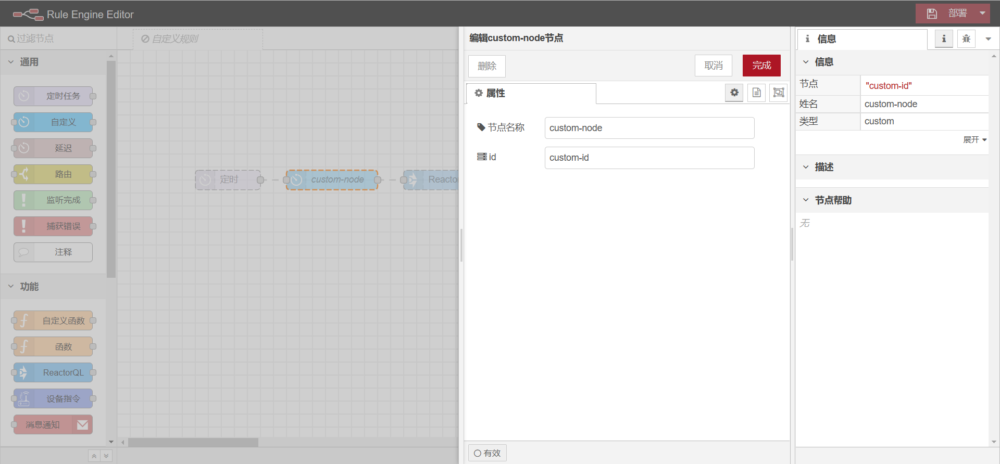

# 自定义规则引擎节点

### 名词说明

**RuleModel(规则模型)**:由多个`RuleNode(规则节点)`,`RuleLink(规则连线)`组成

**RuleNode(规则节点)**: 规则节点描述具体执行的逻辑

**RuleLink(规则连线)**: 用于将多个节点连接起来,将上一个节点的输出结果作为下一个节点的输入结果.

**Input(输入)**: 规则节点的数据输入

**Output(输出)**: 规则节点的数据输出

**Scheduler(调度器)**: 负责将模型转为任务(`Job`),并进行任务调度到`Worker`

**Worker(工作器)**: 负责执行,维护任务.

**ExecutionContext(执行上下文)**: 启动任务时的上下文,通过上下文获取输入输出配置信息等进行任务处理.

**TaskExecutor(任务执行器)**: 具体执行任务逻辑的实现

**TaskExecutorProvider(任务执行器提供商)**: 用于根据模型配置以及上下文创建任务执行器.

**RuleData(规则数据)**: 任务执行过程中的数据实例

<br>

### 自定义节点

1、创建一个类实现接口<code>TaskExecutorProvider</code>

2、将自定义的类添加<code>@Component</code>注解加入容器

```java
@AllArgsConstructor
@Component
@EditorResource(
    id = "custom",
    name = "自定义组件",
    //节点显示需要填入的数据
    editor = "rule-engine/editor/common/custom-node.html",
    //节点显示说明
    helper = "rule-engine/i18n/zh-CN/common/custom-node.html",
    order = 2
)
public class MyCustomExecutorProvider implements TaskExecutorProvider {

    private final EventBus eventBus;

    //定义执行器标识
    @Override
    public String getExecutor() {
        return "custom";
    }

    //创建执行任务
    @Override
    public Mono<TaskExecutor> createTask(ExecutionContext context) {
        return Mono.just(new DeviceSceneTaskExecutor(context));
    }
	
    //定义一个内部内继承FunctionTaskExecutor
    class CustomTaskExecutor extends FunctionTaskExecutor {

        private String id;

        private String name;

        public DeviceSceneTaskExecutor(ExecutionContext context) {
            super("自定义执行器", context);
            reload();
        }

        //定义节点重新加载时执行的方法
        @Override
        public void reload() {
          //从前端页面配置中获取相应的字段
          this.id = (String) getContext().getJob().getConfiguration().get("id");
          this.name = (String) getContext().getJob().getConfiguration().get("name");
        }

        //定义节点启动时执行的方法
        //拿到配置中的id和name封装为map，再通过eventBus将数据发布到topic为/custom/id事件总线中
        @Override
        protected Publisher<RuleData> apply(RuleData input) {
            Map<String, Object> data = new HashMap<>();
            data.put("id", id);
            data.put("name", name);
            data.put("executeTime", System.currentTimeMillis());

            input.acceptMap(data::putAll);

            return eventBus
                .publish(String.join("/", "custom", id), data)
                //转换新的数据
                .thenReturn(context.newRuleData(input.newData(data)));
        }
    }
}
```

<br>

### 配置并显示自定义节点

1、在包<code>rule-engine.editor.common</code>下创建一个<code>custom-node.html</code>文件

2、配置节点所需填写内容

``` html
<script type="text/html" data-template-name="custom">
    <div class="form-row">
        <label for="node-input-name"><i class="fa fa-tag"></i> <span data-i18n="common.label.name"></span></label>
        <input type="text" placeholder="节点名称" id="node-input-name" data-i18n="[placeholder]common.label.name">
    </div>

    <div class="form-row">
        <label for="node-input-id"><i class="fa fa-server"></i> <span>id</span></label>
        <input type="text" id="node-input-id" placeholder="节点id">
    </div>
</script>

<script type="text/javascript">
    (function () {
        RED.nodes.registerType('custom', {
            category: 'common',
            name: "自定义",
            color: "#66ccff",
            defaults: {
                 name: {name:""},
                 id: {id:""}
            },
            inputs: 1,
            outputs: 1,
            icon: "timer.svg",
            label: function () {
                return this.name || "自定义";
            },
            labelStyle: function () {
                return this.name ? "node_label_italic" : "";
            },
            oneditprepare: function () {
            },
        });
    })()
</script>

```

3、在<code>rule-engine.i18n.zh-CN.common</code>包下创建<code>custom-node.html</code>并配置节点说明（可以跳过）

```html
<script type="text/html" data-help-name="custom">
  <p>自定义节点</p>
  <p>需要填入id</p>
  <p>需要填入name</p>
</script>
```

<br>

以上配置完成后可以在规则引擎编辑器中看到自定义的节点


### 使用自定义节点

<div class='explanation primary'>
  <p class='explanation-title-warp'>
    <span class='iconfont icon-bangzhu explanation-icon'></span>
    <span class='explanation-title font-weight'>说明</span>
  </p>
    本例以每10秒通过<code>EventBus</code>发布用户在自定义节点中配置的<code>id</code>和<code>name</code>以及当前系统时间为数据到<code>/custom/id</code>的主题中并通过<code>ReactorQL</code>订阅该主题并在函数中拿到数据并打印日志为例
</div>

1、在规则引擎编辑器中放置如下组件


2、节点内容分别如下

定时任务配置


自定义节点配置



reactorQL配置


全部配置完成后点击右上角的部署保存

3、启动自定义规则，右侧点击<code>debug</code>按钮，执行效果如下


