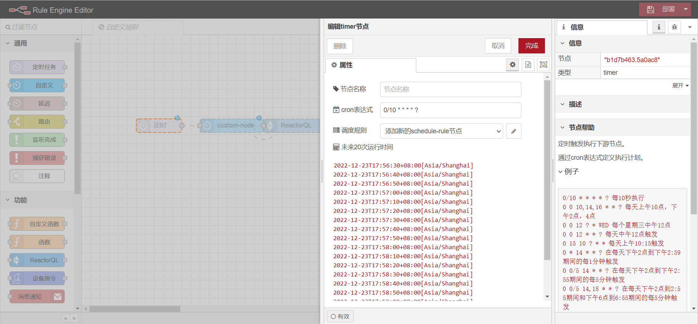
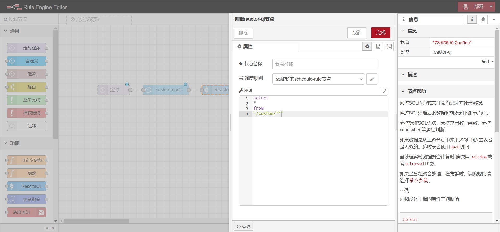
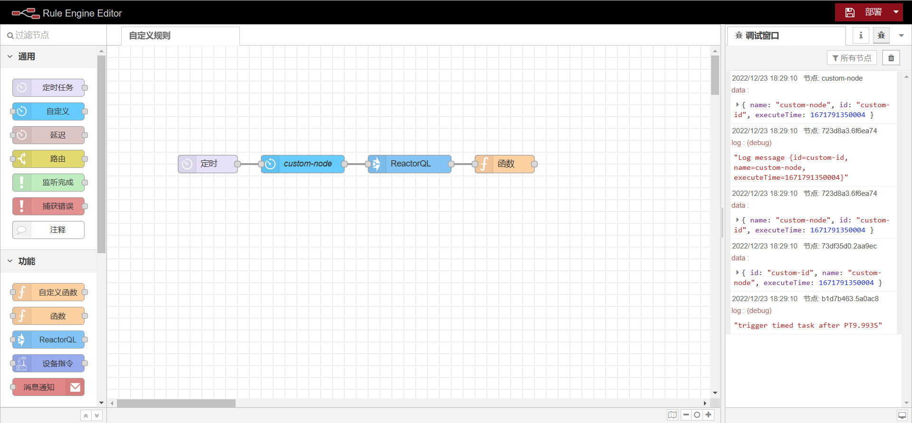

# 自定义规则引擎节点

#### 应用场景

<div class='explanation primary'>
  <p class='explanation-title-warp'>
    <span class='iconfont icon-bangzhu explanation-icon'></span>
    <span class='explanation-title font-weight'>说明</span>
  </p>
    当规则引擎中的节点没有适合自身系统业务时，可以通过代码自定义规则引擎节点
</div>

#### 指导介绍

<div class='explanation primary'>
  <p class='explanation-title-warp'>
    <span class='iconfont icon-bangzhu explanation-icon'></span>
    <span class='explanation-title font-weight'>说明</span>
  </p>
  <p><a href="#1">1. 创建自定义节点后端代码，实现业务系统自定义节点功能</a> </p>
  <p><a href="#2">2. 配置自定义节点html</a></p>
  <p><a href="#3">3. 如何在平台操作使用自定义节点</a></p>
  <p><a href="#4">4. 规则引擎常见名词说明</a></p>
  <p><a href="#5">5. 自定义节点实现国际化支持</a></p>

</div>


### <font id="1">自定义节点</font>

1、创建一个类实现接口<code>TaskExecutorProvider</code>,提供自定义节点的任务执行器
<div class='explanation primary'>
  <p class='explanation-title-warp'>
    <span class='iconfont icon-bangzhu explanation-icon'></span>
    <span class='explanation-title font-weight'>说明</span>
  </p>
   <p>需要使用<code>@Component</code>注解将任务执行器的自定义实现类加入容器</p>
   <p>在任务执行器的自定义实现类中，需要提供一个内部类实现<code>FunctionTaskExecutor</code>,用于执行自定义节点任务</p>
</div>


```java
@AllArgsConstructor
@Component
@EditorResource(
    id = "custom",
    name = "自定义组件",
    //节点显示需要填入的数据
    editor = "rule-engine/editor/common/2-custom-node.html",
    //该节点的说明页面
    helper = "rule-engine/i18n/zh-CN/common/2-custom-node.html",
    order = 2
)
public class MyCustomExecutorProvider implements TaskExecutorProvider {

    private final EventBus eventBus;

    //定义执行器标识
    @Override
    public String getExecutor() {
        return "custom";
    }

    //创建执行任务
    @Override
    public Mono<TaskExecutor> createTask(ExecutionContext context) {
        return Mono.just(new CustomTaskExecutor(context));
    }
	
    //定义一个内部类继承FunctionTaskExecutor
    class CustomTaskExecutor extends FunctionTaskExecutor {

        private String id;

        private String name;

        public CustomTaskExecutor(ExecutionContext context) {
            super("自定义执行器", context);
            reload();
        }

        //定义节点重新加载时执行的方法
        @Override
        public void reload() {
          //从前端页面配置中获取相应的字段
          this.id = (String) getContext().getJob().getConfiguration().get("id");
          this.name = (String) getContext().getJob().getConfiguration().get("name");
        }

        //定义节点具体功能的方法，在此处实现自己系统的业务方法
       @Override
        protected Publisher<RuleData> apply(RuleData input) {
            return this.doSomething(input);
        }
        
        //此处为简单的例子
        //拿到配置中的id和name封装为map，再通过eventBus将数据发布到topic为/custom/id事件总线中
        public Publisher<RuleData> doSomething(RuleData input){
            Map<String, Object> data = new HashMap<>();
            data.put("id", id);
            data.put("name", name);
            data.put("executeTime", System.currentTimeMillis());

            input.acceptMap(data::putAll);

            return eventBus
                .publish(String.join("/", "custom", id), data)
                //转换新的数据
                .thenReturn(context.newRuleData(input.newData(data)));
        }
    }
}
```


<br>

###  <font id="2">配置自定义节点html</font>

1、在resources资源路径下<code>rule-engine.editor.common</code>下创建一个<code>2-custom-node.html</code>文件

2、配置节点所需填写内容

<div class='explanation primary'>
  <p class='explanation-title-warp'>
    <span class='iconfont icon-bangzhu explanation-icon'></span>
    <span class='explanation-title font-weight'>说明</span>
  </p>
    <p>
       <p>该节点需要配置的内容可以使用<code>input</code>标签声明，其中标签的<code>id</code>需要以<code>node-input-</code>为前缀</p>
       <p>如本例中的<code>id="node-input-name"</code></p>
       <p>在后端可以通过<code>getContext().getJob().getConfiguration().get("name")</code>获取对应的输入值</p>
    </p>
</div>


``` html
<script type="text/html" data-template-name="custom">
    <div class="form-row">
        <label for="node-input-name"><i class="fa fa-tag"></i> <span data-i18n="common.label.name"></span></label>
        <input type="text" placeholder="节点名称" id="node-input-name" data-i18n="[placeholder]common.label.name">
    </div>

    <div class="form-row">
        <label for="node-input-id"><i class="fa fa-server"></i> <span>id</span></label>
        <input type="text" id="node-input-id" placeholder="节点id">
    </div>
</script>

<script type="text/javascript">
    (function () {
        RED.nodes.registerType('custom', {
            category: 'common',
            name: "自定义",
            color: "#66ccff",
            defaults: {
                 name: {name:""},
                 id: {id:""}
            },
            inputs: 1,
            outputs: 1,
            icon: "timer.svg",
            label: function () {
                return this.name || "自定义";
            },
            labelStyle: function () {
                return this.name ? "node_label_italic" : "";
            },
            oneditprepare: function () {
            },
        });
    })()
</script>

```

3、在resources资源路径下<code>rule-engine.i18n.zh-CN.common</code>创建<code>2-custom-node.html</code>并配置节点说明（可选）

```html
<script type="text/html" data-help-name="custom">
  <p>自定义节点</p>
  <p>需要填入id</p>
  <p>需要填入name</p>
</script>
```

<br>

以上配置完成后可以在规则引擎编辑器中看到自定义的节点


###  <font id="3">在平台操作使用自定义节点</font>

<div class='explanation primary'>
  <p class='explanation-title-warp'>
    <span class='iconfont icon-bangzhu explanation-icon'></span>
    <span class='explanation-title font-weight'>说明</span>
  </p>
    <p>
     以如下图规则模型所示：
      <p>定时任务(配置cron表达式)--->自定义节点(配置数据)--->reactorQl(订阅自定义节点数据)--->函数(打印日志)</p>
    </p>
</div>


1、在规则引擎编辑器中放置如下组件


2、节点内容分别如下

定时任务配置



自定义节点配置


reactorQL配置



函数配置


全部配置完成后点击右上角的部署保存

3、启动自定义规则，右侧点击<code>debug</code>按钮，执行效果如下




###  <font id="4">规则引擎常见名词说明</font>

**RuleModel(规则模型)**:由多个`RuleNode(规则节点)`,`RuleLink(规则连线)`组成

**RuleNode(规则节点)**: 规则节点描述具体执行的逻辑

**RuleLink(规则连线)**: 用于将多个节点连接起来,将上一个节点的输出结果作为下一个节点的输入结果.

**Input(输入)**: 规则节点的数据输入

**Output(输出)**: 规则节点的数据输出

**Scheduler(调度器)**: 负责将模型转为任务(`Job`),并进行任务调度到`Worker`

**Worker(工作器)**: 负责执行,维护任务.

**ExecutionContext(执行上下文)**: 启动任务时的上下文,通过上下文获取输入输出配置信息等进行任务处理.

**TaskExecutor(任务执行器)**: 具体执行任务逻辑的实现

**TaskExecutorProvider(任务执行器提供商)**: 用于根据模型配置以及上下文创建任务执行器.

**RuleData(规则数据)**: 任务执行过程中的数据实例

<br>


###  <font id="5">自定义节点如何实现国际化</font>

<div class='explanation primary'>
  <p class='explanation-title-warp'>
    <span class='iconfont icon-bangzhu explanation-icon'></span>
    <span class='explanation-title font-weight'>说明</span>
  </p>
    <p>可以配置jvm参数切换主时区</p>
</div>

```java
 以美国时区示例：
   //en:代表语言
  -Duser.language=en
   //US:代表国家
  -Duser.region=US

```

替换MyCustomExecutorProvider注解中的helper
```java
@EditorResource(
    id = "custom",
    name = "自定义组件",
    //节点显示需要填入的数据
    editor = "rule-engine/editor/common/2-custom-node.html",
    //该节点的说明页面
    helper = "rule-engine/i18n/{local}/common/2-custom-node.html",
    order = 2
)
```
<div class='explanation primary'>
  <p class='explanation-title-warp'>
    <span class='iconfont icon-bangzhu explanation-icon'></span>
    <span class='explanation-title font-weight'>说明</span>
  </p>
   <p><code>helper = "rule-engine/i18n/{language}/common/custom-node.html</code></p>
   <p>{locale}代表一种语言以及国家/地区</p>
   <p>程序启动时会在<code>org.jetlinks.pro.rule.engine.editor.resolve</code>替换成真正的路径，如被zh-CN、en-US或者其他替代</p>
</div>


3.创建I18n en-US相关的html文件

`rule-engine/i18n/en-US/common/2-custom-node.html`

```html
<script type="text/html" data-help-name="custom">
    <p>custom node</p>
    <h3>example</h3>
    <code>
    <pre>
    id:d1257d60.3add8
    name:custom i18n
    </pre>
    </code>
</script>
```


4.helper国际化html文档结构图如下：


#### <font id="5">常见问题</font>

*对开发过程中出现的问题进行总结*

<div class='explanation warning'>
  <p class='explanation-title-warp'>
    <span class='iconfont icon-bangzhu explanation-icon'></span>
    <span class='explanation-title font-weight'>问题1</span>
  </p>
    <p>
        Q：自定义节点配置完成后，规则引擎编辑器内左侧组件中未出现该节点
    </p>
    <p>
        A：确认后台代码自定义的类中<code>@EditorResource</code>注解内的<code>id</code>是否与前端页面中的<code>RED.nodes.registerType</code>第一个参数名对应
    </p>
</div>

<br>

<div class='explanation warning'>
  <p class='explanation-title-warp'>
    <span class='iconfont icon-bangzhu explanation-icon'></span>
    <span class='explanation-title font-weight'>问题2</span>
  </p>
    <p>
        Q：后台取不到在该自定义节点中填入的值
    </p>
    <p>
        A：首先判断与前端页面中规定的名称是否对的上，再确认前端在进行<code>id</code>绑定时是否添加<code>node-input-</code>的前缀
    </p>
</div>

<br>

<div class='explanation warning'>
  <p class='explanation-title-warp'>
    <span class='iconfont icon-bangzhu explanation-icon'></span>
    <span class='explanation-title font-weight'>问题3</span>
  </p>
    <p>
        Q：启动自定义规则时提示<code>no scheduler for custom</code>错误
    </p>
    <p>
        A：在<code>spring</code>服务启动时会将容器中实现了<code>TaskExecutorProvider</code>的类加入到HashMap中，如果出现重名的<code>executor</code>则会出现该错误。此时在后端代码自定义实现了<code>TaskExecutorProvider</code>的类中的<code>getExecutor()</code>方法中，重新编辑一个不重名的即可
    </p>
</div>

<div class='explanation warning'>
  <p class='explanation-title-warp'>
    <span class='iconfont icon-bangzhu explanation-icon'></span>
    <span class='explanation-title font-weight'>问题4</span>
  </p>
    <p>
        Q：<code>@EditorResource</code>注解中的<code>helper</code>参数路径动态化时只能用<code>{local}</code>？
    </p>
    <p>
        A：除了使用<code>{local}</code>外，还可以使用<code>{language}</code>和<code>{country}</code>
     <p>1. <code>{language}</code>启动时会被en、zh或者其他语言代码替代，对应的资源路径应为：<code>rule-engine/i18n/{语言}/common/custom-node.html</code></p>
     <p>2. <code>{country}</code>启动时会被CN、US或者其他国家代码替代，对应的资源路径应为：<code>rule-engine/i18n/{国家}/common/custom-node.html</code></p>
     <p>3. <code>{local}</code>启动时会被zh-CN、en-US或者其他语言-国家代码替代，对应的资源路径应为：<code>rule-engine/i18n/{语言-地区}
/common/custom-node.html</code>
</p>
    </p>
</div>


