# 订阅平台内部消息

## 应用场景

<div class='explanation primary'>
  <p class='explanation-title-warp'>
    <span class='iconfont icon-bangzhu explanation-icon'></span>
    <span class='explanation-title font-weight'>说明</span>
  </p>
    <p>
        订阅平台内部的数据转发到自己的业务系统内做自定义业务处理，可以订阅平台特定主题获取
    </p>
</div>


## 指导介绍

<p>1. <a href='/dev-guide/subs-platform-message.html#如何连接到平台'>连接到平台</a></p>
<p>2. <a href='/dev-guide/subs-platform-message.html#如何订阅平台消息'>使用Websocket或MQTT订阅</a></p>
<p>3. <a href='/dev-guide/subs-platform-message.html#平台回复消息格式'>平台回复消息格式</a></p>
<p>4. <a href='/dev-guide/subs-platform-message.html#如何取消订阅'>取消订阅</a></p>
<p>5. <a href='/dev-guide/subs-platform-message.html#开始订阅消息'>平台内可订阅的topic列表</a></p>


## 如何连接到平台

1、使用websocket进行连接

<div class='explanation primary'>
  <p class='explanation-title-warp'>
    <span class='iconfont icon-bangzhu explanation-icon'></span>
    <span class='explanation-title font-weight'>说明</span>
  </p>
    <p>
        通过前端地址连接：<code>ws://前端服务地址:前端服务端口号/api/messaging/{token}?:X_Access_Token={token}</code><br>
        通过后端地址连接：<code>ws://后台服务地址:后台服务端口号/messaging/{token}</code><br>其中<code>{token}</code>可通过登录系统或者使用OpenAPI获取。
    </p>
</div>


此处以JavaScript代码为例，`token`可以在已经登录了的JetLinks平台内打开控制台->网络->Fetch/XHR选择其中任意一个请求查看`X-Access-Token`请求头获取

```javascript
// 如果认证失败,会立即返回消息: {"message":"认证失败","type":"authError"},并断开连接

//通过前端服务连接
let ws_front = new WebSocket("ws://192.168.66.203:9000/api/messaging/d25db4e910caaef90c57ed7c8c45f922?:X_Access_Token=d25db4e910caaef90c57ed7c8c45f922");

//通过后端服务连接
let ws_back = new WebSocket("ws://192.168.66.203:8844/messaging/d25db4e910caaef90c57ed7c8c45f922");

ws_front.onclose = function(e){console.log(e)};
ws_front.onmessage = function(e){console.log(e.data)}
```

可以使用Postman进行连接

通过后端服务连接

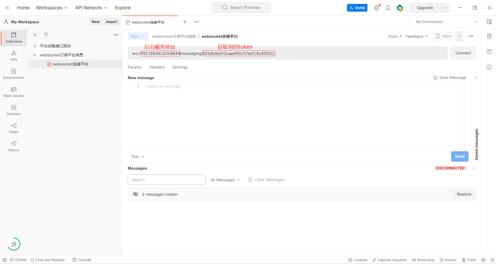

通过前端服务连接

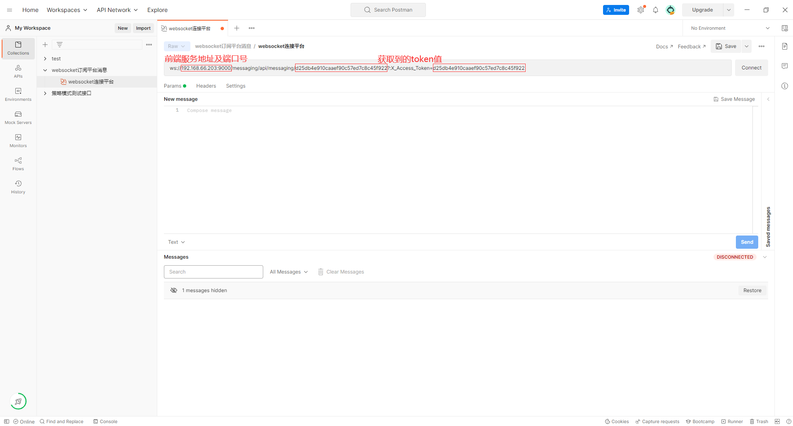


<br>

2、使用MQTT进行连接

在`jetlinks-standalone`模块中找到`application.yml`配置文件并开启使用MQTT订阅平台消息的配置

```yaml
messaging:
  mqtt:
    enabled: true #开启mqtt支持
    port: 11883 # 端口
    host: 0.0.0.0 #绑定网卡
```

默认使用`token`(可以使用`OpenAPI`申请token)作为`clientId`，连接地址为JetLinks平台部署的ip地址，默认端口为11883，`username`和`password`可以不填写。可以通过实现接口`MqttAuthenticationHandler`来自定义认证策略.


## 如何订阅平台消息

1、使用Websocket订阅

消息格式

```json
{
    "type": "sub", //固定为sub
    "topic": "/device/*/*/**", //想要订阅的topic,具体订阅可以查看本文档的topic列表内容
    "parameter": { //参数,不同的订阅请求,支持的参数不同
        
    },
    "id": "request-id" //请求ID, 请求的标识,服务端在推送消息时,会将此标识一并返回.
}
```


<br>

2、使用MQTT进行订阅

<div class='explanation primary'>
  <p class='explanation-title-warp'>
    <span class='iconfont icon-bangzhu explanation-icon'></span>
    <span class='explanation-title font-weight'>说明</span>
  </p>
    <p>
        因为MQTT订阅时没有办法携带消息体，所以想要传入特定参数只能通过在订阅topic后方添加参数
    </p>
</div>

<div class='explanation warning'>
  <p class='explanation-title-warp'>
    <span class='iconfont icon-jinggao explanation-icon'></span>
    <span class='explanation-title font-weight'>警告</span>
  </p>
	<p>
        平台topic使用的通配符为<code>*</code>，在使用MQTT订阅时需要将通配符转换为MQTT的通配符：<code>*</code>转为<code>+</code>，<code>**</code>转为<code>#</code>
    </p>
</div>


## 平台回复消息格式

websocket回复消息格式：

```json
{
	"payload":{}, //实际收到的消息内容, 与订阅的主题相关
	"requestId": "request-id", //与订阅请求的id一致
	"topic": "/device/demo-device/test0/offline", //topic,实际产生数据的topic
	"type": "result" //类型 result:订阅结果 complete:结束订阅 error:发生错误 
}
```

MQTT回复消息格式

```json
{根据订阅主题不同而不同，可以视作websocket的回复消息中payload部分的数据}
```


## 如何取消订阅

websocket发送消息，格式为：

```json
{
    "type":"unsub",//固定为unsub
     "id": "request-id" //与订阅请求id一致
}
```


## 开始订阅消息

<div class='explanation primary'>
  <p class='explanation-title-warp'>
    <span class='iconfont icon-bangzhu explanation-icon'></span>
    <span class='explanation-title font-weight'>说明</span>
  </p>
    <p>
        当平台内部推送消息到某个主题上与订阅的主题相匹配才能接收到消息，type为complete时标识本此订阅已结束，通常是订阅有限数据流时（比如发送设备指令），或者取消订阅时会返回此消息。
    </p>
</div>


<div class='explanation warning'>
  <p class='explanation-title-warp'>
    <span class='iconfont icon-jinggao explanation-icon'></span>
    <span class='explanation-title font-weight'>警告</span>
  </p>
	<p>
        如果订阅时使用通配符，可能会收到大量的消息，请保证消息的处理速度，否则会影响系统消息吞吐量。在取消订阅之前，多次传入相同的id是无效的，不会重复订阅。
    </p>
</div>


#### 平台内部主题

| 匹配Topic                                                    | 说明                                                 |
| ------------------------------------------------------------ | ---------------------------------------------------- |
| `/device/*/*/**`                                             | <a href='#device-message'>订阅设备消息</a>           |
| `/alarm/*/*/*`                                               | <a href='#device-alarm'>告警相关消息</a>             |
| `/rule-engine/**`                                            | <a href='#rule-engine'>规则引擎</a>                  |
| `/device-message-sender/*/*`                                 | <a href='#device-send-message'>设备消息发送</a>      |
| `/dashboard/**`                                              | <a href='#dashboard'>仪表盘相关消息</a>              |
| `/notifications`                                             | <a href='#notifications'>通知推送</a>                |
| `/scene/*`                                                   | <a href='#scene'>场景联动事件</a>                    |
| `/device-batch/*`                                            | <a href='#device-bash'>设备批量操作</a>              |
| `/device-current-state`                                      | <a href='#device-current-state'>设备当前状态消息</a> |
| `/debug/device/*/trace`                                      | <a href='#device-debug-trace'>设备诊断消息</a>       |
| `/device-firmware/publish`                                   | <a href='#device-firm'>推送设备固件更新</a>          |
| `/virtual-property-debug`                                    | <a href='#virtual-property'>虚拟属性调试</a>         |
| `/network/simulator/**`                                      | <a href='#simulator'>模拟器消息订阅</a>              |
| `/network/http/client/*/_send`<br>`/network/http/server/*/_subscribe` | <a href='#http'>HTTP调试</a>                         |
| `/network/mqtt/client/*/_subscribe/*`<br>`/network/mqtt/client/*/_publish/*` | <a href='#mqtt-client'>MQTT客户端调试</a>            |
| `/network/mqtt/server/*/_subscribe/*`                        | <a href='#mqtt-server'>MQTT服务调试</a>              |
| `/network/tcp/client/*/_send`<br>`/network/tcp/client/*/_subscribe` | <a href='#tcp-client'>TCP客户端调试</a>              |
| `/network/tcp/server/*/_subscribe`                           | <a href='#tcp-server'>TCP服务调试</a>                |
| `/network/udp/*/_send`<br>`/network/udp/*/_subscribe`        | <a href='#udp'>UDP调试</a>                           |
| `/network/websocket/client/*/_subscribe/*`<br>`/network/websocket/client/*/_publish/*` | <a href='#websocket-client'>WebSocket客户端调试</a>  |
| `/network/websocket/server/*/_subscribe`                     | <a href='#websocket-server'>WebSocket服务调试</a>    |
| `/network/coap/client/*/_send`<br/>`/network/coap/server/*/_subscribe` | <a href='#coap'>CoAP调试相关消息</a>                 |


#### <font id='device-message'>订阅设备消息</font>

<div class='explanation primary'>
  <p class='explanation-title-warp'>
    <span class='iconfont icon-bangzhu explanation-icon'></span>
    <span class='explanation-title font-weight'>说明</span>
  </p>
    <p>
与消息网关中的设备<code>topic</code>一致，具体想要订阅的<code>topic</code>可以参考<a href='http://doc.jetlinks.cn/function-description/device_message_description.html#设备消息对应事件总线topic' target='blank'>topic列表</a>。 消息负载(<code>payload</code>)与<a  href='http://doc.jetlinks.cn/function-description/device_message_description.html#平台统一设备消息定义' target='blank'>设备消息类型</a>一致。
    </p>
</div>


以订阅产品为`product_test`下的设备`device_test_01`的属性上报消息为例

向websocket发送订阅信息

```json
{
    "type": "sub",
    "topic": "/device/product_test/device_test_01/message/property/report",
    "parameter": {},
    "id": "request-id"
}
```

使用<a href='https://mqttx.app/zh' target='blank'>MQTTX</a>模拟设备上报一条属性，`topic`为`/product_test/device_test_01/properties/report`，使用协议为<a href='https://github.com/jetlinks/jetlinks-official-protocol' target='blank'>官方协议</a>的`v3`分支

```json
//MQTT发送的消息体
{
 "properties":{
    "temperature":48.9 //该产品配置的温度属性
 }
}
```

收到平台回复消息：

```json
{
	"payload": {
		"deviceId": "device_test_01",
		"headers": {
			"deviceName": "测试设备01",
			"productId": "product_test",
			"_uid": "1608016343709896704"
		},
		"messageType": "REPORT_PROPERTY",
		"properties": {
			"temperature": 48.9
		},
		"timestamp": 1672215946496
	},
	"requestId": "request-id",
	"topic": "/device/product_test/device_test_01/message/property/report",
	"type": "result"
}
```

<br>

使用MQTT订阅


#### <font id='device-alarm'>订阅告警相关消息</font>

<div class='explanation primary'>
  <p class='explanation-title-warp'>
    <span class='iconfont icon-bangzhu explanation-icon'></span>
    <span class='explanation-title font-weight'>说明</span>
  </p>
    <p>
        告警相关消息，<code>{targetType}</code>目标类型，<code>{targetId}</code>目标id，<code>{alarmId}</code>告警id。当设备告警第一次触发后如果后续未在告警记录中进行处理，则后续不会订阅到本次已经触发过的告警
    </p>
</div>

使用websocket订阅


```json
	{
        "type": "sub",
        "topic": "/alarm/{targetType}/{targetId}/{alarmId}",
        "parameter": {},
        "id": "request-id"
	}
```

使用MQTT订阅

```kotlin
/alarm/{targetType}/{targetId}/{alarmId}
```

| `targetType` | 说明                                                         |
| :----------: | :----------------------------------------------------------- |
|  `product`   | 当`targetType`为`product`时，则对应的`targetId`为产品id      |
|   `device`   | <p>当`targetType`为`device`时，则对应的`targetId`为设备id</p> |
|    `org`     | <p>当`targetType`为`org`时，则对应的`targetId`为组织id，此时平台回复的报文格式中`bingdings`会增加一个`{"id":"组织id","type":"org"}`的组织信息；如果当前用户存在多个组织，则每个组织均会订阅到该次告警信息，`bingdings`中则为对应组织的信息（组织<b>分配的资产中有当前产品及该产品下对应的设备</b>才能订阅到此次告警信息）</p> |
|   `other`    | <p>当`targetType`为`other`时，平台回复的报文格式中则不会存在`sourceId`,`sourceName`,`sourceType`三个字段，此时的`targetId`则为想要订阅的告警配置的`id`</p> |

平台回复消息具体格式

```json
{
    "payload": {
        "alarmConfigId": "1614934749509095424",//告警配置id
        "alarmConfigName": "设备告警",//告警配置名
        //告警具体信息
        "alarmInfo": "{\"code\":\"TIME_OUT\",\"branch_1_group_1_action_1\":{\"headers\":{\"errorType\":\"org.jetlinks.core.exception.DeviceOperationException\",\"errorMessage\":\"error.code.time_out\"},\"functionId\":\"alarm\",\"code\":\"TIME_OUT\",\"messageType\":\"INVOKE_FUNCTION_REPLY\",\"success\":false,\"messageId\":\"1619208766628511745\",\"message\":\"error.code.time_out\",\"deviceId\":\"1614934616587407360\",\"timestamp\":1674884438088},\"deviceId\":\"1614934616587407360\",\"scene\":{\"sourceId\":\"1614931520184422400\",\"data\":{\"temperature\":48.1},\"data_temperature\":48.1,\"deviceId\":\"1614931520184422400\",\"deviceName\":\"场景联动设备\",\"productName\":\"场景联动产品\",\"timestamp\":1674884428063,\"productId\":\"1614931310716686336\",\"sourceType\":\"device\",\"traceparent\":\"00-84a84b8e2dcff1098906b8849ca74c19-bf77534ce630b8f8-01\",\"_now\":1674884428064,\"sourceName\":\"场景联动设备\",\"_uid\":\"b4X25DEfVXuZTyDq-k6RKnXMltNpf4Rh\"},\"functionId\":\"alarm\",\"messageType\":\"INVOKE_FUNCTION_REPLY\",\"timestamp\":1674884438088,\"headers\":{\"errorType\":\"org.jetlinks.core.exception.DeviceOperationException\",\"errorMessage\":\"error.code.time_out\"},\"messageId\":\"1619208766628511745\",\"message\":\"error.code.time_out\",\"success\":false}",
        "alarmRecordId": "20f0c110fed8402e862cb7c15c992569",//告警记录id
        "alarmTime": 1674884438091,//告警发生时间
        "bindings": [
            {
                "id": "1199596756811550720",
                "type": "user"
            }
        ],
        "id": "b4X25FhTnJgqofbv0RxD4uLJcvvbS0v3",
        "level": 1,//告警等级
        "sourceId": "1614931520184422400",//源id，此处为设备id
        "sourceName": "场景联动设备",//源名字，此处为设备名
        "sourceType": "device",//源类型，此处为设备
        "targetId": "1614931310716686336",//目标id,此处为产品id
        "targetName": "场景联动产品",//目标名，此处为产品名
        "targetType": "product"//目标类型，此处为产品
    },
    "requestId": "request-id",//本次订阅的id
    "topic": "/alarm/product/1614931310716686336/1614934749509095424",//订阅的topic
    "type": "result"//结果类型
}
```

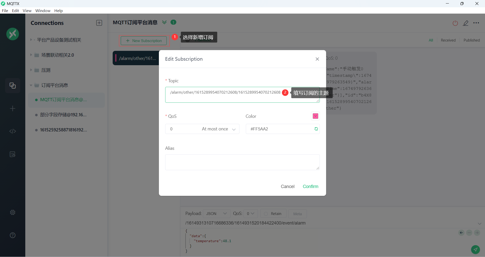


#### <font id='rule-engine'>订阅规则引擎执行相关消息</font>

<div class='explanation primary'>
  <p class='explanation-title-warp'>
    <span class='iconfont icon-bangzhu explanation-icon'></span>
    <span class='explanation-title font-weight'>说明</span>
  </p>
    <p>
       规则引擎相关
    </p>
</div>

发送消息到websocket

```json
{
    "type": "sub", //固定为sub
    "topic": "/rule-engine/{instanceId}/{nodeId}/event/{event}",
    "parameter": {},
    "id": "request-id" //请求ID, 请求的标识,服务端在推送消息时,会将此标识一并返回.
}
```

使用mqtt订阅

```kotlin
/rule-engine/{instanceId}/{nodeId}/event/{event}
```

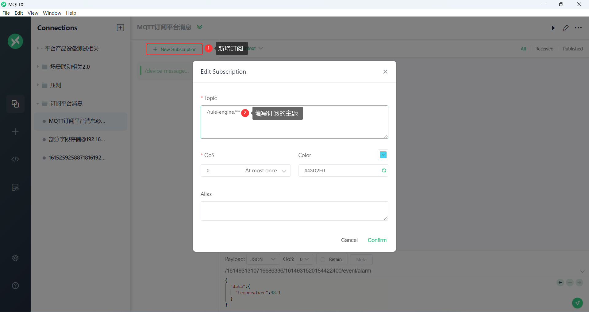

| parameter  | 说明                                                         |
| ---------- | ------------------------------------------------------------ |
| instanceId | 规则编排内的某一实例id,可以在数据库表rule-instance内的id字段查看 |
| nodeId     | 当对应的实例启动后会在rule_task_snapshot内生成一条记录，nodeId即为此表内的node_id字段 |
| event      | state-->订阅该实例节点的状态（比如从启动到停止，从停止到启动）<br/>running-->订阅该实例节点启动时的信息<br/>shutdown-->订阅该实例节点停止时的信息<br/>result-->订阅该实例节点中编排的组件收发的数据信息 |


#### <font id='device-send-message'>订阅设备消息发送</font>

<div class='explanation primary'>
  <p class='explanation-title-warp'>
    <span class='iconfont icon-bangzhu explanation-icon'></span>
    <span class='explanation-title font-weight'>说明</span>
  </p>
    <p>
       <code>deviceId</code>可以传入多个例如device1,device2，也可以使用通配符*，如果设备id使用通配符则<code>productId</code>不能进行通配，<code>parameter</code>内的<code>messageType</code>可以为<code>READ_PROPERTY</code>(读取属性)，<code>WRITE_PROPERTY</code>(修改属性)，<code>INVOKE_FUNCTION</code>(调用功能)
    </p>
</div>


使用websocket订阅


```json
{
    //固定为sub
    "type": "sub", 
    "topic": "/device-message-sender/{productId}/{deviceId}", 
    //根据不同的消息,参数也不同. 具体见: 平台统一消息定义
    "parameter": {
        // 消息类型
        "messageType":"READ_PROPERTY",
        //想要设备回复的属性id标识，此处为读取设备温度，要求设备回复当前温度值
        "properties":["temperature"],
        //头信息
        "headers":{
    		// 是否异步,异步时,平台不等待设备返回指令结果
            "async":false 
        }
    },
	//请求id, 请求的标识,服务端在推送消息时,会将此标识一并返回
    "id": "request-id" 
}
```

<br>

使用MQTT订阅

```kotlin
/device-message-sender/{productId}/{deviceId}?messageType={messageType}&properties[0]=temperature&headers={"async":false}
```

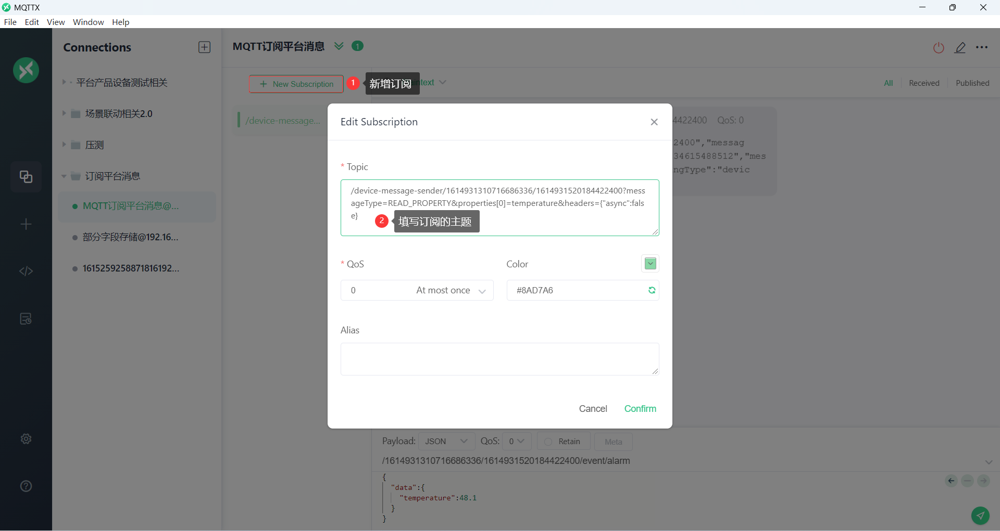

| parameter     | 参数说明                                                     |
| ------------- | ------------------------------------------------------------ |
| `messageType` | 消息类型，可选参数有<code>READ_PROPERTY</code>(读取属性)，<code>WRITE_PROPERTY</code>(修改属性)，<code>INVOKE_FUNCTION</code>(调用功能) |
| `properties`  | 产品或设备实际的属性                                         |
| `headers`     | 头信息，通常为`async`，确定是否是异步                        |


#### <font id='dashboard'>订阅仪表盘消息</font>

<div class='explanation primary'>
  <p class='explanation-title-warp'>
    <span class='iconfont icon-bangzhu explanation-icon'></span>
    <span class='explanation-title font-weight'>说明</span>
  </p>
    <p>
        <code>dashboard</code>仪表盘：一类监控数据的分类，例如: 系统监控，设备监控。<br><code>object</code>仪表盘对象，例如: CPU，内存，设备状态等。<br><code>measurement</code>监控指标，例如: CPU使用率，设备在线状态等。<br><code>dimension</code>指标维度，例如: 实时CPU使用率，设备历史状态等。
    </p>
</div>


使用Websocket订阅

```json
	{
        "type": "sub",
        "topic": "/dashboard/{dashboard}/{object}/{measurement}/{dimension}",
        "parameter": {},
        "id": "request-id"
	}
```

使用MQTT订阅

```kotlin
/dashboard/{dashboard}/{object}/{measurement}/{dimension}
```

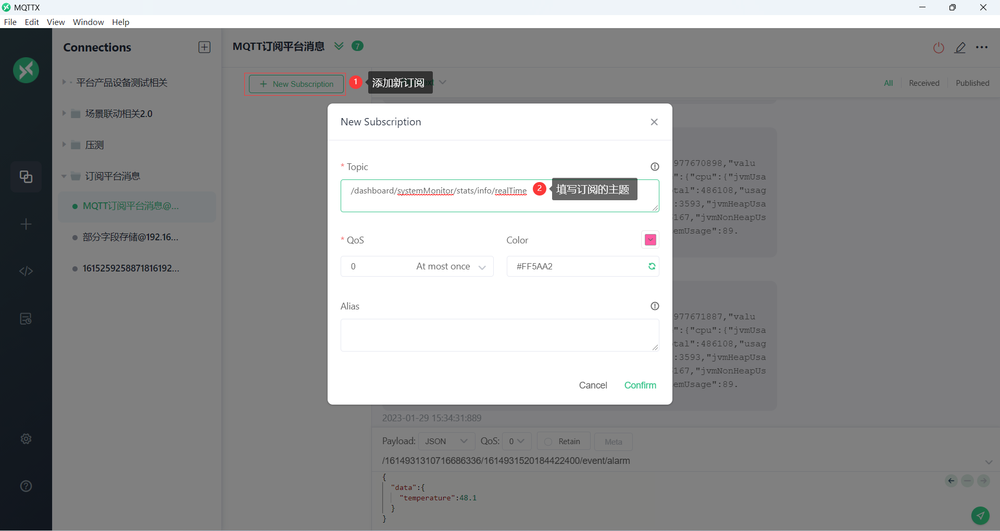

```json
"topic": "/dashboard/{dashboard}/{object}/{measurement}/{dimension}"
```

<div class='explanation warning'>
  <p class='explanation-title-warp'>
    <span class='iconfont icon-jinggao explanation-icon'></span>
    <span class='explanation-title font-weight'>警告</span>
  </p>
	<p>
        选择订阅主题时确认表格中某一格内数据的展示顺序，如果是竖着表示只能选择其中一个且与前后位置相一致，例如<code>systemMonitor</code>这一行数据中，<code>stats</code>后只能选取<code>info</code>而不能选择<code>traffic</code>；如果是横着则表示前一个维度的值可以选取当前格内的任意一个。
    </p>
</div>


可以订阅的主题有


| 仪表盘(dashboard) | 仪表盘对象(object)                 | 监控指标(measurement)                                        | 指标维度(dimension)                                          | 说明     |
| ----------------- | ---------------------------------- | ------------------------------------------------------------ | ------------------------------------------------------------ | -------- |
| `gatewayMonitor`  | `deviceGateway`                    | `connected`<br>`disconnected`<br>`sent_message`<br>`rejected`<br>`connection`<br>`received_message` | `agg`,`history`                                              | 网关消息 |
| `alarm`           | `record`                           | `trend`<br>`rank`                                            | `agg`                                                        | 告警信息 |
| `systemMonitor`   | `stats`<br>`network`               | `info`<br>`traffic`                                          | `realTime,history`<br>`agg`                                  | 系统信息 |
| `device`          | `session`<br>`message`<br>`status` | `online`<br>`quantity`<br>`change,record`                    | `agg`<br>`realTime,agg`<br>`realTime,agg`<br>`current,aggOnline` | 设备信息 |
| `collector`       | `pointData`                        | `quantity`                                                   | `realTime,agg`                                               | 点位信息 |


#### <font id='notifications'>订阅通知消息</font>

<div class='explanation primary'>
  <p class='explanation-title-warp'>
    <span class='iconfont icon-bangzhu explanation-icon'></span>
    <span class='explanation-title font-weight'>说明</span>
  </p>
    <p>
       会根据当前连接到平台的<code>token</code>去订阅相应用户的通知消息
    </p>
</div>


使用websocket订阅


```json
{
    "type": "sub",
    "topic": "/notifications",
    "parameter": {},
    "id": "request-id"
}
```

使用MQTT订阅

```kotlin
/notifications
```

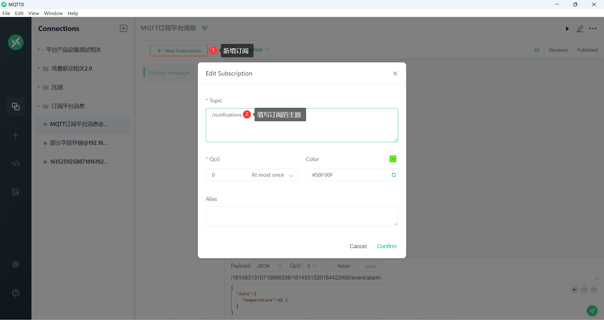


#### <font id='scene'>订阅场景联动消息</font>

<div class='explanation primary'>
  <p class='explanation-title-warp'>
    <span class='iconfont icon-bangzhu explanation-icon'></span>
    <span class='explanation-title font-weight'>说明</span>
  </p>
    <p>
       <code>{sceneId}</code>为场景联动id
    </p>
</div>


使用websocket订阅


```json
{
    "type": "sub",
    "topic": "/scene/{sceneId}",
    "parameter": {},
    "id": "request-id"
}
```

使用MQTT订阅

```kotlin
/scene/{sceneId}
```

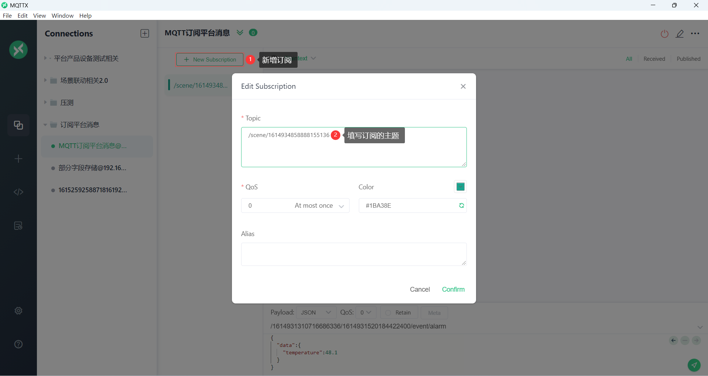


#### <font id='device-bash'>订阅设备批量操作消息</font>

<div class='explanation primary'>
  <p class='explanation-title-warp'>
    <span class='iconfont icon-bangzhu explanation-icon'></span>
    <span class='explanation-title font-weight'>说明</span>
  </p>
    <p>
        <code>type</code>类型可以为<code>state-sync</code>(批量同步设备状态)或者<code>deploy</code>(批量发布设备)
    </p>
</div>


使用websocket订阅


```json
{
    "type": "sub", //固定为sub
    "topic": "/device-batch/{type}",
    "parameter": {
        "query":{"where":"productId is my-product"}//查询条件为动态查询条件
    },
    "id": "request-id"
}
```

使用MQTT订阅

```kotlin
/device-batch/{type}?query={"where":"productId is my-product"}
```

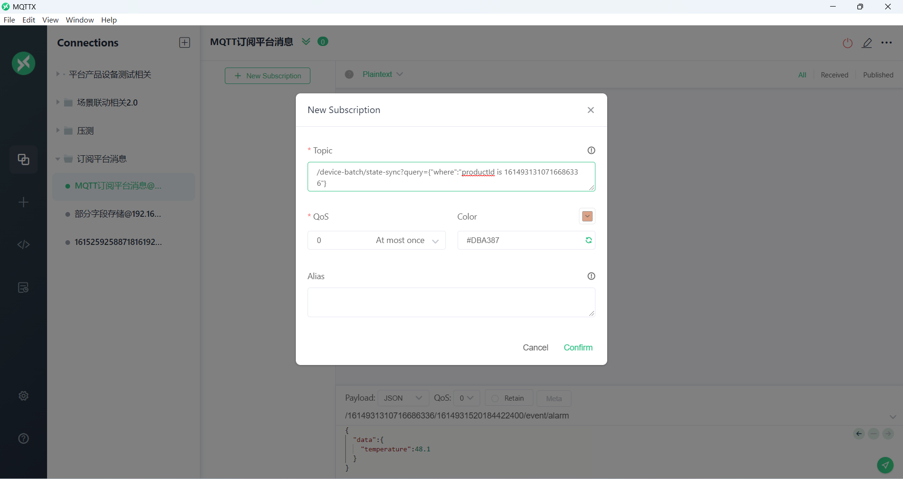

| parameter | 参数说明     |
| --------- | ------------ |
| `query`   | 动态查询条件 |


#### <font id='device-current-state'>订阅设备当前状态消息</font>

<div class='explanation primary'>
  <p class='explanation-title-warp'>
    <span class='iconfont icon-bangzhu explanation-icon'></span>
    <span class='explanation-title font-weight'>说明</span>
  </p>
    <p>
        订阅某一个设备的状态信息，无法使用通配符
    </p>
</div>


使用websocket订阅

```json
{
    "type": "sub",
    "topic": "/device-current-state",
    "parameter": {
        //必须指定设备id
        "deviceId":"deviceId"
    },
    "id": "request-id"
}
```

使用MQTT订阅

```kotlin
/device-current-state?deviceId={deviceId}
```


#### <font id='device-debug-trace'>设备诊断消息</font>

<div class='explanation primary'>
  <p class='explanation-title-warp'>
    <span class='iconfont icon-bangzhu explanation-icon'></span>
    <span class='explanation-title font-weight'>说明</span>
  </p>
    <p>
       订阅某一个设备的诊断消息
    </p>
</div>


使用websocket订阅

```json
{
    "type": "sub",
    "topic": "/debug/device/{deviceId}/trace",
    "parameter": {
     
    },
    "id": "request-id"
}
```


#### <font id='device-firm'>订阅推送设备固件更新消息</font>

<div class='explanation primary'>
  <p class='explanation-title-warp'>
    <span class='iconfont icon-bangzhu explanation-icon'></span>
    <span class='explanation-title font-weight'>说明</span>
  </p>
    <p>
       <code>taskId</code>可以到数据库中的<code>jetlinks</code>数据库下的<code>dev_firmware_upgrade_task</code>表中找到
    </p>
</div>


| parameter | 参数说明 |
| --------- | -------- |
| `taskId`  | 任务id   |

使用websocket订阅


```json
{
    "type": "sub",
    "topic": "/device-current-state",
    "parameter": {
        //必须指定任务id
        "taskId":"taskId"
    },
    "id": "request-id"
}
```

使用MQTT订阅

```kotlin
/device-current-state?taskId={taskId}
```

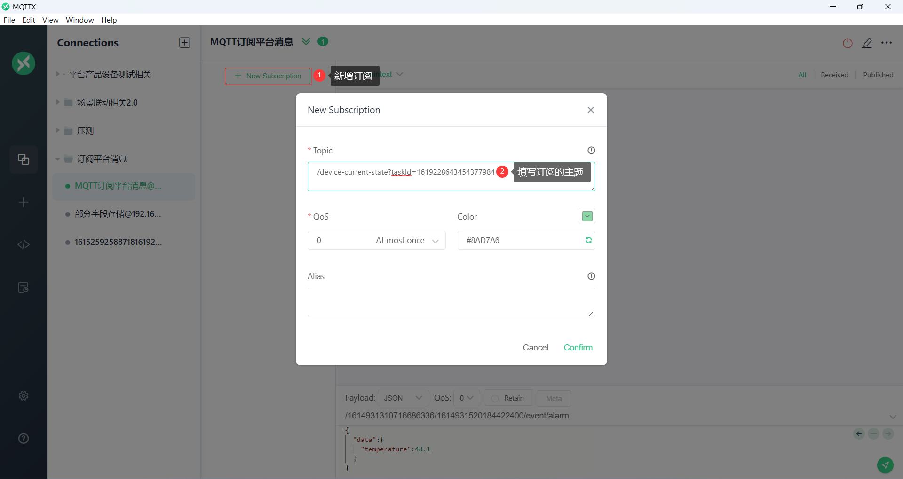


#### <font id='virtual-property'>订阅虚拟属性调试消息</font>

使用websocket订阅

```json
{
    "type": "sub",
    "topic": "/virtual-property-debug",
    "parameter": {
        //虚拟id
        "virtualId":"Kelvin",
        //产品物模型中定义的虚拟属性
        "property":"virtual_temperature",
        //定义规则
        "virtualRule": {
            //固定为script
            "type":"script",
            //计算的规则
            "script":"return $recent(\"temperature\")+273.15"
        },
        //真实属性 计算虚拟属性时需要用到的值
        "properties":[
            {
                "id":"temperature",
                "type":"float",
                "current":100,
                "last":""
            }
        ]    
    },
    "id": "request-id"
}
```

使用MQTT订阅

```kotlin
/virtual-property-debug?virtualId=Kelvin&property=virtual_temperature&properties[0].id=temperature&properties[0].type=float&properties[0].current=100&virtualRule={"type":"script"%2C"script":"return $recent(\"temperature\")%2B273.15"}
```

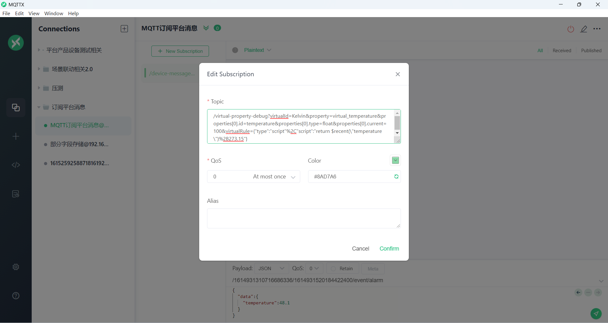

| parameter     | 参数说明                                                    |
| ------------- | ----------------------------------------------------------- |
| `virtualId`   | 虚拟id，通常为`当前时间戳-virtual-property`，可以自定义命名 |
| `property`    | 产品或设备物模型中定义的虚拟属性                            |
| `virtualRule` | 定义计算出该虚拟属性的具体规则                              |
| `properties`  | 计算出虚拟属性需要用的值                                    |


#### <font id='simulator'>订阅模拟器消息</font>

<div class='explanation primary'>
  <p class='explanation-title-warp'>
    <span class='iconfont icon-bangzhu explanation-icon'></span>
    <span class='explanation-title font-weight'>说明</span>
  </p>
    <p>
       <code>{id}</code>为创建的模拟器的id，<code>{sessionId}</code>指创建模拟器时填入的<code>clientId</code>，即设备id
    </p>
</div>


使用websocket订阅


```json
{
    "type": "sub",
    "topic": "/network/simulator/{id}/{sessionId}",
    "parameter": {},
    "id": "request-id"
}
```

使用MQTT订阅

```kotlin
/network/simulator/{id}/{sessionId}
```

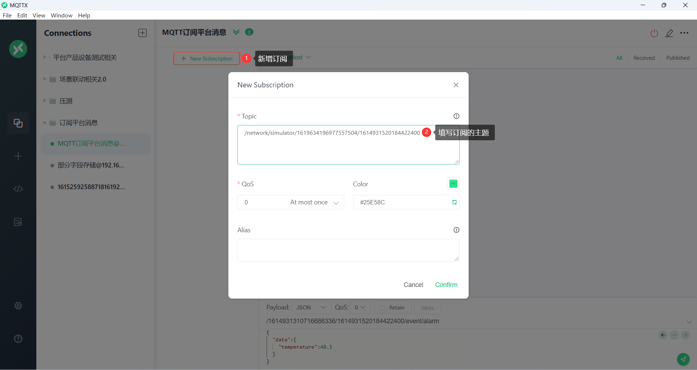


#### <font id='http'>订阅HTTP调试消息</font>

<div class='explanation primary'>
  <p class='explanation-title-warp'>
    <span class='iconfont icon-bangzhu explanation-icon'></span>
    <span class='explanation-title font-weight'>说明</span>
  </p>
    <p>
        订阅此主题分为HTTP客户端和HTTP服务端，当订阅主题以<code>/network/http/server</code>开头时订阅为HTTP服务，否则为HTTP客户端。
    </p>
</div>

订阅HTTP服务

使用websocket订阅

```json
//id可以在浏览器中打开控制台->network->Fetch/XHR,之后F5刷新页面在左侧找到_query/的请求中查看到
//也可以去数据库中的jetlinks数据库下的network_config表中查找
{
    "type": "sub",
    "topic": "/network/http/server/{id}/_subscribe",
    "parameter": {
        //请求参数字符串,如果未传入则默认为"HTTP/1.1 200 OK\nContent-Type application/json\n\n{\"success\":true}"
        "response":"response-params-string"
    },
    "id": "request-id"
}
```

使用MQTT订阅

```kotlin
//获取id方式同上
/network/http/server/{id}/_subscribe?response={response-params-string}
```

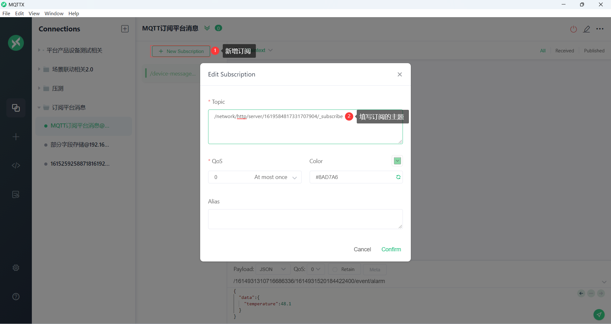

<br>

订阅HTTP客户端 

使用websocket订阅

```json
//id可以在浏览器中打开控制台->network->Fetch/XHR,之后F5刷新页面在左侧找到_query/的请求中查看到
//也可以去数据库中的jetlinks数据库下的network_config表中查找
{
    "type": "sub",
    "topic": "/network/http/server/{id}/_subscribe",
    "parameter": {
        //请求参数字符串
        "request":"request-params-string"
    },
    "id": "request-id"
}
```

使用MQTT订阅

```kotlin
//获取id方式同上
/network/http/server/{id}/_subscribe?request={request-params-string}
```


#### <font id='mqtt-client'>订阅MQTT客户端调试消息</font>

<div class='explanation primary'>
  <p class='explanation-title-warp'>
    <span class='iconfont icon-bangzhu explanation-icon'></span>
    <span class='explanation-title font-weight'>说明</span>
  </p>
    <p>
        订阅此主题的消息分为订阅时的消息和推送时的消息两部分，当<code>{pubsub}</code>为<code>_subscribe</code>时是订阅该id对应的组件在订阅时产生的消息，否则为<code>{_publish}</code>发布时产生的消息。<code>{id}</code>为MQTT客户端组件的id，<code>{type}</code>类型可以选择为<code>JSON</code>、<code>BINARY</code>、<code>STRING</code>、<code>HEX</code>
    </p>
</div>

订阅时的消息

使用websocket订阅


```json
//id可以在浏览器中打开控制台->network->Fetch/XHR,之后F5刷新页面在左侧找到_query/的请求中查看到
//也可以去数据库中的jetlinks数据库下的network_config表中查找
{
    "type": "sub",
    "topic": "/network/mqtt/client/{id}/_subscribe/{type}",
    "parameter": {
        //想要订阅的topic集合，如果是多个topic，之间用\n换行符分隔;如果未传入则默认是订阅所有主题
        "topics":"topics"
    },
    "id": "request-id"
}
```

使用MQTT订阅

```kotlin
//想要订阅的topic集合，如果是多个topic，之间用\n换行符分隔;如果未传入则默认是订阅所有主题
/network/mqtt/client/{id}/_subscribe/{type}?topics={topics}
```

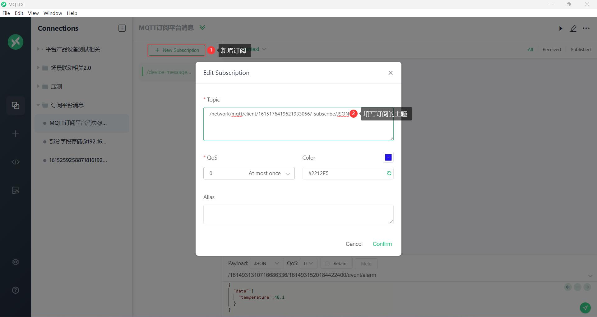


<br>

发布时的消息

使用websocket订阅


```json
//id可以在浏览器中打开控制台->network->Fetch/XHR,之后F5刷新页面在左侧找到_query/的请求中查看到
//也可以去数据库中的jetlinks数据库下的network_config表中查找
{
    "type": "sub",
    "topic": "/network/mqtt/client/{id}/_publish/{type}",
    "parameter": {
        //推送的数据 类型根据topic中的{type}决定 此处为JSON
        "data":{
            "data":123
        },
        //推送的topic
        "topic":"/test"
    },
    "id": "request-id"
}
```

使用MQTT订阅

```kotlin
/network/mqtt/client/{id}/_publish/{type}?data={需要推送的数据}
```

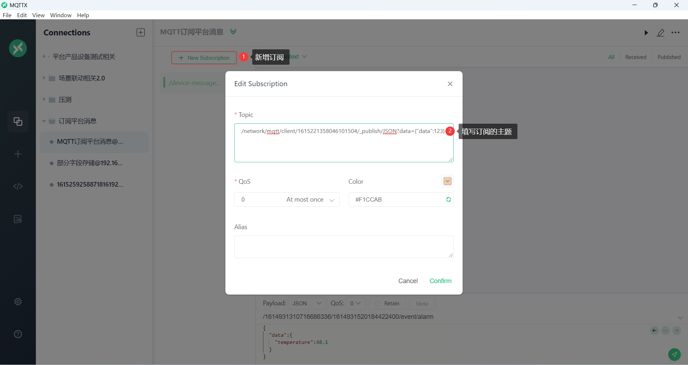


#### <font id='mqtt-server'>订阅MQTT服务调试消息</font>

<div class='explanation primary'>
  <p class='explanation-title-warp'>
    <span class='iconfont icon-bangzhu explanation-icon'></span>
    <span class='explanation-title font-weight'>说明</span>
  </p>
    <p>
       <code>{id}</code>为MQTT服务组件的id，<code>{type}</code>类型可以选择为<code>JSON</code>、<code>BINARY</code>、<code>STRING</code>、<code>HEX</code>
    </p>
</div>
使用websocket订阅


```json
//id可以在浏览器中打开控制台->network->Fetch/XHR,之后F5刷新页面在左侧找到_query/的请求中查看到
//也可以去数据库中的jetlinks数据库下的network_config表中查找
{
    "type": "sub",
    "topic": "/network/mqtt/server/{id}/_subscribe/{type}",
    "parameter": {},
    "id": "request-id"
}
```

使用MQTT订阅

```kotlin
/network/mqtt/server/{id}/_subscribe/{type}
```

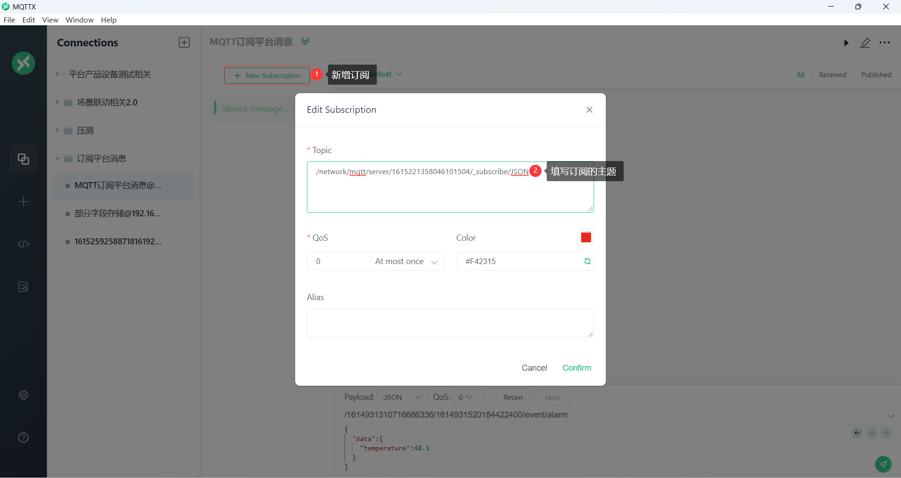


#### <font id='tcp-client'>订阅TCP客户端调试消息</font>

<div class='explanation primary'>
  <p class='explanation-title-warp'>
    <span class='iconfont icon-bangzhu explanation-icon'></span>
    <span class='explanation-title font-weight'>说明</span>
  </p>
    <p>
        订阅此主题的消息分为TCP发送和接收两个部分的消息，<code>{id}</code>为TCP客户端组件的id，<code>{type}</code>类型可以选择为<code>_send</code>或<code>_subscribe</code>
    </p>
</div>

```json
"topic": "/network/tcp/client/{id}/{type}"
```

订阅接收到的消息

使用websocket订阅

```json
{
    "type": "sub",
    "topic": "/network/tcp/client/{id}/_subscribe",
    "parameter": {
        //响应的数据，如果为16进制则以0x开头
        "response":"data"
    },
    "id": "request-id"
}
```

使用MQTT订阅

```kotlin
/network/tcp/client/{id}/_subscribe?response={data}
```

<br>

订阅发送的消息

使用websocket订阅

```json
{
    "type": "sub",
    "topic": "/network/tcp/client/{id}/_send",
    "parameter": {
        //请求的数据，如果为16进制则以0x开头
        "request":"data"
    },
    "id": "request-id"
}
```

使用MQTT订阅

```
/network/tcp/client/{id}/_send?request={data}
```


#### <font id='tcp-server'>订阅TCP服务调试消息</font>

<div class='explanation primary'>
  <p class='explanation-title-warp'>
    <span class='iconfont icon-bangzhu explanation-icon'></span>
    <span class='explanation-title font-weight'>说明</span>
  </p>
    <p>
       <code>{id}</code>为TCP服务组件的id
    </p>
</div>

```json
"topic": "/network/tcp/server/{id}/_subscribe"
```

订阅接收到的数据

使用websocket订阅

```json
{
    "type": "sub",
    "topic": "/network/tcp/server/{id}/_subscribe",
    "parameter": {
        //响应的数据，如果为16进制则以0x开头
        "response":"data"
    },
    "id": "request-id"
}
```

使用MQTT订阅

```kotlin
/network/tcp/server/{id}/_subscribe?response={data}
```


#### <font id='udp'>订阅UDP调试消息</font>

<div class='explanation primary'>
  <p class='explanation-title-warp'>
    <span class='iconfont icon-bangzhu explanation-icon'></span>
    <span class='explanation-title font-weight'>说明</span>
  </p>
    <p>
        订阅此主题的消息分为UDP发送和接收两个部分的消息，<code>{id}</code>为UDP组件的id，<code>{type}</code>类型可以选择为<code>_send</code>或<code>_subscribe</code>
    </p>
</div>
订阅接收到的消息

使用websocket订阅

```json
{
    "type": "sub",
    "topic": "/network/udp/{id}/_subscribe",
    "parameter": {},
    "id": "request-id"
}
```

使用MQTT订阅

```kotlin
/network/udp/{id}/_subscribe
```

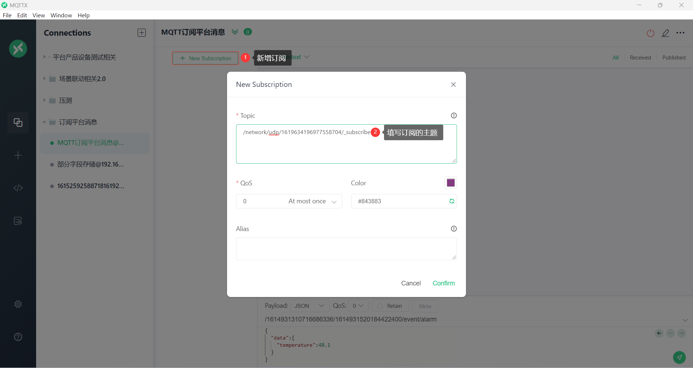


订阅发送的消息

使用websocket订阅

```json
{
    "type": "sub",
    "topic": "/network/tcp/client/{id}/_send",
    "parameter": {
        //请求的数据，如果为16进制则以0x开头
        "request":"data"
    },
    "id": "request-id"
}
```

使用MQTT订阅

```
/network/tcp/client/{id}/_send?request={data}
```

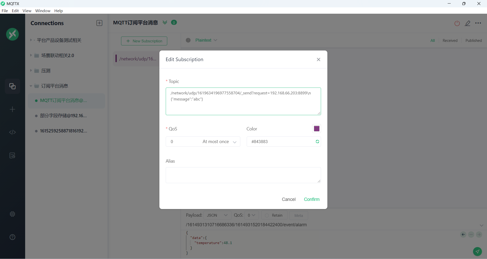


#### <font id='websocket-client'>订阅WebSocket客户端调试消息</font>

<div class='explanation primary'>
  <p class='explanation-title-warp'>
    <span class='iconfont icon-bangzhu explanation-icon'></span>
    <span class='explanation-title font-weight'>说明</span>
  </p>
    <p>
        订阅此主题的消息分为订阅时的消息和推送时的消息两部分，当<code>{pubsub}</code>为<code>_subscribe</code>时是订阅该id的组件在订阅时产生的消息，否则为发布时产生的消息。<code>{id}</code>为WebSocket客户端组件的id，<code>{type}</code>类型可以选择为<code>JSON</code>、<code>BINARY</code>、<code>STRING</code>、<code>HEX</code>
    </p>
</div>


订阅时的消息

使用websocket订阅

```json
{
    "type": "sub",
    "topic": "/network/websocket/client/{id}/_subscribe/{type}",
    "parameter": {},
    "id": "request-id"
}
```

使用MQTT订阅

```
/network/websocket/client/{id}/_subscribe/{type}
```

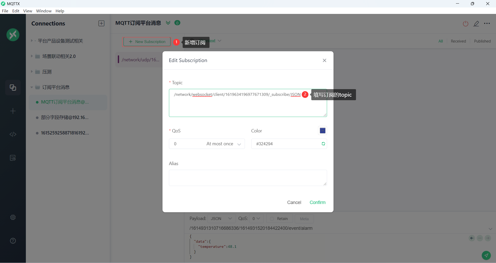


发送时的消息

使用websocket订阅

```json
{
    "type": "sub",
    "topic": "/network/websocket/client/{id}/_publish/{type}",
    "parameter": {},
    "id": "request-id"
}
```

使用MQTT订阅

```
/network/websocket/client/{id}/_publish/{type}
```


#### <font id='websocket-server'>订阅WebSocket服务调试消息</font>

<div class='explanation primary'>
  <p class='explanation-title-warp'>
    <span class='iconfont icon-bangzhu explanation-icon'></span>
    <span class='explanation-title font-weight'>说明</span>
  </p>
    <p>
       <code>{id}</code>为WebSocket服务组件的id，如果未传入<code>response</code>则默认为空
    </p>
</div>


使用websocket订阅

```json
{
    "type": "sub",
    "topic": "/network/websocket/server/{id}/_subscribe",
    "parameter": {
        //响应的数据，16进制以0x开头
        "response":"data"
    },
    "id": "request-id"
}
```

使用MQTT订阅

```kotlin
/network/websocket/server/{id}/_subscribe?response={data}
```

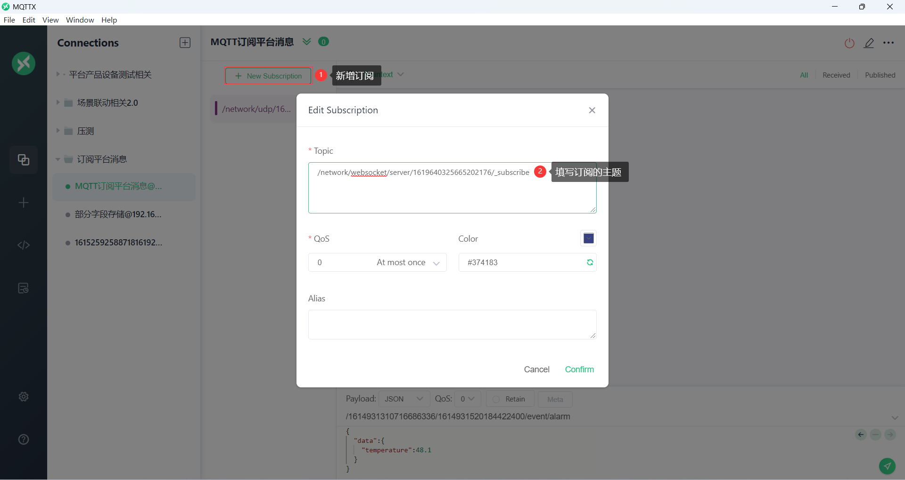


#### <font id='coap'>订阅CoAP调试相关消息</font>

<div class='explanation primary'>
  <p class='explanation-title-warp'>
    <span class='iconfont icon-bangzhu explanation-icon'></span>
    <span class='explanation-title font-weight'>说明</span>
  </p>
    <p>
        当订阅主题以<code>/network/coap/server</code>开头时订阅为CoAP服务，如果订阅CoAP客户端则不会返回任何消息
    </p>
</div>

1、订阅CoAP服务调试消息

| parameter | 参数说明                                                     |
| --------- | ------------------------------------------------------------ |
| `request` | CoAP协议通讯的相关参数类似于HTTP，如果未传入则默认使用`CREATE 2.02\nContent-Format: application/json\n\n{\"success\":true}`当作`request` |

使用Websocket的方式

```json
	//平台网络组件中想要订阅的CoAP服务组件的id
    //此id可以在浏览器中打开控制台->network->Fetch/XHR,之后F5刷新页面在左侧找到_query/的请求中查看到
    //也可以去数据库中的jetlinks数据库下的network_config表中查找
	{
        "type": "sub",
        "topic": "/network/coap/server/{id}/_subscribe",
        "parameter": {
            "request":"request-params-string"
        },
        "id": "request-id"
	}
```

使用MQTT的方式

```kotlin
/network/coap/server/{id}/_subscribe?request={request-params-string}
```

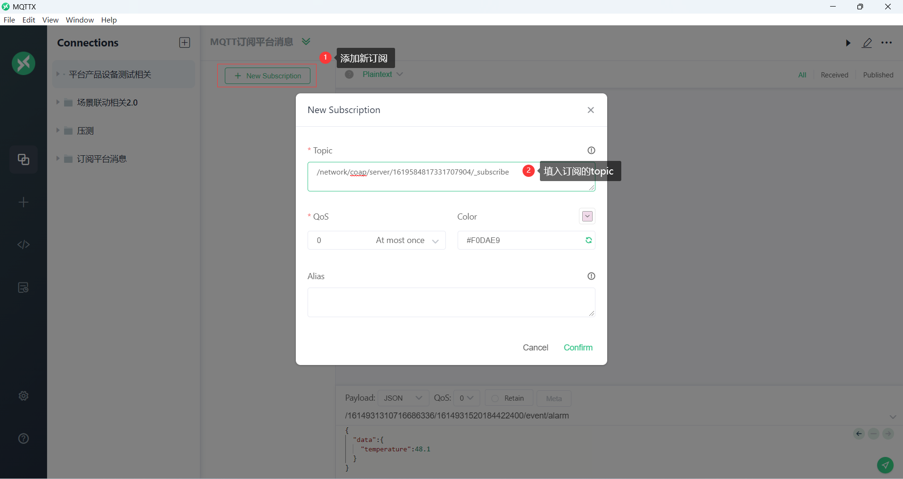


