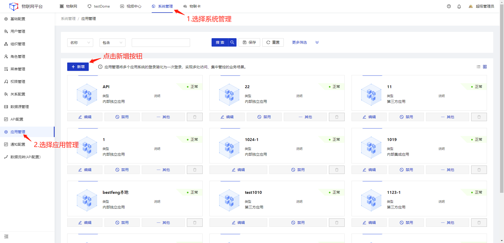
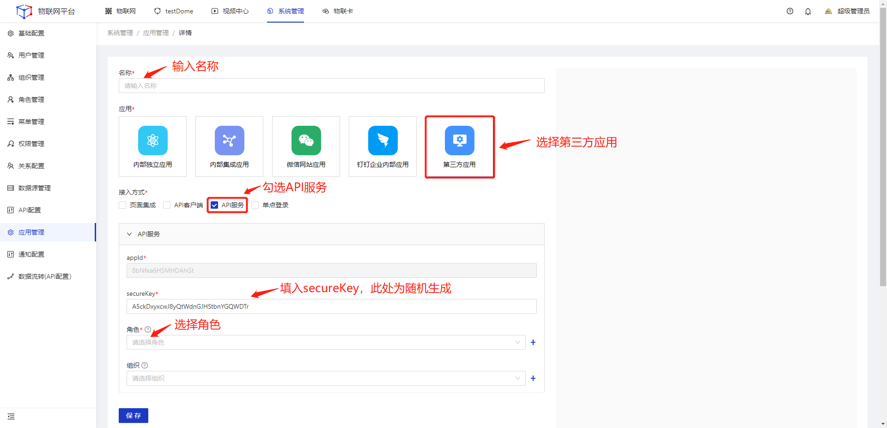

# 第三方平台请求JetLinks服务接口

#### 应用场景

  

    
    说明
  

    第三方平台通过api请求JetLinks服务接口获取相关数据

 

#### 创建第三方平台

首先进入平台：选择平台上方的[系统管理]---选择左侧[应用管理]---点击新增按钮

然后应用选择第三方应用，接入方式只勾选API服务，填入名称、secureKey，选择角色，点击保存

  

    
    说明
  

  appId和secureKey需要提供给客户端开发者，角色是多个用户的集合，角色中创建的用户可以使用用户名密码登录到系统中。IP白名单是只允许填写的ip进行访问

 

#### 赋权

  

    
    说明
  

  大部分情况下只需要勾选设备相关权限即可

赋权操作在[系统管理]---[角色管理]---选择对应的角色后在页面内进行权限分配

 