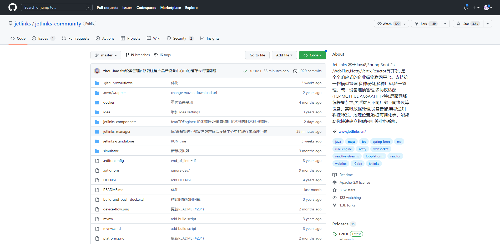

# 社区版安装部署

## 系统环境

启动jetlinks之前，请先确定已经安装好以下环境:

1.  <a href='https://adoptopenjdk.net/releases.html?variant=openjdk8&jvmVariant=hotspot'>JDK 1.8.0_2xx</a>  (需要小版本号大于200) 
2.  <a href='https://archive.apache.org/dist/maven/maven-3/3.6.3/binaries/'>Maven 3.6.x</a>
3. Redis 5.x
4. PostgreSQL 11 或者 mysql 5.7 +
5. ElasticSearch 6.8-7.x 

<div class='explanation info'>
  <p class='explanation-title-warp'>
    <span class='iconfont icon-tishi explanation-icon'></span>
    <span class='explanation-title font-weight'>说明</span>
  </p>
   <p>1. JDK和Maven的版本过高或过低可能会导致拉取jar包失败。</p>
   <p>2. 如果你是linux或者macOS系统，或者是windows10， 推荐<a href='./ide-docker-start.html'>使用docker安装所需环境</a>。
   项目启动后会自动创建表结构,但是数据库需要手动创建。</p>

</div>

## 问题指引

<table>
<tr>
    <td><a href="/install-deployment/deploy-question.html#下载完源码后maven编译失败">下载完源码后maven编译失败</a></td>
    <td><a href="/install-deployment/deploy-question.html#项目打包时有test文件校验不通过">项目打包时有Test文件校验不通过</a></td>
</tr>
<tr>
   <td><a href="/install-deployment/deploy-question.html#mvn打包失败">mvn package -DskipTests打包失败</a></td>
   <td><a href="/install-deployment/deploy-question.html#更换为mysql数据库启动失败">更换为mysql数据库启动失败</a></td>
</tr>
<tr>
   <td><a href="/install-deployment/deploy-question.html#使用mysql后项目启动报sslhandshakeexception">使用mysql后项目启动报SSLHandshakeException</a></td>
   <td><a href="/install-deployment/deploy-question.html#使用mysql项目启动报错">使用mysql后项目启动报No appropriate protocol</a></td>
</tr>
<tr>
   <td><a href="/install-deployment/deploy-question.html#数据库不存在">更换为mysql数据库unknown database jetlinks</a></td>
   <td><a href="/install-deployment/deploy-question.html#windows运行jar抛出win32exception">windows运行jar抛出win32exception</a></td>
</tr>
<tr>
   <td><a href="/install-deployment/deploy-question.html#启动前端登录后无导航和菜单信息">启动前端登录后无导航和菜单信息</a></td>
   <td><a href="/install-deployment/deploy-question.html#上传协议包报无法加载的错误">上传协议包无法加载</a></td>
</tr>
<tr>
   <td><a href="/install-deployment/deploy-question.html#首次启动时抛出表已存在异常">首次启动时抛出表已存在异常</a></td>
   <td><a href="/install-deployment/deploy-question.html#启动时抛出noauth-authentication-required">启动时抛出"NOAUTH Authentication required"</a></td>
</tr>
</table>

## 获取源码

1. 进入<a href='https://github.com/jetlinks/jetlinks-community'>Github</a>
2. 下载源代码,建议使用`git clone`下载源代码,注意代码分支，`master`为最新的稳定分支。

   获取源码详细操作可参考<a href="/dev-guide/pull-code.html#源码获取">获取源码</a></td>
   

```bash
git clone -b master git@github.com:jetlinks/jetlinks-community.git
cd jetlinks-community
# 社区版子模块需要指定为master， 
git pull && git submodule init && git submodule update && git submodule foreach git checkout master && git submodule foreach git pull origin master
```

## 启动后端


### 配置文件

配置文件地址:`jetlinks-standalone/src/main/resources/application.yml`

常见配置说明

```yml
spring:
  redis:
    host: 127.0.0.1 # redis配置
    port: 6379
  r2dbc:
    url: r2dbc:postgresql://127.0.0.1:5432/jetlinks  # 数据库postgresql数据库配置
    #url: r2dbc:mysql://127.0.0.1:3306/jetlinks # 支持切换到mysql数据库
    username: postgres  # 数据库用户名
    password: jetlinks  # 数据库密码
easyorm:
  default-schema: public # 数据库名 修改了数据库请修改这里,mysql为数据库名
  dialect: postgres # 数据库方言，支持 postgres,mysql,h2
elasticsearch:
  embedded:
    enabled: false # 为true时使用内嵌的elasticsearch
    data-path: ./data/elasticsearch
    port: 9200
    host: 0.0.0.0
hsweb:
  file:
    upload:
      static-file-path: ./static/upload   # 上传的文件存储路径
      static-location: http://127.0.0.1:${server.port}/upload # 上传文件后,将使用此地址来访问文件,在部署到服务器后需要修改这个地址为服务器的ip.
network:
  resources:
    - 1883-1890
    - 8800-8810
    - 5060-5061
```

<div class='explanation info'>
  <p class='explanation-title-warp'> 
    <span class='iconfont icon-tishi explanation-icon'></span>
    <span class='explanation-title font-weight'>提示</span>
  </p>
<p>补充:更多的配置文件信息内容移步<a href="/dev-guide/config-info.html">配置文件说明</a></p>

- 除了修改配置文件以外,还可以通过修改环境变量或者启动参数来修改配置,比如:

```bash
java -jar ./jetlinks-standalone/target/jetlinks-standalone.jar --spring.elasticsearch.embedded.enabled=true
```

- 修改了数据库配置也要同时修改`easyorm.dialect`以及`easyorm.default-schema`配置.

</div>

### 使用jar包启动

如果相关环境的ip不是本地,或者端口不是默认端口.请先修改配置文件。

linux或者macOS环境下打包:

```bash
./mvnw clean package -Dmaven.test.skip=true
```

windows 环境下打包

```bash
mvnw.cmd clean package '-Dmaven.test.skip=true'
```

启动

```bash
java -jar ./jetlinks-standalone/target/jetlinks-standalone.jar
```

### 导入IDEA启动

Idea请先安装`lombok`插件.

1. 打开`IDEA`,点击`file-open`,选择项目目录,等待依赖下载完成.
2. 点击`file-Project Structure-Project`,配置SDK为jdk1.8,`Project language level`为`8`.

3. 代码拉取完或更新后执行`reimport`


<div class='explanation info'>
  <p class='explanation-title-warp'> 
    <span class='iconfont icon-tishi explanation-icon'></span>
    <span class='explanation-title font-weight'>提示</span>
  </p>
<p>注意：无论何时在执行过更新代码后都需要 <span class='explanation-title font-weight'>reimport</span>，重新加载代码以及更新maven引用信息。</p>
<p>由于首次拉取代码下载的依赖包较多请耐心等待。
下载完成后IDEA会自动进入maven编译，可以自行配置Maven多线程参数加快编译，具体线程数根据自己的电脑情况填写。
如果依赖无法下载,请确定<span class='explanation-title font-weight'>Maven</span>配置正确,
请勿在<span class='explanation-title font-weight'>settings.xml</span>中配置全局仓库私服。</p>

</div>


4. 右键`jetlinks-standalone/src/main/java/org...../JetLinksApplication.java`,点击`run`启动main方法即可.

1. 使用平台提供的镜像启动

使用`jetlinks-pro/dist/docker-compose.yml`文件启动后端
```shell
cd jetlinks/dist
docker-compose up -d
```

<div class='explanation info'>
  <p class='explanation-title-warp'> 
    <span class='iconfont icon-tishi explanation-icon'></span>
    <span class='explanation-title font-weight'>提示</span>
  </p>

docker-compose中的jetlinks、jetlinks-ui-pro镜像持续更新中，启动docker之前请及时下载更新。

更新命令

```shell
# 查询镜像REPOSITORY 
docker images
REPOSITORY                                                     TAG         IMAGE ID       CREATED        SIZE
registry.cn-shenzhen.aliyuncs.com/jetlinks/jetlinks-ui-pro     2.0.0       c4d539556f75   2 days ago     180MB

# 将上一步查询的镜像仓库和tag号带入，执行更新命令。
docker pull [REPOSITORY]:[TAG]

```

</div>

2. 使用自己构建的镜像启动

   具体镜像构建操作可参考 <a href="/dev-guide/deploy-communtiy.html#docker在线部署">构建docker镜像</a>

## 启动前端

### docker启动前端
JetLinks 是前后端分离的.启动完后端服务后,还需要启动前端.
<div class='explanation info'>
  <p class='explanation-title-warp'> 
    <span class='iconfont icon-tishi explanation-icon'></span>
    <span class='explanation-title font-weight'>提示</span>
  </p>

如果本地不需要修改前端代码,并且本地有docker环境,建议使用docker启动前端.

```bash
docker run -it --rm -p 9000:80 -e "API_BASE_PATH=http://host.docker.internal:8844/" registry.cn-shenzhen.aliyuncs.com/jetlinks/jetlinks-ui-pro:2.0.0
```

http://host.docker.internal:8844/ 为后台服务的地址,请根据情况修改.

</div>


### IDE启动前端
准备环境:

1. nodeJs v16.18.1
2. npm v8.19.2
3. yarn v1.22.19

下载前端代码:

```bash
git clone -b 2.0 git@github.com:jetlinks/jetlinks-ui-antd.git
cd jetlinks-ui-antd
```

修改后台接口地址：
后台接口配置文件地址：config/proxy.ts:

```js
/**
 * 在生产环境 代理是无法生效的，所以这里没有生产环境的配置
 */
export default {
    dev: {
        '/api': {
            target: '后台地址',
            changeOrigin: true,
            pathRewrite: {'^/api': ''},
        },
    },
    test: {
        '/api': {
            target: '后台地址',
            changeOrigin: true,
            pathRewrite: {'^/api': ''},
        },
    },
    pre: {
        '/api': {
            target: '后台地址',
            changeOrigin: true,
            pathRewrite: {'^/api': ''},
        },
    },
};
```

<div class='explanation warning'>
  <p class='explanation-title-warp'>
    <span class='iconfont icon-jinggao explanation-icon'></span>
    <span class='explanation-title font-weight'>注意</span>
  </p>

为了更好的体验，建议使用yarn安装前端依赖包

</div>

启动:

```bash
cd jetlinks-ui-antd
yarn
yarn start:dev
```

启动成功后,访问: http://localhost:9000 即可.


<div class='explanation info'>
  <p class='explanation-title-warp'> 
    <span class='iconfont icon-tishi explanation-icon'></span>
    <span class='explanation-title font-weight'>提示</span>
  </p>

如您不关注前端实现，建议使用docker镜像启动前端。【[docker安装](/install-deployment/docker-start.md#安装docker)参考】

```bash
docker run -it --rm -p 9000:80 -e "API_BASE_PATH=http://{宿主机IP}:{后端应用端口}/" registry.cn-shenzhen.aliyuncs.com/jetlinks/jetlinks-ui-pro:2.0.0
```

</div>

