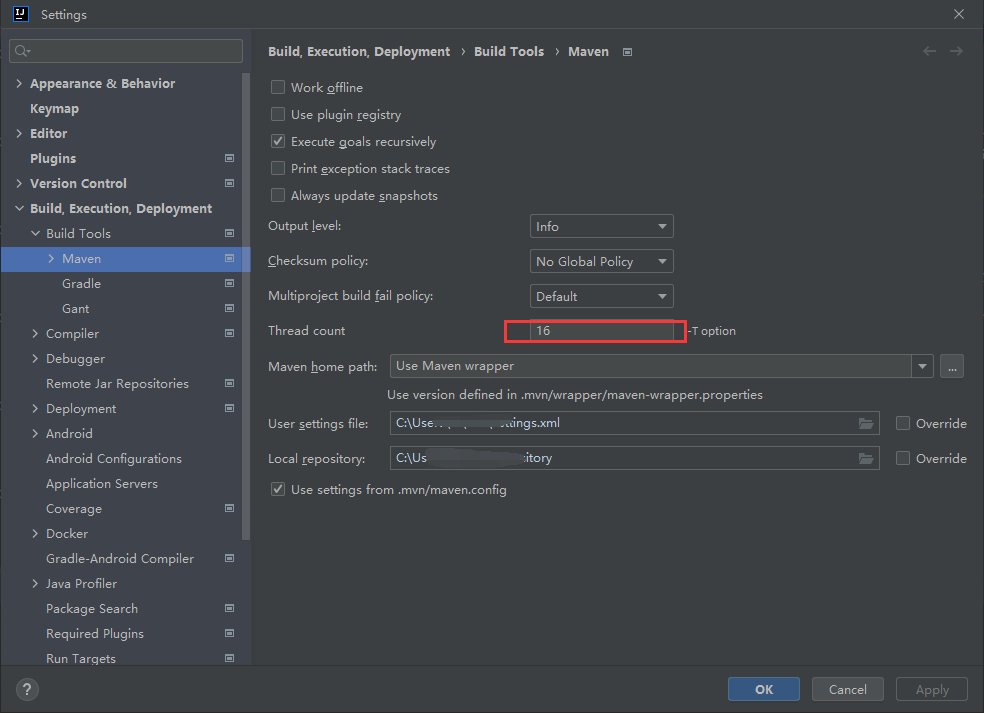

# 本地源码启动

## 系统环境

启动jetlinks之前，请先确定已经安装好以下环境:

1. JDK 1.8.0_2xx (
   需要小版本号大于200) <a href='https://adoptopenjdk.net/releases.html?variant=openjdk8&jvmVariant=hotspot'>下载jdk</a>
2. Redis 5.x
3. PostgreSQL 11 或者 mysql 5.7 +
4. ElasticSearch 6.8-7.x <a href='https://www.elastic.co/cn/downloads/elasticsearch'>下载</a>。

<div class='explanation info'>
  <p class='explanation-title-warp'>
    <span class='iconfont icon-tishi explanation-icon'></span>
    <span class='explanation-title font-weight'>说明</span>
  </p>

   <p>如果你是linux或者macOS系统,或者是windows10. 推荐<a href='./ide-docker-start.html'>使用docker安装所需环境</a>。
   项目启动后会自动创建表结构,但是数据库需要手动创建。</p>

</div>

## 问题指引

<table>
<tr>
    <td><a href="/install-deployment/start-with-source.html#下载完源码后maven编译失败">下载完源码后maven编译失败</a></td>
    <td><a href="/install-deployment/start-with-source.html#项目打包时有test文件校验不通过">项目打包时有Test文件校验不通过</a></td>
</tr>
<tr>
   <td><a href="/install-deployment/start-with-source.html#数据库不存在">更换为mysql数据库unknown database jetlinks</a></td>
   <td><a href="/install-deployment/start-with-source.html#更换为mysql数据库启动失败">更换为mysql数据库启动失败</a></td>
</tr>
<tr>
   <td><a href="/install-deployment/start-with-source.html#使用mysql后项目启动报sslhandshakeexception">使用mysql后项目启动报SSLHandshakeException</a></td>
   <td><a href="/install-deployment/start-with-source.html#使用docker部署es时accessdeniedexception异常">使用docker部署es时accessdeniedexception异常</a></td>
</tr>
<tr>
   <td><a href="/install-deployment/start-with-source.html#首次启动时抛出表已存在异常">首次启动时抛出表已存在异常</a></td>
   <td><a href="/install-deployment/start-with-source.html#启动时抛出noauth-authentication-required">启动时抛出"NOAUTH Authentication required"</a></td>
</tr>
<tr>
   <td><a href="/install-deployment/start-with-source.html#windows运行jar抛出win32exception">windows运行jar抛出win32exception</a></td>
   <td><a href="/install-deployment/start-with-source.html#上传协议包抛出无法加载协议异常">上传协议包抛出无法加载协议异常</a></td>
</tr>
</table>

## 获取源码

1. 进入<a href='https://gitee.com/jetlinks/jetlinks-community'>Gitee</a>
2. Star仓库，此处以社区版为例，企业版源码获取移步<a href="/dev-guide/pull-code.html">帮助文档</a>。
   
3. 下载源代码,建议使用`git clone`下载源代码,注意代码分支,`2.0`为最新的开发分支.其他分支为对应的版本.
   

```bash
$ git clone -b 2.0 https://gitee.com/jetlinks/jetlinks-community.git
$ cd jetlinks-community
# 社区版子模块需要指定为2.0， 企业版子模块是master
$ git pull && git submodule init && git submodule update && git submodule foreach git checkout 2.0 && git submodule foreach git pull origin 2.0
```

## 启动后端

<div class='explanation info'>
  <p class='explanation-title-warp'>
    <span class='iconfont icon-tishi explanation-icon'></span>
    <span class='explanation-title font-weight'>说明</span>
  </p>

   <p>本文档以企业版源码启动做示例。社区版是企业版的体验版本，
代码量有所精简但操作步骤一致，如图片上目录名称和社区版目录名称不一致，无需担心跟着操作文档下一步即可。</p>

</div>

### 配置文件

配置文件地址:`jetlinks-standalone/src/main/resources/application.yml`

常见配置说明

```yml
spring:
  redis:
    host: 127.0.0.1 # redis配置
    port: 6379
  r2dbc:
    url: r2dbc:postgresql://127.0.0.1:5432/jetlinks  # 数据库postgresql数据库配置
    #url: r2dbc:mysql://127.0.0.1:3306/jetlinks # 支持切换到mysql数据库
    username: postgres  # 数据库用户名
    password: jetlinks  # 数据库密码
easyorm:
  default-schema: public # 数据库名 修改了数据库请修改这里,mysql为数据库名
  dialect: postgres # 数据库方言，支持 postgres,mysql,h2
elasticsearch:
  embedded:
    enabled: false # 为true时使用内嵌的elasticsearch
    data-path: ./data/elasticsearch
    port: 9200
    host: 0.0.0.0
hsweb:
  file:
    upload:
      static-file-path: ./static/upload   # 上传的文件存储路径
      static-location: http://127.0.0.1:${server.port}/upload # 上传文件后,将使用此地址来访问文件,在部署到服务器后需要修改这个地址为服务器的ip.
network:
  resources:
    - 1883-1890
    - 8800-8810
    - 5060-5061
```

<div class='explanation info'>
  <p class='explanation-title-warp'> 
    <span class='iconfont icon-tishi explanation-icon'></span>
    <span class='explanation-title font-weight'>提示</span>
  </p>
<p>补充:更多的配置文件信息内容移步<a href="/dev-guide/config-info.html">配置文件说明</a></p>

- 除了修改配置文件以外,还可以通过修改环境变量或者启动参数来修改配置,比如:

```bash
java -jar ./jetlinks-standalone/target/jetlinks-standalone.jar --spring.elasticsearch.embedded.enabled=true
```

- 修改了数据库配置也要同时修改`easyorm.dialect`以及`easyorm.default-schema`配置.

</div>

### 使用命令行启动

如果相关环境的ip不是本地,或者端口不是默认端口.请先修改配置文件.

linux或者macOS环境下打包:

```bash
$ ./mvnw clean package -Dmaven.test.skip=true
```

windows 环境下打包

```bash
$ mvnw.cmd clean package '-Dmaven.test.skip=true'
```

启动

```bash
$ java -jar ./jetlinks-standalone/target/jetlinks-standalone.jar
```

### 导入IDEA启动

Idea请先安装`lombok`插件.

1. 打开`IDEA`,点击`file-open`,选择项目目录,等待依赖下载完成.
2. 点击`file-Project Structure-Project`,配置SDK为jdk1.8,`Project language level`为`8`.

3. 代码拉取完或更新后执行`reimport`


<div class='explanation info'>
  <p class='explanation-title-warp'> 
    <span class='iconfont icon-tishi explanation-icon'></span>
    <span class='explanation-title font-weight'>提示</span>
  </p>
<p>注意：无论何时在执行过更新代码后都需要 <span class='explanation-title font-weight'>reimport</span>，重新加载代码以及更新maven引用信息。</p>
<p>由于首次拉取代码下载的依赖包较多请耐心等待。
下载完成后IDEA会自动进入maven编译，可以自行配置Maven多线程参数加快编译，具体线程数根据自己的电脑情况填写。
如果依赖无法下载,请确定<span class='explanation-title font-weight'>Maven</span>配置正确,
请勿在<span class='explanation-title font-weight'>settings.xml</span>中配置全局仓库私服。</p>

</div>




4. 扩展子模块加入Maven多模块项目

<div class='explanation info'>
  <p class='explanation-title-warp'> 
    <span class='iconfont icon-tishi explanation-icon'></span>
    <span class='explanation-title font-weight'>提示</span>
  </p>
<p>如无扩展模块，该步骤可跳过。补充：社区版可跳过该步。</p>
</div>

- jetlinks-pro添加子模块依赖

在项目根目录下的`jetlinks-pro/pom.xml`中的modules节点中添加模块

```xml

<modules>
    <module>expands-components/jetlinks-ctwing</module>
</modules>
```

在启动模块`jetlinks-standalone/pom.xml`中引入依赖

```xml

<dependency>
    <groupId>org.jetlinks.pro</groupId>
    <artifactId>jetlinks-ctwing</artifactId>
    <version>${project.version}</version>
</dependency>

```

- jetlinks-cloud添加子模块依赖

在项目根目录下的`jetlinks-cloud/pom.xml`中的modules节点中添加模块

```xml

<modules>
    <module>expands-components/jetlinks-ctwing</module>
</modules>
```

在启动模块`iot-service/pom.xml`中引入依赖

```xml

<dependency>
    <groupId>org.jetlinks.pro</groupId>
    <artifactId>jetlinks-ctwing</artifactId>
    <version>${project.version}</version>
</dependency>

```

其余模块同理。

5. 右键`jetlinks-standalone/src/main/java/org...../JetLinksApplication.java`,点击`run`启动main方法即可.

## 启动前端

### docker启动前端
JetLinks 是前后端分离的.启动完后端服务后,还需要启动前端.
<div class='explanation info'>
  <p class='explanation-title-warp'> 
    <span class='iconfont icon-tishi explanation-icon'></span>
    <span class='explanation-title font-weight'>提示</span>
  </p>

如果本地不需要修改前端代码,并且本地有docker环境,建议使用docker启动前端.

```bash
docker run -it --rm -p 9000:80 -e "API_BASE_PATH=http://host.docker.internal:8844/" registry.cn-shenzhen.aliyuncs.com/jetlinks/jetlinks-ui-pro:2.0.0
```

http://host.docker.internal:8844/ 为后台服务的地址,请根据情况修改.

</div>


### IDE启动前端
准备环境:

1. nodeJs v12.xx
2. npm v6.xx

下载前端代码:

```bash
$ git clone -b 2.0 https://gitee.com/jetlinks/jetlinks-ui-antd.git
$ cd jetlinks-ui-antd
```

修改后台接口地址：
后台接口配置文件地址：config/proxy.ts:

```js
/**
 * 在生产环境 代理是无法生效的，所以这里没有生产环境的配置
 */
export default {
    dev: {
        '/api': {
            target: '后台地址',
            changeOrigin: true,
            pathRewrite: {'^/api': ''},
        },
    },
    test: {
        '/api': {
            target: '后台地址',
            changeOrigin: true,
            pathRewrite: {'^/api': ''},
        },
    },
    pre: {
        '/api': {
            target: '后台地址',
            changeOrigin: true,
            pathRewrite: {'^/api': ''},
        },
    },
};
```

<div class='explanation warning'>
  <p class='explanation-title-warp'>
    <span class='iconfont icon-jinggao explanation-icon'></span>
    <span class='explanation-title font-weight'>注意</span>
  </p>

为了更好的体验，建议使用yarn安装前端依赖包

</div>

启动:

```bash
$ cd jetlinks-ui-antd
$ yarn
$ yarn start:dev
```

启动成功后,访问: http://localhost:9000 即可.


<div class='explanation info'>
  <p class='explanation-title-warp'> 
    <span class='iconfont icon-tishi explanation-icon'></span>
    <span class='explanation-title font-weight'>提示</span>
  </p>

如您不关注前端实现，建议使用docker镜像启动前端。【[docker安装](/install-deployment/docker-start.md#安装docker)参考】

```bash
docker run -it --rm -p 9000:80 -e "API_BASE_PATH=http://{宿主机IP}:{后端应用端口}/" registry.cn-shenzhen.aliyuncs.com/jetlinks/jetlinks-ui-pro:2.0.0
```

</div>

## 常见问题

#### 下载完源码后maven编译失败

<div class='explanation warning'>
  <p class='explanation-title-warp'>
    <span class='iconfont icon-bangzhu explanation-icon'></span>
    <span class='explanation-title font-weight'>问题</span>
  </p>

  <p>Q：Maven项目启动过程中出现jar包引入失败。</p>
  <p>A：一般是由于自行设置了配置文件的mirrors镜像加速地址，注释或者使用纯净的<b class='explanation-title font-weight'>settings.xml</b>配置文件。</p>
</div>

#### 项目打包时有Test文件校验不通过

<div class='explanation warning'>
  <p class='explanation-title-warp'>
    <span class='iconfont icon-bangzhu explanation-icon'></span>
    <span class='explanation-title font-weight'>问题</span>
  </p>

  <p>Q：项目打包时有Test文件校验不通过。</p>
  <p>A：使用如下命令重新打包或者在Maven窗口关闭test校验</p>

```bash
#linux系统或许macOS
$ ./mvnw clean package -Dmaven.test.skip=true

#windows系统
$ mvnw.cmd clean package '-Dmaven.test.skip=true'
```


</div>

#### 更换为mysql数据库，提示数据库不存在

<div class='explanation warning'>
  <p class='explanation-title-warp'>
    <span class='iconfont icon-bangzhu explanation-icon'></span>
    <span class='explanation-title font-weight'>问题</span>
  </p>

  <p>Q：更换为mysql数据库，提示数据库不存在。</p>
  <p>A：平台默认使用PostgreSQL，如需切换使用mysql数据库则自行连接mysql服务，手动创建数据库。</p>
</div>

#### 更换为mysql数据库启动失败

<div class='explanation warning'>
  <p class='explanation-title-warp'>
    <span class='iconfont icon-bangzhu explanation-icon'></span>
    <span class='explanation-title font-weight'>问题</span>
  </p>

  <p>Q：更换为mysql数据库启动报错，报错截图如下。</p>
   
  <p>A：修改<span class='explanation-title font-weight'>easyorm.dialect和easyorm.default-schema</span>参数，</p>
   


</div>

#### 首次启动时抛出表已存在异常

<div class='explanation warning'>
  <p class='explanation-title-warp'>
    <span class='iconfont icon-bangzhu explanation-icon'></span>
    <span class='explanation-title font-weight'>问题</span>
  </p>

  <p>Q：首次启动时抛出"Table 'xx' already exists"异常。</p>
  <p>A：删除数据库并重新创建数据然后重启项目，由项目自行创建表及表结构。</p>
</div>

#### 使用mysql后项目启动报SSLHandshakeException

<div class='explanation warning'>
  <p class='explanation-title-warp'>
    <span class='iconfont icon-bangzhu explanation-icon'></span>
    <span class='explanation-title font-weight'>问题</span>
  </p>

  <p>Q：使用mysql后项目启动报SSLHandshakeException。异常信息如下</p>

```bash
"Operator called default onErrorDropped"
"Caused by: javax.net.ssl.SSLHandshakeException: No appropriate protocol (protocol is disabled or cipher suites are inappropriate)"
```
  <p>A：关闭mysql的SSL连接认证。在连接地址上加入  <span class='explanation-title font-weight'>问题</span></p>
</div>

#### 使用docker部署ES时AccessDeniedException异常

<div class='explanation warning'>
  <p class='explanation-title-warp'>
    <span class='iconfont icon-bangzhu explanation-icon'></span>
    <span class='explanation-title font-weight'>问题</span>
  </p>

  <p>Q：docker中启动ES报错：AccessDeniedException: /usr/share/elasticsearch/data/nodes</p>

```bash
ElasticsearchException[failed to bind service]; nested: AccessDeniedException[/usr/share/elasticsearch/data/nodes];
Likely root cause: java.nio.file.AccessDeniedException: /usr/share/elasticsearch/data/nodes
        at java.base/sun.nio.fs.UnixException.translateToIOException(UnixException.java:90)
        at java.base/sun.nio.fs.UnixException.rethrowAsIOException(UnixException.java:106)
        at java.base/sun.nio.fs.UnixException.rethrowAsIOException(UnixException.java:111)
        at java.base/sun.nio.fs.UnixFileSystemProvider.createDirectory(UnixFileSystemProvider.java:396)
        at java.base/java.nio.file.Files.createDirectory(Files.java:694)
        at java.base/java.nio.file.Files.createAndCheckIsDirectory(Files.java:801)
        at java.base/java.nio.file.Files.createDirectories(Files.java:787)
```
  <p>A：对ES挂载目录进行授权，命令如下。重启es服务节点和后端应用。</p>

```bash
sudo chmod 777 -R elasticsearch
```

</div>

#### 启动时抛出NOAUTH Authentication required

<div class='explanation warning'>
  <p class='explanation-title-warp'>
    <span class='iconfont icon-bangzhu explanation-icon'></span>
    <span class='explanation-title font-weight'>问题</span>
  </p>

  <p>Q：启动时抛出NOAUTH Authentication required。</p>
  <p>A：Redis并未设置密码，在配置文件中指定了<span class='explanation-title font-weight'>spring.redis.password</span>参数，修改该参数置空即可。
</p>
</div>

#### Windows运行jar抛出Win32Exception

<div class='explanation warning'>
  <p class='explanation-title-warp'>
    <span class='iconfont icon-bangzhu explanation-icon'></span>
    <span class='explanation-title font-weight'>问题</span>
  </p>

  <p>Q：Windows运行jar抛出Win32Exception。</p>
   
  <p>A：修改<span class='explanation-title font-weight'>spring.reactor.debug-agent.enabled</span>参数为false。</p>
</div>

#### 上传协议包抛出无法加载协议异常

<div class='explanation warning'>
  <p class='explanation-title-warp'>
    <span class='iconfont icon-bangzhu explanation-icon'></span>
    <span class='explanation-title font-weight'>问题</span>
  </p>

  <p>Q：上传协议包抛出无法加载协议异常</p>
  <p>A: 原因一：目录名称使用中文进行命名！使用中文命名目录，当系统查找协议包时在查找中文目录名称时转义失败，抛出无法加载协议的异常。</p>
   <p>原因二：协议内未找到主入口类<span class='explanation-title font-weight'>（implements ProtocolSupportProvider的类）</span>。</p>

</div>