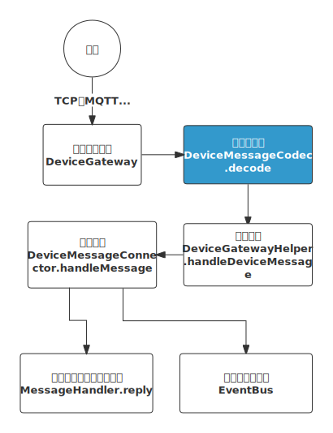
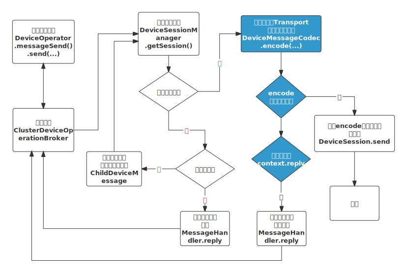

# 协议包开发说明

协议包作为设备接入的核心,用于对设备进行消息编解码等操作.目前仅提供`java`版的协议包开发sdk.

此文档基于`jetlinks-core 1.2.0`版本

## 名词解释

+ *协议提供商* (`ProtocolSupportProvider`): 用于创建协议包实例,在发布协议时,将使用此接口的实现类来创建协议包实例.
+ *协议包* (`ProtocolSupport`) : 用于解析`设备`和`平台`通信报文的插件,同时还对接入协议进行一些描述,如: 接入说明,需要的配置信息,默认物模型等.
+ *编解码* (`DeviceMessageCodec`): 对设备上报的数据进行解码,翻译为平台定义的统一的设备消息(`DeviceMessage`).以及将平台下发的消息(指令)`DeviceMessage`,编码为设备支持的报文.
+ *设备操作器*(`DeviceOperator`): 对一个设备实例的操作接口,可通过此接口获取、设置配置信息,获取物模型等操作.
+ *设备会话* (`DeviceSession`): 一个设备的连接会话信息,如: TCP,MQTT连接.
+ *设备消息* (`DeviceMessage`): 平台统一定义的设备消息,如:属性上报(`ReportPropertyMessage`),功能调用(`FunctionInvokeMessage`)等.
+ *设备原始消息* (`EncodedMessage`): 设备端原始的消息,如: MQTT(`MqttMessage`),HTTP(`HttpExchangeMessage`)等.
  

## 调用流程

::: tip 提示
<b style='color:#3399cc'>蓝色背景</b>表示协议包在整个流程中的角色
:::
设备上报数据到平台流程

平台下发指令到设备流程

